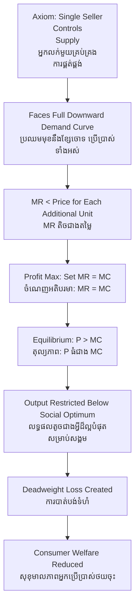

# Monopoly — First-Principles Derivation
# ការផូកផ្តាច់ — ការស្រាយបញ្ជាក់ពីគោលការណ៍ដំបូង

---

## Core Problem / បញ្ហាស្នូល

**English:** Markets are supposed to distribute resources efficiently through competition. But what happens when one seller controls the entire supply of a good? Why does this harm society, and how can we prove it rigorously?

**ខ្មែរ:** ទីផ្សារគួរចែកចាយធនធានប្រកបដោយប្រសិទ្ធភាពតាមរយៈការប្រកួតប្រជែង។ ប៉ុន្តែតើអ្វីកើតឡើងនៅពេលអ្នកលក់ម្នាក់គ្រប់គ្រងការផ្គត់ផ្គង់ទំនិញទាំងអស់? ហេតុអ្វីបានជាវាបំផ្លាញសង្គម ហើយយើងអាចបញ្ជាក់វាដោយរឹតបន្តឹងដោយរបៀបណា?

---

## First Principles Derivation / ការស្រាយបញ្ជាក់ពីគោលការណ៍ដំបូង

**Axiom 1 — Buyers are rational (អ័ក្សទ 1 — អ្នកទិញគឺមានហេតុផល):**
Each buyer has a maximum willingness-to-pay (WTP). They buy only when price ≤ WTP.

**Axiom 2 — Sellers maximize profit (អ័ក្សទ 2 — អ្នកលក់ memaksimumkan ចំណេញ):**
A firm chooses quantity Q where Marginal Revenue (MR) = Marginal Cost (MC).

**Axiom 3 — Market power changes the pricing rule (អ័ក្សទ 3 — អំណាចទីផ្សារផ្លាស់ប្ដូរច្បាប់តម្លៃ):**
Under competition: Price (P) = MC. Under monopoly: P > MC because the firm faces the entire downward-sloping demand curve.

**Derivation Chain (ខ្សែសង្វាក់ការស្រាយ):**

1. Demand curve slopes downward → to sell more, monopolist must lower price for ALL units.
2. This makes Marginal Revenue < Price for every unit beyond the first.
3. Profit-maximizing rule: produce where MR = MC.
4. Since MR < P, and MR = MC at optimum → P > MC at equilibrium.
5. The gap (P − MC) = monopoly markup = deadweight loss source.

**Implication:** Society loses transactions that would have been mutually beneficial at competitive prices — this is **deadweight loss (ការបាត់បង់ទំហំផ្ទទៃ)**.

---

## Visual Derivation / ការបង្ហាញដោយមើលឃើញ

---

## Real-World Application / ការអនុវត្តន៍ក្នុងពិភពជាក់ស្ដែង

**Cambodian Context (បរិបទកម្ពុជា):**

Imagine a single mobile-money operator (like Wing or ABA) that had no competitors in rural Cambodia. With monopoly power, it could charge fees far above the cost of processing each transaction. Farmers sending remittances from Phnom Penh to Kampong Cham would pay more, reducing the net income families actually receive.

Contrast with today's competitive market: multiple providers compete → fees fall toward marginal cost → rural families keep more money.

**Key insight (ចំណុចសំខាន់):** The monopoly markup is not merely a transfer from consumer to firm — some transactions never happen at all. A farmer who would have sent 50,000 riel at 500 riel fee (competitive) may not send at 3,000 riel fee (monopoly). That lost transaction is the deadweight loss.

---

## Related Posts / អត្ថបទដែលទាក់ទង

- [02 — Feynman Technique](./02-feynman.md)
- [03 — Socratic Dialogue](./03-socratic.md)
- [04 — Analogy Bridge](./04-analogy.md)
- [05 — Narrative Story](../precautionary-principle/05-storyteller.md)
- [06 — Journalist Interview](../precautionary-principle/06-interview.md)
- [Parable: The Farmer Who Raised the Price](../../year-1/parables/260-the-farmer-who-raised-the-price.md)
