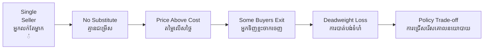

# Monopoly — Socratic Dialogue
# ការផូកផ្តាច់ — កិច្ចសន្ទនា Socratic

**Author:** ichamrong | **Date:** 2026-05-29
**Tags:** #socratic #business-sustainability #monopoly

---

## Dialogue / កិច្ចសន្ទនា

**Professor:** Dara, if you wanted to buy rice in Phnom Penh and only one shop existed in the entire city, what would happen to the price?

**Dara:** It would probably be higher, because I have no choice but to buy from that shop.

**Professor:** And if that shop raised the price to 20,000 riel per kilogram, would every single person who needs rice still buy it?

**Dara:** No — some people couldn't afford it. They might eat less, or go without.

**Professor:** So who is harmed by that high price — only the people who pay it, or also the people who stop buying?

**Dara:** ... Both? The buyers who pay lose money. But the people who stop buying also lose — they needed the rice.

**Professor:** Good. What do we call the value that was never exchanged — the rice that was never sold to someone willing to pay a competitive price?

**Dara:** Is that the deadweight loss?

**Professor:** What condition must be true for a seller to successfully charge a price above cost?

**Dara:** The seller must have no competition — no one else selling the same thing at a lower price.

**Professor:** And what protects a monopoly from new competitors entering and undercutting its price?

**Dara:** Maybe they own something unique — like a patent, or a license from the government, or a resource nobody else has.

**Professor:** If the Cambodian government granted one company the exclusive right to run all mobile-money transfers, what would you predict about transfer fees?

**Dara:** They would rise, and ordinary Cambodians sending money home to their families would pay more.

**Professor:** Is that merely a transfer from citizens to the company, or does something else happen to total welfare?

**Dara:** Some people might stop sending money altogether if it gets too expensive. Those transfers that never happen — that is the deadweight loss again.

**Professor:** So what is the policy question a government must weigh when it grants an exclusive license?

**Dara:** Whether the benefit of the monopoly — maybe better coordination or investment — outweighs the deadweight loss from restricted output and higher prices.

---

## Insight Chain / ខ្សែសង្វាក់ការយល់ដឹង

---

## Related Posts / អត្ថបទដែលទាក់ទង

- [01 — MIT Professor Derivation](./01-mit-professor.md)
- [02 — Feynman Technique](./02-feynman.md)
- [04 — Analogy Bridge](./04-analogy.md)
- [05 — Narrative Story](../precautionary-principle/05-storyteller.md)
- [06 — Journalist Interview](../precautionary-principle/06-interview.md)
- [Parable: The Farmer Who Raised the Price](../../year-1/parables/260-the-farmer-who-raised-the-price.md)
