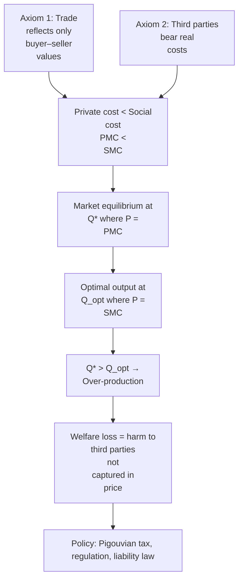

# Negative Externality — First-Principles Derivation
# ផលប៉ះពាល់ខាងក្រៅអវិជ្ជមាន — ការស្រាយបញ្ជាក់ពីគោលការណ៍ស្នូល

**Author:** ichamrong | **Date:** 2026-05-29 | **Tags:** #mit-professor #business-sustainability #negative-externality

---

## Core Problem / បញ្ហាស្នូល

When a transaction between a buyer and seller imposes costs on third parties who never agreed to bear those costs, the market produces too much of the harmful activity. Prices fail to tell the truth. The factory that dumps waste into a river pays nothing for the ruined fishing downstream — so it over-produces relative to what society would choose if all costs were counted.

ពេលដែលការប្រព្រឹត្ដកម្មរវាងអ្នកលក់និងអ្នកទិញបង្កការខូចខាតដល់ភាគីទីបី ដែលមិនដែលព្រមទទួលបន្ទុកនោះ ទីផ្សារនឹងផលិតច្រើនហួសហេតុ។ តម្លៃក្លាយជាមិនពិត។ រោងចក្រដែលបង្ហូររឹមឱ្យចូលទន្លេមិនចំណាយអ្វីសម្រាប់ការខូចខាតដែលកើតឡើងខាងក្រោម — ហើយដូច្នេះវាផលិតច្រើនជាង​អ្វីដែលសង្គមនឹងជ្រើសរើស ប្រសិនបើការចំណាយទាំងអស់ត្រូវបានរាប់បញ្ចូល។

---

## First Principles Derivation / ការស្រាយបញ្ជាក់

**Axiom 1 — Voluntary Exchange (EN):** When two parties trade, they do so because both expect to gain. The price agreed upon reflects only the values held by those two parties.

**អ័ក្សូម ១ — ការផ្លាស់ប្ដូរដោយស្ម័គ្រចិត្ត (KH):** នៅពេលដែលភាគីពីររូបធ្វើពាណិជ្ជកម្ម ពួកគេធ្វើដូច្នេះព្រោះទាំងពីររំពឹងថានឹងទទួលបានអត្ថប្រយោជន៍។ តម្លៃដែលបានព្រមព្រៀងបង្ហាញតែតម្លៃដែលអ្នកពាក់ព័ន្ធទាំងពីររូបកាន់កាប់ប៉ុណ្ណោះ។

**Axiom 2 — Third-Party Effects Exist (EN):** Many production and consumption activities physically alter the environment, health, or property of people not party to the transaction. These people bear real costs without receiving compensation.

**អ័ក្សូម ២ — ផលប៉ះពាល់ដល់ភាគីទីបីមានស្រាប់ (KH):** សកម្មភាពផលិតកម្មនិងការប្រើប្រាស់ជាច្រើនប្តូរបរិស្ថាន សុខភាព ឬទ្រព្យសម្បត្តិ​របស់អ្នកដែលមិនមែនជាភាគីក្នុងប្រតិបត្តិការ។ មនុស្សទាំងនេះទទួលបន្ទុកការចំណាយពិតដោយមិនទទួលបានសំណង។

**Derivation — Why Markets Over-Produce (EN):**
- Let private marginal cost (PMC) = cost borne by the producer only.
- Let marginal external cost (MEC) = cost imposed on third parties per unit produced.
- Social marginal cost (SMC) = PMC + MEC.
- The market sets price = PMC (ignoring MEC), so it produces at quantity Q* where PMC = demand.
- The socially optimal quantity Q_opt is where SMC = demand.
- Because SMC > PMC, Q* > Q_opt. The market over-produces by exactly the quantity between Q_opt and Q*.
- This gap is the welfare loss — real harm to real people that markets, left alone, will not correct.

**ការស្រាយបញ្ជាក់ — ហេតុអ្វីបានជាទីផ្សារផលិតច្រើនហួស (KH):**
- ចូរ PMC = ការចំណាយរបស់អ្នកផលិតតែម្នាក់ឯង។
- ចូរ MEC = ការចំណាយដែលដាក់លើភាគីទីបីក្នុងមួយឯកតា។
- ការចំណាយសង្គម SMC = PMC + MEC។
- ទីផ្សារកំណត់តម្លៃ = PMC (មិនរាប់ MEC) ហើយដូច្នេះផលិតនៅបរិមាណ Q* ។
- បរិមាណល្អប្រសើរតាមសង្គម Q_opt គឺជាកន្លែងដែល SMC = ឱសថ។
- ដោយសារ SMC > PMC ដូច្នេះ Q* > Q_opt ។ ទីផ្សារផលិតច្រើនហួស។

---

## Visual Derivation / គំនូសតាង

---

## Real-World Application / ការអនុវត្ត

**Cambodian Example — Garment Factory Wastewater:**
Garment factories along the outskirts of Phnom Penh discharge untreated wastewater into drainage canals that flow into rice paddies and community wells. The factory's private cost of production does not include the health costs of nearby residents or the lost rice yields of downstream farmers. Because these costs fall on others, the factory has no market signal to reduce output or invest in treatment. The result: production volume is higher than Cambodia's full social cost would justify, and rural communities bear a hidden subsidy to the export sector.

**Global Example — Carbon Emissions:**
An airline prices tickets based on fuel, labour, maintenance, and airport fees. None of these line items capture the contribution of each flight to atmospheric CO₂ concentration and the downstream costs of sea-level rise, crop failure, and extreme weather borne by people who never flew. The market-clearing price of a ticket is therefore systematically too low, and air travel is systematically over-consumed relative to a world where all costs are priced in.

---

## Related Posts / ភ្ជាប់ទៅ

- [02 — Feynman Explanation](./02-feynman.md)
- [03 — Socratic Discovery](./03-socratic.md)
- [04 — Analogy Bridge](../monopoly/04-analogy.md)
- [05 — The Story](../precautionary-principle/05-storyteller.md)
- [06 — Expert Interview](../precautionary-principle/06-interview.md)
- [Parable: The Farmer Who Raised the Price](../../year-1/parables/260-the-farmer-who-raised-the-price.md)
