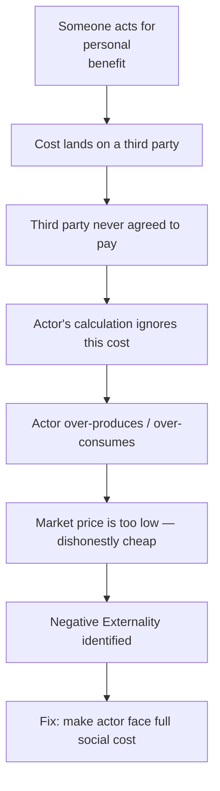

# Negative Externality — Socratic Discovery
# ផលប៉ះពាល់ខាងក្រៅអវិជ្ជមាន — ការរកឃើញតាមមគ្គទស្សន៍ Socrate

**Author:** ichamrong | **Date:** 2026-05-29 | **Tags:** #socratic #business-sustainability #negative-externality

---

## The Dialogue / កិច្ចសន្ទនា

### English

**Professor:** Dara, if I asked you to pay for your neighbour's lunch, would you?

**Dara:** No, of course not. Why would I pay for something I didn't order?

**Professor:** What if your neighbour's cooking smoke made you cough all morning — do you pay for that either?

**Dara:** No. But that is different. I didn't choose the smoke.

**Professor:** Interesting. So in the second case, a cost falls on you — the coughing, the discomfort — but you never agreed to it. Who agreed to it?

**Dara:** Nobody asked me. The neighbour just lit the fire.

**Professor:** And when the neighbour decided to cook, did she include your coughing in her calculation of whether to cook?

**Dara:** No, she just thought about her own food.

**Professor:** So her private calculation — her benefit, her cost — ignored a real cost that landed on you. What does that tell you about her decision to cook?

**Dara:** She cooked more than she should have? If she had to pay for my discomfort, maybe she would have cooked differently.

**Professor:** Or used a different fuel. Now imagine it is not a neighbour but a factory. And instead of one coughing person, it is ten thousand people downstream. Does the factory include their costs?

**Dara:** Not if they do not have to. The factory only pays for what it buys.

**Professor:** So what happens to the total amount the factory produces?

**Dara:** It produces more than it would if it had to pay everything. Because it is getting a discount — the people downstream are paying part of the cost for it.

**Professor:** What would you call an action that imposes a cost on others who never agreed to pay?

**Dara:** A burden on them. An outside cost. Something that leaks out beyond the transaction.

**Professor:** Economists call it a negative externality. But you just defined it yourself. Now — does the market have any automatic mechanism to correct this?

**Dara:** Not unless the factory somehow has to pay for the downstream harm. The market price only reflects what the factory spent. The fishermen's loss is invisible in the price.

**Professor:** And what might make those invisible costs visible?

**Dara:** A tax on the pollution? Or a law forcing the factory to compensate the fishermen?

**Professor:** Both are real policy tools. What do they have in common?

**Dara:** They make the factory face the full cost — including the part it was pushing onto others.

**Professor:** And when it faces the full cost?

**Dara:** It produces less. At the right amount.

---

### ខ្មែរ

**សាស្ត្រាចារ្យ:** ដារ៉ា ប្រសិនបើខ្ញុំសួរឱ្យអ្នកបង់ថ្លៃអាហារថ្ងៃត្រង់ជិតខាងអ្នក តើអ្នកនឹងធ្វើទេ?

**ដារ៉ា:** ទេ ជាការពិត។ ហេតុអ្វីខ្ញុំត្រូវបង់ប្រាក់សម្រាប់អ្វីដែលខ្ញុំមិនបានបញ្ជា?

**សាស្ត្រាចារ្យ:** ប្រសិនបើផ្សែងចម្អិនអាហាររបស់ជិតខាងធ្វើឱ្យអ្នកក្អួតពេញព្រឹក — តើអ្នកបង់ការ​ចំណាយ​នោះទេ?

**ដារ៉ា:** ទេ។ ប៉ុន្តែនោះខុសគ្នា។ ខ្ញុំមិនបានជ្រើសរើសផ្សែងនោះទេ។

**សាស្ត្រាចារ្យ:** គួរឱ្យចាប់អារម្មណ៍ណាស់។ ដូច្នេះក្នុងករណីទីពីរ ការចំណាយធ្លាក់លើអ្នក — ការក្អួត ភាពមិន​ស្រួល — ប៉ុន្តែអ្នកមិនដែលព្រម។ តើអ្នកណាបានព្រម?

**ដារ៉ា:** គ្មាននរណាសួរខ្ញុំ។ ជិតខាងគ្រាន់តែបុកភ្លើង។

**សាស្ត្រាចារ្យ:** ហើយនៅពេលដែលជិតខាងសម្រេចចិត្តចម្អិនអាហារ តើនាងបានរាប់បញ្ចូលការក្អួតរបស់​អ្នក​ក្នុងការគណនារបស់នាងអំពីការចម្អិនដែរឬទេ?

**ដារ៉ា:** ទេ នាងគ្រាន់តែគិតអំពីអាហាររបស់នាងប៉ុណ្ណោះ។

**សាស្ត្រាចារ្យ:** ដូច្នេះការគណនាឯកជនរបស់នាង — ផលប្រយោជន៍ ការចំណាយ — បានមិនរាប់បញ្ចូលការ​ចំណាយ​ពិតដែលធ្លាក់លើអ្នក។ តើនោះប្រាប់អ្នកអ្វីអំពីការសម្រេចចិត្តចម្អិនរបស់នាង?

**ដារ៉ា:** នាងចម្អិនច្រើនហួសអ្វីដែលគួរ? ប្រសិនបើនាងត្រូវបង់ប្រាក់សម្រាប់ភាពមិនស្រួលរបស់ខ្ញុំ ប្រហែលជា​នាង​នឹងចម្អិនខុសគ្នា។

**សាស្ត្រាចារ្យ:** ឬប្រើប្រាស់ប្រេងឥន្ធនៈខុសគ្នា។ ឥឡូវស្រមៃថាវាមិនមែនជាជិតខាងទេ ប៉ុន្តែជារោងចក្រ។ ហើយ​ជំនួស​ឱ្យមនុស្សក្អួតម្នាក់ វាជាមនុស្សដប់ពាន់នាក់ខាងក្រោមទន្លេ។ តើរោងចក្របញ្ចូលការចំណាយ​របស់​ពួក​គេ​ទេ?

**ដារ៉ា:** មិនទេ ប្រសិនបើពួកគេមិនចាំបាច់ធ្វើ។ រោងចក្របង់ប្រាក់​តែ​អ្វីដែលខ្លួនទិញប៉ុណ្ណោះ។

**សាស្ត្រាចារ្យ:** ដូច្នេះតើអ្វីកើតឡើងចំពោះបរិមាណសរុបដែលរោងចក្រផលិត?

**ដារ៉ា:** វាផលិតច្រើនជាងអ្វីដែលវានឹងផលិត ប្រសិនបើវាត្រូវបង់ប្រាក់ទាំងអស់។ ព្រោះវាទទួលបានការ​បញ្ចុះ​តម្លៃ — អ្នករស់នៅខាងក្រោមទន្លេកំពុងបង់ប្រាក់ផ្នែកមួយនៃការចំណាយជំនួស​ខ្លួន​វា។

**សាស្ត្រាចារ្យ:** តើអ្នកនឹងហៅសកម្មភាពដែលដាក់ការចំណាយលើអ្នកដទៃដែលមិនដែលព្រមទូទាត់ ថាអ្វី?

**ដារ៉ា:** ជាបន្ទុកលើពួកគេ។ ជាការចំណាយខាងក្រៅ។ អ្វីមួយដែលលេចហួសចេញពីប្រតិបត្តិការ។

**សាស្ត្រាចារ្យ:** អ្នកសេដ្ឋកិច្ចហៅវាថា ផលប៉ះពាល់ខាងក្រៅអវិជ្ជមាន (negative externality) ។ ប៉ុន្តែ​អ្នក​ទើប​នឹង​កំណត់​និយមន័យ​ដោយ​ខ្លួន​ឯង​ហើយ។

---

## The Insight Chain / ខ្សែច្រវាក់ការយល់ដឹង

---

## Related Posts

- [01 — First-Principles Derivation](./01-mit-professor.md)
- [02 — Feynman Explanation](./02-feynman.md)
- [04 — Analogy Bridge](../monopoly/04-analogy.md)
- [05 — The Story](../precautionary-principle/05-storyteller.md)
- [06 — Expert Interview](../precautionary-principle/06-interview.md)
- [Parable: The Farmer Who Raised the Price](../../year-1/parables/260-the-farmer-who-raised-the-price.md)
