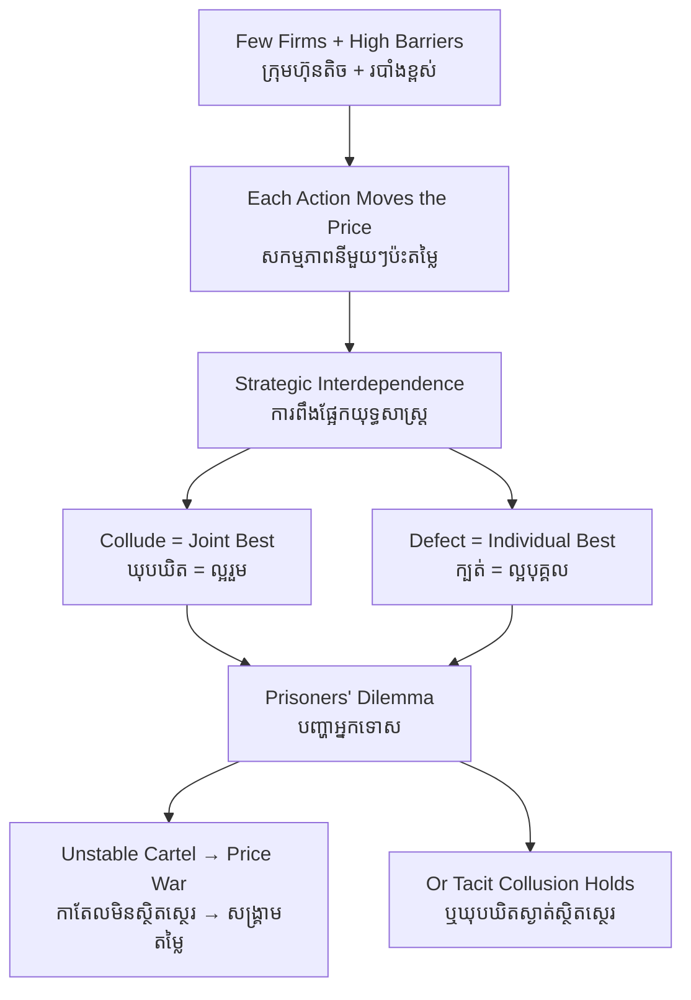

# Oligopoly — First-Principles Derivation
# អូលីហ្គោប៉ូលី — ការស្រាយបញ្ជាក់ពីគោលការណ៍ដំបូង

*Author: ichamrong | Date: 2026-06-01*

---

## Foundational Scholars / អ្នកសិក្សាស្ថាបនិក

**Antoine Augustin Cournot**, the French mathematician, founded the formal theory in his 1838 *Recherches* by modelling two spring-water sellers who each choose a quantity while anticipating the other — the first rigorous treatment of strategic interdependence. **Joseph Bertrand** (1883) recast the rivalry around price rather than quantity. A century later, **John Nash** gave the field its central solution concept, the **Nash equilibrium**, where each firm's choice is the best reply to the others'. Oligopoly is the market structure where these strategic ideas come alive. This course, *Principles of Microeconomics* (see [../../year-1/01-principles-of-microeconomics.md](../../year-1/01-principles-of-microeconomics.md)), uses it as the bridge from price theory into game theory.

---

## Core Problem / បញ្ហាស្នូល

**English:** In perfect competition, a firm is too small to affect the price; in monopoly, a single firm faces no rival. But most important industries — fuel, telecoms, cement, airlines — are run by a *handful* of large firms. Here each firm's profit depends not only on its own choices but on what its few rivals do in response. Lower your price and rivals may follow, igniting a price war; raise it and you may lose every customer. There is no simple "take the price as given." We need to derive how rational firms behave when they must *anticipate each other*.

**ខ្មែរ:** ក្នុងការប្រកួតប្រជែងពេញលេញ ក្រុមហ៊ុនតូចពេកមិនអាចប៉ះពាល់តម្លៃ។ ក្នុងម៉ូណូប៉ូល ក្រុមហ៊ុនតែមួយគ្មានគូប្រកួត។ ប៉ុន្តែឧស្សាហកម្មសំខាន់ៗភាគច្រើន — ប្រេងឥន្ធនៈ ទូរគមនាគមន៍ ស៊ីម៉ងត៍ ក្រុមហ៊ុនអាកាសចរណ៍ — ត្រូវបានដឹកនាំដោយក្រុមហ៊ុនធំ **មួយក្ដាប់**។ នៅទីនេះ ប្រាក់ចំណេញរបស់ក្រុមហ៊ុននីមួយៗ មិនត្រឹមតែអាស្រ័យលើជម្រើសរបស់ខ្លួនទេ ប៉ុន្តែលើអ្វីដែលគូប្រកួតពីរបីនាក់របស់ខ្លួនធ្វើ។ បន្ថយតម្លៃ គូប្រកួតអាចតាម បង្កសង្គ្រាមតម្លៃ។ ដំឡើងតម្លៃ អ្នកអាចបាត់បង់អតិថិជនទាំងអស់។ យើងត្រូវស្រាយពីរបៀបដែលក្រុមហ៊ុនមានហេតុផល ប្រព្រឹត្តពេលពួកវាត្រូវ **ព្យាករណ៍គ្នាទៅវិញទៅមក**។

---

## First Principles Derivation / ការស្រាយបញ្ជាក់ពីគោលការណ៍ដំបូង

**Axiom 1 — Few sellers, high barriers (អ័ក្សទ ១ — អ្នកលក់តិច របាំងខ្ពស់):**
A small number of firms supply most of the market because entry is blocked by huge fixed costs, control of resources, licences, or network effects.

**Axiom 2 — Strategic interdependence (អ័ក្សទ ២ — ការពឹងផ្អែកយុទ្ធសាស្ត្រ):**
Because each firm is large, its action visibly moves the market price. Therefore each firm must choose its action conditional on its rivals' likely response. Profit is the outcome of a *game*, not a solo optimization.

**Axiom 3 — Best-response rationality (អ័ក្សទ ៣ — ហេតុផលឆ្លើយតបល្អបំផុត):**
Each firm picks the strategy that maximizes its own profit given what it expects rivals to do.

**Derivation Chain (ខ្សែសង្វាក់ការស្រាយ):**

1. The market settles at a **Nash equilibrium**: a set of strategies where no firm can profit by unilaterally changing course.
2. **Two pulls** act on the firms. *Collusion* (acting like one monopoly, restricting output, sharing high profits) is jointly best. *Defection* (secretly undercutting to grab market share) is individually tempting.
3. This is a **prisoners' dilemma**: each firm gains by cheating on a cartel, so cartels are inherently unstable and collapse into **price wars**.
4. The equilibrium outcome therefore sits *between* monopoly and competition — prices higher than competitive, output lower, unless a price war temporarily drives prices toward cost.
5. Outcomes depend sharply on the rules: whether firms compete on price (Bertrand, fierce) or quantity (Cournot, softer), and whether the game repeats (repetition can sustain tacit collusion).

**Tacit collusion (ការឃុបឃិតស្ងាត់):** Even without an illegal agreement, repeated interaction lets firms learn to keep prices high by threatening retaliation — "price leadership" without a signed pact.

---

## Visual Derivation / ការបង្ហាញដោយមើលឃើញ

---

## Sustainability Note / ចំណាំអំពីនិរន្តរភាព

Global energy is the textbook oligopoly: a few national oil companies and a cartel (OPEC) coordinate output to hold prices and profits high. This concentration shapes the climate transition. An oligopoly can *slow* decarbonization when incumbents protect fossil assets, or *accelerate* it when a few dominant firms decide to electrify together. Understanding strategic interdependence is essential to predicting how concentrated industries respond to carbon pricing; see [monopoly](../monopoly/01-mit-professor.md) and [negative-externality](../negative-externality/01-mit-professor.md).

---

## Cambodian Application / ការអនុវត្តន៍ក្នុងបរិបទកម្ពុជា

**Cement and fuel distribution:** Cambodia's cement market and its petroleum import-distribution are each dominated by a handful of large players. When global crude prices fall, retail pump prices often drift down slowly and incompletely — a hallmark of oligopoly, where firms match each other's reluctance to cut rather than racing to the bottom. The few-seller structure, not collusion alone, explains why prices can be "sticky downward" even as costs ease.

---

## Related Posts / អត្ថបទដែលទាក់ទង

- [02 — Feynman Technique](./02-feynman.md)
- [03 — Socratic Dialogue](./03-socratic.md)
- [04 — Analogy Bridge](./04-analogy.md)
- [05 — Narrative Story](./05-storyteller.md)
- [06 — Journalist Interview](./06-interview.md)
- [Course: Principles of Microeconomics](../../year-1/01-principles-of-microeconomics.md)
- [Parable: The King Who Banned the Smoke](../../year-1/parables/263-the-king-who-banned-the-smoke.md)
