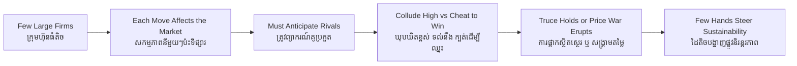

# Oligopoly — Socratic Dialogue
# អូលីហ្គោប៉ូលី — ការសន្ទនាបែប Socratic

*Author: ichamrong | Date: 2026-06-01*

---

**Professor:** Sophea, in a market with thousands of rice sellers, does any one seller worry about how a rival will react to her price?

**Sophea:** No. She's tiny. If she changes her price, no one even notices.

**Professor:** Now suppose a whole industry — say mobile networks in Cambodia — has only three big firms. Does each one worry about the others?

**Sophea:** Very much. If one cuts its data prices, the other two will see it immediately and have to respond.

**Professor:** So what is fundamentally different about a market of three large firms versus thousands of small ones?

**Sophea:** Each firm is big enough that its own move changes the market. They have to think about each other's reactions.

**Professor:** We call that strategic interdependence, and the structure an **oligopoly**. Now, if those three firms could secretly agree, what price would they want?

**Sophea:** A high one. If they all hold prices up together, they share monopoly-level profits.

**Professor:** Good. So why don't they all just quietly do that forever?

**Sophea:** Because... each one is tempted to cheat. If two keep prices high and the third secretly undercuts, the third grabs all the customers and makes a fortune.

**Professor:** And what happens once one firm cheats?

**Sophea:** The others have to cut too, or lose everyone. Then prices crash — a price war.

**Professor:** You've described a famous trap. Two outcomes are possible: a cosy high-price truce, or a ruinous war. What determines which one happens?

**Sophea:** Whether they trust each other to behave. And maybe whether they meet again and again — if they'll face each other tomorrow, cheating today gets punished tomorrow.

**Professor:** Exactly — repetition can hold a truce together without any signed contract. Now connect this to sustainability. Global oil is supplied by a few national giants and a cartel. How does their oligopoly shape the climate?

**Sophea:** They can coordinate to keep oil flowing and prices managed, protecting their fossil assets. That can slow the shift to clean energy.

**Professor:** And could the same concentration ever *help*?

**Sophea:** Yes — if a few dominant firms decided together to electrify, their size would move the whole market fast. Few hands can push either way.

**Professor:** So is "few sellers" inherently good or bad?

**Sophea:** Neither. It just means a handful of decisions steer the outcome — toward high prices or low, toward fossil lock-in or rapid transition. The structure concentrates the power; what matters is how it's used.

**Professor:** Hold onto that. Oligopoly is where market outcomes stop being mechanical and start being strategic.

---

## Insight Chain / ខ្សែសង្វាក់ការយល់ដឹង

---

## Related Posts / អត្ថបទដែលទាក់ទង

- [01 — MIT Professor](./01-mit-professor.md)
- [02 — Feynman Technique](./02-feynman.md)
- [04 — Analogy Bridge](./04-analogy.md)
- [05 — Narrative Story](./05-storyteller.md)
- [06 — Journalist Interview](./06-interview.md)
- [Course: Principles of Microeconomics](../../year-1/01-principles-of-microeconomics.md)
- [Parable: The King Who Banned the Smoke](../../year-1/parables/263-the-king-who-banned-the-smoke.md)
