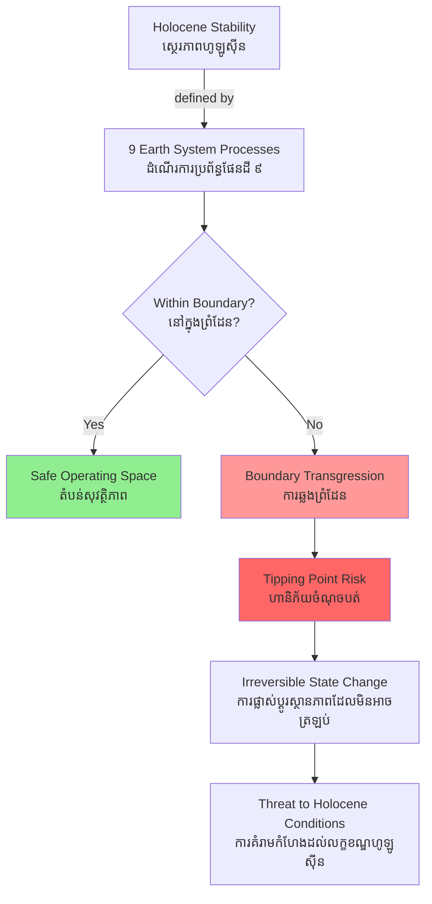

# Planetary Boundaries — First-Principles Derivation
# ព្រំដែនភពផែនដី — ការដឹកនាំពីគោលការណ៍មូលដ្ឋាន

*By Prof. Johan Rockström, Stockholm Resilience Centre | ដោយ សាស្ត្រាចារ្យ Johan Rockström*

*Author: ichamrong | Date: 2026-05-29*

---

## Core Problem | បញ្ហាស្នូល

The Holocene (ហូឡូស៊ីន) — the 11,700-year period of remarkable climatic stability since the last ice age — is the only planetary state in which human civilization has ever existed. Our agriculture, cities, water systems, and political institutions were all built within Holocene conditions. The central question: **what are the biophysical boundaries that define a "safe operating space" (តំបន់សុវត្ថិភាព) within which humanity can continue to thrive?**

---

## First Principles Derivation | ការដឹកនាំពីគោលការណ៍

**Axiom 1:** Earth is a complex adaptive system with nonlinear dynamics and multiple stable states.

**Axiom 2:** Human industrial activity since ~1950 (the "Great Acceleration") has pushed several Earth system processes outside their Holocene range of variability.

**Axiom 3:** Some biophysical processes, when perturbed beyond a threshold, trigger self-reinforcing feedbacks — tipping points — that cannot be reversed on human timescales.

**Axiom 4:** Multiple Earth system processes are interconnected; crossing one boundary can cascade into others.

**Therefore:** A safe operating space can be defined by identifying the key Earth system processes that regulate the Holocene state, and quantifying the boundaries beyond which transgression risks tipping points.

**The nine planetary boundaries (Rockström et al., 2009; updated 2023):**

1. **Climate change** (ការប្រែប្រួលអាកាសធាតុ) — CO₂ concentration boundary: 350 ppm (current: ~423 ppm — *transgressed*)
2. **Biosphere integrity / Biodiversity** (ភាពសុចរិតជីវចម្រុះ) — extinction rate: < 10 species/million species/year (current: ~100–1,000 — *transgressed*)
3. **Land-system change** (ការប្រែប្រួលប្រព័ន្ធដី) — % forested land: > 75% in tropical forests (current: *transgressed*)
4. **Freshwater change** (ការប្រែប្រួលទឹកសាប) — green and blue water flows
5. **Biogeochemical flows — N & P** (លំហូរជីវ-គីមី) — nitrogen and phosphorus cycles (*transgressed*)
6. **Ocean acidification** (ការជូរចត់ប្រព័ន្ធសមុទ្រ)
7. **Stratospheric ozone depletion** (ការបំផ្លាញស្រទាប់អូហ្សូន)
8. **Atmospheric aerosol loading** (ការផ្ទុកភាគល្អិតក្នុងបរិយាកាស)
9. **Novel entities** (សារធាតុថ្មី) — plastics, synthetic chemicals (*transgressed*)

**Implication 1:** At least six of nine boundaries have been transgressed as of 2023.

**Implication 2:** The framework shifts the sustainability question from "how much growth can the planet absorb?" to "what is the minimum safe space for Earth system stability?"

**Implication 3:** Transgression is not uniform — developing nations like Cambodia have contributed least to boundary crossings but are most exposed to their consequences.

---

## Visual Derivation | ដ្យាក្រាមដឹកនាំ

---

## Real-World Application | ការអនុវត្តជាក់ស្តែង

**Cambodia's position:** Cambodia has not industrialized at a scale that drives planetary boundary transgression — its per-capita emissions are among the world's lowest. Yet the country sits at the intersection of multiple transgressed boundaries:

- **Climate boundary:** Mekong River flow variability is increasing due to global warming + upstream dams, directly threatening Tonle Sap flood-pulse ecology.
- **Land-system boundary:** Cambodia's deforestation rate remains among the highest in Southeast Asia. Forest cover dropped from ~73% in 1993 to ~46% by 2020.
- **Biodiversity boundary:** The Mekong is the world's most biodiverse river; Mekong dams block fish migration routes that support Cambodia's inland fishery.

**Policy link:** Cambodia's REDD+ program is essentially a contribution to the land-system and biodiversity planetary boundaries. Every hectare of forest protected in the Cardamom Mountains is a partial payment toward staying within global safe space.

---

## Related Posts | អត្ថបទពាក់ព័ន្ធ

- [02 — Feynman Explanation](./02-feynman.md)
- [03 — Socratic Dialogue](./03-socratic.md)
- [04 — Analogy Bridge](./04-analogy.md)
- [05 — Narrative Story](./05-storyteller.md)
- [06 — Journalist Interview](./06-interview.md)
- [Parable: The River That Fed the Village](../../year-1/parables/262-the-river-that-fed-the-village.md)
