# Planetary Boundaries — Socratic Dialogue
# ព្រំដែនភពផែនដី — កិច្ចសន្ទនាបែប Socrates

*Author: ichamrong | Date: 2026-05-29*

---

**Professor:** Dara, if I asked you to describe the climate of Cambodia 200 years ago, what would you say?

**Dara:** Hot. Rainy season from May to October, dry season after. Mekong floods on a fairly regular schedule. Rice harvest in November.

**Professor:** And today?

**Dara:** Still mostly that pattern, but the rains are less predictable. Floods happen at unexpected times. Droughts are more severe. Scientists say the Tonle Sap's flood pulse is weakening.

**Professor:** What does it mean that human civilization was built during a period of unusual climatic stability?

**Dara:** Our agriculture, water infrastructure, and settlement patterns all assume a certain climatic range. If the range shifts outside that, all those assumptions break.

**Professor:** Scientists have identified nine major Earth system processes that regulate this stability. What happens if we exceed safe limits in those processes?

**Dara:** We risk triggering changes that can't be easily reversed — tipping points (ចំណុចបត់).

**Professor:** Give me a tipping point relevant to Cambodia.

**Dara:** The Tonle Sap flood pulse (ជំនន់ទន្លេសាប). It depends on the Mekong flood arriving at a certain strength and timing. If upstream dams and climate change reduce that flood below a critical threshold, the lake could fail to refill properly — and the fish population that depends on flooded forest spawning could collapse.

**Professor:** Is that collapse reversible?

**Dara:** It would take decades to recover, if ever. The fish populations, the forest structure, the sediment dynamics — they're all interconnected.

**Professor:** Johan Rockström's framework says we have transgressed six of nine planetary boundaries. Cambodia's industrial contribution to this transgression is near zero. Is the framework then irrelevant to Cambodia?

**Dara:** No, because Cambodia suffers the consequences without causing the problem. Climate boundary transgressed by rich countries → Mekong hydrology disrupted → Cambodian families lose fish protein.

**Professor:** What does that imply about the ethics of planetary boundary governance?

**Dara:** That there's a profound injustice. Those who caused the boundary crossing must compensate those who bear the costs — through climate finance, technology transfer, or loss-and-damage funds.

**Professor:** Cambodia has REDD+ forest carbon credits. Is this a solution to planetary boundary governance?

**Dara:** Partially. Cambodia protecting its forests contributes to the land-system and biodiversity boundaries. But the payment Cambodia receives is still far below the actual value of those ecosystem services.

**Professor:** What would a full-cost approach look like?

**Dara:** Richer countries paying the true cost of Cambodia's ecosystem services — not just carbon, but water regulation, biodiversity habitat, flood buffering for the whole Mekong region.

**Professor:** Is there a risk that planetary boundary thinking leads to "green colonialism" — rich countries dictating how poor countries use their forests?

**Dara:** Yes, that's a real tension. Cambodia should have the right to develop. The solution is adequate compensation and technology sharing, not just restrictions.

---

## Insight Chain | ខ្សែសង្វាក់ការយល់ដឹង

```mermaid
graph LR
    A["Holocene Stability<br/>ស្ថេរភាពហូឡូស៊ីន"] -->|requires| B["9 Boundaries Respected<br>ព្រំដែន ៩ ត្រូវគោរព"]
    B -->|6 transgressed| C["Tipping Point Risk<br>ហានិភ័យចំណុចបត់"]
    C -->|Mekong example| D["Flood Pulse Disruption<br>ការរំខានជំនន់ទន្លេ"]
    D -->|causes| E["Fish Collapse Risk<br>ហានិភ័យការដួលរលំនៃត្រី"]
    E -->|injustice| F["Cambodia Bears Cost<br>កម្ពុជាទទួលផល"]
    F -->|solution| G["Climate Finance + REDD+<br>ហិរញ្ញប្បទានអាកាសធាតុ"]
```

---

## Related Posts | អត្ថបទពាក់ព័ន្ធ

- [01 — MIT Professor](./01-mit-professor.md)
- [02 — Feynman Explanation](./02-feynman.md)
- [04 — Analogy Bridge](./04-analogy.md)
- [05 — Narrative Story](./05-storyteller.md)
- [06 — Journalist Interview](./06-interview.md)
- [Parable: The River That Fed the Village](../../year-1/parables/262-the-river-that-fed-the-village.md)
