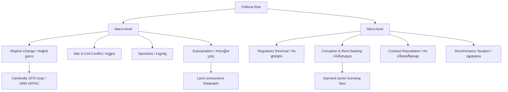

# Political Risk: First Principles
# ហានិភ័យនយោបាយ៖ គោលការណ៍មូលដ្ឋាន

> *In the tradition of Dani Rodrik — economics meets political economy*

---

## The Core Argument / អាគុយម៉ង់ស្នូល

Political risk is not noise in the economic system — it **is** the system. Every investment decision, every supply-chain design, every market-entry strategy is ultimately a bet on institutional stability. When economists model growth without modeling governance, they are building castles on sand.

ហានិភ័យនយោបាយមិនមែនជាការរំខានក្នុងប្រព័ន្ធសេដ្ឋកិច្ចទេ — វា **គឺជា** ប្រព័ន្ធផ្ទាល់។ ការវិនិយោគ ការរចនាខ្សែសង្វាក់ផ្គត់ផ្គង់ និងយុទ្ធសាស្ត្រចូលទីផ្សារ គ្រប់យ៉ាងសុទ្ធតែជាការភ្នាល់លើស្ថិរភាពស្ថាប័ន។

---

## Definition: What Political Risk Actually Is / និយមន័យ

**Political risk** is the probability that a political event — a regime change, a regulatory reversal, an expropriation, a civil conflict, or even a subtle shift in enforcement norms — will materially affect the value of an investment or the viability of a business operation.

**ហានិភ័យនយោបាយ** គឺជាប្រូបាបនៃព្រឹត្តិការណ៍នយោបាយ — ការផ្លាស់ប្ដូររបបគ្រប់គ្រង ការផ្ដាច់ច្បាប់ ការដណ្ដើមទ្រព្យ ជម្លោះសង្គ្រាម ឬការប្ដូរបទដ្ឋានអនុវត្ត — ដែលប៉ះពាល់យ៉ាងសំខាន់ដល់តម្លៃការវិនិយោគ។

It differs from **country risk** (broader macroeconomic instability) and **regulatory risk** (rule-change within stable systems). Political risk is specifically about the *relationship between the state and private actors* — and who has power to rewrite that relationship overnight.

---

## The Rodrik Framework: The Political Trilemma / ក្របខ័ណ្ឌ Rodrik

Dani Rodrik's political trilemma of the world economy argues that no nation can simultaneously have:

1. **Deep economic integration** (globalization)
2. **National sovereignty** (autonomous policy-making)
3. **Democratic politics** (responsive governance)

You can have any two — but not all three.

```
Deep Integration + Sovereignty = Technocratic rule (no democracy)
Deep Integration + Democracy   = Global governance (no sovereignty)
Sovereignty + Democracy        = Limited globalization
```

For investors in frontier markets like Cambodia, this trilemma is not abstract. It explains why the country that accepts the most Chinese BRI investment (sovereignty + integration) must often suppress democratic competition to maintain the arrangement.

សម្រាប់វិនិយោគិននៅទីផ្សារដូចកម្ពុជា ត្រីមុខភាពនេះមិនមែនជាទ្រឹស្ដីទេ។ វាពន្យល់ថាហេតុអ្វីបានជាប្រទេសដែលទទួលការវិនិយោគ BRI ច្រើន (អធិបតេយ្យ + សមាហរណកម្ម) ត្រូវតែទប់ស្កាត់ប្រជាធិបតេយ្យ។

---

## A Taxonomy of Political Risk / ចំណាត់ថ្នាក់ហានិភ័យនយោបាយ



---

## How Political Risk Is Measured / របៀបវាស់វែង

Three dominant methodologies exist:

| Method | Approach | Weakness |
|--------|----------|----------|
| **ICRG (PRS Group)** | Quantitative scoring (0–100) across 22 variables | Backward-looking |
| **Political Risk Insurance** (MIGA, OPIC) | Actuarial pricing of specific events | Expensive, opaque |
| **Qualitative Scenario Analysis** | Expert judgment on plausible futures | Subjective |

Rodrik would add a fourth: **structural indicators** — quality of institutions, rule-of-law indices, Polity IV democracy scores — that are more predictive than event-based metrics.

---

## The Cambodia Case: Hun Sen Era Political Risk / ករណីកម្ពុជា

From 1985–2023, Cambodia under Prime Minister Hun Sen presented a distinctive political risk profile:

- **Stability of authoritarian consolidation**: low coup risk, but high expropriation and regulatory reversal risk for firms that challenged political-business networks
- **Chinese BRI dependency**: by 2020, China accounted for ~38% of FDI; this created asymmetric risk — proximity to Beijing reduced political risk *from the state* but increased it *from Western sanctions*
- **ASEAN neutrality play**: Cambodia's ASEAN chairmanship (2022) showed how small states manage geopolitical risk through multilateral positioning

ក្នុងសម័យ លោក ហ៊ុន សែន ហានិភ័យនយោបាយនៅកម្ពុជាផ្ដោតលើ៖ ការដណ្ដើមដីធ្លី អំពើពុករលួយ និងការប្ដូរច្បាប់ភ្លាមៗ ជំនួសឱ្យការផ្ដាច់ដំណែង។

---

## Key Insight for Practitioners / ចំណុចសំខាន់

> Political risk is not something you can eliminate — only understand, price, and hedge. The firms that fail are not those that entered risky markets; they are those that failed to *continuously reassess* as the political landscape shifted beneath them.

ហានិភ័យនយោបាយមិនអាចលុបបំបាត់បានទេ — គ្រាន់តែអាចយល់ កំណត់តម្លៃ និងការពារ។

---

## Related Posts / អត្ថបទពាក់ព័ន្ធ

- [Geopolitical Risk](../geopolitical-risk/01-mit-professor.md)
- [Realism vs. Liberalism](../realism-vs-liberalism/01-mit-professor.md)
- [Sanctions](../sanctions/01-mit-professor.md)
- [Corporate Social Responsibility](../corporate-social-responsibility/01-mit-professor.md)
- [Parable: The Emperor and the Trade Route](../../year-1/parables/266-the-emperor-and-the-trade-route.md)
