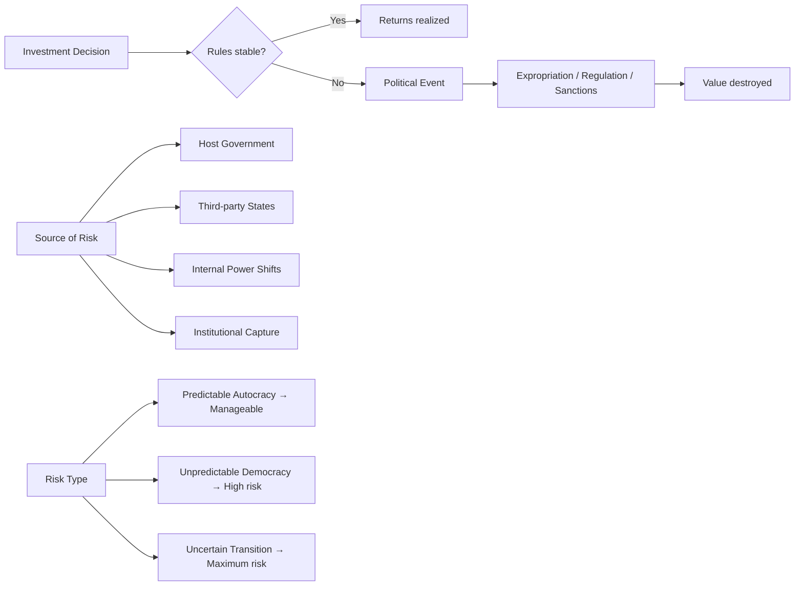

# Political Risk: A Socratic Dialogue
# ហានិភ័យនយោបាយ៖ វិធីសំណួរ-ចម្លើយ

*Professor and student Dara explore political risk through questions alone.*
*សាស្រ្តាចារ្យ និងនិស្សិត ដារា ស្វែងរកហានិភ័យនយោបាយតាមរយៈសំណួរ។*

---

**Professor:** Dara, when a factory owner invests in a new machine, what is she really betting on?

**Dara:** That the machine will produce enough to pay back the cost?

**Professor:** Yes — but what else? What must remain stable for that bet to pay off?

**Dara:** … The price of the product? The availability of workers?

**Professor:** And the rules. What if a new law passes tomorrow that bans her product altogether?

**Dara:** Then all her investment is lost — even though the machine still works perfectly.

**Professor:** So what name do we give to the risk that the *rules* will change because of *politics*?

---

**Dara:** Political risk. But Professor — isn't that the same as legal risk?

**Professor:** Are all legal changes political? And are all political changes legal?

**Dara:** I suppose… a leader could just *ignore* the law. Or change it to fit their interests.

**Professor:** When Hun Sen's government cancelled the opposition party in 2017, was that legal under Cambodian law at the time?

**Dara:** They used the courts… but most observers said it was politically motivated.

**Professor:** So what does that tell you about where political risk *really* lives?

**Dara:** Not in the law itself — but in who controls the institutions that interpret the law?

---

**Professor:** Now. A Chinese company invests $400 million in a Cambodian port. What political risks does it face?

**Dara:** The Cambodian government could expropriate it? Or cancel the contract?

**Professor:** What would make the Cambodian government do that?

**Dara:** If relations with China broke down? Or if a new government came to power that didn't want Chinese influence?

**Professor:** And from the other direction — what if Cambodia *stays* close to China? What new risk appears?

**Dara:** Western sanctions? The US or EU might sanction Cambodia for being too aligned with China?

**Professor:** So is political risk only about the country you invest in?

**Dara:** No — it can also come from *third parties*. Countries that don't like who you're doing business with.

---

**Professor:** Good. Now let me ask you something harder. Is Cambodia's political risk *high* or *low* compared to, say, Singapore?

**Dara:** High, I think — because there's less rule of law, more personal power?

**Professor:** But Singapore has had one-party dominance for 60 years. Is that not also a political risk?

**Dara:** …Maybe the risk isn't about democracy vs. authoritarianism. It's about whether the *system is predictable*?

**Professor:** What is the difference between a *stable autocracy* and an *unpredictable one*?

**Dara:** Investors can plan around stable rules, even if the rules are unfair?

**Professor:** And what does that suggest about the nature of political risk?

**Dara:** That it's really about *uncertainty* — not about whether the government is good or bad?

---

**Professor:** One final question. If you were advising a Cambodian garment factory about political risk — not from foreign governments, but from within Cambodia — what would you tell them to watch?

**Dara:** Changes in who the powerful families are supporting? New licensing requirements? Who is getting contracts?

**Professor:** And why are those signals more useful than reading the newspaper headlines?

**Dara:** Because by the time it's in the headlines, the risk has already materialized?

**Professor:** Now you understand political risk.

---

## The Insight Chain / ខ្សែភ្ជាប់សម្រាប់យល់ដឹង

---

## Related Posts / អត្ថបទពាក់ព័ន្ធ

- [Geopolitical Risk](../geopolitical-risk/03-socratic.md)
- [Sanctions](../sanctions/03-socratic.md)
- [Realism vs. Liberalism](../realism-vs-liberalism/03-socratic.md)
- [Corporate Social Responsibility](../corporate-social-responsibility/03-socratic.md)
- [Parable: The Emperor and the Trade Route](../../year-1/parables/266-the-emperor-and-the-trade-route.md)
