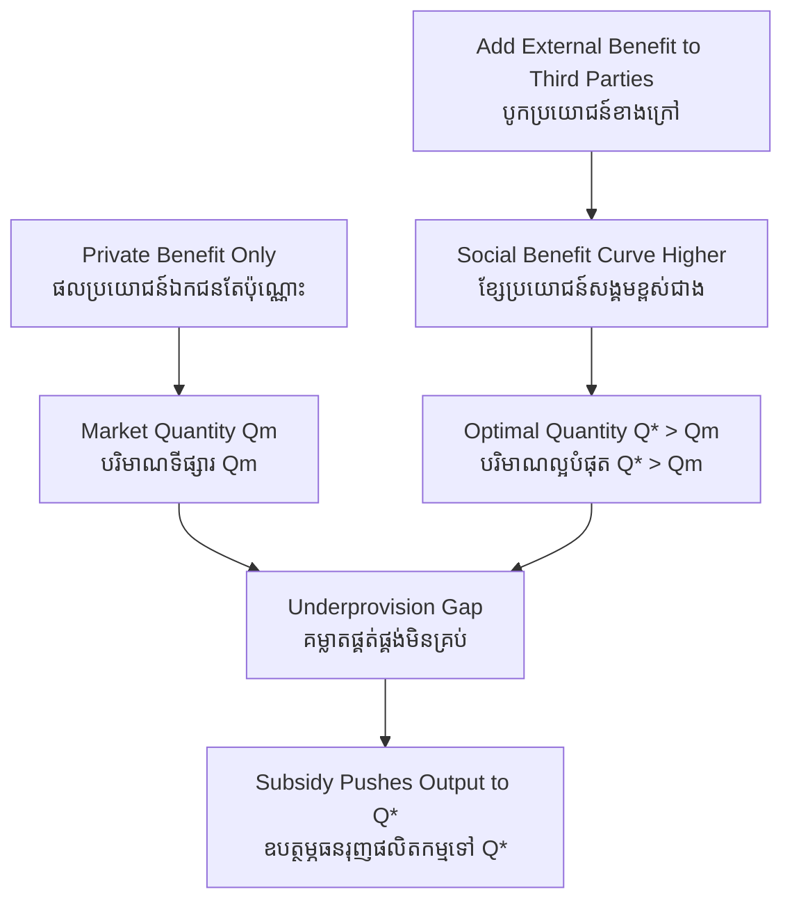

# Positive Externality — First-Principles Derivation
# ផលជះក្រៅប្រព័ន្ធវិជ្ជមាន — ការស្រាយបញ្ជាក់ពីគោលការណ៍ដំបូង

*Author: ichamrong | Date: 2026-06-01*

---

## Foundational Scholars / អ្នកសិក្សាស្ថាបនិក

**Alfred Marshall** introduced the notion of external economies in his 1890 *Principles of Economics*, but it was his student **Arthur Cecil Pigou** (University of Cambridge) who, in *The Economics of Welfare* (1920), built the modern theory. Pigou distinguished the *private* product of an action from its *social* product and argued that where the social benefit exceeds the private one — a positive externality — the market underprovides the good, and a **subsidy** can correct it. This course, *Principles of Microeconomics* (see [../../year-1/01-principles-of-microeconomics.md](../../year-1/01-principles-of-microeconomics.md)), treats the externality as the central form of market failure.

---

## Core Problem / បញ្ហាស្នូល

**English:** When you vaccinate yourself, you protect not only yourself but everyone you might have infected. When a landowner reforests a hillside, the cleaner air and stable soil benefit a whole valley. The decision-maker bears the full cost but captures only a slice of the benefit; the rest spills over to strangers who pay nothing. A self-interested agent weighs only their *private* gain against cost — so they do *too little* of the beneficial activity. We need to derive why the market underprovides goods whose benefits leak outward, and how policy can close the gap.

**ខ្មែរ:** ពេលអ្នកចាក់វ៉ាក់សាំង អ្នកការពារមិនត្រឹមតែខ្លួនឯងទេ ប៉ុន្តែការពារអ្នកគ្រប់គ្នាដែលអ្នកអាចឆ្លងដល់។ ពេលម្ចាស់ដីដាំព្រៃឡើងវិញលើភ្នំ ខ្យល់ស្អាត និងដីរឹងមាំ ផ្តល់ប្រយោជន៍ដល់ជ្រលងភ្នំទាំងមូល។ អ្នកសម្រេចចិត្តទទួលរងចំណាយពេញលេញ ប៉ុន្តែទទួលបានត្រឹមតែផ្នែកមួយនៃផលប្រយោជន៍។ ផ្នែកដែលនៅសល់ហូរទៅអ្នកដទៃដែលមិនបង់ប្រាក់។ ភ្នាក់ងារដែលគិតតែពីខ្លួនឯង ថ្លឹងតែ **ផលប្រយោជន៍ឯកជន** របស់ខ្លួននឹងចំណាយ — ដូច្នេះគេធ្វើសកម្មភាពមានប្រយោជន៍ **តិចពេក**។ យើងត្រូវស្រាយថា ហេតុអ្វីទីផ្សារផ្គត់ផ្គង់ទំនិញដែលផលប្រយោជន៍ហូរចេញក្រៅ មិនគ្រប់គ្រាន់ និងរបៀបដែលគោលនយោបាយអាចបំពេញគម្លាត។

---

## First Principles Derivation / ការស្រាយបញ្ជាក់ពីគោលការណ៍ដំបូង

**Axiom 1 — Agents weigh private benefit against private cost (អ័ក្សទ ១ — ភ្នាក់ងារថ្លឹងផលប្រយោជន៍ឯកជននឹងចំណាយឯកជន):**
A rational decision-maker chooses the quantity at which their *marginal private benefit* equals their *marginal private cost*.

**Axiom 2 — Some benefits accrue to third parties (អ័ក្សទ ២ — ផលប្រយោជន៍ខ្លះធ្លាក់ដល់ភាគីទីបី):**
For certain activities, each unit produces a *marginal external benefit* enjoyed by people not party to the transaction. **Marginal social benefit = marginal private benefit + marginal external benefit.**

**Axiom 3 — Efficiency requires social benefit = social cost (អ័ក្សទ ៣ — ប្រសិទ្ធភាពទាមទារ ប្រយោជន៍សង្គម = ចំណាយសង្គម):**
The socially optimal quantity equates *marginal social benefit* with marginal social cost.

**Derivation Chain (ខ្សែសង្វាក់ការស្រាយ):**

1. The market settles where *private* benefit equals cost, at quantity *Qₘ*.
2. The optimum sits where *social* benefit equals cost, at quantity *Q\**.
3. Because external benefit is positive, the social-benefit curve lies *above* the private one, so *Q\* > Qₘ* — the market **underprovides**.
4. The gap between *Qₘ* and *Q\** represents lost welfare: units that would have benefited society more than they cost are never produced — a **deadweight loss** of foregone good.
5. A **Pigouvian subsidy** equal to the marginal external benefit lowers the private cost enough to push output to *Q\**, internalizing the spillover.

**Why markets can't fix it alone (ហេតុអ្វីទីផ្សារមិនអាចដោះស្រាយតែឯង):** The third-party beneficiaries cannot easily be charged, so the producer has no way to capture the external benefit and no incentive to supply the optimal amount.

---

## Visual Derivation / ការបង្ហាញដោយមើលឃើញ

---

## Sustainability Note / ចំណាំអំពីនិរន្តរភាព

Positive externalities are the economic case for green investment. Rooftop solar, reforestation, mangrove restoration, and clean public transit all generate benefits — carbon stored, air cleaned, biodiversity preserved — that the investor cannot fully capture, so the market underbuilds them. This is the mirror image of the [negative-externality](../negative-externality/01-mit-professor.md) problem and the justification for green subsidies and feed-in tariffs. Compare also [public-goods](../public-goods/01-mit-professor.md), whose nonexcludable benefits are an extreme externality.

---

## Cambodian Application / ការអនុវត្តន៍ក្នុងបរិបទកម្ពុជា

**Mangrove replanting in Koh Kong:** A community that replants mangroves captures some private benefit (more crabs and fish in nearby waters) but generates large external benefits it cannot charge for — coastal protection for distant villages, carbon storage for the whole planet, nursery habitat for offshore fisheries. Left to private incentive alone, far too few mangroves get planted. NGO and government payments for ecosystem services act as a Pigouvian subsidy, lifting replanting toward the socially optimal level.

---

## Related Posts / អត្ថបទដែលទាក់ទង

- [02 — Feynman Technique](./02-feynman.md)
- [03 — Socratic Dialogue](./03-socratic.md)
- [04 — Analogy Bridge](./04-analogy.md)
- [05 — Narrative Story](./05-storyteller.md)
- [06 — Journalist Interview](./06-interview.md)
- [Course: Principles of Microeconomics](../../year-1/01-principles-of-microeconomics.md)
- [Parable: The River That Fed the Village](../../year-1/parables/262-the-river-that-fed-the-village.md)
