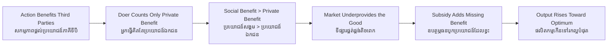

# Positive Externality — Socratic Dialogue
# ផលជះក្រៅប្រព័ន្ធវិជ្ជមាន — ការសន្ទនាបែប Socratic

*Author: ichamrong | Date: 2026-06-01*

---

**Professor:** Dara, when a person gets vaccinated against a contagious disease, who benefits?

**Dara:** The person themselves — they won't get sick.

**Professor:** Only them?

**Dara:** No... also everyone they might have infected. By staying healthy, they protect others around them too.

**Professor:** So the benefit of one vaccination extends beyond the buyer. What do we call a benefit that lands on people outside the transaction?

**Dara:** An externality — and since it's good, a positive externality.

**Professor:** Now, when the person decides whether to get vaccinated, whose benefit do they weigh against the cost and trouble?

**Dara:** Mostly their own. They think "will this protect *me*," not "how many strangers will I protect."

**Professor:** So do they count the full benefit their vaccination creates?

**Dara:** No. They count only their private slice. The benefit to others doesn't enter their decision.

**Professor:** Then will more people, or fewer people, get vaccinated than would be best for society as a whole?

**Dara:** Fewer. Each person undervalues the act because they ignore the good they do for others. So we get too little vaccination.

**Professor:** You've reached the heart of it — positive externalities lead to *underprovision*. Now, is this because people are bad?

**Dara:** No. They're just rational about their own costs and benefits. The good that spills out is invisible to their wallet.

**Professor:** Good. So how might society get the amount that's actually best?

**Dara:** Pay people, or lower the cost — make vaccines free, or even reward people for getting them. A subsidy.

**Professor:** That's a Pigouvian subsidy — it adds the missing external benefit back into the private decision. Now extend it. A landowner reforests a hillside. Who gains?

**Dara:** Him a little — but the whole valley below gets cleaner water, firmer soil, less flooding. Most of the benefit goes to people he'll never meet.

**Professor:** So left alone, how much reforestation happens?

**Dara:** Too little. He plants for his own small benefit and stops there.

**Professor:** And this is the foundation of which kind of policy in a sustainable economy?

**Dara:** Green subsidies — for solar, for trees, for clean transit. All of them throw off benefits the investor can't capture, so the market underbuilds them, and the subsidy closes the gap.

**Professor:** Precisely. A negative externality means the market does *too much* of something harmful. A positive externality means it does *too little* of something wonderful. Both are failures of the same kind — prices that don't tell the whole truth about value.

---

## Insight Chain / ខ្សែសង្វាក់ការយល់ដឹង

---

## Related Posts / អត្ថបទដែលទាក់ទង

- [01 — MIT Professor](./01-mit-professor.md)
- [02 — Feynman Technique](./02-feynman.md)
- [04 — Analogy Bridge](./04-analogy.md)
- [05 — Narrative Story](./05-storyteller.md)
- [06 — Journalist Interview](./06-interview.md)
- [Course: Principles of Microeconomics](../../year-1/01-principles-of-microeconomics.md)
- [Parable: The River That Fed the Village](../../year-1/parables/262-the-river-that-fed-the-village.md)
