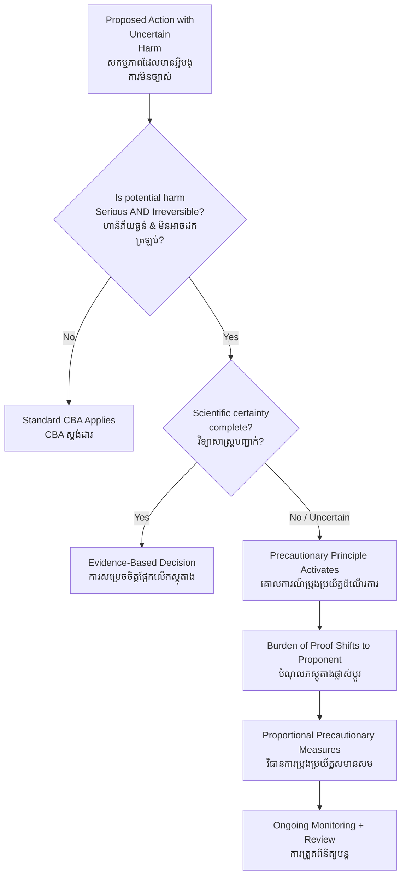

# Precautionary Principle — First-Principles Derivation
# គោលការណ៍ប្រុងប្រយ័ត្ន — ការស្រាយបញ្ជាក់ពីគោលការណ៍ដំបូង

*Author: ichamrong | Date: 2026-05-29*

---

## Foundational Scholar / អ្នកសិក្សាស្ថាបនិក

**Hans Jonas** (1903–1993), German-American philosopher, articulated the foundational ethics of precaution in *The Imperative of Responsibility* (1979): *"Act so that the effects of your action are compatible with the permanence of genuine human life."* Jonas argued that modern technology creates the possibility of irreversible catastrophic harm — and that the traditional ethical frameworks, which assume reversible or local effects, are inadequate for this new reality.

In environmental law, the principle was codified in **Principle 15 of the Rio Declaration (1992):** *"Where there are threats of serious or irreversible damage, lack of full scientific certainty shall not be used as a reason for postponing cost-effective measures to prevent environmental degradation."*

---

## Core Problem / បញ្ហាស្នូល

**English:** Classical cost-benefit analysis assumes that all outcomes are known, reversible, and measurable. But many environmental and technological decisions involve outcomes that are uncertain, potentially irreversible, and catastrophic in scale. In these conditions, standard expected-value maximization fails — because the expected value of a low-probability catastrophe can be severely underestimated, and because the catastrophe may be beyond any possibility of correction once it occurs.

**ខ្មែរ:** ការវិភាគប្រាក់ចំណូល-ចំណាយបែបប្រពៃណីសន្មតថាលទ្ធផលទាំងអស់ត្រូវបានស្គាល់ អាចជាក់ស្ដែង និងអាចវាស់វែងបាន។ ប៉ុន្តែការសម្រេចចិត្តបរិស្ថាន និងបច្ចេកវិទ្យាជាច្រើនពាក់ព័ន្ធនឹងលទ្ធផលដែលមិនច្បាស់លាស់ ហើយអាចមិនអាចដកត្រឡប់ ហើយមានទំហំគ្រោះមហន្តរាយ។ ក្នុងលក្ខខណ្ឌទាំងនេះ ការ memaksimumkan តម្លៃរំពឹងបែបស្ដង់ដាររបស់ Bayesian fails — ពីព្រោះការសម្មតម្លៃរំពឹងនៃគ្រោះមហន្តរាយប្រូបាបិលីតេទាបអាចត្រូវបានប៉ាន់ស្មានចេញពីការពិតយ៉ាងខ្លាំង ហើយគ្រោះមហន្តរាយអាចហួសសំណងនៅពេលវាកើតឡើង។

---

## First Principles Derivation / ការស្រាយបញ្ជាក់ពីគោលការណ៍ដំបូង

**Axiom 1 — Irreversibility asymmetry (អ័ក្សទ 1 — ភាពមិនស្មើគ្នានៃការមិនអាចដកត្រឡប់):**
Some harms can be corrected after the fact (reversible). Others cannot: extinction of a species, collapse of a river ecosystem, contamination of an aquifer. The asymmetry between reversible and irreversible harm is morally and strategically significant.

**Axiom 2 — Uncertainty is not ignorance (អ័ក្សទ 2 — ភាពមិនច្បាស់លាស់មិនមែនជាការចាត់ទុក):**
"We don't have enough evidence to prove harm" is not the same as "the activity is safe." In complex systems, absence of evidence of harm is not evidence of absence of harm.

**Axiom 3 — The standard cost-benefit framework underweights tail risks (អ័ក្សទ 3 — ក្របខ័ណ្ឌ CBA ស្ដង់ដារ underweights ហានិភ័យបន្ត):**
Expected value = Σ (probability × outcome). When probabilities are deeply uncertain and outcomes are catastrophic and irreversible, this calculation is unreliable.

**Derivation Chain (ខ្សែសង្វាក់ការស្រាយ):**

1. Identify action with potential for serious or irreversible harm.
2. Assess scientific certainty: is harm proven, probable, or merely possible?
3. If harm is serious AND irreversible AND scientific certainty is incomplete → precautionary trigger is activated.
4. Burden of proof shifts: the proponent of the action must demonstrate safety, not the objector demonstrate harm.
5. Proportionality: precautionary measures must be proportional to the severity and probability of harm.
6. Do not wait for full scientific proof if the cost of waiting = irreversible catastrophe.

---

## Wingspread Formulation (1998) / ការបញ្ជាក់ Wingspread

*"When an activity raises threats of harm to human health or the environment, precautionary measures should be taken even if some cause-and-effect relationships are not fully established scientifically."*

This formulation places the burden of proof on the activity proponent — not on those who might be harmed.

---

## Visual Derivation / ការបង្ហាញដោយមើលឃើញ

---

## Cambodian Application / ការអនុវត្តន៍ក្នុងបរិបទកម្ពុជា

**Mekong Dam Construction:**
Before mainstream Mekong dams were proposed, fish migration specialists warned that the Mekong fishery — which provides 60–80% of animal protein for millions of Cambodians — could be catastrophically disrupted. Scientific certainty was incomplete: the exact scale of disruption was unknown. But the harm was potentially irreversible (fish migration routes disrupted; species lost; delta salinity intrusion changed permanently).

The precautionary principle would have required dam proponents to demonstrate safety before proceeding. Instead, the evidentiary standard was reversed: critics had to prove harm. By the time harm was documented, construction was complete and irreversible.

This is precisely the governance failure the precautionary principle is designed to prevent.

---

## Related Posts / អត្ថបទដែលទាក់ទង

- [02 — Feynman Technique](./02-feynman.md)
- [03 — Socratic Dialogue](./03-socratic.md)
- [04 — Analogy Bridge](./04-analogy.md)
- [05 — Narrative Story](./05-storyteller.md)
- [06 — Journalist Interview](./06-interview.md)
- [Parable: The King Who Banned the Smoke](../../year-1/parables/263-the-king-who-banned-the-smoke.md)
