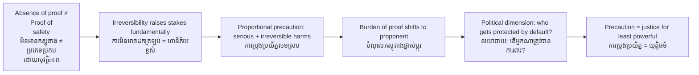

# Precautionary Principle — Socratic Dialogue
# គោលការណ៍ប្រុងប្រយ័ត្ន — ការសន្ទនាបែប Socratic

*Author: ichamrong | Date: 2026-05-29*

---

**Professor:** Dara, a mining company wants to extract bauxite in Mondulkiri Province. Scientists say the process may contaminate groundwater used by indigenous communities. But they have not proven it will. Should the government approve the mine?

**Dara:** If there is no proof of harm, I think the company should be allowed to proceed. That seems fair.

**Professor:** What do you mean by "fair"? Fair to whom?

**Dara:** Fair to the company — they have done the studies, invested capital, and there is no evidence against them.

**Professor:** What if the contamination occurs after approval? What happens to the groundwater?

**Dara:** It might be permanently poisoned. The communities have no other water source.

**Professor:** Can poisoned groundwater be restored?

**Dara:** That is very difficult — it could take decades or may be impossible.

**Professor:** So the harm, if it occurs, is irreversible. Does that change your answer?

**Dara:** It changes the stakes. If the harm cannot be undone, the decision feels more serious.

**Professor:** In standard expected-value analysis, we multiply probability by outcome. What happens when the outcome is infinitely bad — or at least permanently bad — even at low probability?

**Dara:** The expected harm is still potentially large, even if probability is low. And we are calculating with incomplete information about the probability.

**Professor:** What does it mean to say "not proven harmful" in a complex ecological system?

**Dara:** It might just mean we have not done enough research yet, or the system is too complicated to model precisely.

**Professor:** So "no proof of harm" could mean "safe" or it could mean "we don't know yet"?

**Dara:** Yes. Those are different things.

**Professor:** Hans Jonas argued that in situations where potential harm is irreversible and catastrophic, the default ethical position should be caution — and the burden of proof should fall on the proponent of the action, not on the objector. What is the argument against this position?

**Dara:** It could slow development. Almost any action has some uncertain risk. If we require proof of safety before every project, nothing gets built.

**Professor:** A fair objection. So what limits the precautionary principle from being infinitely paralyzing?

**Dara:** The principle should be proportional — activated only when potential harm is both serious AND irreversible, not for every small risk.

**Professor:** And what distinguishes precaution from paralysis?

**Dara:** Precaution says: require better evidence, do more research, try smaller-scale tests first, design with reversibility in mind. It does not necessarily say "never." It says "not yet, and not without proof."

**Professor:** The Rio Declaration says "lack of full scientific certainty shall not be used as a reason for postponing precautionary measures." Who bears the cost of delay under this principle?

**Dara:** The developer bears the cost of delay. The community does not bear the risk of irreversible harm.

**Professor:** And who bore the cost in the Mekong dam approvals that proceeded without full ecological impact assessment?

**Dara:** The fishing communities downstream. The people who depended on the Mekong fishery. They bore the cost of a decision where the burden of proof was placed on them rather than on the dam builders.

**Professor:** So the precautionary principle is also a question of power — who is forced to prove their case, and who is given the benefit of the doubt?

**Dara:** Yes. And in Cambodia, historically, the communities with the least political power have been the ones forced to prove harm after the fact, when it is already too late.

**Professor:** Does that make the precautionary principle a technical concept or a political one?

**Dara:** Both. The technical content is about decision-making under uncertainty. The political content is about who decides and whose interests are protected when there is doubt.

---

## Insight Chain / ខ្សែសង្វាក់ការយល់ដឹង

---

## Related Posts / អត្ថបទដែលទាក់ទង

- [01 — MIT Professor](./01-mit-professor.md)
- [02 — Feynman Technique](./02-feynman.md)
- [04 — Analogy Bridge](./04-analogy.md)
- [05 — Narrative Story](./05-storyteller.md)
- [06 — Journalist Interview](./06-interview.md)
- [Parable: The King Who Banned the Smoke](../../year-1/parables/263-the-king-who-banned-the-smoke.md)
