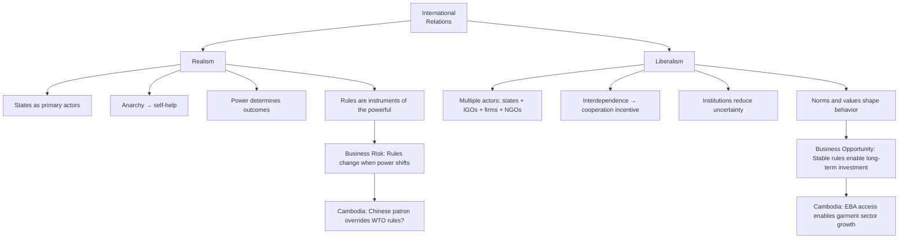

# Realism vs. Liberalism in International Relations: First Principles
# រេអាលីស និង លីបឺរ៉ាលីស ក្នុងទំនាក់ទំនងអន្តរជាតិ

> *In the tradition of Kenneth Waltz (Realism) and Robert Keohane (Liberalism) — the two foundational lenses for understanding world order*

---

## Why This Matters for Business / ហេតុអ្វីវាសំខាន់សម្រាប់អាជីវកម្ម

Before a company decides to invest in a foreign market, it implicitly answers a theoretical question: *What governs international behavior?* Is it power — military, economic, coercive — that determines who gets what? Or is it institutions, rules, interdependence, and norms?

Your answer shapes your entire risk assessment. A realist thinks supply chains can be weaponized at any time. A liberal thinks interdependence creates stability. Both have been right, and both have been wrong — often at the same time, in the same place.

---

## Realism: The Core Theory / ទ្រឹស្ដីរេអាលីស

**Realism** holds that:

1. **States are the primary actors** in international relations
2. **The international system is anarchic** — there is no world government to enforce rules
3. **States pursue survival and power** as their primary objectives
4. **Cooperation is limited** — possible only when it serves national interest
5. **Military and economic power** are the ultimate determinants of outcomes

Kenneth Waltz's *structural realism* adds: it doesn't matter what individual leaders want — the *structure* of the system (the distribution of power among states) determines behavior. A weaker state will always balance against a stronger one, regardless of ideology or preference.

**Implication for Business:** In a realist world, rules and contracts are only as reliable as the power behind them. A trade agreement is honored as long as the stronger party benefits from it. The moment a great power's interests change, the rules change.

**Cambodia Application:** China's BRI investments in Cambodia are not driven by charity or liberal idealism — they are driven by strategic interest: maritime access, diplomatic votes, supply-chain positioning. A realist says: understand what China *needs* from Cambodia, and you understand how stable the relationship will be.

---

## Liberalism: The Core Theory / ទ្រឹស្ដីលីបឺរ៉ាលីស

**Liberal Internationalism** (Keohane, Nye, Ikenberry) holds that:

1. **Multiple actors matter** — not just states, but international organizations, NGOs, corporations, transnational movements
2. **Complex interdependence** creates incentives for cooperation — trade, investment, and information flows make war too costly
3. **International institutions** (WTO, UN, ASEAN, IMF) lock in rules that reduce uncertainty
4. **Democratic peace theory** — liberal democracies rarely fight each other
5. **Norms and values** shape state behavior beyond pure power calculation

Robert Keohane's key insight: even after American hegemony declines, the institutions America built (Bretton Woods, UN, WTO) can continue to structure international behavior because states have invested in them and benefit from their predictability.

**Implication for Business:** In a liberal world, the rules-based international order is your greatest business asset. Contracts are enforceable, dispute resolution exists, and reputation matters. Investment is safer because institutions reduce political risk.

**Cambodia Application:** When Cambodia joined the WTO (2004) and received EBA trade preferences from the EU, liberal logic predicted that economic integration would gradually improve governance. The EBA suspension partially disproved this — political behavior trumped economic integration logic.

---

## The Core Tension: A Framework Map / ផែនទីការប្រឈមមុខ

---

## The Current Moment: A Realist-Liberal Hybrid / ព្រឹត្តិការណ៍បច្ចុប្បន្ន

The US-China competition has partially invalidated the liberal prediction that interdependence creates peace. But it has also not fully confirmed the realist prediction that great powers always escalate to war. We are in a complex hybrid:

- **Trade wars** (realist instruments) coexist with **WTO dispute resolution** (liberal institutions)
- **BRI** (realist power projection) is contested by **Indo-Pacific frameworks** (liberal alliance management)
- **Sanctions** (realist coercion) are deployed *through* multilateral institutions (liberal mechanisms)

For business strategists, the practical takeaway is: *You must think both ways simultaneously.* Assume institutions will work until they don't. Assume power politics are always present even when they're quiet.

---

## Cambodia: Small State Theory / ទ្រឹស្ដីរដ្ឋតូចតាច

Small states like Cambodia face a distinctive version of this debate. Realists would say Cambodia has no choice but to bandwagon with the dominant regional power (China). Liberals would say Cambodia can exploit international institutions to punch above its weight.

Cambodia's actual strategy is a pragmatic synthesis: use ASEAN's multilateral framework (liberal) to gain collective cover while maintaining bilateral patron-client relationships (realist). When these two logics conflict — as they did in the South China Sea ASEAN declarations — realist logic tends to win.

---

## Related Posts / អត្ថបទពាក់ព័ន្ធ

- [Geopolitical Risk](../geopolitical-risk/01-mit-professor.md)
- [Political Risk](../political-risk/01-mit-professor.md)
- [Sanctions](../sanctions/01-mit-professor.md)
- [Corporate Social Responsibility](../corporate-social-responsibility/01-mit-professor.md)
- [Parable: The Emperor and the Trade Route](../../year-1/parables/266-the-emperor-and-the-trade-route.md)
