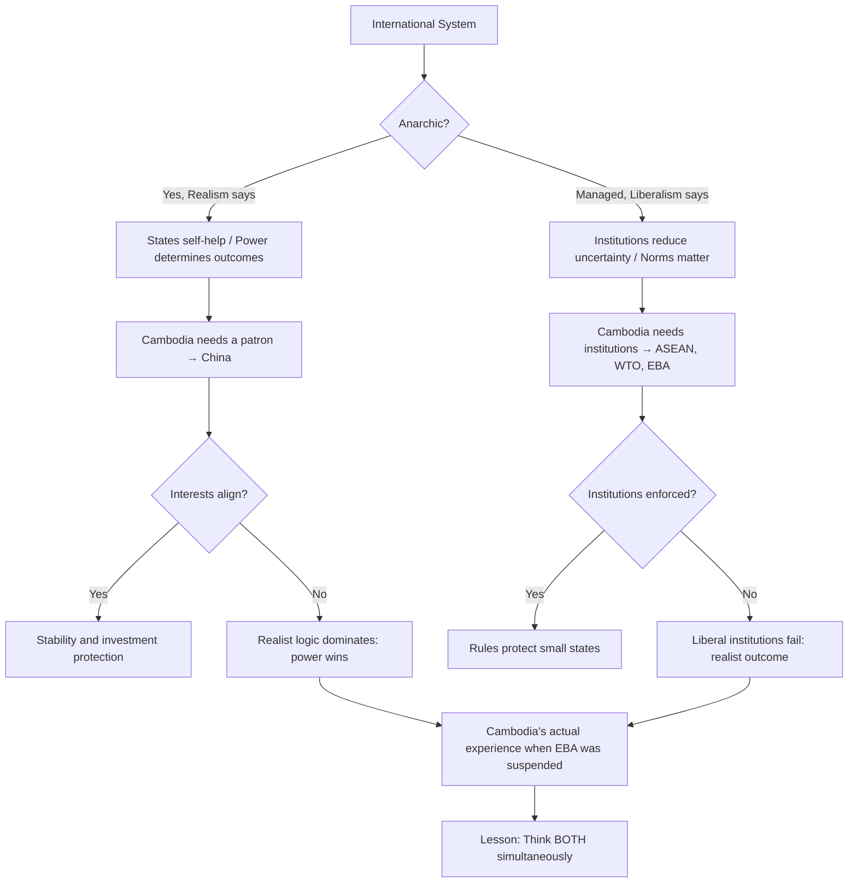

# Realism vs. Liberalism: A Socratic Dialogue
# រេអាលីស ទល់នឹង លីបឺរ៉ាលីស៖ វិធីសំណួរ-ចម្លើយ

*Professor and student Dara examine the two foundational lenses of international relations.*

---

**Professor:** Dara, when Cambodia joined the WTO in 2004, what did its government expect to get?

**Dara:** Access to international markets? Rules that other countries had to follow when trading with Cambodia?

**Professor:** And what theory of the world underlies that expectation?

**Dara:** That rules and institutions matter — that countries would follow WTO commitments even when they didn't want to?

**Professor:** Yes. And if I told you that in 2021, the US blocked WTO judicial appointments, causing the appellate body to stop functioning — what does that tell you about that theory?

**Dara:** That even the most powerful countries only follow the rules when it suits them?

**Professor:** What school of thought would predict exactly that?

**Dara:** Realism? The idea that power ultimately determines what rules are followed?

---

**Professor:** Let me ask the reverse. The EU suspended Cambodia's EBA trade preferences. Did that hurt Cambodia?

**Dara:** Yes — some factories closed or moved. Garment exports to Europe dropped.

**Professor:** And what did Cambodia do in response?

**Dara:** Moved closer to China. Accepted more BRI investment.

**Professor:** So the liberal tool — trade preference conditionality — pushed Cambodia *away* from liberal values, not toward them. What does that suggest about the liberal theory of economic integration producing democratic reform?

**Dara:** That it didn't work in this case?

**Professor:** Or that the realist dynamics — Cambodia needing a patron for regime survival — were stronger than the liberal incentives?

**Dara:** So realism and liberalism are both operating at the same time?

**Professor:** Can you think of a situation where they are NOT both operating?

---

**Professor:** Let's try ASEAN. Is ASEAN a realist or a liberal institution?

**Dara:** Liberal? It has a charter, dispute mechanisms, economic integration frameworks, a human rights commission on paper.

**Professor:** But Cambodia blocked ASEAN statements on South China Sea. Can a liberal institution be blocked by a member following realist logic?

**Dara:** It seems so — because ASEAN uses consensus, so any member can veto.

**Professor:** Who designed ASEAN's consensus rule?

**Dara:** The original ASEAN members — who wanted to protect their sovereignty from interference.

**Professor:** So the institution was designed using realist logic — protecting sovereignty — while the stated goals were liberal — regional cooperation. What does that tell you?

**Dara:** That institutions are never purely one or the other. They're built by states with power interests, and those power interests are embedded in the rules.

---

**Professor:** China says its BRI is about shared prosperity and mutual development. The US says it's about strategic control and debt dependency. Which is the realist argument? Which is the liberal argument?

**Dara:** China is using liberal language — prosperity, development, mutual benefit. The US is using realist analysis — power projection, dependency, strategic positioning.

**Professor:** And which is more accurate about China's actual behavior?

**Dara:** …Maybe both? China genuinely wants trade and growth. But it also genuinely wants strategic access.

**Professor:** So can realism and liberalism both be simultaneously *true* descriptions of the same actor?

**Dara:** Then how do we decide which lens to use?

**Professor:** Which one tells you more about what will happen when Cambodia and China's interests diverge?

**Dara:** Realism. Because when interests conflict, power decides.

**Professor:** And which one tells you more about how Cambodia can accumulate leverage and protection against that power?

**Dara:** Liberalism. By building institutions and interdependencies that make it costly for China to punish Cambodia.

**Professor:** Now you have your answer.

---

## The Insight Chain / ខ្សែភ្ជាប់សម្រាប់យល់ដឹង

---

## Related Posts / អត្ថបទពាក់ព័ន្ធ

- [Geopolitical Risk](../geopolitical-risk/03-socratic.md)
- [Political Risk](../political-risk/03-socratic.md)
- [Sanctions](../sanctions/03-socratic.md)
- [Corporate Social Responsibility](../corporate-social-responsibility/03-socratic.md)
- [Parable: The Emperor and the Trade Route](../../year-1/parables/266-the-emperor-and-the-trade-route.md)
