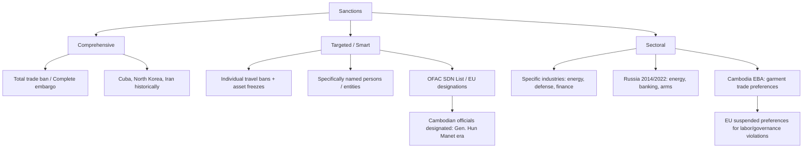

# Sanctions: First Principles
# ទណ្ឌកម្មសេដ្ឋកិច្ច៖ គោលការណ៍មូលដ្ឋាន

> *Drawing on Gary Hufbauer, Jeffrey Schott, and Kimberly Elliott — the canonical political economy of economic coercion*

---

## Definition: What Sanctions Are / និយមន័យ

**Sanctions** are deliberate state-imposed restrictions on economic exchange — trade, investment, finance, or travel — designed to coerce, signal, or punish a target government, entity, or individual.

**ទណ្ឌកម្ម** គឺជាការដាក់កំហិតដោយចេតនារបស់រដ្ឋ លើការផ្លាស់ប្ដូរសេដ្ឋកិច្ច — ពាណិជ្ជកម្ម ការវិនិយោគ ហិរញ្ញវត្ថុ ឬការធ្វើដំណើរ — ដែលត្រូវបានរចនាឡើងដើម្បីបង្ខំ ផ្ញើសញ្ញា ឬដាក់ទោស រដ្ឋាភិបាល អង្គភាព ឬបុគ្គលជាគោលដៅ។

Sanctions differ from **tariffs** (which are primarily economic tools for protecting domestic industries) and from **embargoes** (which are total trade bans). Most modern sanctions are *targeted* — "smart sanctions" — aimed at specific elites, companies, or sectors rather than entire populations.

---

## The Political Economy Framework / ក្របខ័ណ្ឌសេដ្ឋកិច្ចនយោបាយ

Hufbauer, Schott, and Elliott's landmark study of 200+ sanction episodes found:

**When sanctions succeed:**
- Target is a smaller, economically weaker state highly dependent on the sender
- Political cost of compliance is lower than economic cost of sanctions
- Multilateral support exists — not just the sender alone
- Goal is limited and clearly defined
- Sanctions are implemented quickly and comprehensively

**When sanctions fail:**
- Target can find alternative partners (China has served this role for many sanctioned states)
- Domestic political dynamics in the target *strengthen* the regime (rally-around-the-flag effect)
- Goal is regime change or fundamental policy reversal — too high a bar
- Sender has conflicting interests (e.g., needs the target's oil or trade)

---

## Types of Sanctions / ប្រភេទទណ្ឌកម្ម

---

## The US Sanctions Architecture / ស្ថាបត្យកម្មទណ្ឌកម្ម

The United States operates the world's most powerful sanctions regime through:

- **OFAC (Office of Foreign Assets Control):** Administers SDN (Specially Designated Nationals) list
- **EAR (Export Administration Regulations):** Controls dual-use technology exports
- **ITAR (International Traffic in Arms Regulations):** Arms and defense technology
- **Secondary sanctions:** Punish *third parties* that trade with sanctioned entities — this is the mechanism most relevant to Cambodia

**Secondary sanctions** are the key innovation. They extend US jurisdiction globally: a Cambodian company that does business with a sanctioned Chinese firm risks being cut off from the US financial system itself — even if the Cambodian company has no direct connection to the US.

This is why Chinese BRI investment in Cambodia creates compliance risk for European companies sourcing from Cambodia: their Cambodia suppliers may have Chinese input suppliers on sanction watch lists.

---

## The Cambodia Sanctions History / ប្រវត្តិទណ្ឌកម្មក្នុងកម្ពុជា

Cambodia has experienced three distinct phases of sanctions pressure:

**1. Post-Khmer Rouge (1979–1991):** The US and Western allies imposed trade and aid restrictions on Cambodia in response to the Vietnamese-installed government. This was partly Cold War politics — Vietnam was aligned with Soviet Union. Cambodia's isolation severely retarded development.

**2. EBA Suspension (2020–present):** The EU partially suspended Cambodia's EBA trade preferences citing the 2017 dissolution of the opposition CNRP and the 2018 election. This was a *sectoral* sanction targeting trade preferences, not a comprehensive embargo. It specifically hurt garment and footwear exports, reducing Cambodia's EU market access for goods in affected categories.

**3. Individual Designations:** The US has designated specific Cambodian officials and companies under various authorities — CAATSA, Global Magnitsky, Burma-related sanctions spillover — targeting those associated with Chinese military facility development at Ream or with the destruction of democratic institutions.

---

## The Effectiveness Question in Cambodia / សំណួរប្រសិទ្ធភាព

Did the EBA suspension change Cambodia's political behavior?

The evidence suggests: **not in the intended direction.** Cambodia's government responded to EBA pressure by:
1. Accelerating Chinese BRI integration (reducing economic dependency on the EU)
2. Maintaining political restrictions (no return of the opposition party)
3. Improving some labor standards at the margin (the area where change was easiest and cheapest)

This is consistent with the Hufbauer framework: sanctions against states with alternative partners and high political costs of compliance tend to fail at their primary goal while producing some partial adjustments at the margins.

ទណ្ឌកម្ម EBA ពី EU — ប្រតិកម្មរបស់កម្ពុជាគឺ ពង្រឹងទំនាក់ទំនងចិន ជំនួសឱ្យការកែទម្រង់ — ស្របតាម Hufbauer framework ដែលថាទណ្ឌកម្មបរាជ័យ ពេលគោលដៅអាចរកដៃគូផ្សេងបាន។

---

## Business Compliance Implications / ន័យអនុលោមភាពអាជីវកម្ម

For businesses operating in or sourcing from Cambodia, the sanctions landscape creates specific compliance requirements:

1. **OFAC screening:** Any payment chain involving USD must be screened against OFAC's SDN list
2. **Supply chain due diligence:** EU and UK Modern Slavery Acts require tracing input sources
3. **End-use monitoring:** Technology exports to Cambodia may face restrictions if end users are connected to Chinese military entities
4. **Secondary sanctions risk:** Partnership with Chinese-state-owned entities in Cambodia's SEZs may trigger secondary sanctions exposure

---

## Related Posts / អត្ថបទពាក់ព័ន្ធ

- [Geopolitical Risk](../geopolitical-risk/01-mit-professor.md)
- [Political Risk](../political-risk/01-mit-professor.md)
- [Realism vs. Liberalism](../realism-vs-liberalism/01-mit-professor.md)
- [Corporate Social Responsibility](../corporate-social-responsibility/01-mit-professor.md)
- [Parable: The Emperor and the Trade Route](../../year-1/parables/266-the-emperor-and-the-trade-route.md)
