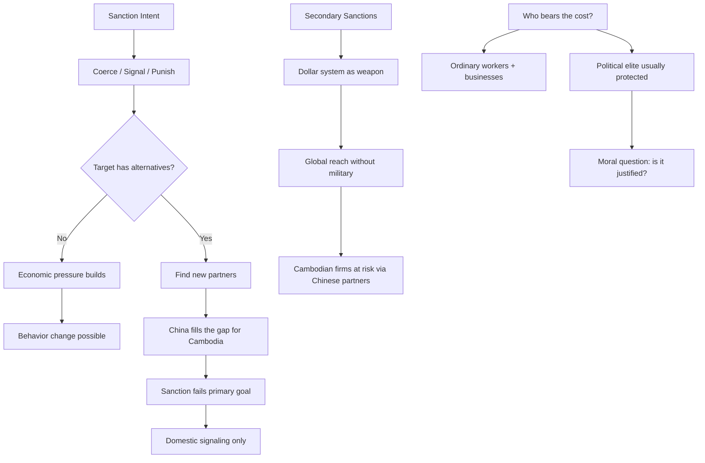

# Sanctions: A Socratic Dialogue
# ទណ្ឌកម្ម៖ វិធីសំណួរ-ចម្លើយ

*Professor and student Dara examine the logic and effectiveness of economic sanctions.*

---

**Professor:** Dara, imagine the EU tells Cambodia: "We will suspend your garment trade preferences unless you restore the opposition party." What are the possible responses Cambodia's government can make?

**Dara:** They can restore the opposition party. Or they refuse and accept the economic consequences. Or they find another market to sell their garments to.

**Professor:** Which response did Cambodia choose?

**Dara:** Mostly the third option — accept some economic damage and deepen ties with China and other markets.

**Professor:** So the sanction did not achieve its stated goal. Does that mean it failed entirely?

**Dara:** Not entirely? Maybe it slowed the democracy decline somewhat? Or it signaled to Cambodia that there are costs?

**Professor:** What is the difference between a sanction that "signals" and a sanction that "changes behavior"?

**Dara:** Signaling is cheaper — you're just communicating your values or creating a record. Changing behavior requires the costs to outweigh the political benefits for the target.

---

**Professor:** When did Cambodia first experience large-scale international sanctions?

**Dara:** After 1979? When Vietnam invaded and removed the Khmer Rouge?

**Professor:** Yes. The US and ASEAN refused to recognize the new Vietnamese-installed government. They blocked aid, blocked trade, blocked international recognition. What was the effect on Cambodia's development?

**Dara:** Terrible — Cambodia was isolated for over a decade while already devastated by war and genocide.

**Professor:** And who suffered most from that isolation?

**Dara:** The Cambodian people — not the political leaders who made the decisions being punished.

**Professor:** This is the central moral question of sanctions. If the people of a country suffer but the leaders don't change their behavior — what has been accomplished?

**Dara:** Punishment? Expression of displeasure? Domestic political signaling by the sanctioning country's government to its own voters?

**Professor:** Can sanctions serve the interests of the *sender* country without serving the people of the *target* country?

**Dara:** Yes — a politician in Brussels can claim they "stood up for democracy" while Cambodian garment workers lose their jobs.

---

**Professor:** Now — what about secondary sanctions? If the US says, "Any company that trades with North Korea will be cut off from the US financial system" — what is the mechanism of power there?

**Dara:** The US controls the dollar system. Almost all international trade uses dollars. So if you're cut off from dollar clearing, you can't do business internationally.

**Professor:** Can a Cambodian company be affected by a US sanction even if it has no direct connection to the US?

**Dara:** Yes — if it transacts in dollars, or if its European clients' banks process dollar payments that go through US correspondent banks?

**Professor:** And does Cambodia's government need to do anything wrong for a Cambodian company to face this risk?

**Dara:** No — if a Cambodian company's Chinese partner is on a US sanction list, the Cambodian company might be at risk just by association.

**Professor:** So what does this tell us about how the geography of sanction risk has changed?

**Dara:** It used to be between countries. Now it's between entities — any company, anywhere, that touches a sanctioned entity faces risk?

**Professor:** And for a Cambodian garment factory sourcing inputs from a Chinese supplier — what due diligence do they now need?

**Dara:** They need to know who their Chinese supplier's investors are. Whether any of those investors appear on OFAC's SDN list. Whether any of the inputs themselves were produced by sanctioned entities.

**Professor:** Welcome to the compliance world of 2026.

---

## The Insight Chain / ខ្សែភ្ជាប់សម្រាប់យល់ដឹង

---

## Related Posts / អត្ថបទពាក់ព័ន្ធ

- [Political Risk](../political-risk/03-socratic.md)
- [Geopolitical Risk](../geopolitical-risk/03-socratic.md)
- [Realism vs. Liberalism](../realism-vs-liberalism/03-socratic.md)
- [Corporate Social Responsibility](../corporate-social-responsibility/03-socratic.md)
- [Parable: The Emperor and the Trade Route](../../year-1/parables/266-the-emperor-and-the-trade-route.md)
