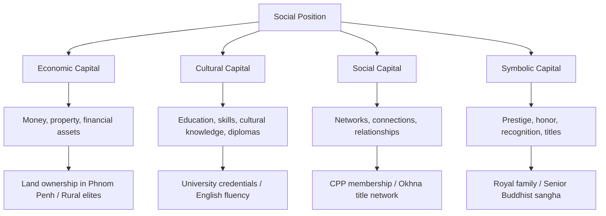

# Social Stratification: First Principles
# ការបែងចែកថ្នាក់សង្គម៖ គោលការណ៍មូលដ្ឋាន

> *In the tradition of Max Weber and Pierre Bourdieu — class, status, and power as analytical categories*

---

## Definition and Core Concept / និយមន័យ

**Social stratification** is the systematic, hierarchical ranking of groups in society based on wealth, power, prestige, and social characteristics — where one's position in the hierarchy shapes access to resources, opportunities, and life outcomes.

**ការបែងចែកថ្នាក់សង្គម** គឺជាការបែងចែករចនាសម្ព័ន្ធ ជាប្រព័ន្ធ នៃក្រុមមនុស្សក្នុងសង្គម ដោយផ្អែកលើ ទ្រព្យ អំណាច កិត្តិយស និងលក្ខណៈសង្គម — ដែលទីតាំងនៅក្នុងថ្នាក់ជាន់កំណត់ ការចូលប្រើធនធាន ឱកាស និងលទ្ធផលជីវិត។

Stratification is **not merely inequality** — random variation in outcomes. It is *structured* inequality, reproduced across generations, embedded in institutions, and reinforced by ideology that naturalizes the hierarchy.

---

## The Weber Framework: Three Dimensions / ក្របខ័ណ្ឌ Weber

Max Weber identified three distinct but interacting dimensions of stratification:

**1. Class** — Economic position; access to market resources
- Determined by ownership of property, skills, credentials
- Creates shared economic interests but not necessarily shared identity

**2. Status** — Social honor and prestige; how society evaluates your worth
- Can be based on ethnicity, religion, education, family background
- Does not always align with class (a monk may have high status but low wealth)

**3. Party** — Power; ability to influence decisions collectively
- Organized capacity to achieve political ends
- May or may not align with class or status

**Cambodia Application:** These three dimensions frequently diverge in Cambodia:
- A wealthy Chinese-Cambodian businessman (high class) may have limited social status in traditional Khmer community hierarchies
- A Buddhist monk (high status) has minimal economic class position
- A former Khmer Rouge commander who became a CPP official (high party power) may have rebuilt class position through that power

---

## Bourdieu's Capital Framework / ក្របខ័ណ្ឌ Bourdieu

Pierre Bourdieu extends Weber by identifying four forms of capital that determine social position:

**Habitus:** Bourdieu's key insight — social position is not just about what you have, but about deeply internalized dispositions (habits of thought, taste, manner) that reproduce class position even without conscious effort. A garment worker's child internalizes expectations that differ from those of a minister's child — shaping aspirations, educational choices, and life outcomes before any formal inequality has been applied.

---

## Stratification Mechanisms in Cambodia / យន្តការបែងចែកថ្នាក់ក្នុងកម្ពុជា

### Historical Layers

Cambodia's stratification system has been remade multiple times:

1. **Pre-colonial hierarchy:** Royal family → Okhna (noble) → free peasants → slaves
2. **French colonial period:** European administrators → elite Khmer/Vietnamese collaborators → peasant majority
3. **Khmer Rouge (1975-79):** Class inversion — urban educated "base people" vs. "old people" — deliberate destruction of previous stratification through genocide
4. **Post-UNTAC (1993-present):** New elite formation through CPP patronage networks, Chinese-Cambodian business families, and international NGO/UN sector professional class

### Current Stratification Dimensions

| Dimension | Elite | Middle | Lower |
|-----------|-------|--------|-------|
| Economic | CPP-connected business families, okhnas | Urban professionals, NGO workers | Garment workers, rural farmers, urban poor |
| Cultural | French/English-educated, Phnom Penh urban | Technical/vocational training | Minimal formal education |
| Political | CPP membership, military, police | Local officials, civil servants | Structural exclusion |
| Spatial | Boeung Keng Kang 1–3, riverside condos | Daun Penh, Sen Sok | Prek Pnov, Meanchey, periurban |

---

## The Phnom Penh Urban Poor Case / ករណីអ្នកក្រទីក្រុង

The displacement of communities around Boeng Kak Lake (2008–2012) is a canonical case of stratification operating through urban development:

- A politically connected developer received a 99-year lease over the lake
- 4,000+ families — primarily lower-class residents with informal land claims — were displaced
- Compensation was inadequate by any standard
- Formal legal systems provided limited protection against political-economic power
- The Phnom Penh city administration accelerated displacement timeline under pressure

The stratification dynamic: **economic capital + political power + spatial advantage** operated against households with **no formal capital, no political connections, and no legal security**. The outcome — displacement — was not random. It followed the contours of the stratification system with precision.

---

## Why This Matters for Business Sustainability / ហេតុអ្វីវាសំខាន់ FCSB

Businesses that ignore stratification risk:
1. **Labor relations failures** — misunderstanding garment workers' social position leads to wage and organizing disputes
2. **Community relations crises** — infrastructure projects that displace lower-class communities generate reputational and legal risk
3. **Governance capture** — stratified political systems concentrate procurement decisions in elite networks, disadvantaging transparent procurement

Businesses that understand stratification can:
1. Design **inclusive hiring and promotion** practices that capture talent across class backgrounds
2. Conduct **stakeholder mapping** that correctly identifies affected populations' power positions
3. Build **community benefit agreements** that address asymmetric power in consultation processes

---

## Related Posts / អត្ថបទពាក់ព័ន្ធ

- [Intersectionality](../intersectionality/01-mit-professor.md)
- [FPIC](../fpic/01-mit-professor.md)
- [Corporate Social Responsibility](../corporate-social-responsibility/01-mit-professor.md)
- [Political Risk](../political-risk/01-mit-professor.md)
- [Parable: The Anthropologist in the Factory](../../year-1/parables/267-the-anthropologist-in-the-factory.md)
