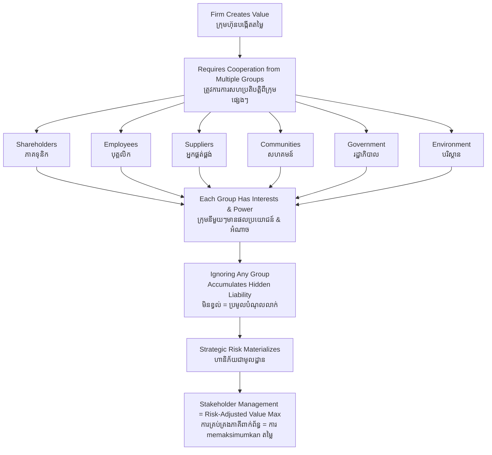

# Stakeholder Theory — First-Principles Derivation
# ទ្រឹស្ដីភាគីពាក់ព័ន្ធ — ការស្រាយបញ្ជាក់ពីគោលការណ៍ដំបូង

*Author: ichamrong | Date: 2026-05-29*

---

## Foundational Scholar / អ្នកសិក្សាស្ថាបនិក

**R. Edward Freeman** (Darden School, University of Virginia) formalized stakeholder theory in his 1984 book *Strategic Management: A Stakeholder Approach*. Freeman challenged Milton Friedman's shareholder primacy doctrine — the idea that the sole duty of management is to maximize returns to equity holders. Freeman argued this framework was empirically incomplete and strategically dangerous: firms that ignore the interests of non-shareholder groups eventually destroy the value they are trying to protect.

---

## Core Problem / បញ្ហាស្នូល

**English:** The traditional model of the firm treats it as a nexus of contracts among shareholders, managers, and employees. But every firm also depends on communities, suppliers, governments, creditors, and the natural environment — none of whom hold equity. When management ignores these groups, it accumulates hidden liabilities that eventually materialize as regulatory sanctions, social conflict, reputational collapse, or supply-chain failure. The question is: how should managers systematically identify and respond to those whose cooperation the firm needs?

**ខ្មែរ:** គំរូប្រពៃណីនៃក្រុមហ៊ុនចាត់ទុកវាជាបណ្ដាញនៃកិច្ចសន្យារវាងភាគទុនិក អ្នកគ្រប់គ្រង និងបុគ្គលិក។ ប៉ុន្តែក្រុមហ៊ុនគ្រប់ជំនិតក៏ពឹងផ្អែកលើសហគមន៍ អ្នកផ្គត់ផ្គង់ រដ្ឋាភិបាល លោករ៍ និងបរិស្ថានធម្មជាតិ — គ្មានអ្នកណាក្នុងនោះដែលមានភាគហ៊ុន។ នៅពេលការគ្រប់គ្រងមិនខ្វល់ពីក្រុមទាំងនេះ វាប្រមូលផ្ដុំបំណុលលាក់ ដែលនៅទីបំផុតនឹងកើតឡើងក្នុងទម្រង់ ទណ្ឌកម្មបទប្បញ្ញត្តិ ជម្លោះសង្គម ការដួលរលំកេរ្តិ៍ ឬការខ្វះខាតខ្សែសង្វាក់ផ្គត់ផ្គង់។

---

## First Principles Derivation / ការស្រាយបញ្ជាក់ពីគោលការណ៍ដំបូង

**Axiom 1 — Value creation requires cooperation (អ័ក្សទ 1 — ការបង្កើតតម្លៃទាមទារការសហប្រតិបត្តិ):**
A firm cannot produce anything without inputs from employees (labor), suppliers (materials), communities (infrastructure, legitimacy), governments (legal framework), and customers (revenue).

**Axiom 2 — Groups with power can impose costs (អ័ក្សទ 2 — ក្រុមមានអំណាចអាចដាក់ប្រាក់ចំណាយ):**
Any group that can disrupt operations, withdraw legitimacy, or impose costs has *de facto* power over firm outcomes — regardless of whether they hold equity.

**Axiom 3 — Long-run value maximization requires stakeholder management (អ័ក្សទ 3 — ការ memaksimumkan តម្លៃរយៈពេលវែងទាមទារការគ្រប់គ្រងភាគីពាក់ព័ន្ធ):**
A firm that only serves shareholders while harming other groups will eventually trigger responses that destroy shareholder value.

**Derivation Chain (ខ្សែសង្វាក់ការស្រាយ):**

1. Define stakeholder: any individual or group who can affect or is affected by the firm's achievement of its objectives.
2. Map stakeholder interests → identify where firm actions create or destroy value for each group.
3. Identify stakeholder power → assess ability to impose costs or withdraw cooperation.
4. Where interests and power overlap → high-priority claims that management must address.
5. Strategy: align firm actions to create value across stakeholder groups simultaneously — this is not charity; it is long-run profit maximization under realistic social constraints.

---

## Freeman's Two Key Questions / សំណួរចំនួន ២ សំខាន់របស់ Freeman

1. **Who are the stakeholders of this firm?** — Map every group with a stake in or claim on the firm's activities.
2. **What is the firm's responsibility to each?** — Not equal treatment, but proportional acknowledgment of each group's legitimate interests.

---

## Visual Derivation / ការបង្ហាញដោយមើលឃើញ

---

## Cambodian Application / ការអនុវត្តន៍ក្នុងបរិបទកម្ពុជា

**The Seila Governance Program:**
Cambodia's Seila Program (1996–2009) was a decentralized governance initiative that explicitly mapped stakeholders at the commune level — village chiefs, commune councils, district authorities, NGOs, and rural communities — before designing any intervention. The program's success in reducing local conflict and improving service delivery was attributed partly to this stakeholder mapping process: understanding who had claims, who had power, and whose cooperation was required before acting.

**Contrast with infrastructure projects that skipped stakeholder mapping:**
Large dam projects on the Mekong tributaries that proceeded without meaningful consultation with downstream communities triggered years of legal challenges, international advocacy campaigns, and ultimately delayed construction timelines and increased costs. The "hidden liability" of ignored stakeholders materialized exactly as Freeman's framework predicts.

---

## Related Posts / អត្ថបទដែលទាក់ទង

- [02 — Feynman Technique](./02-feynman.md)
- [03 — Socratic Dialogue](./03-socratic.md)
- [04 — Analogy Bridge](./04-analogy.md)
- [05 — Narrative Story](./05-storyteller.md)
- [06 — Journalist Interview](./06-interview.md)
- [Parable: The King Who Banned the Smoke](../../year-1/parables/263-the-king-who-banned-the-smoke.md)
