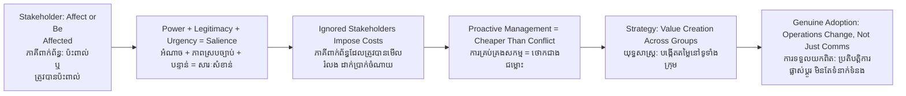

# Stakeholder Theory — Socratic Dialogue
# ទ្រឹស្ដីភាគីពាក់ព័ន្ធ — ការសន្ទនាបែប Socratic

*Author: ichamrong | Date: 2026-05-29*

---

**Professor:** Dara, suppose a mining company in Mondulkiri has been legally granted a concession by the Cambodian government. It has shareholders in Singapore. Who does the company have obligations to?

**Dara:** To its shareholders, I suppose. They invested their money and expect a return.

**Professor:** And the indigenous Bunong communities whose land overlaps with the concession boundary — do they have any claim on the company?

**Dara:** Legally, maybe not, if the concession is valid. But morally...

**Professor:** Let us stay with the practical before we reach the moral. If the Bunong communities oppose the mine, what can they do?

**Dara:** They could protest. Alert NGOs. Contact journalists. Take it to international human rights bodies.

**Professor:** And if they do any of those things, what happens to the mining company?

**Dara:** Operations might be disrupted. The international press coverage could upset the investors or the buyers of the minerals. There might be a legal challenge.

**Professor:** So the Bunong community, despite having no equity stake, has power to impose real costs on the company?

**Dara:** Yes, that is true.

**Professor:** What do we call a group that has no formal ownership but can affect — or be affected by — a firm's activities?

**Dara:** A stakeholder?

**Professor:** Precisely. Now, R. Edward Freeman argues that managers have strategic obligations to stakeholders — not just shareholders. Is this idealism or is there a practical logic?

**Dara:** Based on what we just said, it seems practical. If you ignore a stakeholder with power, they impose costs. So managing them proactively is cheaper than managing the conflict reactively.

**Professor:** Good. Now, who decides which stakeholders matter most?

**Dara:** The ones with the most power to disrupt operations?

**Professor:** Is power the only criterion?

**Dara:** Maybe also urgency — how quickly they can impose the harm? And legitimacy — whether their claim is legally or morally recognized?

**Professor:** You have just independently derived Mitchell, Agle, and Wood's (1997) stakeholder salience model. Power, legitimacy, urgency — the intersection of all three identifies the highest-priority stakeholders. Does the Bunong community score high on all three?

**Dara:** Power — yes, through advocacy. Legitimacy — yes, they have a moral claim on their ancestral land. Urgency — yes, the mine displaces them immediately. So they should be among the highest-priority stakeholders.

**Professor:** And yet many extractive projects in Cambodia proceeded as if those communities were invisible. What does that tell you?

**Dara:** That managers were applying shareholder primacy, not stakeholder theory. And that the "hidden liabilities" accumulated — the protests, the legal challenges, the reputational damage — were predictable.

**Professor:** Is stakeholder theory the same as saying every group gets what it wants?

**Dara:** No — that is impossible. Some stakeholder interests conflict. Shareholders want low cost; workers want high wages; communities want a clean river. The company cannot satisfy all of them fully.

**Professor:** So what is the manager's actual task?

**Dara:** To find strategies that create enough value for enough stakeholders that the cooperation network holds together — and to manage trade-offs explicitly rather than pretending they do not exist.

**Professor:** Is there a version of stakeholder theory where this management is purely voluntary, or does it require external pressure?

**Dara:** Probably both. Enlightened managers do it voluntarily because it makes strategic sense. But the structure of corporate law and capital markets creates pressures toward shareholder primacy. Without regulation, external accountability, and civil society pressure, the voluntary adoption of stakeholder theory is probably fragile.

**Professor:** A sophisticated answer. The tension between stakeholder theory as strategy and stakeholder theory as law is still actively debated. What would convince you that a company has genuinely adopted stakeholder thinking rather than performing it?

**Dara:** If the community's concerns actually changed the company's operations — not just its communications.

---

## Insight Chain / ខ្សែសង្វាក់ការយល់ដឹង

---

## Related Posts / អត្ថបទដែលទាក់ទង

- [01 — MIT Professor](./01-mit-professor.md)
- [02 — Feynman Technique](./02-feynman.md)
- [04 — Analogy Bridge](./04-analogy.md)
- [05 — Narrative Story](./05-storyteller.md)
- [06 — Journalist Interview](./06-interview.md)
- [Parable: The King Who Banned the Smoke](../../year-1/parables/263-the-king-who-banned-the-smoke.md)
