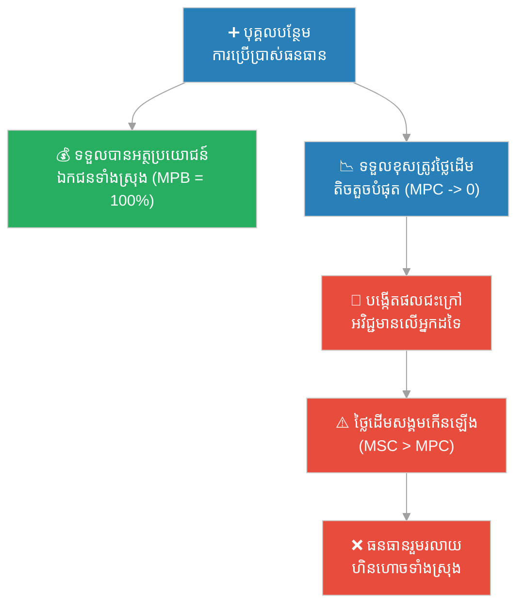
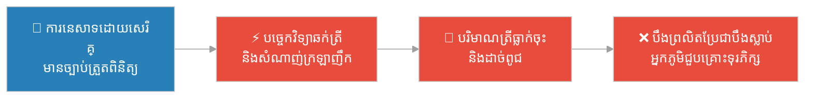

# សោកនាដកម្មនៃទ្រព្យរួម (Tragedy of the Commons)

**Author:** ichamrong  
**Date:** 2026-05-30  
**Tags:** #tragedy-of-the-commons #environmental-economics #market-failure #public-goods #sustainability  
**Category:** Business Sustainability  
**Read Time:** ~15 min  

---

## 📌 មាតិកា (Table of Contents)
- [សេចក្តីផ្តើម (Introduction)](#0)
- [១. ការពន្យល់បែបដំណើរការ MIT (MIT-Style Process Explanation)](#1)
- [២. វិធីសាស្ត្រ Feynman (Feynman Technique - Simple Explanation)](#2)
- [៣. វិធីសាស្ត្រសួរដេញដោលបែបសូក្រាត (Socratic Method)](#3)
- [៤. ឧទាហរណ៍ប្រៀបធៀបគំនិត (Intuitive Analogy)](#4)
- [៥. រឿងនិទានប្រវត្តិសាស្ត្រខ្មែរ (Cambodian Historical Story)](#5)
- [៦. កិច្ចសម្ភាសន៍បែបអាជីព (Professional Peer Interview)](#6)
- [🔗 ទំនាក់ទំនងមុខវិជ្ជា និងរឿងប្រៀបធៀប (Course & Parable Links)](#7)

---

<a id="0"></a>
## សេចក្តីផ្តើម (Introduction)

**សោកនាដកម្មនៃទ្រព្យរួម (Tragedy of the Commons)** គឺជាគំនិតសេដ្ឋកិច្ច និងសង្គមវិទ្យាដែលត្រូវបានបកស្រាយជាផ្លូវការដោយលោក **Garrett Hardin** ក្នុងឆ្នាំ ១៩៦៨។ វាពិពណ៌នាអំពីស្ថានភាពដែលបុគ្គលម្នាក់ៗ ធ្វើសកម្មភាពដោយឯករាជ្យ និងសមហេតុផលសម្រាប់ផលប្រយោជន៍ផ្ទាល់ខ្លួនរយៈពេលខ្លី ប៉ុន្តែចុងក្រោយបង្កឱ្យមានការបំផ្លិចបំផ្លាញធនធានរួមដែលមិនអាចបែងចែកបាន ដែលផ្ទុយស្រឡះពីផលប្រយោជន៍រយៈពេលវែងរបស់មនុស្សគ្រប់គ្នា។

---

<a id="1"></a>
## ១. ការពន្យល់បែបដំណើរការ MIT (MIT-Style Process Explanation)

នៅក្នុងគំរូសេដ្ឋកិច្ចបរិស្ថានកម្រិតខ្ពស់របស់ MIT យន្តការនៃ «សោកនាដកម្មនៃទ្រព្យរួម» ត្រូវបានវិភាគតាមរយៈភាពខុសគ្នារវាង **ថ្លៃដើមឯកជនបន្ថែម (Marginal Private Cost - MPC)** និង **ថ្លៃដើមសង្គមបន្ថែម (Marginal Social Cost - MSC)**។



### ដំណើរការជាជំហានៗ (Step-by-Step Process)៖

1. **លក្ខណៈសម្បត្តិនៃធនធាន (Resource Attributes)៖**
   ធនធានរួម (Common-Pool Resources - CPRs) មានលក្ខណៈពីរ៖
   - **គ្មានភាពផាត់ចេញ (Non-Excludable)៖** វាពិបាក ឬថ្លៃខ្លាំងណាស់ក្នុងការរារាំងមនុស្សមិនឱ្យប្រើប្រាស់វា។
   - **មានភាពប្រជែងគ្នា (Rivalrous)៖** ការប្រើប្រាស់របស់មនុស្សម្នាក់ កាត់បន្ថយបរិមាណសម្រាប់អ្នកដទៃ។

2. **ការលើកទឹកចិត្តមិនស្មើគ្នា (Asymmetrical Incentives)៖**
   នៅពេលដែលបុគ្គលម្នាក់ដកយកធនធានរួមមួយឯកតាបន្ថែម៖
   - **អត្ថប្រយោជន៍ឯកជនបន្ថែម (Marginal Private Benefit - MPB)** គឺស្មើនឹង $1$ (ទទួលបានអត្ថប្រយោជន៍ពេញលេញ)។
   - **ថ្លៃដើមឯកជនបន្ថែម (Marginal Private Cost - MPC)** គឺស្មើនឹង $\frac{1}{N}$ (ដែល $N$ គឺជាចំនួនអ្នកប្រើប្រាស់សរុប) ព្រោះថ្លៃដើមខូចខាត ឬការបាត់បង់ត្រូវបានបែងចែកទៅឱ្យមនុស្សគ្រប់គ្នានៅក្នុងសហគមន៍។

3. **លទ្ធផលគ្មានប្រសិទ្ធភាពសង្គម (Social Inefficiency)៖**
   ដោយសារតែ $MPB > MPC$ បុគ្គលម្នាក់ៗមានសនិទានភាព (Rationality) ក្នុងការប្រើប្រាស់ធនធានកាន់តែច្រើន រហូតដល់ចំណុចដែលអត្ថប្រយោជន៍សង្គមបន្ថែម (Marginal Social Benefit - MSB) មានតម្លៃអវិជ្ជមាន។ ចំណុចលំនឹងទីផ្សារសេរី (Market Equilibrium) នាំឱ្យមានការប្រើប្រាស់ហួសកម្រិត (Over-exploitation) ធៀបនឹងចំណុចល្អប្រសើរបំផុតសម្រាប់សង្គម (Social Optimum)។

---

<a id="2"></a>
## ២. វិធីសាស្ត្រ Feynman (Feynman Technique - Simple Explanation)

ស្រមៃថាមានវាលស្មៅបៃតងមួយដ៏ធំនៅកណ្តាលភូមិ ដែលគ្មានម្ចាស់កម្មសិទ្ធិ ហើយអ្នកភូមិគ្រប់គ្នាអាចយកគោរបស់ខ្លួនមកស៊ីស្មៅនៅទីនោះដោយសេរី ដោយមិនបាច់បង់ប្រាក់ឡើយ។

ដំបូងឡើយ វាលស្មៅមានស្មៅដុះច្រើនលើសលប់។ អ្នកភូមិម្នាក់ៗគិតថា៖ *«បើខ្ញុំយកគោមកលែង ១ ក្បាលទៀត ខ្ញុំនឹងបានទឹកដោះគោ និងសាច់កាន់តែច្រើនសម្រាប់លក់។ ទោះបីជាគោរបស់ខ្ញុំស៊ីស្មៅខ្លះ ក៏វាមិនប៉ះពាល់ដល់វាលស្មៅធំនេះដែរ។»*

គំនិតនេះសមហេតុផលណាស់សម្រាប់មនុស្សម្នាក់ៗ។ ប៉ុន្តែបញ្ហាកើតឡើងនៅពេលដែល **អ្នកភូមិគ្រប់រូប** គិតដូចគ្នា និងធ្វើដូចគ្នា ក្នុងពេលតែមួយ! ពួកគេយកគោបន្ថែមមកលែងម្នាក់ ២ ក្បាល ៣ ក្បាល រហូតដល់រាប់រយក្បាល។

ចុងក្រោយ៖
- ស្មៅមិនអាចដុះទាន់ការស៊ីរបស់គោទាំងអស់ឡើយ។
- វាលស្មៅបៃតងប្រែជាវាលដីហុយ។
- គ្មានគោណាមួយមានស្មៅស៊ីទៀតទេ ហើយគោទាំងអស់ក៏ត្រូវងាប់។

នេះហើយជា «សោកនាដកម្ម»៖ **នៅពេលដែលទ្រព្យរួមជារបស់មនុស្សគ្រប់គ្នា វានឹងលែងជារបស់នរណាម្នាក់ឡើយ ព្រោះគ្មាននរណាម្នាក់ថែរក្សាវា ប៉ុន្តែគ្រប់គ្នាដណ្តើមគ្នាទាញយកផលប្រយោជន៍ពីវា។**

---

<a id="3"></a>
## ៣. វិធីសាស្ត្រសួរដេញដោលបែបសូក្រាត (Socratic Method)

**សាស្ត្រាចារ្យ៖** ប្រសិនបើអ្នកឃើញបឹងមួយពោរពេញដោយត្រី ហើយគ្មានច្បាប់ហាមឃាត់ការនេសាទ តើអ្នកគួរធ្វើដូចម្តេច?

**និស្សិត៖** ខ្ញុំនឹងទៅនេសាទត្រីឱ្យបានច្រើនតាមដែលអាចធ្វើទៅបាន ដើម្បីយកមកលក់ និងចិញ្ចឹមគ្រួសារ។

**សាស្ត្រាចារ្យ៖** តើនោះជាសកម្មភាពឆ្លាតវៃសម្រាប់អ្នកដែរឬទេ?

**និស្សិត៖** បាទ ពិតជាឆ្លាតវៃ ព្រោះបើខ្ញុំមិននេសាទទេ អ្នកជិតខាងរបស់ខ្ញុំនឹងនេសាទយកត្រីទាំងនោះអស់ដដែល។

**សាស្ត្រាចារ្យ៖** ចុះប្រសិនបើអ្នកជិតខាងរបស់អ្នកទាំងអស់គិតដូចអ្នក ហើយពួកគេម្នាក់ៗទិញទូកធំៗ និងសំណាញ់ក្រឡាញឹកមកនេសាទត្រីទាំងយប់ទាំងថ្ងៃ តើនឹងមានអ្វីកើតឡើងចំពោះត្រីនៅក្នុងបឹង?

**និស្សិត៖** ត្រីទាំងអស់នឹងត្រូវរលាយហិនហោចក្នុងរយៈពេលខ្លី ហើយបឹងនឹងលែងមានត្រីទៀតហើយ។

**សាស្ត្រាចារ្យ៖** ត្រឹមត្រូវ។ ចុះនៅពេលដែលបឹងលែងមានត្រី តើទូក និងសំណាញ់ដ៏ថ្លៃរបស់អ្នកនៅមានតម្លៃសម្រាប់ចិញ្ចឹមគ្រួសាររបស់អ្នកទៀតទេ?

**និស្សិត៖** ទេ វានឹងក្លាយជាសម្រាម بیکារ។

**សាស្ត្រាចារ្យ៖** ដូច្នេះ តើសកម្មភាពដែលហាក់ដូចជា «ឆ្លាតវៃ និងសមហេតុផល» សម្រាប់បុគ្គលម្នាក់ៗនៅពេលដំបូង បាននាំមកនូវលទ្ធផល «ល្ងង់ខ្លៅ និងមហន្តរាយ» សម្រាប់សហគមន៍ទាំងមូលនៅពេលចុងក្រោយដែរឬទេ?

**និស្សិត៖** ពិតប្រាកដណាស់។ នេះជាវិបត្តិដ៏ធំ។

**សាស្ត្រាចារ្យ៖** ចុះតើយើងអាចដោះស្រាយវិបត្តិនេះដោយរបៀបណា? តើយើងត្រូវពឹងផ្អែកលើ «សីលធម៌ និងការស្ម័គ្រចិត្ត» របស់មនុស្សម្នាក់ៗ ឬយើងត្រូវការយន្តការច្បាប់ និងកម្មសិទ្ធិ?

**និស្សិត៖** ការស្ម័គ្រចិត្តប្រហែលជាមិនគ្រប់គ្រាន់ទេ ព្រោះដរាបណាមានមនុស្សម្នាក់លោភលន់ ប្រព័ន្ធទាំងមូលនឹងរលាយ។ យើងពិតជាត្រូវការការគ្រប់គ្រងរួម ឬការបែងចែកកម្មសិទ្ធិឱ្យបានច្បាស់លាស់។

---

<a id="4"></a>
## ៤. ឧទាហរណ៍ប្រៀបធៀបគំនិត (Intuitive Analogy)

គិតអំពី **«ទូទឹកកករួមនៅក្នុងការិយាល័យ ឬផ្ទះជួលរួម»**។

```markdown
┌────────────────────────────────────────────────────────┐
│               🏠 ទូទឹកកករួមរបស់ផ្ទះជួល                 │
├───────────────────────────┬────────────────────────────┤
│   ⚠️ ស្ថានភាពអសន្តិសុខ        │    🛡️ ស្ថានភាពមានសណ្តាប់ធ្នាប់    │
├───────────────────────────┼────────────────────────────┤
│ - ទឹកដោះគោជារបស់រួម      │ - ប្រអប់នីមួយៗមានបិទឈ្មោះ  │
│ - ម្នាក់ៗលួចផឹកបន្តិចៗ      │ - មានច្បាប់ផាកពិន័យច្បាស់   │
│ - គ្មាននរណាលាងសម្អាតទូ     │ - ម្នាក់ៗទិញ និងការពារខ្លួនឯង│
│ - ចុងក្រោយទឹកដោះគោជូរផ្អូម │ - ទូទឹកកកស្អាត និងមានរបៀប   │
└───────────────────────────┴────────────────────────────┘
```

នៅពេលដែលទឹកដោះគោ ឬម្ហូបអាហារនៅក្នុងទូទឹកកកមិនត្រូវបានកត់ត្រាកម្មសិទ្ធិ៖
- ម្នាក់ៗនឹងលួចយកមកបរិភោគ ព្រោះគិតថា «មិនដឹងជារបស់នរណាទេ បើខ្ញុំមិនញ៉ាំ អ្នកផ្សេងនឹងញ៉ាំអស់ដដែល»។
- គ្មាននរណាម្នាក់សុខចិត្តលាងសម្អាតទូទឹកកកឡើយ ព្រោះគ្មាននរណាម្នាក់ចង់ធ្វើការងារហត់នឿយសម្រាប់ផលប្រយោជន៍អ្នកដទៃដោយឥតគិតថ្លៃឡើយ (បញ្ហាអ្នកជិះឥតគិតថ្លៃ - Free-Rider Problem)។
- ចុងក្រោយ ទូទឹកកកប្រែជាកខ្វក់ ស្អុយរលួយ និងគ្មានអាហារអាចបរិភោគបានឡើយ។

---

<a id="5"></a>
## ៥. រឿងនិទានប្រវត្តិសាស្ត្រខ្មែរ (Cambodian Historical Story)

កាលពីព្រេងនាយ មានភូមិមួយឈ្មោះថា **ភូមិវាលធំ** ស្ថិតនៅក្បែរបឹងធម្មជាតិដ៏ធំមួយឈ្មោះថា **បឹងព្រលិត**។ បឹងនេះជាប្រភពទឹក និងជាកន្លែងរកត្រីដ៏ចម្បងរបស់អ្នកភូមិទាំងអស់។ ដោយសារបឹងនេះជារបស់រួម មេឃុំមិនបានបង្កើតច្បាប់ហាមឃាត់ ឬកម្មសិទ្ធិលើផ្នែកណាមួយនៃបឹងឡើយ។

ជាច្រើនជំនាន់មកហើយ អ្នកភូមិរស់នៅដោយសុខសាន្ត ព្រោះពួកគេនេសាទត្រីដោយប្រើឧបករណ៍បុរាណ ដូចជាទ្រូ លប និងសៃយ៉ឺ ដែលមិនអាចចាប់ត្រីបានច្រើនហួសប្រមាណឡើយ។



ថ្ងៃមួយ មានអ្នកភូមិម្នាក់ឈ្មោះ **សន** បានទិញឧបករណ៍ «ឆក់ត្រីដោយប្រើអាគុយ» ពីទីក្រុង។ ការប្រើប្រាស់ឧបករណ៍ថ្មីនេះ ធ្វើឱ្យគាត់អាចចាប់ត្រីបានរាប់សិបគីឡូក្រាមក្នុងមួយយប់ ដោយមិនបាច់ខំប្រឹងឡើយ។ សន ក្លាយជាអ្នកមានក្នុងភូមិយ៉ាងលឿន។

ឃើញឱកាសបែបនេះ អ្នកភូមិដទៃទៀតក៏ចាប់ផ្តើមចម្លងតាម។ ក្នុងរយៈពេលតែប៉ុន្មានខែ ផ្ទះស្ទើរតែគ្រប់គ្នាក្នុងភូមិមានឧបករណ៍ឆក់ត្រី និងសំណាញ់ក្រឡាញឹកបំផុត។ ពួកគេមិនត្រឹមតែចាប់ត្រីធំៗនោះទេ សូម្បីតែកូនត្រីតូចៗ និងពងត្រីក៏ត្រូវបំផ្លាញខ្ទេចខ្ទីដែរ។

អ្នកភូមិខ្លះដែលមានមនសិការ បានព្យាយាមព្រមានថា៖ *«សូមកុំធ្វើបែបនេះអី! បើដកហូតត្រីទាំងងងឹតងងុលបែបនេះ ថ្ងៃក្រោយនឹងគ្មានត្រីសម្រាប់កូនចៅយើងឡើយ!»*

ប៉ុន្តែអ្នកឆក់ត្រីបានឆ្លើយតបវិញថា៖ *«ទោះបីជាខ្ញុំមិនឆក់ ក៏អ្នកផ្សេងឆក់ដដែល។ បើបឹងនេះជារបស់រួម ហេតុអ្វីបានជាខ្ញុំត្រូវទុកឱ្យអ្នកដទៃមានបាន ឯខ្លួនឯងក្រខ្សត់?»*

ចុងក្រោយ បឹងព្រលិតដ៏សម្បូរបែប ប្រែជាបឹងគ្មានជីវិត។ ទឹកបឹងចាប់ផ្តើមស្អុយរលួយ ត្រីងាប់អស់គ្មានសល់។ អ្នកភូមិវាលធំលែងមានប្រភពអាហារ និងប្រភពទឹកស្អាតប្រើប្រាស់ទៀតឡើយ ហើយពួកគេត្រូវបានបង្ខំចិត្តបោះបង់ចោលភូមិដ្ឋាន និងភៀសខ្លួនទៅធ្វើការងារជាកម្មករនៅតំបន់ផ្សេងទាំងក្តីលំបាក។

---

<a id="6"></a>
## ៦. កិច្ចសម្ភាសន៍បែបអាជីព (Professional Peer Interview)

**អ្នកសម្ភាសន៍ (Junior Developer & Startup Founder)៖** ខ្ញុំយល់ពីគំនិតនេះនៅក្នុងបរិបទបរិស្ថាន ដូចជាការបំពុលព្រៃឈើ និងការនេសាទហួសកម្រិត។ ប៉ុន្តែនៅក្នុងពិភព **បច្ចេកវិទ្យា និងអាជីវកម្មឌីជីថល** តើយើងមានជួបប្រទះនឹង «សោកនាដកម្មនៃទ្រព្យរួម» ដែរឬទេ?

**អ្នកជំនាញ (Senior IT & Sustainability Consultant)៖** ពិតជាមាន និងកើតឡើងរាល់ថ្ងៃតែម្តង! ឧទាហរណ៍ដ៏ច្បាស់លាស់មួយគឺ **«ប្រភពធនធានរួមនៃប្រព័ន្ធទិន្នន័យ (Shared Database Connection Pool)»**។ 

ស្រមៃថាអ្នកមាន Application Microservices ចំនួន ២០ ដែលរត់ទន្ទឹមគ្នា ហើយតភ្ជាប់ទៅកាន់ Database រួមតែមួយ។ ប្រសិនបើគ្មានដែនកំណត់ (Rate Limiting or Connection Allocation) ទេនោះ Developer ម្នាក់ៗនឹងរចនា Microservice របស់ខ្លួនឱ្យបើក Connection ច្រើនបំផុតតាមដែលអាចធ្វើបាន ដើម្បីឱ្យសេវាកម្មរបស់ខ្លួនដើរបានលឿនបំផុត។ ចុងក្រោយ Connection Pool របស់ Database នឹងត្រូវពេញហៀរ (Exhausted) ធ្វើឱ្យប្រព័ន្ធទាំងមូលគាំង (Crash) ប្រើលែងកើតគ្រប់គ្នា។

**អ្នកសម្ភាសន៍៖** អូ! ខ្ញុំមើលឃើញហើយ។ នោះពិតជាសោកនាដកម្មឌីជីថលមែន។ ចុះនៅក្នុងអាជីវកម្ម និងខ្សែច្រវាក់ផ្គត់ផ្គង់វិញ?

**អ្នកជំនាញ៖** នៅក្នុងខ្សែច្រវាក់ផ្គត់ផ្គង់សកល ក្រុមហ៊ុននានាប្រើប្រាស់ **«កេរ្តិ៍ឈ្មោះបរិស្ថានរួម (Shared Brand Reputation on Sustainability)»**។ ប្រសិនបើឧស្សាហកម្មមួយ (ឧទាហរណ៍៖ ម៉ូដសម្លៀកបំពាក់រហ័ស - Fast Fashion) ផ្សព្វផ្សាយថាខ្លួនប្រើប្រាស់វត្ថុធាតុដើមសរីរាង្គប្រកបដោយនិរន្តរភាព ប៉ុន្តែគ្មានការបញ្ជាក់ច្បាស់លាស់ (Non-excludable standard) ក្រុមហ៊ុនខូចខាតខ្លះនឹងធ្វើពុតជាស្រឡាញ់បរិស្ថាន (Greenwashing) ដើម្បីទទួលបានចំណែកទីផ្សារបៃតង។ 

នៅពេលដែលអតិថិជនដឹងការពិតថាមានការបោកប្រាស់ ពួកគេនឹងលែងជឿជាក់លើរាល់យុទ្ធនាការបៃតងនៃក្រុមហ៊ុនទាំងអស់នៅក្នុងឧស្សាហកម្មនោះតែម្តង។ កេរ្តិ៍ឈ្មោះល្អរួមរបស់ឧស្សាហកម្មត្រូវបានរលាយហិនហោចដោយសារសកម្មភាពលោភលន់របស់ក្រុមហ៊ុនមួយចំនួនតូច។

**អ្នកសម្ភាសន៍៖** តើយើងគួរដោះស្រាយវិបត្តិនេះដោយរបៀបណា?

**អ្នកជំនាញ៖** លោកស្រី **Elinor Ostrom** (ម្ចាស់រង្វាន់ណូបែលសេដ្ឋកិច្ចឆ្នាំ ២០០៩) បានបង្ហាញថា ដំណោះស្រាយមិនមែនមានតែការដាក់បញ្ជាពីរដ្ឋ ឬការធ្វើឯកជនភាវូបនីយកម្ម (Privatisation) ទាំងស្រុងនោះទេ។ 

ដំណោះស្រាយដ៏ល្អបំផុតគឺ **«អភិបាលកិច្ចផ្អែកលើសហគមន៍ (Community-Based Governance)»** ដែលមានច្បាប់ច្បាស់លាស់ មានការត្រួតពិនិត្យដោយតម្លាភាព (Transparent Monitoring) និងមានទណ្ឌកម្មជាជំហានៗ (Graduated Sanctions) សម្រាប់អ្នកដែលបំពានច្បាប់រួម។

---

<a id="7"></a>
## 🔗 ទំនាក់ទំនងមុខវិជ្ជា និងរឿងប្រៀបធៀប (Course & Parable Links)

- **មុខវិជ្ជាសិក្សាទាក់ទងនៅ Denison University៖**
  - [Environmental Economics (សេដ្ឋកិច្ចបរិស្ថាន)](../../year-4/02-environmental-economics.md) — វិភាគស៊ីជម្រៅលើឧបករណ៍គោលនយោបាយដូចជា ពន្ធ Pigouvian និង Cap-and-Trade ដើម្បីបញ្ចូលថ្លៃដើមខូចខាតទ្រព្យរួមទៅក្នុងថ្លៃដើមឯកជន។
  - [Introduction to Environmental Studies](../../year-1/03-introduction-to-environmental-studies.md) — ការយល់ដឹងអំពីដែនកំណត់អេកូឡូស៊ី និងព្រំដែនភពផែនដី (Planetary Boundaries)។
  - [Corporate Sustainability Practices](../../year-3/05-corporate-sustainability-practices.md) — ការការពារខ្សែច្រវាក់ផ្គត់ផ្គង់ពីការបំផ្លិចបំផ្លាញធនធានធម្មជាតិរួម។

- **រឿងប្រៀបធៀបគំរូទាក់ទង៖**
  - [The Lake That Belonged to Everyone (បឹងដែលជារបស់មនុស្សគ្រប់គ្នា)](../../year-4/parables/282-the-lake-that-belonged-to-everyone.md) — រឿងនិទានប្រៀបធៀបអំពីសហគមន៍មួយដែលប្រឈមមុខនឹងការដួលរលំនៃបឹងរួម និងរបៀបដែលពួកគេប្រើប្រាស់ក្របខ័ណ្ឌលោកស្រី Elinor Ostrom ដើម្បីសង្គ្រោះវាឡើងវិញ។
