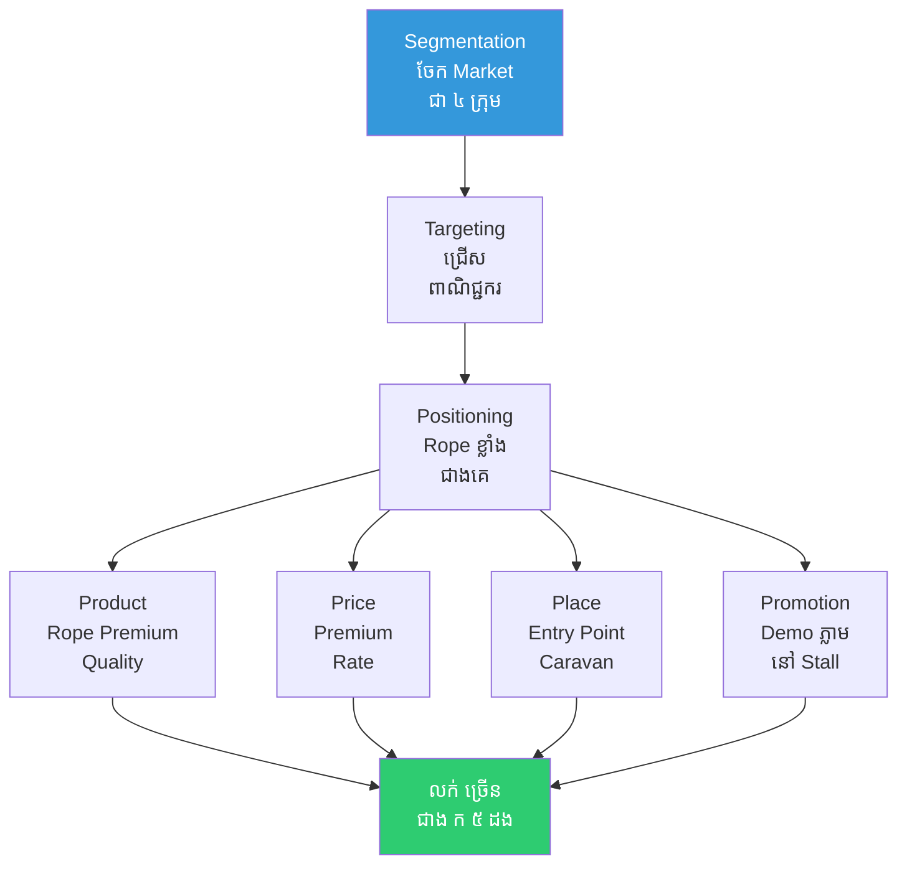

# The Market at the Crossroads and Marketing Principles (ផ្សារនៅផ្លូវវែង និងគោលការណ៍ទីផ្សារ)

**Author:** ichamrong  
**Date:** 2026-05-26  
**Tags:** #marketing #4ps #segmentation #targeting #positioning #consumer-behavior  
**Category:** Concepts / Parables  
**Read Time:** ~5 min  

---

## 📌 មាតិកា (Table of Contents)
- [ផ្សារនៅចំណុចផ្លូវវែង (The Crossroads Market)](#ផ្សារនៅចំណុចផ្លូវវែង-the-crossroads-market)
- [ការសង្កេតរបស់ ពានិជ ខ (Merchant B Observes)](#ការសង្កេតរបស់-ពានិជ-ខ-merchant-b-observes)
- [ការអនុវត្ត STP និង 4Ps (Applying STP and the 4Ps)](#ការអនុវត្ត-stp-និង-4ps-applying-stp-and-the-4ps)
- [ការវិភាគទ្រឹស្តី៖ Marketing Principles (Theoretical Breakdown)](#ការវិភាគទ្រឹស្តី-marketing-principles-theoretical-breakdown)
- [Related Posts](#related-posts)

---

## ផ្សារនៅចំណុចផ្លូវវែង (The Crossroads Market)

នៅត្រង់ចំណុចផ្លូវបំបែកដ៏មមាញឹកមួយ មានអ្នកធ្វើដំណើរចំនួន ៤ ប្រភេទ តែងតែដើរឆ្លងកាត់ទីនោះជារៀងរាល់ថ្ងៃ ៖ **ក្រុមអ្នកធម្មយាត្រា (Pilgrims), ក្រុមពាណិជ្ជករ (Merchants), ក្រុមទាហាន (Soldiers), និងក្រុមកសិករ (Farmers)**។

មានពាណិជ្ជករ ២ រូប បានបើកតូបលក់ដូរ (Stalls) នៅក្បែរៗគ្នា។

**ពាណិជ្ជករ ក** — បានលក់ទំនិញដូចៗគ្នាទៅកាន់មនុស្សគ្រប់គ្នា។ គាត់ប្រើពាក្យសម្តីអូសទាញ (Pitch) ដូចគ្នា លក់ក្នុងតម្លៃ (Price) ដូចគ្នា និងផ្តល់ផលិតផល (Product) ដូចគ្នាទាំងអស់។ ក្រោយ ១ ខែ — ការលក់របស់គាត់ស្ថិតក្នុងកម្រិតមធ្យម។ ក្រោយ ២ ខែ — ការលក់នៅតែមធ្យម។ ១ ឆ្នាំក្រោយមក — លទ្ធផលលក់ក៏នៅតែដដែល។

**ពាណិជ្ជករ ខ** — វិញបានគិតផ្សេងពីនេះ — គាត់ប្រាប់ខ្លួនឯងថា "ខ្ញុំត្រូវតែ **ស្គាល់អតិថិជនរបស់ខ្ញុំ (Customer)** ឱ្យបានច្បាស់ជាមុនសិន"។

---

## ការសង្កេតរបស់ ពានិជ ខ (Merchant B Observes)

ពាណិជ្ជករ ខ បានចំណាយពេល **១ សប្តាហ៍** ពេញដើម្បីអង្គុយសង្កេតមើល (Watch)។ គាត់បានកត់ត្រាចូលទៅក្នុងក្រដាស (Papyrus) ដូចខាងក្រោម ៖

| ប្រភេទអ្នកដំណើរ | តម្រូវការ (Needs) | អំណាចទិញ (Spending Power) |
|--------|-------|----------------|
| ពាណិជ្ជករ | ខ្សែពួរស្វិតល្អ (Rope សម្រាប់ចងឥវ៉ាន់) | ខ្ពស់ |
| ទាហាន | អាហារដែលអាចញ៉ាំបានរហ័ស | មធ្យម |
| អ្នកធម្មយាត្រា | ទៀនដែលមានតម្លៃថោក | ទាប |
| កសិករ | ឧបករណ៍ធ្វើស្រែចម្ការធុនធ្ងន់ | ទាប |

ពាណិជ្ជករ ខ ក៏បានសម្រេចចិត្តថា ៖ **មុខសញ្ញាអតិថិជនគោលដៅ (Target) — គឺក្រុមពាណិជ្ជករ** (ព្រោះពួកគេមានអំណាចនៃការចំណាយខ្ពស់ជាងគេបំផុត)។

---

## ការអនុវត្ត STP និង 4Ps (Applying STP and the 4Ps)

ពាណិជ្ជករ ខ បានជ្រើសរើសទីតាំងតូបរបស់ខ្លួន នៅចំ **ច្រកចូលនៃក្បួនរទេះពាណិជ្ជកម្មតែម្តង** (ទីកន្លែង - Place)។ ខ្សែពួររាល់មួយហ្វ៊ីត សុទ្ធតែត្រូវបានធ្វើតេស្តសាកល្បងភាពធន់នឹងទម្ងន់ ១,០០០ ផោន (ផលិតផល - Product)។ តម្លៃ (Price) ៖ គាត់លក់ថ្លៃជាង ពាណិជ្ជករ ក ដល់ទៅ ២ ដង ប៉ុន្តែក្រុមពាណិជ្ជករនៅតែយល់ព្រមទិញ ព្រោះពួកគេមើលឃើញពីគុណតម្លៃច្បាស់លាស់។ ការផ្សព្វផ្សាយ (Promotion) ៖ គាត់ឱ្យអតិថិជនសាកល្បងភ្លាមៗ — ដោយប្រាប់ថា "អ្នកសាកល្បងទាញវាទៅមើល៍"។

ឈានចូលដល់ខែទី ៣ ការលក់របស់ ពាណិជ្ជករ ខ **មានចំនួនច្រើនជាង ពាណិជ្ជករ ក ដល់ទៅ ៥ ដង**។

ពាណិជ្ជករ ក ក៏បានមកសួរដោយការងឿងឆ្ងល់ថា ៖ "ហេតុអ្វីបានជាតូបរបស់ខ្ញុំមើលទៅក៏ស្រដៀងនឹងតូបរបស់អ្នកដែរ — ប៉ុន្តែខ្ញុំបែរជាលក់មិនសូវដាច់អញ្ចឹង?"។

ពាណិជ្ជករ ខ ឆ្លើយថា ៖ "**ព្រោះខ្ញុំមិនមែនលក់ទំនិញនោះទេ — តែខ្ញុំកំពុងលក់ដំណោះស្រាយ ដើម្បីដោះស្រាយបញ្ហារបស់អតិថិជន។**"

---

## ការវិភាគទ្រឹស្តី៖ Marketing Principles (Theoretical Breakdown)

### ១. គោលការណ៍ STP — ការបែងចែក ការកំណត់គោលដៅ និងការកំណត់ទីតាំង (Segmentation, Targeting, Positioning)
**ការបែងចែកទីផ្សារ (Segmentation)** ៖ គឺការបែងចែកអតិថិជនទៅតាមប្រជាសាស្រ្ត (Demographics), ចិត្តសាស្ត្រ (Psychographics), អាកប្បកិរិយា (Behavior), ឬភូមិសាស្ត្រ (Geography)។ **ការកំណត់គោលដៅ (Targeting)** ៖ គឺការជ្រើសរើសក្រុមណាមួយដែលមានភាពទាក់ទាញបំផុត (ផ្អែកលើទំហំ កំណើន ការប្រកួតប្រជែង និងភាពស័ក្តិសម)។ **ការកំណត់ទីតាំង (Positioning)** ៖ គឺការកំណត់ថា តើយើងចង់ឱ្យយីហោ (Brand) របស់យើងត្រូវបានអតិថិជនចងចាំថាជា "អ្វី" នៅក្នុងគំនិតរបស់ពួកគេ។

### ២. ល្បាយទីផ្សារ 4Ps (4Ps Marketing Mix)
**ផលិតផល (Product)** (តើយើងលក់អ្វី), **តម្លៃ (Price)** (លក់ក្នុងតម្លៃប៉ុន្មាន), **ទីកន្លែង (Place)** (លក់តាមរយៈប៉ុស្តិ៍ណាខ្លះ), **ការផ្សព្វផ្សាយ (Promotion)** (ការទំនាក់ទំនងទៅកាន់អតិថិជន)។ ធាតុទាំង ៤ នេះត្រូវតែមានភាពស៊ីចង្វាក់គ្នា — ឧទាហរណ៍៖ បើផលិតផលជាប្រភេទ Premium តែបែរជាលក់ក្នុងតម្លៃថោក Cheap = វានឹងធ្វើឱ្យអតិថិជនមានភាពច្របូកច្របល់ចំពោះយីហោរបស់យើង។

### ៣. អាកប្បកិរិយារបស់អ្នកប្រើប្រាស់ (Consumer Behavior)
ក្រុមពាណិជ្ជករទិញខ្សែពួរ ដើម្បីបំពេញ **តម្រូវការមុខងារ (Functional Need)** (គឺសុវត្ថិភាពក្នុងការចងឥវ៉ាន់)។ ចំណែកអ្នកធម្មយាត្រាទិញទៀន ដើម្បីបំពេញ **តម្រូវការខាងជំនឿ (Ritualistic Need)**។ ការយល់ដឹងពីកត្តាជម្រុញ (Motivation) អតិថិជន → វានឹងនាំទៅរកការបង្កើតផលិតផលបានកាន់តែល្អប្រសើរ។ **ឋានានុក្រមតម្រូវការរបស់ម៉ាស្លូវ (Maslow's Hierarchy)** គឺជាក្របខ័ណ្ឌដ៏ល្បីល្បាញមួយសម្រាប់ការសិក្សាលើចំណុចនេះ។

### ៤. សំណើគុណតម្លៃ (Value Proposition)
អ្វីដែល ពាណិជ្ជករ ខ ផ្តល់ជូនគឺ ៖ "ខ្សែពួរដែលស្វិតនិងរឹងមាំជាងគេបំផុតប្រចាំខេត្ត" — នេះគឺជាការផ្តល់ជូនដែល **ច្បាស់លាស់ គួរឱ្យជឿជាក់ និងទាក់ទាញ (Clear, Credible, Compelling)**។ សំណើគុណតម្លៃដ៏ល្អមួយ ត្រូវតែអាចឆ្លើយតបទៅនឹងសំនួរដែលថា "ហេតុអ្វីបានជាអតិថិជនត្រូវសម្រេចចិត្តទិញទំនិញពីយើង?"។

**សេចក្តីសន្និដ្ឋាន៖** ទីផ្សារ (Marketing) មិនមែនគ្រាន់តែជាការ "ផ្សព្វផ្សាយ ឬឃោសនា" ប៉ុណ្ណោះទេ — តែវាគឺជា **ការស្គាល់អតិថិជនឱ្យច្បាស់ ហើយបន្ទាប់មកផ្តល់ជូនពួកគេនូវគុណតម្លៃ (Value) ដែលត្រឹមត្រូវនិងស័ក្តិសមបំផុត**។

---

## Related Posts

*   **[01 Marketing Principles](../01-marketing-principles.md)** — មុខវិជ្ជា Marketing Principles នៅ Denison University ។
*   **[251 The Invisible Shop](./251-the-invisible-shop.md)** — Digital Marketing ជា extension នៃ Marketing Principles ។

---

*Last updated: 2026-05-26*
