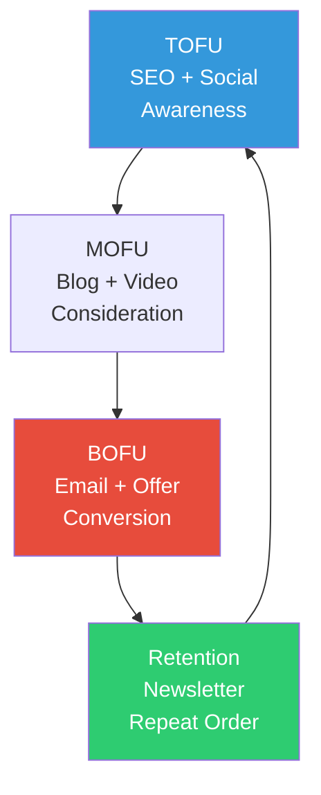

# The Invisible Shop and Digital Marketing (ហាងដែលមើលមិនឃើញ និងទីផ្សារឌីជីថល)

**Author:** ichamrong  
**Date:** 2026-05-26  
**Tags:** #digital-marketing #seo #social-media #google-analytics #content-strategy  
**Category:** Concepts / Parables  
**Read Time:** ~5 min  

---

## 📌 មាតិកា (Table of Contents)
- [ជាងឆ្លាក់ឈើដ៏ពូកែ ដែលគ្មានអ្នកស្គាល់ (The Master Carver Nobody Knows)](#ជាងឆ្លាក់ឈើដ៏ពូកែ-ដែលគ្មានអ្នកស្គាល់-the-master-carver-nobody-knows)
- [សំណួររបស់ លីណា (Lina's Question)](#សំណួររបស់-លីណា-linas-question)
- [ហាង​ ដែល​ ក្លាយ​ ជា​ visible (The Shop Becomes Visible)](#ហាង-ដែល-ក្លាយ-ជា-visible-the-shop-becomes-visible)
- [ការវិភាគទ្រឹស្តី៖ Digital Marketing (Theoretical Breakdown)](#ការវិភាគទ្រឹស្តី-digital-marketing-theoretical-breakdown)
- [Related Posts](#related-posts)

---

## ជាងឆ្លាក់ឈើដ៏ពូកែ ដែលគ្មានអ្នកស្គាល់ (The Master Carver Nobody Knows)

**លោកគ្រូ ចំណាន (Master Chamnan)** គឺជាជាងចម្លាក់ឈើ (Woodcarver) ដ៏ចំណាននិងពូកែជាងគេបំផុតនៅក្នុងខេត្ត។ រាល់ស្នាដៃចម្លាក់ (Carvings) របស់គាត់ — មិនថាជារូបព្រះ រូបក្អម ឬរូបក្របីនោះទេ — សុទ្ធតែមានភាពស្រស់ស្អាតឥតខ្ចោះ។ ជនបរទេសណាក៏ដោយឱ្យតែបានឃើញស្នាដៃរបស់គាត់ គឺតែងតែទិញភ្លាមៗមិនដែលខកខានឡើយ។ ប៉ុន្តែបញ្ហានោះគឺ **ហាងរបស់គាត់ស្ថិតនៅក្នុងផ្លូវលំដ៏កំបាំងមួយ (Hidden Lane)** ដែលស្ទើរតែគ្មានជនបរទេសណាអាចដើរទៅដល់ ឬរកឃើញឡើយ។

ហាងរបស់គាត់គ្មានស្លាកយីហោ គ្មានគេហទំព័រ (Website) គ្មាននៅលើ Google និងគ្មានទំព័រ Facebook នោះទេ។ ដូច្នេះហើយ ក្នុងមួយខែៗ គាត់ទទួលបាន **ការបញ្ជាទិញតែ ២ ទៅ ៣ ប៉ុណ្ណោះ ពីអតិថិជនចាស់ៗដែលធ្លាប់ស្គាល់គ្នា**។

លោកគ្រូ ចំណាន តែងតែជឿជាក់យ៉ាងមុតមាំថា "**ឱ្យតែស្នាដៃយើងល្អ អតិថិជនមុខជានឹងខិតខំស្វែងរកយើងដោយខ្លួនឯងមិនខាន**"។ ៥ ឆ្នាំកន្លងផុតទៅ ១០ ឆ្នាំកន្លងផុតទៅ — ចំនួននៃការបញ្ជាទិញនៅតែមានតិចតួចដដែល។

---

## សំណួររបស់ លីណា (Lina's Question)

**លីណា (Lina)** គឺជាយុវតីវ័យ ២២ ឆ្នាំម្នាក់ ដែលទើបតែចូលមកធ្វើជាកូនជាង (Apprentice) នៅក្នុងហាងនេះ។ ត្រឹមតែ ១ ខែក្រោយមក — នាងក៏បានសួរទៅកាន់លោកគ្រូថា ៖

> "**លោកគ្រូ — លោកគ្រូមានទាំងចំណេះដឹង និងទេពកោសល្យ (Talent) យ៉ាងច្រើនមហាសាល ប៉ុន្តែហេតុអ្វីបានជាចំណូលរបស់លោកគ្រូបែរជាមិនសក្តិសមទៅនឹងសមត្ថភាពបែបនេះទៅវិញ? បើមនុស្សចង់ស្វែងរកមាសនៅក្នុងដី — ពួកគេត្រូវតែដឹងជាមុនសិនថាតើគួរទៅជីកនៅទីណា។ ហើយដើម្បីឱ្យគេដឹងថានៅទីនេះមានមាស — លោកគ្រូត្រូវតែដាក់សញ្ញាសម្គាល់ទីតាំង (Mark) ឱ្យគេបានដឹងផងដែរ។**"

លោកគ្រូ ចំណាន បានត្រឹមតែនៅស្ងៀមស្ងាត់។

រួចគាត់ក៏តបថា "លីណា! ចូរឯងជួយណែនាំគ្រូផងទៅមើល៍។"

---

## ហាង​ ដែល​ ក្លាយ​ ជា​ visible (The Shop Becomes Visible)

លីណា ក៏បានចាប់ផ្តើមអនុវត្តយុទ្ធសាស្ត្រ **ទីផ្សារឌីជីថល (Digital Marketing)** ភ្លាមៗ ៖

**ខែទី ១ — ការបង្កើត Google Business Profile និង SEO ៖**
នាងបានរៀបចំគណនី Google Business Profile សម្រាប់ហាង និងបង្កើតគេហទំព័រ (Website) ដែលមានមួយទំព័រ។ នាងបានសរសេរអត្ថបទមួយក្រោមចំណងជើងថា "**បច្ចេកទេសចម្លាក់ឈើបុរាណខ្មែរ (Traditional Khmer woodcarving techniques)**" (ដោយផ្អែកលើការស្រាវជ្រាវពាក្យគន្លឹះ ដែលបង្ហាញថាមានអ្នកស្វែងរកច្រើន)។

**ខែទី ២ — ការបង្កើតមាតិកា (Content) និងបណ្តាញសង្គម ៖**
នាងបានថត **វីដេអូចំនួន ១២** បង្ហាញពីដំណើរការនៃការឆ្លាក់ឈើ — រួចបង្ហោះវានៅលើ Instagram Reels។ វីដេអូទាំងនោះបានបង្ហាញពីសកម្មភាពពិតៗ ៖ តាំងពីការឆ្លាក់ ការកាត់តម្រឹម រហូតដល់ការខាត់ឱ្យរលោង។ ជាមួយនឹងភាពពិតៗនិងរស់រវើកនេះ មានវីដេអូចំនួន ២ បានផ្ទុះការចាប់អារម្មណ៍យ៉ាងខ្លាំង (Viral)។ នាងថែមទាំងបានចែករំលែកវាចូលទៅក្នុងក្រុម Facebook ដែលមានឈ្មោះថា "អ្នកស្រឡាញ់សិល្បៈខ្មែរ" ទៀតផង។

**ខែទី ៣ ដល់ ៦ — ការរៀបចំចីវលោអ៊ីមែល (Email Funnel) ៖**
នាងបានប្រមូលចងក្រងបញ្ជីឈ្មោះអ៊ីមែលពីអ្នកដែលចូលមើលគេហទំព័រ។ បន្ទាប់មកនាងបានផ្ញើព្រឹត្តិបត្រព័ត៌មាន (Newsletter) ចំនួន ២ ដងក្នុងមួយខែ ដែលបង្ហាញពីសកម្មភាពនៅពីក្រោយការផលិត (Behind-the-scenes) ស្នាដៃថ្មីៗ និងការផ្តល់ជូនពិសេសផ្សេងៗ។

**ឈានចូលដល់ខែទី ៦ ៖** ហាងទទួលបានការបញ្ជាទិញជាច្រើនហូរហែរមកពីទីក្រុងភ្នំពេញ ទីក្រុងបាងកក និងប្រទេសសិង្ហបុរី។ ស្នាដៃរបស់លោកគ្រូ ត្រូវបានគេកក់ទុកមុនរហូតដល់ទៅ **៣ ខែពេញ**។

លោកគ្រូ ចំណាន បានញញឹមយ៉ាងស្រស់ស្រាយ រួចពោលថា ៖ "**ទីបំផុត ហាងរបស់លោកគ្រូ មានគេមើលឃើញហើយ។**"

---

## ការវិភាគទ្រឹស្តី៖ Digital Marketing (Theoretical Breakdown)

### ១. ការធ្វើឱ្យប្រសើរឡើងលើម៉ាស៊ីនស្វែងរក (SEO — Search Engine Optimization)
**ការធ្វើ SEO នៅលើទំព័រ (On-page SEO)** ៖ គឺត្រូវធានាថាពាក្យគន្លឹះ (Keyword) មានវត្តមាននៅក្នុងចំណងជើងធំ (Title), ក្បាលអត្ថបទ (H1), ការពណ៌នាសង្ខេប (Meta Description) និងក្នុងអត្ថបទពណ៌នារូបភាព (Alt Text)។ **ការធ្វើ SEO ផ្នែកបច្ចេកទេស (Technical SEO)** ៖ ផ្តោតលើល្បឿននៃគេហទំព័រ (Site Speed), ភាពងាយស្រួលនៅលើទូរស័ព្ទដៃ (Mobile-friendly) និងទិន្នន័យដែលមានរចនាសម្ព័ន្ធ។ **ការធ្វើ SEO ក្រៅទំព័រ (Off-page SEO)** ៖ គឺការទទួលបានតំណភ្ជាប់ (Backlinks) ពីគេហទំព័រដែលមានកេរ្តិ៍ឈ្មោះល្អ។ លីណា បានជ្រើសរើសពាក្យគន្លឹះ "traditional Khmer woodcarving" ពីព្រោះវាមាន **អ្នកមានបំណងស្វែងរកច្រើន (High Intent) ប៉ុន្តែមានការប្រកួតប្រជែងតិច (Low Competition)**។

### ២. ទីផ្សារមាតិកា (Content Marketing — TOFU/MOFU/BOFU)
ចីវលោទីផ្សារ (Marketing Funnel) ត្រូវបានបែងចែកជា ៣ គឺ ៖ **TOFU (កំពូលចីវលោ)** គឺដើម្បីបង្កើតការយល់ដឹង (Awareness) — តាមរយៈប្លុក បណ្តាញសង្គម និងវីដេអូ។ **MOFU (កណ្តាលចីវលោ)** គឺសម្រាប់ឱ្យអតិថិជនពិចារណា (Consideration) — តាមរយៈការប្រៀបធៀប ការបង្ហាញផ្ទាល់ និងអ៊ីមែល។ **BOFU (បាតចីវលោ)** គឺដើម្បីជំរុញឱ្យមានការសម្រេចចិត្តទិញ (Conversion) — តាមរយៈការផ្តល់ជូនពិសេស ការបញ្ចុះតម្លៃ និងការវាយតម្លៃពីអតិថិជន។ យុទ្ធសាស្ត្រមាតិកាដ៏ល្អ ត្រូវតែអាចឆ្លើយតបទៅនឹងដំណាក់កាលទាំង ៣ នេះ។

### ៣. យុទ្ធសាស្ត្របណ្តាញសង្គម (Social Media Strategy)
ការប្រើប្រាស់ Instagram Reels គឺមានប្រសិទ្ធភាពណាស់ ពីព្រោះ **ក្បួនដោះស្រាយ (Algorithm) របស់វាកំពុងតែពេញចិត្តនូវវីដេអូខ្លីៗ**។ មាតិកាដែលបង្ហាញពីដំណើរការផលិតពិតៗ (Behind-the-scenes) តែងតែទទួលបានការគាំទ្រ (Engagement) ខ្ពស់ជាងរូបភាពផលិតផលធម្មតា។ ការបង្ហាញពី **ភាពពិតប្រាកដ (Authenticity)** គឺមានតម្លៃខ្លាំងជាងភាពល្អឥតខ្ចោះ នៅក្នុងយុគសម័យថ្មីនេះ។

### ៤. ទីផ្សារតាមរយៈអ៊ីមែល (Email Marketing)
បញ្ជីអ៊ីមែល គឺជា **ប៉ុស្តិ៍ទីផ្សារកម្មសិទ្ធិផ្ទាល់ខ្លួន (Owned Channel)** — ដែលវាមិនពឹងផ្អែកទៅលើក្បួនដោះស្រាយ (Algorithm) របស់បណ្តាញសង្គមឡើយ។ ជាមធ្យម ការធ្វើទីផ្សារតាមអ៊ីមែលអាចផ្តល់ផលចំណេញត្រលប់មកវិញ (ROI) = **$36 សម្រាប់រាល់ការចំណាយ $1** (យោងតាម DMA)។ ការផ្ញើព្រឹត្តិបត្រព័ត៌មានឱ្យបានទៀងទាត់ នឹងជួយកសាង **ទំនុកចិត្ត (Trust) ទៅតាមពេលវេលា**។

### ៥. ការវិភាគទិន្នន័យ (Google Analytics)
វាជួយតាមដានទៅលើ ៖ **ប្រភពនៃអ្នកចូលមើល (Traffic Source)** (ថាតើមកពី SEO, បណ្តាញសង្គម, ឬចូលដោយផ្ទាល់), **អត្រានៃការសម្រេចចិត្តទិញ (Conversion Rate)**, **អត្រានៃការចាកចេញលឿន (Bounce Rate)**, និង **រយៈពេលដែលគេចំណាយនៅលើគេហទំព័រ (Session Duration)**។ ទិន្នន័យទាំងនេះជួយឱ្យ លីណា ដឹងថាប៉ុស្តិ៍មួយណាអាចជំរុញការបញ្ជាទិញបានច្រើនជាងគេ រួចធ្វើការកែលម្អ (Optimize) បន្ថែម។

**សេចក្តីសន្និដ្ឋាន៖** ទីផ្សារឌីជីថល (Digital Marketing) ប្រៀបបានទៅនឹង **ឧបករណ៍បំពងសំឡេង (Amplifier)**។ ផលិតផលល្អ + ភាពងាយស្រួលក្នុងការស្វែងរកឃើញ = ការរីកចម្រើន (Growth)។ ផលិតផលល្អ + ការបិទបាំងមិនឱ្យគេឃើញ = ភាពមើលមិនឃើញ (Invisible)។ លីណា មិនបានកែប្រែគុណភាពផលិតផលរបស់លោកគ្រូនោះទេ — អ្វីដែលនាងបានកែប្រែគឺ **ការបង្កើតឱកាសឱ្យអតិថិជនបានស្គាល់និងរកឃើញ (Discoverability)** ប៉ុណ្ណោះ។

---

## Related Posts

*   **[02 Digital Marketing and SEO](../02-digital-marketing-and-seo.md)** — មុខវិជ្ជា Digital Marketing & SEO នៅ Denison University ។
*   **[250 The Market at the Crossroads](./250-the-market-at-the-crossroads.md)** — Marketing Principles ជា foundation នៃ Digital Marketing ។

---

*Last updated: 2026-05-26*
