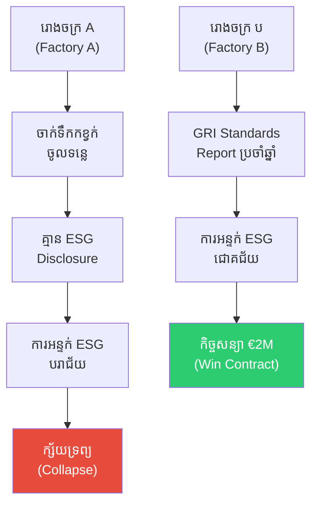
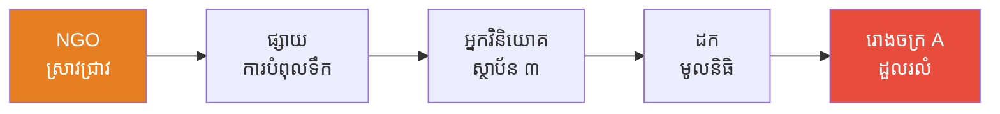
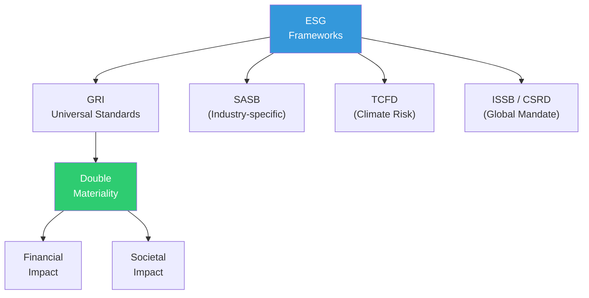

# The Company That Reported Nothing and ESG (ក្រុមហ៊ុនដែលមិនរាយការណ៍ និង ESG)

**Author:** ichamrong  
**Date:** 2026-05-26  
**Tags:** #esg #gri-standards #sasb #tcfd #sustainability-reporting #greenwashing  
**Category:** Concepts / Parables  
**Read Time:** ~6 min  

---

## 📌 មាតិកា (Table of Contents)
- [រោងចក្រពីរ (Two Factories)](#រោងចក្រពីរ-two-factories)
- [ការអន្ទក់ ESG (The ESG Screen)](#ការអន្ទក់-esg-the-esg-screen)
- [ការបោះបង់ និងការដួលរលំ (The Collapse)](#ការបោះបង់-និងការដួលរលំ-the-collapse)
- [ការវិភាគទ្រឹស្តី៖ ESG Reporting Frameworks (Theoretical Breakdown)](#ការវិភាគទ្រឹស្តី-esg-reporting-frameworks-theoretical-breakdown)
- [Related Posts](#related-posts)

---

## រោងចក្រពីរ (Two Factories)

នៅក្នុងខេត្តព្រះសីហនុ មានរោងចក្រកាត់ដេរ (Garment Factory) ចំនួនពីរ ដែលជាអ្នកផ្គត់ផ្គង់សម្លៀកបំពាក់ឲ្យម៉ាកយីហោ (Fashion Brand) ដ៏ល្បីមួយនៅអឺរ៉ុប។

**រោងចក្រ A** តែងតែលួចបង្ហូរទឹកកខ្វក់ (Wastewater) ចូលទៅក្នុងទន្លេ ដោយមិនមានតម្លាភាព ឬទិន្នន័យអ្វីបង្ហាញដល់អ្នកវិនិយោគ (Investors) ឡើយ។ រោងចក្រនេះក៏មិនមានការបញ្ចេញរបាយការណ៍ (Disclosure) ណាមួយទាក់ទងនឹងការការពារបរិស្ថាន (Environmental) ការផ្តល់ប្រាក់ឈ្នួលសមរម្យ (Social) ឬអភិបាលកិច្ចក្នុងការដឹកនាំ (Governance) នោះដែរ។ អ្នកគ្រប់គ្រង (Management) របស់ពួកគេជឿថា ការរក្សាភាពស្ងៀមស្ងាត់ (Silence) គឺជារឿងដ៏ល្អបំផុត — ឲ្យតែគ្មាននរណាមើលឃើញ នោះពួកគេនឹងមិនមានទោសកំហុសអ្វីឡើយ។

ចំណែកឯ **រោងចក្រ B** វិញ បានប្រើប្រាស់ស្តង់ដារ **GRI Universal Standards** ដើម្បីចេញផ្សាយរបាយការណ៍ប្រចាំឆ្នាំ (Annual Report) ជារៀងរាល់ឆ្នាំ៖ របាយការណ៍នោះបានបញ្ជាក់យ៉ាងច្បាស់អំពី បរិមាណទឹកដែលបានប្រើប្រាស់ (Water Usage) ប្រាក់ឈ្នួលរបស់កម្មករ (Worker Wages) និងកម្រិតឧស្ម័នកាបូនិចដែលបានបញ្ចេញក្នុងការផលិតអាវមួយ (Carbon per Garment)។ ទិន្នន័យ (Data) ទាំងអស់នេះត្រូវបានចុះផ្ទៀងផ្ទាត់ និងទទួលស្គាល់ (Third-party verified) ដោយស្ថាប័នឯករាជ្យ Bureau Veritas ។

---

## ការអន្ទក់ ESG (The ESG Screen)

ក្រុមលទ្ធកម្ម (Procurement Team) របស់ម៉ាកយីហោ **LumiThreads** មកពីប្រទេសហូឡង់ បានប្រើប្រាស់ប្រព័ន្ធវាយតម្លៃ **ESG Screen** ដោយផ្អែកលើក្របខ័ណ្ឌ **SASB (Sustainability Accounting Standards Board)**។ ក្រុមលទ្ធកម្មនេះបានពិនិត្យមើលចំណុចសំខាន់ៗចំនួន ៣ របស់រោងចក្រនីមួយៗ៖

**១. បរិស្ថាន (Environmental)** — ការគ្រប់គ្រងប្រព័ន្ធទឹក ការបំពុល (Pollution) និងការប្រើប្រាស់ថាមពល (Energy Use)។  
**២. សង្គម (Social)** — ប្រាក់ឈ្នួល សុខមាលភាព និងការការពារសិទ្ធិពលកម្ម (Labor Rights)។  
**៣. អភិបាលកិច្ច (Governance)** — ស្ថិរភាពថ្នាក់ដឹកនាំ ការប្រឆាំងអំពើពុករលួយ (Anti-corruption) និងតម្លាភាព (Transparency)។

រោងចក្រ A ត្រូវបានធ្លាក់ចេញ (Disqualified) ភ្លាមៗតែម្តង — **"គ្មានទិន្នន័យ = ធ្លាក់ដោយស្វ័យប្រវត្តិ"**។ ស្តង់ដារ ESG សម្រាប់វិស័យឧស្សាហកម្ម (Industry SASB Benchmark) ទាមទារឲ្យមានការបញ្ចេញទិន្នន័យជាអប្បបរមា (Minimum Disclosure) — ការដែលមិនមានទិន្នន័យអ្វីសោះ (Absence of Data) ត្រូវបានគេចាត់ទុកថាជាសញ្ញានៃការលាក់បាំងហានិភ័យ (Non-disclosure signals risk)។

រោងចក្រ B បានឆ្លងកាត់ការវាយតម្លៃនេះដោយជោគជ័យ (Passes) ហើយក៏ទទួលបាន **កិច្ចសន្យាដែលមានទំហំទឹកប្រាក់រហូតដល់ទៅ ២ លានអឺរ៉ូ** (€2M Contract)។

---

## ការបោះបង់ និងការដួលរលំ (The Collapse)

ប្រាំមួយខែក្រោយមក អង្គការក្រៅរដ្ឋាភិបាលអន្តរជាតិ (International NGO) មួយបានទម្លាយ (Expose) រឿងអាស្រូវអំពីការបំពុលបរិស្ថាន (Pollution) របស់រោងចក្រ A។ ត្រឹមតែរយៈពេល ១ សប្ដាហ៍ប៉ុណ្ណោះ **អ្នកវិនិយោគស្ថាប័ន (Institutional Investors) ធំៗចំនួន ៣ បានដកទុនវិនិយោគរបស់ពួកគេត្រឡប់ទៅវិញ** (Pull Funding)។ ម៉ាកយីហោជាដៃគូ (Brand Partners) ទាំងអស់បានបញ្ចប់ (Terminate) កិច្ចសន្យា។ ទីបំផុត រោងចក្រ A ក៏បានដួលរលំ (Collapse) ហើយត្រូវបិទទ្វារ (Shut Down)។

រីឯរោងចក្រ B វិញ ទទួលបានភាពជោគជ័យយ៉ាងត្រចះត្រចង់ — ដោយមានម៉ាកយីហោល្បីៗចំនួន ២ ទៀត (Two New Brand Partners) បានទាក់ទងមកដោយផ្ទាល់ (Approach) ដោយពួកគេបានសំអាងលើរបាយការណ៍ GRI ថាជា **ភស្តុតាងនៃដំណើរការការងារដ៏ល្អឥតខ្ចោះ (Proof of Performance)** របស់រោងចក្រមួយនេះ។

---

## ការវិភាគទ្រឹស្តី៖ ESG Reporting Frameworks (Theoretical Breakdown)

**ESG (បរិស្ថាន សង្គម និងអភិបាលកិច្ច)** បានក្លាយទៅជាក្របខ័ណ្ឌគោល (Core Framework) ដ៏សំខាន់សម្រាប់ **អត្ថន័យទ្វេដង (Double Materiality)** — ដែលមានន័យថា វាវាស់វែងទាំង ហានិភ័យដែលមានមកលើក្រុមហ៊ុន (Risk to Company) **និង** ផលប៉ះពាល់ដែលក្រុមហ៊ុនមានទៅលើសង្គម (Impact on Society)។

### ១. GRI Standards (Global Reporting Initiative)
**ស្តង់ដារ GRI Universal Standards 2021** គឺផ្តោតសំខាន់ទៅលើ **ភាពសំខាន់នៃផលប៉ះពាល់ (Impact Materiality)**។ GRI 300 Series = បរិស្ថាន ; GRI 400 Series = សង្គម ; GRI 200 Series = សេដ្ឋកិច្ច។

### ២. SASB (Sustainability Accounting Standards Board)
ស្តង់ដារនេះត្រូវបានបង្កើតឡើងសម្រាប់ **វិស័យឧស្សាហកម្មជាក់លាក់នីមួយៗ (Industry-specific)** — ដោយមានម៉ូដែល (Model) សម្រាប់ ១១ ផ្នែកឧស្សាហកម្ម។ រង្វាស់រង្វាល់ (Metrics) របស់វាត្រូវបានប្រើប្រាស់ដោយ Bloomberg ESG Terminal ផងដែរ។

### ៣. TCFD (Task Force on Climate-related Financial Disclosures)
ជាការបញ្ចេញរបាយការណ៍ (Disclosure) ដែលពាក់ព័ន្ធនឹងហានិភ័យនៃការប្រែប្រួលអាកាសធាតុ (Climate Risk) — ដូចជា អភិបាលកិច្ច យុទ្ធសាស្ត្រ ការគ្រប់គ្រងហានិភ័យ និងរង្វាស់រង្វាល់។ វាត្រូវបានតម្រូវ (Required) ឲ្យអនុវត្តដោយចក្រភពអង់គ្លេស សហភាពអឺរ៉ុប និងប្រទេសសិង្ហបុរី។

### ៤. ISSB / CSRD
**ISSB IFRS S1 & S2** គឺជាស្តង់ដារគោលជាសកល (Global Baseline) ហើយចំណែកឯ **CSRD (Corporate Sustainability Reporting Directive)** ត្រូវបានបង្កើតឡើងដើម្បីជំនួស NFRD ចាស់។ ច្បាប់របស់សហភាពអឺរ៉ុប បានតម្រូវ (Mandate) ឲ្យក្រុមហ៊ុនធំៗទាំងអស់អនុវត្តចាប់ពីឆ្នាំ ២០២៦ តទៅ។

**សេចក្តីសន្និដ្ឋាន៖** នៅក្នុងសេដ្ឋកិច្ចទំនើប (Modern Economy) ការបញ្ចេញរបាយការណ៍ ESG មិនមែនគ្រាន់តែជាជម្រើស (Option) នោះទេ — ប៉ុន្តែវាគឺជា **ច្រកផ្លូវឆ្ពោះទៅរកប្រភពដើមទុន (Capital Access)**។ ការរាយការណ៍ប្រកបដោយតម្លាភាព (Transparent Reporting) គឺជាទ្រព្យសម្បត្តិដ៏មានតម្លៃបំផុតសម្រាប់ក្រុមហ៊ុន។

---

## Related Posts

- **[ESG Reporting and GRI Standards](../01-esg-reporting-and-gri-standards.md)** — ក្របខ័ណ្ឌ ESG ពេញលេញ GRI, SASB, TCFD, ISSB, CSRD, Double Materiality

---

*Last updated: 2026-05-26*
