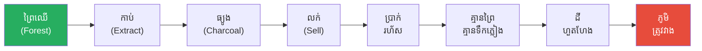
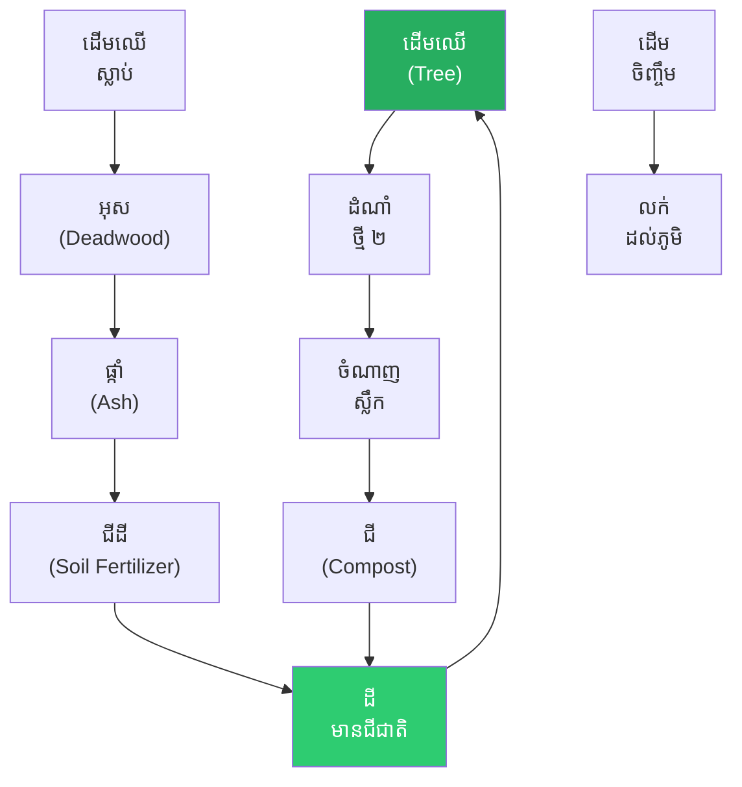
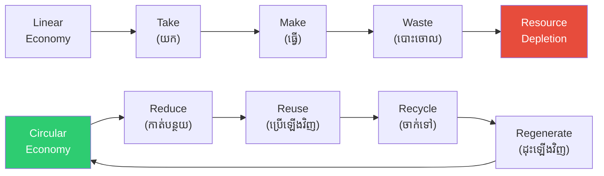

# The Village That Ate Its Own Forest and the Circular Economy (ភូមិដែលស៊ីព្រៃខ្លួនឯង និងសេដ្ឋកិច្ចរង្វិល)

**Author:** ichamrong  
**Date:** 2026-05-26  
**Tags:** #circular-economy #cradle-to-cradle #linear-economy #sustainability #waste-elimination  
**Category:** Concepts / Parables  
**Read Time:** ~6 min  

---

## 📌 មាតិកា (Table of Contents)
- [ភូមិ A ៖ ការបំផ្លាញ (Village A — The Destruction)](#ភូមិ-a-ការបំផ្លាញ-village-a-the-destruction)
- [ភូមិ ប ៖ ការបង្វិល (Village B — The Loop)](#ភូមិ-ប-ការបង្វិល-village-b-the-loop)
- [លទ្ធផល ៥០ ឆ្នាំ (Fifty-Year Outcome)](#លទ្ធផល-៥០-ឆ្នាំ-fifty-year-outcome)
- [ការវិភាគទ្រឹស្តី៖ Circular Economy (Theoretical Breakdown)](#ការវិភាគទ្រឹស្តី-circular-economy-theoretical-breakdown)
- [Related Posts](#related-posts)

---

## ភូមិ A ៖ ការបំផ្លាញ (Village A — The Destruction)

នៅក្បែរជួរភ្នំក្រវាញ មានភូមិពីរនៅក្បែរគ្នា ដែលប្រជាជនពឹងផ្អែកទៅលើអនុផលព្រៃឈើ (Forest) ដូចគ្នា ប៉ុន្តែពួកគេបាន **ជ្រើសរើសផ្លូវដើរ** ខុសគ្នាស្រឡះ។

**ភូមិ A** បាននាំគ្នាកាប់ (Cut) ដើមឈើដើម្បីដុតធ្វើជាធ្យូង (Charcoal) លក់យកលុយ ព្រោះវាអាចផ្តល់ប្រាក់ចំណូលបានយ៉ាងរហ័ស (Fast Money)។ ពួកគេគិតថា ហេតុអ្វីត្រូវរង់ចាំ? ព្រៃឈើមានច្រើនណាស់ ហើយប្រជាជនក៏ត្រូវការប្រាក់ (Cash) ភ្លាមៗ (Now) ដែរ។ ត្រឹមតែរយៈពេល ១០ ឆ្នាំប៉ុណ្ណោះ — ព្រៃឈើស្ទើរតែទាំងស្រុងត្រូវបានកាប់បំផ្លាញ (Cleared) រលីង។

នៅពេលដែលគ្មានដើមឈើ (Trees) ៖ របបទឹកភ្លៀង (Rainfall) ក៏ចាប់ផ្តើមធ្លាក់ចុះ ដំណាំ (Crops) លែងទទួលបានផលល្អ ហើយដីក៏ចាប់ផ្តើមហូរច្រោះ (Soil Erosion)។ ក្នុងរយៈពេល ៣០ ឆ្នាំក្រោយមក ភូមិ A ត្រូវបានគេបោះបង់ចោល (Abandoned)។ ប្រជាជននៅក្នុងភូមិ (Villagers) បាននាំគ្នាចំណាកស្រុក (Migrate) ទៅកាន់តំបន់ផ្សេង។

---

## ភូមិ ប ៖ ការបង្វិល (Village B — The Loop)

ចំណែកឯ **ភូមិ B** វិញ មានដំណើរការ (Operate) ខុសពីនេះ។ ពួកគេបានអនុវត្តតាមវិធានការសំខាន់ៗចំនួន ៣ ៖

**វិធានការទី ១** — កាប់ដើមឈើ ១ ដើម (One Tree Cut) ត្រូវតែដាំដើមឈើថ្មីជំនួសវិញ ២ ដើម (Plant ២)។  
**វិធានការទី ២** — អនុញ្ញាតឲ្យកាប់តែដើមឈើណាដែលងាប់ (Deadwood) យកទៅធ្វើអុស ឬដុតធ្យូងប៉ុណ្ណោះ។  
**វិធានការទី ៣** — ផេះ (Ash) ទាំងអស់ដែលបានមកពីការដុត ត្រូវយកទៅបាច ឬកប់ (Dig) ចូលទៅក្នុងដីស្រែចម្ការ (Farmland)។

ជាជាងការបោះចោលយ៉ាងខ្ជះខ្ជាយ (Waste) ៖ ស្លឹកឈើជ្រុះ (Fallen Leaves) ត្រូវបានយកទៅធ្វើជាជីកំប៉ុស្ត (Compost); រីឯកូនឈើដែលនៅសល់ (Surplus Saplings) ត្រូវបានយកទៅលក់ (Sell) ឱ្យអ្នកភូមិផ្សេងទៀត។

---

## លទ្ធផល ៥០ ឆ្នាំ (Fifty-Year Outcome)

ក្រោយរយៈពេល **៥០ ឆ្នាំ** កន្លងផុតទៅ ទំហំព្រៃឈើ (Forest) របស់ ភូមិ B មានភាពធំទូលាយ (Larger) ជាងព្រៃដើម (Original) ទៅទៀត; ដី (Soil) ក៏មានជីជាតិកាន់តែល្អ (Richer); ហើយថ្មីៗនេះ ភូមិ B ថែមទាំងបានចុះកិច្ចព្រមព្រៀង (Signs) លក់ **ឥណទានកាបូន (Carbon Credit Agreement)** ទៅឱ្យក្រុមហ៊ុនអន្តរជាតិ (International Buyer) ទៀតផង។

ភូមិ A គឺតំណាងឱ្យ **សេដ្ឋកិច្ចបែបលីនេអ៊ែរ (Linear Economy)** — ដែលមានគោលគំនិត "ទាញយក-ផលិត-បោះចោល (Take-Make-Waste)"។  
ចំណែកភូមិ B គឺតំណាងឱ្យ **សេដ្ឋកិច្ចរង្វិល (Circular Economy)** — ដែលមានន័យថា ធនធាន (Resources) ទាំងអស់ ត្រូវបានច្នៃប្រឌិតនិងប្រើប្រាស់វិលជុំជាប្រចាំ (Perpetual Loop)។

---

## ការវិភាគទ្រឹស្តី៖ Circular Economy (Theoretical Breakdown)

**សេដ្ឋកិច្ចរង្វិល (Circular Economy)** គឺជាគំរូសេដ្ឋកិច្ចមួយ (Economic Model) ដែលផ្តោតជាសំខាន់ទៅលើការរចនា (Design) ដើម្បី **លុបបំបាត់ចោល (Eliminate)** នូវការបង្កើតកាកសំណល់ (Waste)។

### ១. ដ្យាក្រាមមេអំបៅ (Butterfly Diagram - ដោយ Ellen MacArthur Foundation)
ដ្យាក្រាមនេះបែងចែកវដ្តជា ២ (Two Cycles) ៖ **វដ្តបច្ចេកទេស (Technical Cycle)** (វត្ថុធាតុដើមត្រូវបានកែច្នៃយកទៅប្រើប្រាស់ឡើងវិញក្នុងវិស័យឧស្សាហកម្ម) និង **វដ្តជីវសាស្ត្រ (Biological Cycle)** (សារធាតុចិញ្ចឹមត្រូវបានប្រគល់ត្រឡប់ទៅឱ្យធម្មជាតិវិញ)។ ភូមិ B បានប្រើប្រាស់វដ្តជីវសាស្ត្រ — ស្លឹកឈើ → ជីកំប៉ុស្ត → ដី → ដើមឈើ។

### ២. ទ្រឹស្តី Cradle-to-Cradle (C2C)
ទ្រឹស្តីរបស់ **Braungart & McDonough** បានលើកឡើងថា រាល់ផលិតផល (Product) ទាំងអស់ ត្រូវតែ (Must) ត្រូវបានរចនាឡើង (Designed) ក្នុងទម្រង់ជា "កាកសំណល់ = ចំណី (Waste = Food)" — ដែលមានន័យថា រាល់កាកសំណល់ទាំងអស់ ត្រូវតែអាចត្រឡប់ (Return) ចូលទៅក្នុងវដ្តជីវសាស្ត្រ ឬវដ្តបច្ចេកទេសវិញបាន។

### ៣. ក្របខ័ណ្ឌ ReSOLVE
**R**egenerate (ស្តារឡើងវិញ) — **S**hare (ចែករំលែក) — **O**ptimize (ធ្វើឱ្យប្រសើរឡើង) — **L**oop (វិលជុំ) — **V**irtualize (ប្រែក្លាយជាឌីជីថល) — **E**xchange (ផ្លាស់ប្តូរ)។ ក្រុមហ៊ុន (Company) ឬភូមិ (Village) ដែលជ្រើសរើសយកក្របខ័ណ្ឌ ReSOLVE មកអនុវត្ត នឹងអាចរក្សា (Retain) នូវតម្លៃ (Value) នៃធនធាន (Resource) របស់ពួកគេបានយូរអង្វែង។

### ៤. សហជីវិតឧស្សាហកម្ម (Industrial Symbiosis)
ភូមិ B បានលក់កូនឈើ និងផេះ។ នៅក្នុងទ្រឹស្តីសហជីវិតឧស្សាហកម្ម កាកសំណល់ (Waste) របស់ក្រុមហ៊ុន A អាចត្រូវបានផ្ទេរ (Send) ទៅឱ្យក្រុមហ៊ុន B ដើម្បីប្រើប្រាស់ជាវត្ថុធាតុដើម (Input)។ តំបន់ឧស្សាហកម្ម Kalundborg Symbiosis នៅប្រទេសដាណឺម៉ាក (Denmark) គឺជាឧទាហរណ៍ជាក់ស្ដែងមួយនៃទ្រឹស្តីនេះ។

**សេចក្ដីសន្និដ្ឋាន៖** ភូមិ B ប្រហែលជាមិនទទួលបាន "ប្រាក់ចំណេញ (Profit) ច្រើន" ភ្លាមៗនៅក្នុងឆ្នាំទី ១ នោះទេ — ប៉ុន្ដែនៅក្នុងរយៈពេល ៥០ ឆ្នាំ ភូមិ B បាន **ជ្រើសរើសការរស់រានមានជីវិត (Survival) ក៏ដូចជាកំណើនយូរអង្វែង (Growth)** សម្រាប់កូនចៅជំនាន់ក្រោយ។

---

## Related Posts

- **[Circular Economy](../02-circular-economy.md)** — Butterfly Diagram, Cradle-to-Cradle, ReSOLVE Framework, Industrial Symbiosis

---

*Last updated: 2026-05-26*
