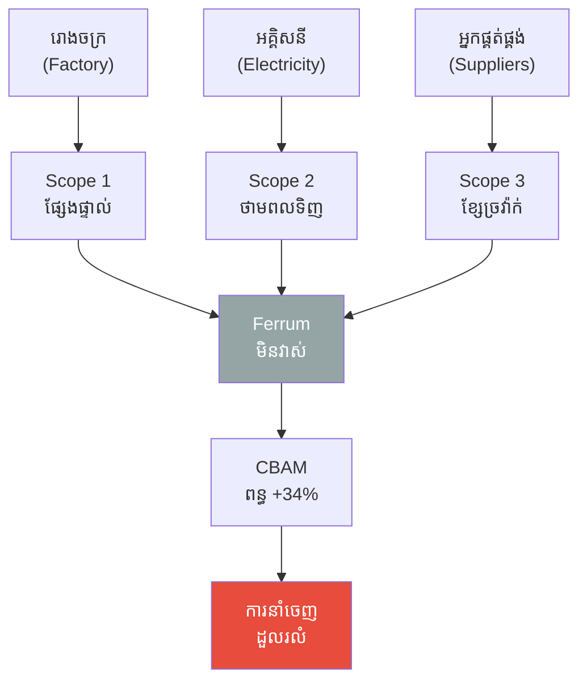
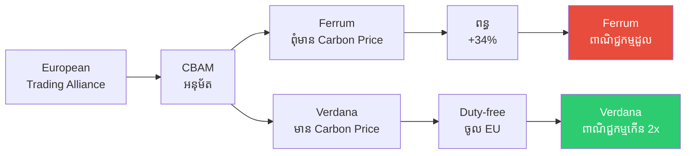
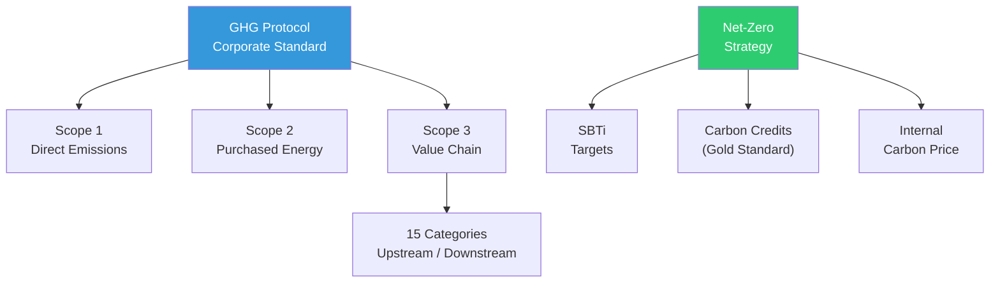

# The Smoke That Cost a Kingdom and Carbon Accounting (ផ្សែងដែលបំផ្លាញព្រះរាជាណាចក្រ និងការគណនាកាបូន)

**Author:** ichamrong  
**Date:** 2026-05-26  
**Tags:** #carbon-accounting #ghg-protocol #scope-emissions #net-zero #sbti #carbon-border-adjustment  
**Category:** Concepts / Parables  
**Read Time:** ~6 min  

---

## 📌 មាតិកា (Table of Contents)
- [ព្រះរាជាណាចក្រ Ferrum (Kingdom Ferrum)](#ព្រះរាជាណាចក្រ-ferrum-kingdom-ferrum)
- [ព្រះរាជាណាចក្រ Verdana (Kingdom Verdana)](#ព្រះរាជាណាចក្រ-verdana-kingdom-verdana)
- [CBAM និងចរន្តពាណិជ្ជកម្ម (CBAM and Trade Flows)](#cbam-និងចរន្តពាណិជ្ជកម្ម-cbam-and-trade-flows)
- [ការវិភាគទ្រឹស្តី៖ Carbon Accounting (Theoretical Breakdown)](#ការវិភាគទ្រឹស្តី-carbon-accounting-theoretical-breakdown)
- [Related Posts](#related-posts)

---

## ព្រះរាជាណាចក្រ Ferrum (Kingdom Ferrum)

ព្រះរាជាណាចក្រ **Ferrum** មានភាពរុងរឿង (Prospers) ដោយសារតែការប្រើប្រាស់ថាមពលធ្យូងថ្ម (Coal)។ រោងចក្រ (Factory) នីមួយៗសុទ្ធតែបានបញ្ចេញផ្សែងពុល (Emit)។ កប៉ាល់ (Ships) ដឹកជញ្ជូន ក៏បញ្ចេញផ្សែងពុល។ សូម្បីតែសកម្មភាពកសិកម្ម (Farms) ក៏បង្កើតការបំពុលដែរ។ ប៉ុន្ដែព្រះរាជា (King) នៃនគរ Ferrum ជឿជាក់ថា ផ្សែង (Smoke) តំណាងឱ្យផលិតភាព (Productivity) ពោលគឺ **"មានផ្សែងកាន់តែច្រើន ប្រាក់ចំណូលក៏កាន់តែច្រើន"**។

ព្រះរាជាណាចក្រ Ferrum មិនដែល (Never) ខ្វាយខ្វល់ក្នុងការវាស់វែង (Measure) កម្រិតនៃការបញ្ចេញឧស្ម័នពុលណាមួយឡើយ។ ទិន្នន័យស្តីពីឧស្ម័នផ្ទះកញ្ចក់ (GHG) គឺស្មើនឹងសូន្យ (០) ហើយពួកគេក៏មិនមាន (No) ផែនទីបង្ហាញផ្លូវឆ្ពោះទៅរកការបំភាយសូន្យ (Net-Zero Roadmap) នោះដែរ។

---

## ព្រះរាជាណាចក្រ Verdana (Kingdom Verdana)

ផ្ទុយទៅវិញ ព្រះរាជាណាចក្រ **Verdana** បានចាប់ផ្តើម (Start) ធ្វើការវាស់វែង (Measure) ទៅលើបរិមាណនៃការបញ្ចេញឧស្ម័នពុល (Emission) ដោយផ្អែកលើស្តង់ដារ **GHG Protocol**។

**Scope 1** ៖ ការបំភាយឧស្ម័នដោយផ្ទាល់ (Direct) ពីបំពង់ផ្សែងរបស់រោងចក្រនីមួយៗ (Factory Chimneys)។  
**Scope 2** ៖ ការបំភាយឧស្ម័នដោយប្រយោល (Indirect) ដែលកើតចេញពីការប្រើប្រាស់អគ្គិសនី (Purchased Electricity)។  
**Scope 3** ៖ ការបំភាយឧស្ម័នពីខ្សែចង្វាក់តម្លៃ (Value Chain) ទាំងមូល — ដូចជាការដឹកជញ្ជូន (Shipping) ការធ្វើដំណើររបស់បុគ្គលិក (Commute) និងការប្រើប្រាស់ផលិតផលសម្រេចជាដើម។

ប្រទេស Verdana បានចុះហត្ថលេខា (Signs) យល់ព្រមលើការកំណត់គោលដៅផ្អែកលើវិទ្យាសាស្ត្រ **(SBTi)** ដោយរៀបចំផែនការសម្រេចឱ្យបាននូវ ការបំភាយសូន្យ (Net-Zero) នៅត្រឹមឆ្នាំ ២០៤៥។ ពួកគេថែមទាំងបានទិញ (Purchase) **ឥណទានកាបូនដែលមានការបញ្ជាក់ត្រឹមត្រូវ (Verified Carbon Credits - Gold Standard)** ដើម្បីប៉ះប៉ូវចំពោះការបំភាយឧស្ម័នដែលនៅសេសសល់ (Residual Emission) ទៀតផង។

---

## CBAM និងចរន្តពាណិជ្ជកម្ម (CBAM and Trade Flows)

ស្របពេលនោះ **សហព័ន្ធពាណិជ្ជកម្មអឺរ៉ុប (European Trading Alliance)** បានដាក់ចេញនូវយន្តការ **CBAM (Carbon Border Adjustment Mechanism)** — ដែលជាពន្ធកាបូន (Tariff) យកទៅលើទំនិញនាំចូល (Import Goods) ពីប្រទេសដែលមិនបានប្រើប្រាស់ប្រព័ន្ធកំណត់តម្លៃកាបូន (Without Carbon Pricing)។

ទំនិញរបស់នគរ Ferrum ស្រាប់តែក្លាយទៅជាមានតម្លៃថ្លៃជាងមុន (Expensive) ដល់ទៅ ៣៤%។ ខណៈដែលទំនិញរបស់នគរ Verdana អាចនាំចូល (Enter) ទៅលក់ដោយមិនមានការគិតពន្ធឡើយ (Duty-free)។

ក្នុងរយៈពេលត្រឹមតែ ១ ទសវត្សរ៍ (Decade) ប៉ុណ្ណោះ ៖ វិស័យពាណិជ្ជកម្ម (Trade) របស់ Ferrum បាន **ដួលរលំ** ស្ទើរតែទាំងស្រុង; ខណៈដែលពាណិជ្ជកម្មរបស់ Verdana ឯណោះវិញ បាន **កើនឡើងទ្វេដង (Double)**។

---

## ការវិភាគទ្រឹស្តី៖ Carbon Accounting (Theoretical Breakdown)

**ការគណនាកាបូន (Carbon Accounting)** គឺជាដំណើរការ (Process) នៃការវាស់វែង (Measure) ការគណនា (Calculate) និងការផ្ទៀងផ្ទាត់ (Verify) ទៅលើកម្រិតនៃការបំភាយឧស្ម័នផ្ទះកញ្ចក់ (GHG Emissions)។

### ១. ពិធីសារ GHG (GHG Protocol) — Scope 1 / 2 / 3
**Scope 1** ៖ ការបំភាយឧស្ម័នដោយផ្ទាល់ (Direct) — ដូចជាពីបំពង់ផ្សែងរោងចក្រ (Factory) និងយានយន្ត (Fleet)។  
**Scope 2** ៖ ការបំភាយដោយប្រយោលពីការប្រើប្រាស់ (Purchased) ថាមពលអគ្គិសនី (Energy)។  
**Scope 3** ៖ ការបំភាយតាមខ្សែចង្វាក់តម្លៃ (Value Chain) ដែលមាន ១៥ ប្រភេទ (Categories) ផ្សេងៗគ្នា — ដែលជាទូទៅ (Often) មានចំនួនលើសពី ៧០% នៃទំហំបំភាយសរុប (Carbon Footprint)។

### ២. គំនិតផ្តួចផ្តើមគោលដៅផ្អែកលើវិទ្យាសាស្ត្រ (SBTi)
ក្រុមហ៊ុន (Company) ដែលចូលរួម (Commit) ត្រូវតែ (Must) កំណត់គោលដៅរបស់ខ្លួន (Target) ឱ្យស្របទៅតាម (Aligned) កិច្ចព្រមព្រៀងទីក្រុងប៉ារីស (១.៥°C)។ អង្គការ SBTi នឹងធ្វើការផ្ទៀងផ្ទាត់ (Validate) ទៅលើគោលដៅទាំងនោះ។

### ៣. ឥណទានកាបូន (Carbon Credits / Offsets)
ត្រូវបានប្រើប្រាស់ (Use) សម្រាប់ប៉ះប៉ូវ (Compensate) ទៅលើការបំភាយឧស្ម័នដែលនៅសេសសល់ (Residual Emission)។ ត្រូវជ្រើសរើសស្តង់ដារ (Standards) ដែលគួរឱ្យទុកចិត្ត (ដូចជា Gold Standard, Verra VCS) និងត្រូវប្រុងប្រយ័ត្ន (Beware) ចំពោះការបោកប្រាស់ (Greenwashing) — ដោយត្រូវប្រាកដថាវាមានភាពបន្ថែម (Additionality) ពិតប្រាកដ។

### ៤. យន្តការ EU CBAM
ចាប់ផ្តើម (Start) អនុវត្តនៅឆ្នាំ ២០២៦ — ដោយបែងចែកជាដំណាក់កាល (Phased System)។ ដំណាក់កាលទី ១ ផ្តោតលើវិស័យ (Sectors) ដូចជា៖ ដែកថែប (Steel) អាលុយមីញ៉ូម (Aluminium) និងស៊ីម៉ងត៍ (Cement)។ ដំណាក់កាលបន្តបន្ទាប់ អាចនឹងរួមបញ្ចូលនូវវិស័យសារធាតុគីមី (Chemicals) និងអ៊ីដ្រូសែន (Hydrogen)។

**សេចក្ដីសន្និដ្ឋាន៖** ផ្សែង (Smoke) ដែលនគរ Ferrum មិនបានវាស់វែង (Measure) គឺត្រូវប្តូរមកជាការបង់ពន្ធ **ទូទាត់ (Pay)** យ៉ាងធ្ងន់ធ្ងរ ដោយសារតែគ្មានការរៀបចំផែនការទុកជាមុន (Without Planning)។ ការវាស់វែង (Measurement) គឺជាជំហានដំបូងបំផុត (First Step) នៅក្នុងយុទ្ធសាស្ត្រឆ្ពោះទៅរកការបំភាយសូន្យ (Net-Zero Strategy)។

---

## Related Posts

- **[Carbon Accounting and Net-Zero](../03-carbon-accounting-and-net-zero.md)** — GHG Protocol, Scope 1/2/3, SBTi, Carbon Credits, EU CBAM

---

*Last updated: 2026-05-26*
