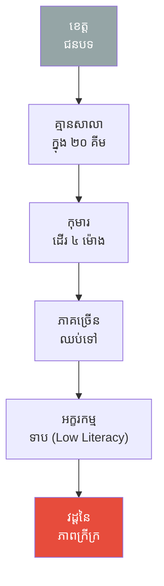
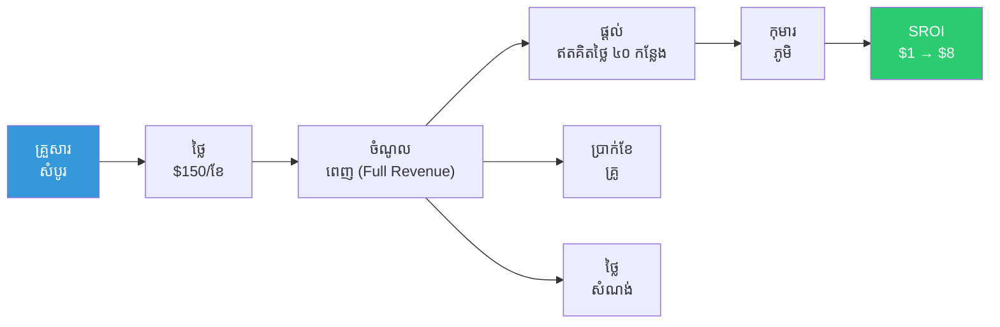
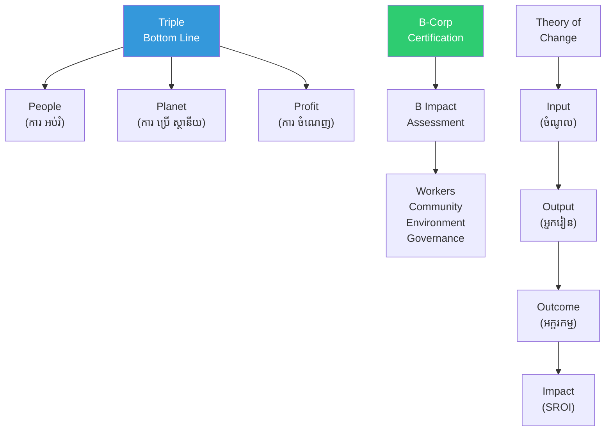

# The Monk Who Built a School and Social Entrepreneurship (ព្រះដែលសង់សាលារៀន និងសហគ្រិនភាពសង្គម)

**Author:** ichamrong  
**Date:** 2026-05-26  
**Tags:** #social-entrepreneurship #b-corp #sroi #impact-investing #triple-bottom-line  
**Category:** Concepts / Parables  
**Read Time:** ~6 min  

---

## 📌 មាតិកា (Table of Contents)
- [បញ្ហា ៖ គ្មានសាលា (The Problem — No School)](#បញ្ហា-គ្មានសាលា-the-problem-no-school)
- [គំរូ Hybrid (The Hybrid Model)](#គំរូ-hybrid-the-hybrid-model)
- [ការវាស់ SROI (Measuring SROI)](#ការវាស់-sroi-measuring-sroi)
- [ការវិភាគទ្រឹស្តី៖ Social Entrepreneurship (Theoretical Breakdown)](#ការវិភាគទ្រឹស្តី-social-entrepreneurship-theoretical-breakdown)
- [Related Posts](#related-posts)

---

## បញ្ហា ៖ គ្មានសាលា (The Problem — No School)

ព្រះតេជគុណ **សួន (Suon)** បានគង់នៅ (Lives) ក្នុងខេត្តមួយនៅតំបន់ជនបទ (Rural Province) ដែលនៅទីនោះមិនមាន (Without) សាលារៀន (School) សោះឡើយ ក្នុងកាំចម្ងាយ ២០ គីឡូម៉ែត្រ (20km)។ ក្មេងៗ (Children) ត្រូវដើរ (Walk) យ៉ាងហោចណាស់ ៤ ម៉ោង ដើម្បីទៅរៀន ឬមួយក៏ពួកគេសម្រេចចិត្តឈប់រៀនតែម្តង។ រដ្ឋាភិបាល (Government) ក៏មិនមាន (No) ថវិកា (Budget) សម្រាប់សាងសង់សាលារៀននៅទីនោះដែរ។ ចំណែកឯព្រះតេជគុណ សួន ផ្ទាល់ ក៏មិនមានថវិកាដូចគ្នា។

ប៉ុន្ដែ ព្រះតេជគុណ សួន បាន **មើលឃើញ (Sees)** ឱកាសមួយ ៖ នៅក្នុងទីរួមខេត្ត (Provincial Capital) មានគ្រួសារ (Families) អ្នកមានជីវភាពធូរធារ (Wealthy) ជាច្រើន ដែលកំពុងតែស្វែងរក (Seek) ការអប់រំ (Education) មួយដែលមានគុណភាពខ្ពស់ (Quality) សម្រាប់កូនៗរបស់ពួកគេ។

---

## គំរូ Hybrid (The Hybrid Model)

ព្រះតេជគុណ សួន បានរចនា (Designs) **គំរូអាជីវកម្មបែបចម្រុះ (Hybrid Model)** មួយឡើង ៖

**ការបង់ថ្លៃសិក្សាពេញលេញ ($150/ខែ)** ៖ គ្រួសារ (Families) អ្នកមាន (Wealthy) នៅឯទីក្រុង (Capital) សុខចិត្តចំណាយ (Pay) ប្រាក់ ដើម្បីឱ្យកូនៗ (Children) របស់ពួកគេបានស្នាក់នៅរៀនសូត្រ (Board) នៅថ្ងៃធ្វើការក្នុងសប្ដាហ៍ (Weekdays)។

**ប្រាក់ចំណូល (Revenue) ដែលទទួលបាននេះ ត្រូវបានយកទៅផ្គត់ផ្គង់ (Funds) ១០០%** សម្រាប់បង្កើត **កន្លែងសិក្សាដោយឥតគិតថ្លៃចំនួន ៤០ កន្លែង (40 Free Places)** សម្រាប់ក្មេងៗ (Children) ដែលរស់នៅក្នុងភូមិ (Village)។

ព្រះតេជគុណ សួន បាន **តាមដាន (Track) ទិន្នន័យ (Data) ទាំងអស់** យ៉ាងយកចិត្តទុកដាក់ ៖

- អត្រា (Rate) អក្ខរកម្ម (Literacy) — ទាំងមុនពេល (Before) និងក្រោយពេល (After) អនុវត្តគម្រោង
- ប្រាក់ខែ (Salary) របស់លោកគ្រូអ្នកគ្រូ (Teachers)
- ការចំណាយ (Cost) ទៅលើការសាងសង់ (Construction)
- **ផលត្រឡប់មកវិញនៃសង្គមពីការវិនិយោគ (SROI)** ៖ រាល់ ១ ដុល្លារដែលបានចំណាយ (Spent) → អាចបង្កើតសមត្ថភាពរកប្រាក់ចំណូល (Earning Capacity) បានដល់ទៅ ៨ ដុល្លារ នាពេលអនាគត (Future)។

---

## ការវាស់ SROI (Measuring SROI)

ព្រះតេជគុណ សួន បានចុះឈ្មោះសាលារៀននេះ (Registers) ជាក្រុមហ៊ុន **B-Corp** ដែលត្រូវបានផ្ទៀងផ្ទាត់និងទទួលស្គាល់ (Verified) ដោយស្ថាប័ន B Lab។

ក្នុងរយៈពេលត្រឹមតែ **៣ ឆ្នាំ** ប៉ុណ្ណោះ ៖ មាន **អ្នកវិនិយោគដើម្បីផលប៉ះពាល់សង្គម (Impact Investors) ចំនួន ២ ស្ថាប័ន** បានយល់ព្រមផ្តល់ (Fund) ដើមទុន (Capital) ដើម្បី **សាងសង់ (Build) សាលារៀនថ្មីចំនួន ២ ទៀត**។ មូលហេតុ (Reason) នោះគឺដោយសារតែ ៖ គម្រោងនេះមានផែនការ (Plan) ច្បាស់លាស់ (Clear); មានទិន្នន័យ (Data) ត្រឹមត្រូវអាចជឿទុកចិត្តបាន (Accurate); និងមានបេសកកម្ម (Mission) ជួយសង្គមពិតប្រាកដ (Real)។

---

## ការវិភាគទ្រឹស្តី៖ Social Entrepreneurship (Theoretical Breakdown)

**សហគ្រិនភាពសង្គម (Social Entrepreneurship)** គឺជាការប្រើប្រាស់ (Use) យុទ្ធសាស្ត្រអាជីវកម្ម (Business Process) ដើម្បីរួមចំណែកដោះស្រាយ (Solve) បញ្ហានានានៅក្នុងសង្គម (Social Problem)។

### ១. ទ្រឹស្តី Triple Bottom Line (Elkington)
ផ្តោតលើគោលការណ៍ ៣ យ៉ាង៖ **ប្រជាជន (People), ភពផែនដី (Planet), ប្រាក់ចំណេញ (Profit)**។ អាជីវកម្ម (Business) ដ៏ល្អមួយ ត្រូវតែ (Must) អាចផ្តល់ (Deliver) នូវអត្ថប្រយោជន៍ទាំង ៣ នេះព្រមៗគ្នា។ គម្រោងរបស់ព្រះតេជគុណ សួន ឆ្លើយតបនឹងចំណុចទាំង ៣ នេះ៖ ប្រជាជន (ការផ្តល់ការអប់រំ), ប្រាក់ចំណេញ (ចំណូលពីការបង់ថ្លៃសិក្សា), ភពផែនដី (ការប្រើប្រាស់ថាមពលព្រះអាទិត្យ Solar Panel)។

### ២. ផលត្រឡប់មកវិញនៃសង្គមពីការវិនិយោគ (SROI - Social Return on Investment)
**SROI = តម្លៃនៃលទ្ធផលសង្គម (Value of Social Outcomes) / ថ្លៃដើមនៃការវិនិយោគ (Cost of Investment)**។ ការចំណាយ ១ ដុល្លារ (Spent) → បង្កើតសមត្ថភាពរកចំណូលបាន ៨ ដុល្លារនៅថ្ងៃអនាគត (Future Earning Capacity) ដែលស្មើនឹង SROI 8:1។

### ៣. វិញ្ញាបនបត្រ B-Corp (B-Corp Certification)
ស្ថាប័ន **B Lab** ជាអ្នកផ្តល់វិញ្ញាបនបត្រ (Certify) ដល់ក្រុមហ៊ុន (Company) ណាដែលមានតុល្យភាពរវាង គោលបំណងជួយសង្គម (Purpose) និង ប្រាក់ចំណេញ (Profit)។ ការដាក់ពិន្ទុ (Score) គឺផ្អែកលើ៖ បុគ្គលិក សហគមន៍ បរិស្ថាន អភិបាលកិច្ច និងអតិថិជន។ ពិន្ទុស្តង់ដារ (Threshold) ត្រូវយ៉ាងហោចណាស់ ៨០/២០០។

### ៤. ហិរញ្ញប្បទានចម្រុះ (Blended Finance)
គឺជាការលាយបញ្ចូលគ្នា (Blend) នូវប្រភពទុន (Sources) ជាច្រើន៖ ដូចជា ជំនួយឥតសំណង (Grants) + អ្នកវិនិយោគដើម្បីសង្គម (Impact Investors) + មូលធនពាណិជ្ជកម្ម (Commercial Capital)។ ព្រះតេជគុណ សួន បានប្រើប្រាស់ប្រាក់បង់ថ្លៃសិក្សា (Commercial) រួមជាមួយនឹងទុនពីអ្នកវិនិយោគសង្គម (Blended)។

### ៥. ទ្រឹស្តីនៃការផ្លាស់ប្តូរ (Theory of Change)
ដំណើរការរបស់វាគឺ៖ **ធាតុចូល (Input) → សកម្មភាព (Activities) → លទ្ធផលផ្ទាល់ (Outputs) → លទ្ធផលចុងក្រោយ (Outcomes) → ផលប៉ះពាល់ (Impact)**។ នេះគឺជាក្របខ័ណ្ឌ (Framework) ដែលព្រះតេជគុណ សួន បានប្រើដើម្បីបញ្ជាក់ (Justify) ពីភាពត្រឹមត្រូវ និងទាក់ទាញការវិនិយោគ (Investment)។

**សេចក្ដីសន្និដ្ឋាន៖** ព្រះតេជគុណ សួន បានជ្រើសរើសយក (Chooses) ការបង្ហាញទិន្នន័យជាតួលេខ (Numbers)។ ផលប៉ះពាល់សង្គម (Impact) ណាដែលមិនអាចវាស់វែងបាន (Cannot Measure) វាក៏មិនអាច (Cannot) ទាក់ទាញដើមទុន (Capital) បាននោះដែរ។ **"ទិន្នន័យ (Data) គឺជាប្រភពថាមពល (Food) ដ៏សំខាន់សម្រាប់ជម្រុញបេសកកម្ម (Mission)"**។

---

## Related Posts

- **[Social Entrepreneurship](../04-social-entrepreneurship.md)** — B-Corp, SROI, Theory of Change, Impact Investing, Blended Finance, Triple Bottom Line

---

*Last updated: 2026-05-26*
