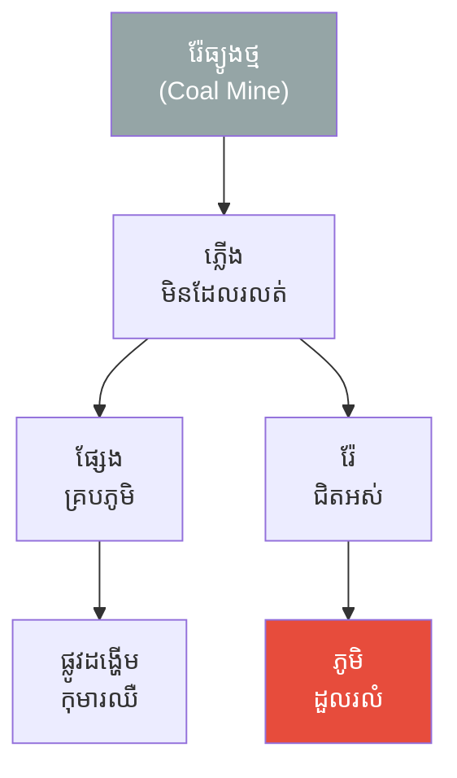
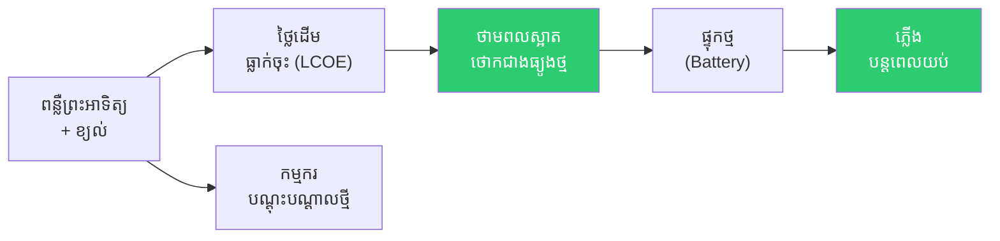
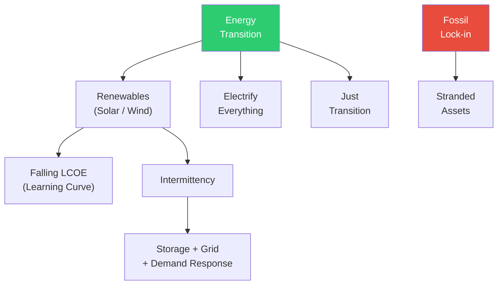

# The Two Villages and the River of Fire and Energy Transition (ភូមិពីរ និងទន្លេភ្លើង និងការផ្លាស់ប្តូរថាមពល)

**Author:** ichamrong  
**Date:** 2026-06-01  
**Tags:** #energy-transition #decarbonization #renewables #just-transition #intermittency #grid  
**Category:** Concepts / Parables  
**Read Time:** ~6 min  

---

## 📌 មាតិកា (Table of Contents)
- [ភូមិដែលដុតភ្លើងពេញមួយយប់ (The Village That Burned All Night)](#ភូមិដែលដុតភ្លើងពេញមួយយប់-the-village-that-burned-all-night)
- [ភូមិដែលរៀនទាញពន្លឺ (The Village That Learned to Catch Light)](#ភូមិដែលរៀនទាញពន្លឺ-the-village-that-learned-to-catch-light)
- [យប់ដែលគ្មានខ្យល់ (The Night With No Wind)](#យប់ដែលគ្មានខ្យល់-the-night-with-no-wind)
- [ការវិភាគទ្រឹស្តី៖ Energy Transition (Theoretical Breakdown)](#ការវិភាគទ្រឹស្តី-energy-transition-theoretical-breakdown)
- [Related Posts](#related-posts)

---

## ភូមិដែលដុតភ្លើងពេញមួយយប់ (The Village That Burned All Night)

នៅតាមដងទន្លេមួយ មានភូមិពីរ (Two Villages)។ ភូមិទីមួយឈ្មោះ **ផ្លាមៀង (Phlameang)** — ភូមិដែលរុងរឿង (Prospers) ដោយសារ "ទន្លេភ្លើង" (River of Fire) ៖ ប្រភពធ្យូងថ្ម (Coal) ដ៏ច្រើនសន្ធឹកនៅក្រោមដី។ ពេលយប់ ភូមិទាំងមូលភ្លឺថ្លា (Bright) ដោយសារភ្លើងដែលឆេះ **មិនដែលរលត់ (Never Stops)**។ អ្នកភូមិមានមោទនភាព ៖ **"ផ្សែងកាន់តែច្រើន មានន័យថាយើងកាន់តែខ្លាំង។"**

ប៉ុន្តែ ផ្សែង (Smoke) នោះ បានគ្របដណ្តប់លើផ្ទៃមេឃ។ កុមារ (Children) ចាប់ផ្ដើមឈឺផ្លូវដង្ហើម (Lungs)។ ហើយ រ៉ែ (Mine) ដែលគេគិតថាគ្មានទីបញ្ចប់នោះ ក៏ចាប់ផ្ដើម **ជិតរីងស្ងួត (Running Out)**។ អ្នកភូមិ ផ្លាមៀង មិនដែលគិត (Never Plans) ពីថ្ងៃដែលភ្លើងនឹងរលត់ឡើយ។

---

## ភូមិដែលរៀនទាញពន្លឺ (The Village That Learned to Catch Light)

ភូមិទីពីរឈ្មោះ **ស្រែស្អាត (Sre-Saat)** គ្មានធ្យូងថ្មទេ។ ដំបូង ពួកគេច្រណែន (Envy) ភូមិ ផ្លាមៀង។ ប៉ុន្តែ មេភូមិវ័យចំណាស់ម្នាក់បាននិយាយថា ៖ **"ព្រះអាទិត្យ (Sun) រះរាល់ថ្ងៃ; ខ្យល់ (Wind) បក់រាល់ល្ងាច។ ហេតុអ្វីយើងមិនរៀនទាញ (Catch) ពួកវា?"**

ពួកគេបានដំឡើងបន្ទះព្រះអាទិត្យ (Solar Panels) និងកង្ហារខ្យល់ (Wind Turbines)។ ដំបូងថ្លៃ (Expensive) ណាស់ — ប៉ុន្តែ ឆ្នាំ​នីមួយៗ ថ្លៃដើម (Cost) កាន់តែធ្លាក់ចុះ ដោយសារពួកគេ **រៀនធ្វើបានកាន់តែប្រសើរ (Learning Curve)**។ មិនយូរប៉ុន្មាន ថាមពលស្អាត (Clean Power) របស់ពួកគេ ថោកជាង (Cheaper) ភ្លើងធ្យូងថ្មរបស់ ផ្លាមៀង ទៅទៀត។

លើសពីនេះ ភូមិ ស្រែស្អាត មិនបានបោះបង់ (Abandon) កម្មករ (Workers) ចាស់ឡើយ។ អ្នកដែលធ្លាប់កាប់អុស ត្រូវបាន **បណ្ដុះបណ្ដាលឡើងវិញ (Retrained)** ឱ្យថែទាំបន្ទះព្រះអាទិត្យ — នេះគឺជា **ការផ្លាស់ប្តូរប្រកបដោយយុត្តិធម៌ (Just Transition)**។

---

## យប់ដែលគ្មានខ្យល់ (The Night With No Wind)

មានយប់មួយ មេឃ​ងងឹត (No Sun) ហើយខ្យល់ក៏ស្ងប់ស្ងាត់ (No Wind) — ភ្លើងភូមិ ស្រែស្អាត ស្ទើរតែរលត់។ អ្នកភូមិ ផ្លាមៀង សើច ៖ **"ឃើញទេ? ព្រះអាទិត្យមិនទៀងទាត់ (Intermittent)!"**

ប៉ុន្តែ ភូមិ ស្រែស្អាត បាន **រៀបចំទុកជាមុន (Planned Ahead)**។ ពួកគេមាន **ថ្មផ្ទុកថាមពល (Battery Storage)** ដែលប្រមូលពន្លឺពេលថ្ងៃទុក ប្រើពេលយប់; ហើយពួកគេ **តភ្ជាប់បណ្ដាញ (Connected the Grid)** ជាមួយភូមិជិតខាង ដើម្បីចែករំលែកថាមពលគ្នាទៅវិញទៅមក។ ភ្លើងរបស់ពួកគេមិនបានរលត់ឡើយ។

ប៉ុន្មានឆ្នាំក្រោយមក រ៉ែធ្យូងថ្មរបស់ ផ្លាមៀង **រីងស្ងួតអស់ (Exhausted)**។ រោងចក្រភ្លើងថ្លៃៗរបស់ពួកគេ ក្លាយជា **ទ្រព្យសកម្មគាំង (Stranded Assets)** — ដែលគ្មានតម្លៃ មុនពេលផុតអាយុកាលរបស់វាទៅទៀត។

---

## ការវិភាគទ្រឹស្តី៖ Energy Transition (Theoretical Breakdown)

**ការផ្លាស់ប្តូរថាមពល (Energy Transition)** គឺជាការផ្លាស់ប្ដូរ (Shift) សេដ្ឋកិច្ចមួយ ចេញឆ្ងាយ (Away) ពីប្រេងឥន្ធនៈហ្វូស៊ីល (Fossil Fuels) ឆ្ពោះទៅរកថាមពលស្អាត (Clean Energy)។

### ១. ថ្លៃដើមធ្លាក់ចុះ (Falling Costs — LCOE & Learning Curves)
"ថ្លៃដើមថាមពលជាមធ្យម" (LCOE) របស់ពន្លឺព្រះអាទិត្យ និងខ្យល់ បានធ្លាក់ចុះ (Plummeted) — ឥឡូវនេះថោកជាង (Cheaper) ធ្យូងថ្មនៅតំបន់ភាគច្រើន។ កាន់តែផលិតច្រើន ថ្លៃកាន់តែថោក (Learning Curve)។

### ២. ភាពមិនទៀងទាត់ និងបណ្តាញ (Intermittency & the Grid)
ព្រះអាទិត្យ និងខ្យល់ ផលិតមិនទៀងទាត់ (Intermittent)។ ដំណោះស្រាយ (Solutions) គឺ ៖ ការផ្ទុកថ្ម (Battery Storage), ការឆ្លើយតបតម្រូវការ (Demand Response), បណ្តាញឆ្លាតវៃ (Smart Grids), និងការតភ្ជាប់ឆ្លងតំបន់ (Interconnection)។

### ៣. ទ្រព្យសកម្មគាំង (Stranded Assets)
រោងចក្រធ្យូងថ្ម និងបំពង់ឧស្ម័ន ប្រឈមនឹងការបាត់បង់តម្លៃ (Lose Value) មុនពេលផុតអាយុកាលសេដ្ឋកិច្ច — នេះជាហានិភ័យហិរញ្ញវត្ថុ (Financial Risk) ដ៏ធំសម្រាប់អ្នកដែលមិនរៀបចំ។

### ៤. ការផ្លាស់ប្តូរប្រកបដោយយុត្តិធម៌ (The Just Transition)
ការផ្លាស់ប្តូរបង្កើតទាំងអ្នកឈ្នះ និងអ្នកចាញ់ — កម្មករធ្យូងថ្ម និងសហគមន៍។ ការផ្លាស់ប្តូរ​ដ៏ត្រឹមត្រូវ ត្រូវ **ចែករំលែក (Share)** បន្ទុក និងផលប្រយោជន៍ ដោយសមធម៌ — តាមរយៈការបណ្ដុះបណ្ដាលឡើងវិញ (Retraining) និងការគាំទ្រ។

**សេចក្ដីសន្និដ្ឋាន៖** ភូមិ ផ្លាមៀង ជឿថា ផ្សែង (Smoke) គឺជាកម្លាំង — ប៉ុន្តែវាជាខ្សែចង (Lock-in)។ ភូមិ ស្រែស្អាត រៀន​ទាញពន្លឺ (Catches Light), រៀបចំសម្រាប់​យប់​គ្មាន​ខ្យល់ (Plans for the Calm Night), និងមិនបោះបង់​នរណាម្នាក់ឡើយ។ **"ការផ្លាស់ប្តូរថាមពល មិនមែនជាការបាត់បង់ភ្លើងទេ — វាជាការ​រៀន​​ទាញវាពី​ប្រភព​ដែល​មិន​ដែលអស់ (Inexhaustible Source)។"**

---

## Related Posts

- **[Energy Transition and Decarbonization](../05-energy-transition-and-decarbonization.md)** — Renewables, LCOE, Intermittency, Grid Flexibility, Stranded Assets, Just Transition

---

*Last updated: 2026-06-01*
