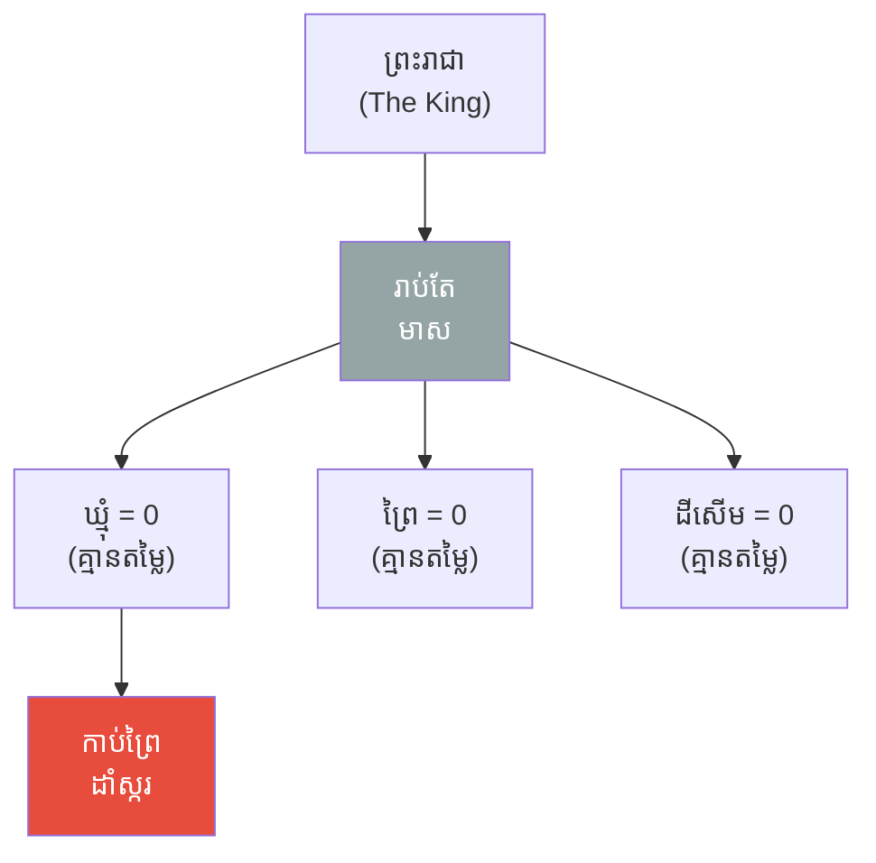
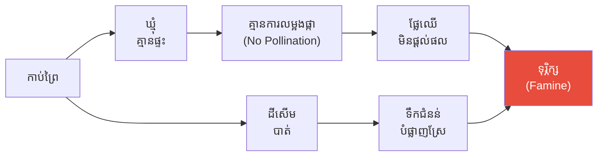
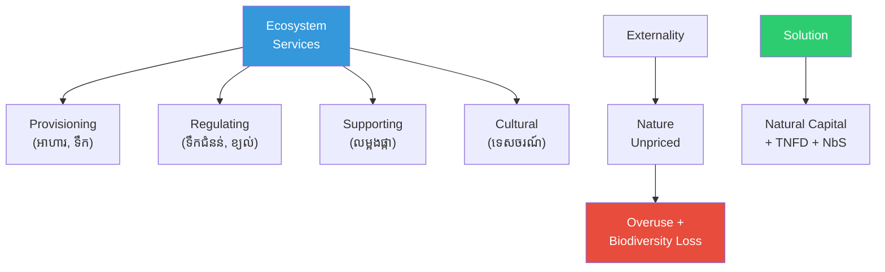

# The King Who Counted Only Gold and Biodiversity (ស្ដេចដែលរាប់តែមាស និងជីវចម្រុះ)

**Author:** ichamrong  
**Date:** 2026-06-01  
**Tags:** #biodiversity #ecosystem-services #natural-capital #tnfd #nature-based-solutions  
**Category:** Concepts / Parables  
**Read Time:** ~6 min  

---

## 📌 មាតិកា (Table of Contents)
- [សួនព្រះរាជា (The King's Garden)](#សួនព្រះរាជា-the-kings-garden)
- [ឆ្នាំដែលឃ្មុំរលត់ (The Year the Bees Vanished)](#ឆ្នាំដែលឃ្មុំរលត់-the-year-the-bees-vanished)
- [តម្លៃលាក់នៃធម្មជាតិ (The Hidden Value of Nature)](#តម្លៃលាក់នៃធម្មជាតិ-the-hidden-value-of-nature)
- [ការវិភាគទ្រឹស្តី៖ Biodiversity (Theoretical Breakdown)](#ការវិភាគទ្រឹស្តី-biodiversity-theoretical-breakdown)
- [Related Posts](#related-posts)

---

## សួនព្រះរាជា (The King's Garden)

មានព្រះរាជា (King) មួយអង្គ ដែលស្រឡាញ់ការរាប់ (Counts) ទ្រព្យសម្បត្តិ។ រាល់ល្ងាច ទ្រង់រាប់ មាស (Gold), ដី (Land), និងគោក្របី (Cattle)។ អ្វីដែលអាច​ដាក់​ក្នុង​បញ្ជី​បាន ទ្រង់ឱ្យតម្លៃ (Value)។ អ្វីដែលរាប់មិនបាន ទ្រង់ចាត់ទុកថា **គ្មានតម្លៃ (Worthless)**។

នៅជុំវិញវាំង មានព្រៃ (Forest), មានដីសើម (Wetland), និងមាន **ឃ្មុំ (Bees)** ដ៏ច្រើនរាប់លាន។ ប៉ុន្តែ ឃ្មុំមិនមែនជាមាស; ព្រៃមិនមែនជាគ្រឿងអលង្ការ។ ដូច្នេះ ក្នុង​បញ្ជី​របស់ព្រះរាជា ៖ ឃ្មុំ = ០, ព្រៃ = ០, ដីសើម = ០។ ទ្រង់​បញ្ជា​ឱ្យ **កាប់ព្រៃ (Clear the Forest)** ដើម្បីដាំ​អំពៅ (Sugarcane) — ដែលលក់​បាន​មាស។

---

## ឆ្នាំដែលឃ្មុំរលត់ (The Year the Bees Vanished)

ឆ្នាំ​បន្ទាប់ ឃ្មុំ (Bees) គ្មានព្រៃ​ជា​ផ្ទះ ក៏​**រលត់​បាត់ (Vanished)**។ ដោយ​គ្មាន​ឃ្មុំ​លម្អង​ផ្កា (Pollinate), ដើម​ផ្លែ​ឈើ (Orchards) ទាំង​អស់​នៅ​ក្នុង​ព្រះ​រាជា​ណាចក្រ **មិន​ផ្ដល់​ផល (No Fruit)** ឡើយ។

ដោយ​គ្មាន​ដី​សើម (Wetland) ដែល​ធ្លាប់​ស្រូប​ទឹក, ភ្លៀង​ធ្លាក់​ខ្លាំង​ម្ដង ទឹក​ជំនន់ (Floods) បាន​បំផ្លាញ​ស្រែ​ស្រូវ​ទាំង​មូល។ ស្ករ​អំពៅ​ដែល​ព្រះ​រាជា​ដាំ ក៏​មិន​អាច​ផ្ដល់​ផល​ដោយ​គ្មាន​ឃ្មុំ​ដែរ។

ព្រះ​រាជា​ត្រូវ​ចំណាយ​មាស (Gold) ដ៏​ច្រើន ៖ ជួល​មនុស្ស​មក​លម្អង​ផ្កា​ដោយ​ដៃ (By Hand), សង់​ទំនប់​ការ​ពារ​ទឹក​ជំនន់ (Flood Walls)។ អ្វី​ដែល​ធម្មជាតិ​ធ្លាប់​ធ្វើ​**ដោយ​ឥត​គិត​ថ្លៃ (For Free)**, ឥឡូវ​នេះ​លែង​មាន​ទៀត​ហើយ។

---

## តម្លៃលាក់នៃធម្មជាតិ (The Hidden Value of Nature)

ទីបំផុត ទីប្រឹក្សា​ចំណាស់​ម្នាក់​បាន​ក្រាប​បង្គំ​ទូល​ថា ៖ **"សូម​ព្រះ​ករុណា — ឃ្មុំ​មិន​មែន​គ្មាន​តម្លៃ​ទេ។ ការ​លម្អង​ផ្កា (Pollination) របស់​ពួក​វា មាន​តម្លៃ​ច្រើន​ជាង​ស្ករ​អំពៅ​ទាំង​អស់​របស់​ព្រះ​អង្គ​ទៅ​ទៀត។ ព្រៃ​ការ​ពារ​ទឹក​ជំនន់; ដី​សើម​ត្រង​ទឹក។ ពួក​វា​ផ្ដល់​សេវា (Services) ដ៏​មាន​តម្លៃ — គ្រាន់​តែ​ព្រះ​អង្គ​មិន​ដែល​ដាក់​វា​ក្នុង​បញ្ជី (Never Counted Them)។"**

ព្រះ​រាជា​ទើប​យល់ ៖ ធម្មជាតិ​ត្រូវ​បាន​បំផ្លាញ​ហួស​ហេតុ មិន​មែន​ព្រោះ​វា​គ្មាន​តម្លៃ​ទេ — ប៉ុន្តែ​ព្រោះ **គ្មាន​នរណា​ឱ្យ​តម្លៃ​វា (No One Priced It)**។ ទ្រង់​ចាប់​ផ្ដើម​ស្ដារ​ព្រៃ (Restore) ឡើង​វិញ, ការ​ពារ​ដី​សើម, និង​បញ្ចូល "ដើម​ទុន​ធម្មជាតិ" (Natural Capital) ទៅ​ក្នុង​បញ្ជី​ទ្រព្យ​សម្បត្តិ​របស់​ព្រះ​អង្គ។

---

## ការវិភាគទ្រឹស្តី៖ Biodiversity (Theoretical Breakdown)

**ជីវចម្រុះ (Biodiversity)** គឺ​ជា​ភាព​សម្បូរ​បែប​នៃ​ជីវិត — ដែល​ជា​មូល​ដ្ឋាន (Foundation) របស់​ប្រព័ន្ធ​អេកូឡូស៊ី​ដែល​សេដ្ឋ​កិច្ច​ពឹង​ផ្អែក​លើ។

### ១. សេវាកម្មប្រព័ន្ធអេកូឡូស៊ី (Ecosystem Services)
ធម្មជាតិ​ផ្ដល់​សេវា​បួន​ប្រភេទ ៖ ការ​ផ្គត់​ផ្គង់ (Provisioning ៖ អាហារ, ទឹក), ការ​គ្រប់​គ្រង (Regulating ៖ ការ​ពារ​ទឹក​ជំនន់, ការ​ត្រង​ខ្យល់), ការ​គាំទ្រ (Supporting ៖ ការ​លម្អង​ផ្កា), និង​វប្បធម៌ (Cultural ៖ ទេស​ចរណ៍)។

### ២. ផលជះក្រៅ និងតម្លៃលាក់ (Externality & the Unpriced)
ដូច​ឃ្មុំ​របស់​ព្រះ​រាជា, ធម្មជាតិ​ត្រូវ​បាន​ប្រើ​ប្រាស់​ហួស​ហេតុ (Overused) ព្រោះ​វា​**គ្មាន​តម្លៃ​ទីផ្សារ (No Market Price)** — នេះ​ជា​បញ្ហា "ផល​ជះ​ក្រៅ" (Externality) និង "ទំនិញ​សាធារណៈ" (Public Goods)។

### ៣. ដើមទុនធម្មជាតិ និង TNFD (Natural Capital & Disclosure)
ការ​ដាក់​តម្លៃ​ធម្មជាតិ (Natural Capital Valuation) ធ្វើ​ឱ្យ​តម្លៃ​លាក់​នោះ​មើល​ឃើញ។ ក្រប​ខណ្ឌ **TNFD** (ប្រើ​វិធី LEAP ៖ Locate, Evaluate, Assess, Prepare) តម្រូវ​ឱ្យ​ក្រុម​ហ៊ុន​បង្ហាញ​ការ​ពឹង​ផ្អែក និង​ផល​ប៉ះ​ពាល់​លើ​ធម្មជាតិ។ **ហានិភ័យ​ធម្មជាតិ ឥឡូវ​ជា​ហានិភ័យ​ហិរញ្ញ​វត្ថុ។**

### ៤. ដំណោះស្រាយផ្អែកលើធម្មជាតិ (Nature-Based Solutions — NbS)
ការ​ស្ដារ​ព្រៃ និង​ដី​សើម (Restoration) ផ្ដល់​ផល​បី​យ៉ាង​ក្នុង​ពេល​តែ​មួយ — អាកាស​ធាតុ, ជីវ​ចម្រុះ, និង​សហគមន៍។

**សេចក្ដីសន្និដ្ឋាន៖** ព្រះ​រាជា​រាប់​តែ​មាស (Counted Only Gold) ហើយ​ស្ទើរ​តែ​បាត់​បង់​ព្រះ​រាជា​ណាចក្រ​ទាំង​មូល។ អ្វី​ដែល​យើង​មិន​ដាក់​តម្លៃ (Do Not Value), យើង​បំផ្លាញ​វា​ដោយ​ងាយ។ **"ធម្មជាតិ​មិន​មែន​ជា​ការ​ប្រណីត​ទេ — វា​ជា​មូល​ដ្ឋាន​សេដ្ឋ​កិច្ច (Economic Infrastructure) ដែល​អ្វីៗ​ទាំង​អស់​ឈរ​លើ។"**

---

## Related Posts

- **[Biodiversity and Ecosystem Management](../06-biodiversity-and-ecosystem-management.md)** — Ecosystem Services, Natural Capital, TNFD, Nature-Based Solutions, Nature-Positive Goals

---

*Last updated: 2026-06-01*
