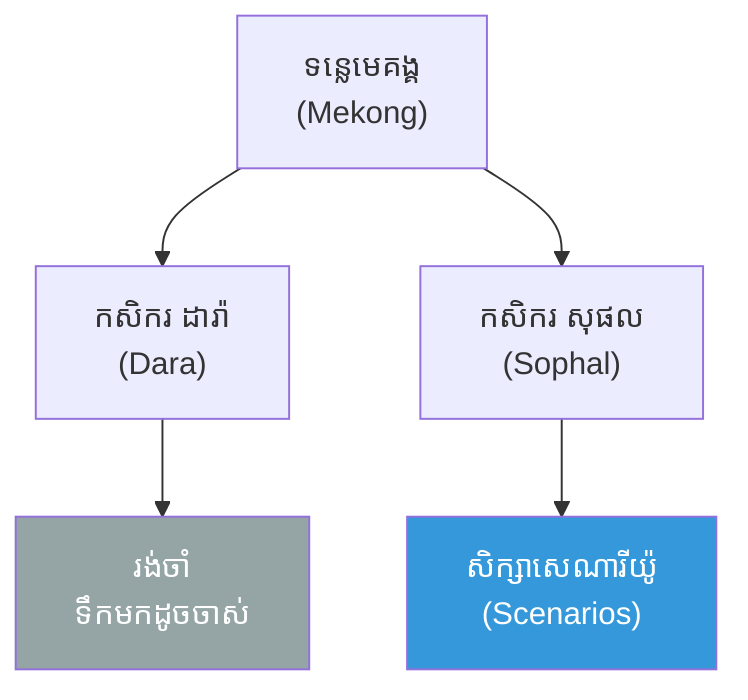
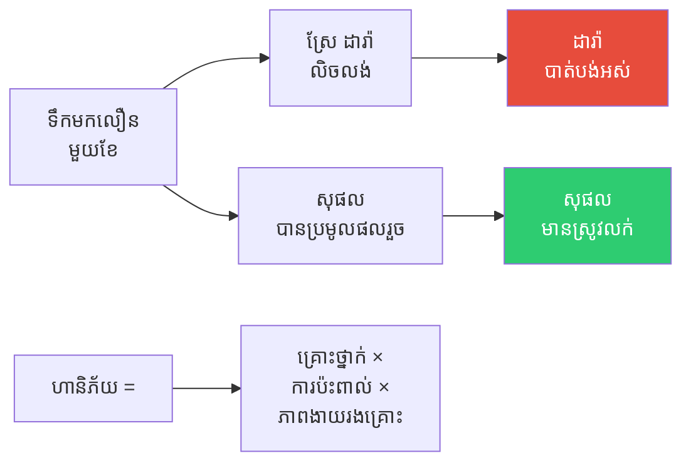
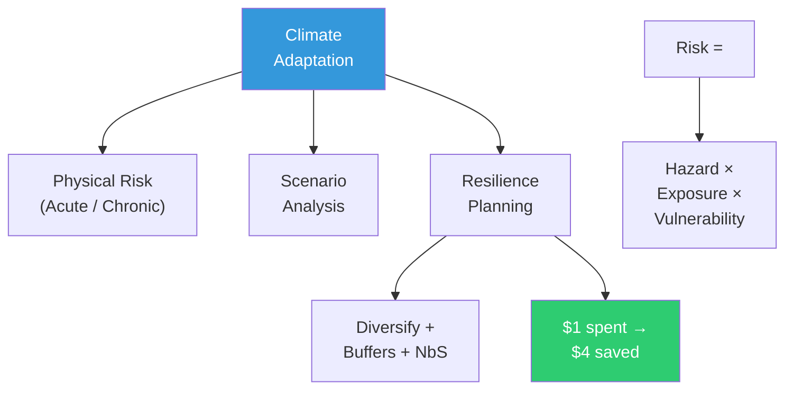

# The Two Farmers and the Rising River and Climate Adaptation (កសិករពីរនាក់ និងទន្លេដែលឡើងខ្ពស់ និងការសម្របខ្លួននឹងអាកាសធាតុ)

**Author:** ichamrong  
**Date:** 2026-06-01  
**Tags:** #climate-adaptation #resilience #physical-risk #scenario-analysis #vulnerability  
**Category:** Concepts / Parables  
**Read Time:** ~6 min  

---

## 📌 មាតិកា (Table of Contents)
- [កសិករពីរនាក់នៅទន្លេមេគង្គ (Two Farmers on the Mekong)](#កសិករពីរនាក់នៅទន្លេមេគង្គ-two-farmers-on-the-mekong)
- [ឆ្នាំដែលទឹកមកលឿន (The Year the Water Came Early)](#ឆ្នាំដែលទឹកមកលឿន-the-year-the-water-came-early)
- [ការវិនិយោគមួយ​ដុល្លារ (The One-Dollar Investment)](#ការវិនិយោគមួយដុល្លារ-the-one-dollar-investment)
- [ការវិភាគទ្រឹស្តី៖ Climate Adaptation (Theoretical Breakdown)](#ការវិភាគទ្រឹស្តី-climate-adaptation-theoretical-breakdown)
- [Related Posts](#related-posts)

---

## កសិករពីរនាក់នៅទន្លេមេគង្គ (Two Farmers on the Mekong)

នៅ​មាត់​ទន្លេ​មេគង្គ (Mekong) មាន​កសិករ​ពីរ​នាក់។ កសិករ **ដារ៉ា (Dara)** ដាំ​ស្រូវ​ដូច​ដែល​ជីដូន​ជីតា​បាន​ដាំ — ដោយ​ជឿ​ថា ៖ **"ទឹក (Water) មក​ពេល​ណា ត្រឡប់​ពេល​ណា — យើង​ដឹង​ច្បាស់​ហើយ។"** គាត់​មិន​ដែល​គិត​ថា អាកាស​ធាតុ​នឹង​ផ្លាស់​ប្ដូរ​ឡើយ។

កសិករ **សុផល (Sophal)** ឯ​ណោះ​វិញ បាន​សង្កេត​ឃើញ​ថា ៖ ភ្លៀង (Rain) ធ្លាក់​មិន​ទៀង​ទាត់​ទៀត​ហើយ; ខ្លះ​ឆ្នាំ​រាំង​ស្ងួត (Drought), ខ្លះ​ឆ្នាំ​ទឹក​ជំនន់ (Flood) ខ្លាំង។ គាត់​សួរ​ខ្លួន​ឯង ៖ **" បើ​ឆ្នាំ​ក្រោយ​ទឹក​មក​លឿន​ជាង​មុន​មួយ​ខែ​នោះ​ដូច​ម្ដេច?"**

---

## ឆ្នាំដែលទឹកមកលឿន (The Year the Water Came Early)

ឆ្នាំ​នោះ ទឹក​ទន្លេ​មក​ **លឿន​ជាង​មុន​មួយ​ខែ (A Month Early)** — ដែល​ជា​អ្វី​ដែល​មិន​ដែល​កើត​ឡើង​ពី​មុន។

កសិករ **ដារ៉ា** ដែល​នៅ​រង់​ចាំ​ដាំ​តាម​ប្រតិទិន​ចាស់ ត្រូវ​ទឹក​ជំនន់ **លិច​លង់ (Submerged)** ស្រែ​ស្រូវ​ទាំង​មូល មុន​ពេល​ប្រមូល​ផល។ គាត់​បាត់​បង់​អស់ (Lost Everything)។

ប៉ុន្តែ កសិករ **សុផល** បាន **រៀប​ចំ​ទុក​ជា​មុន (Prepared)** ៖ គាត់​ប្ដូរ​ទៅ​ប្រើ​ពូជ​ស្រូវ​ដែល​លូត​លាស់​លឿន (Short-Season Rice), លើក​ភ្លឺ​ស្រែ​ឱ្យ​ខ្ពស់ (Raised Dykes), និង​ដាំ​ឱ្យ​បាន​មុន​ពេល។ ពេល​ទឹក​មក​លឿន គាត់ **បាន​ប្រមូល​ផល​រួច​ហើយ**។ លើស​ពី​នេះ គាត់​មិន​ដាំ​តែ​ស្រូវ​ទេ — គាត់​ចិញ្ចឹម​ត្រី និង​ដាំ​បន្លែ​ផង​ដែរ (Diversified), ដូច្នេះ​បើ​ដំណាំ​មួយ​ខូច គាត់​នៅ​មាន​ប្រភព​ផ្សេង​ទៀត។

---

## ការវិនិយោគមួយ​ដុល្លារ (The One-Dollar Investment)

កសិករ **ដារ៉ា** ធ្លាប់​សើច​ចំអក​ឱ្យ **សុផល** ៖ **"ហេតុ​អ្វី​ចំណាយ​ប្រាក់​លើ​ភ្លឺ​ខ្ពស់ និង​ពូជ​ស្រូវ​ថ្មី? ឥត​ប្រយោជន៍!"**

ប៉ុន្តែ ក្រោយ​ទឹក​ជំនន់ ដារ៉ា ​បាន​ឃើញ​ការ​ពិត ៖ រាល់ **១ ដុល្លារ** ដែល សុផល បាន​ចំណាយ​លើ​ការ​សម្រប​ខ្លួន (Adaptation) — បាន​ជួយ​គាត់​សន្សំ​ការ​ខាត​បង់ **៤ ដុល្លារ ឬ​ច្រើន​ជាង​នេះ (4x or More)**។ ការ​សម្រប​ខ្លួន​មិន​មែន​ជា​ការ​ចំណាយ (Cost) ទេ — វា​ជា **ការ​វិនិយោគ (Investment)**។

មិន​មែន​សុផល​ដឹង​ច្បាស់​ថា ​អនាគត​នឹង​យ៉ាង​ណា​ទេ — តែ​គាត់​បាន​រៀប​ចំ​ឱ្យ​ខ្លួន **ធន់ (Resilient)** ចំពោះ​អនាគត​ច្រើន​បែប (Many Futures)។ **ភាព​ធន់ ឈ្នះ​លើ​ការ​ប្រតិកម្ម (Resilience Over Reaction)។**

---

## ការវិភាគទ្រឹស្តី៖ Climate Adaptation (Theoretical Breakdown)

**ការ​សម្រប​ខ្លួន​នឹង​អាកាស​ធាតុ (Climate Adaptation)** គឺ​ជា​ការ​រៀប​ចំ (Preparing) សម្រាប់​ផល​ប៉ះ​ពាល់​អាកាស​ធាតុ​ដែល​**ជៀស​មិន​រួច (Unavoidable)** — ផ្ទុយ​ពី​ការ​កាត់​បន្ថយ (Mitigation) ដែល​ព្យាយាម​បញ្ឈប់​បញ្ហា។

### ១. ហានិភ័យរូបវន្ត (Physical Risk — Acute vs. Chronic)
ហានិភ័យ "ស្រួច​ស្រាវ" (Acute ៖ ទឹក​ជំនន់, ព្យុះ — ភ្លាមៗ) និង "រ៉ាំ​រ៉ៃ" (Chronic ៖ កម្ពស់​ទឹក​សមុទ្រ​កើន, សីតុណ្ហ​ភាព​ប្រែ​ប្រួល — យឺតៗ)។ ទឹក​ដែល​មក​លឿន​របស់ ដារ៉ា គឺ​ជា​ហានិភ័យ​រូបវន្ត។

### ២. ហានិភ័យ = គ្រោះថ្នាក់ × ការប៉ះពាល់ × ភាពងាយរងគ្រោះ
**Risk = Hazard × Exposure × Vulnerability**។ សុផល មិន​អាច​ផ្លាស់​ប្ដូរ​គ្រោះ​ថ្នាក់ (ទឹក​ជំនន់) បាន​ទេ — ប៉ុន្តែ​គាត់​បាន​កាត់​បន្ថយ​ភាព​ងាយ​រង​គ្រោះ (Vulnerability) ដោយ​លើក​ភ្លឺ និង​ប្ដូរ​ពូជ។

### ៣. ការវិភាគសេណារីយ៉ូ (Scenario Analysis)
ជំនួស​ឱ្យ​ការ​ទាយ​អនាគត​តែ​មួយ, គេ​រៀប​ចំ​ផែន​ការ​សម្រាប់​អនាគត​ច្រើន​បែប — "ការ​សម្រេច​ចិត្ត​រឹង​មាំ" (Robust Decision-Making) ដែល​ដំណើរ​ការ​ល្អ​លើ​សេណារីយ៉ូ​ច្រើន។

### ៤. ករណីសម្រាប់ភាពធន់ (The Business Case for Resilience)
រាល់ **១ ដុល្លារ** ដែល​ចំណាយ​លើ​ការ​សម្រប​ខ្លួន អាច​សន្សំ **៤ ដុល្លារ​ឬ​ច្រើន​ជាង** ក្នុង​ការ​ខាត​បង់​ដែល​ជៀស​វាង — ភាព​ធន់​ជា​ការ​វិនិយោគ មិន​មែន​ការ​ចំណាយ។ ការ​ធ្វើ​ពិពិធកម្ម (Diversification) និង​ដំណោះ​ស្រាយ​ផ្អែក​លើ​ធម្មជាតិ​ជួយ​បង្កើន​ភាព​ធន់។

**សេចក្ដីសន្និដ្ឋាន៖** កសិករ ដារ៉ា រង់​ចាំ​អតីត​កាល​ត្រឡប់​មក​វិញ ហើយ​បាត់​បង់​អស់។ កសិករ សុផល រៀប​ចំ​សម្រាប់​អនាគត​ដែល​ប្រែ​ប្រួល ហើយ​រស់​រាន។ **"ផល​ប៉ះ​ពាល់​អាកាស​ធាតុ​បាន​មក​ដល់​ហើយ (Already Here) — អ្នក​ដែល​រៀប​ចំ​នឹង​រស់​រាន; អ្នក​ដែល​រង់​ចាំ​នឹង​បាត់​បង់។"**

---

## Related Posts

- **[Climate Adaptation and Resilience](../07-climate-adaptation-and-resilience.md)** — Physical Risk, Scenario Analysis, Vulnerability Assessment, Resilience Planning, The Business Case for Resilience

---

*Last updated: 2026-06-01*
