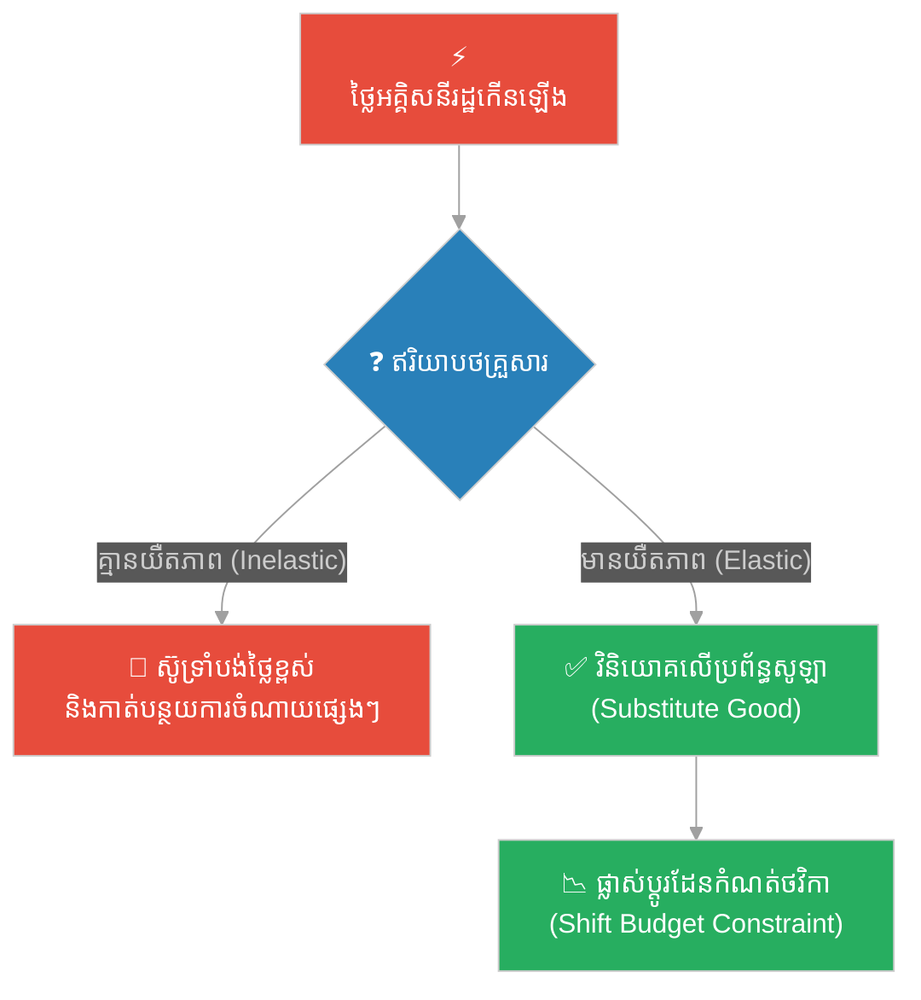
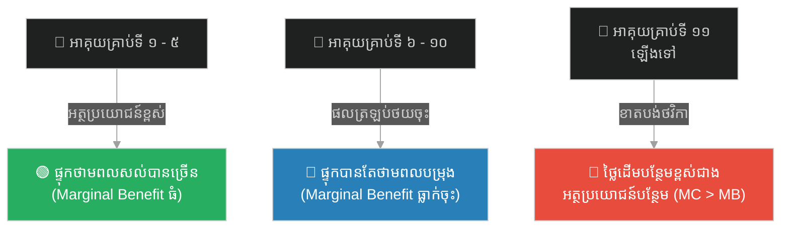
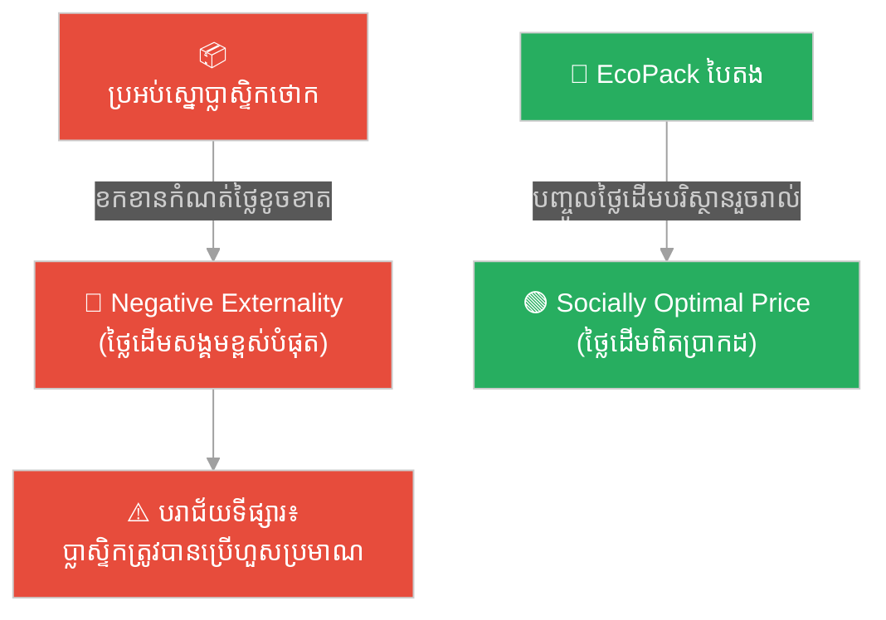
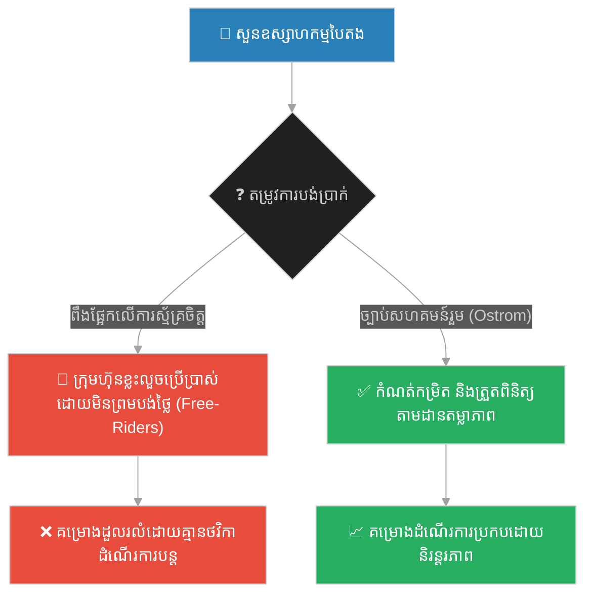
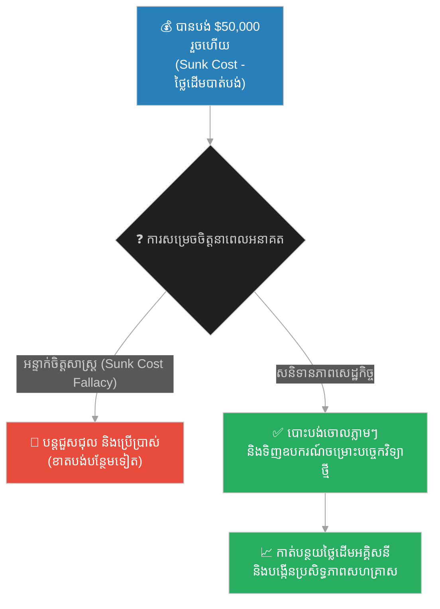

# ២៦០ — ករណីសិក្សា ៥ កម្រិត៖ គោលការណ៍សេដ្ឋកិច្ចមីក្រូ (Principles of Microeconomics ELI5 Cases)

**Author:** ichamrong  
**Date:** 2026-05-30  
**Tags:** #eli5 #microeconomics #elasticity #externalities #opportunity-cost #sunk-cost #business-sustainability  
**Category:** Business Sustainability  
**Read Time:** ~12 min  

---

## 📌 មាតិកា (Table of Contents)
- [សេចក្តីផ្តើម (Introduction)](#0)
- [១. ករណីសិក្សា ៥ កម្រិត (5-Level Practical Cases)](#1)
  - [កម្រិតទី ១ (បុគ្គល/គ្រួសារ)៖ ការសម្រេចចិត្តទិញផ្ទាំងសូឡា (Price Elasticity & Budget Constraint)](#1-1)
  - [កម្រិតទី ២ (បច្ចេកទេស/វិស្វកម្ម)៖ ការបន្ថែមអាគុយផ្ទុកថាមពល (Marginal Analysis & Diminishing Returns)](#1-2)
  - [កម្រិតទី ៣ (ធុរកិច្ច/Startup)៖ ការវេចខ្ចប់បៃតងប្រកួតប្រជែងជាមួយប្លាស្ទិក (Negative Externalities)](#1-3)
  - [កម្រិតទី ៤ (សហគមន៍/គ្រប់គ្រង)៖ គម្រោងកែច្នៃសម្រាមរួមគ្នានៃសួនឧស្សាហកម្ម (Public Goods & Free-Rider)](#1-4)
  - [កម្រិតទី ៥ (ទំនាក់ទំនង/ចិត្តសាស្ត្រ)៖ អន្ទាក់ថ្លៃដើមដែលបាត់បង់ក្នុងការវិនិយោគបៃតង (Sunk Cost Fallacy)](#1-5)
- [២. សំនួរដេញដោលបែបសូក្រាត (Socratic Discussion)](#2)
- [🔗 ឯកសារយោង និងតំណភ្ជាប់ (References & Course Links)](#3)

---

## សេចក្តីផ្តើម (Introduction)

**គោលការណ៍សេដ្ឋកិច្ចមីក្រូ (Principles of Microeconomics)** មិនមែនគ្រាន់តែជាក្រាហ្វិកទ្រឹស្តីផ្គត់ផ្គង់ និងតម្រូវការនៅលើក្តារខៀនឡើយ។ វាគឺជាកញ្ចក់វិភាគដែលជួយយើងមើលឃើញពីរបៀបដែលបុគ្គល វិស្វករ សហគ្រិន អ្នកគ្រប់គ្រង និងដៃគូសហការ ធ្វើការសម្រេចចិត្តបែងចែកធនធានដែលមានកំណត់។ ករណីសិក្សា ៥ កម្រិត (ELI5) នេះ នឹងបកស្រាយពីរបៀបដែលទ្រឹស្តីសេដ្ឋកិច្ចមីក្រូត្រូវបានអនុវត្តជាក់ស្តែងពីកម្រិតគ្រួសាររហូតដល់ចិត្តសាស្ត្រទំនាក់ទំនង។

---

## ១. ករណីសិក្សា ៥ កម្រិត (5-Level Practical Cases)

### 🟢 កម្រិតទី ១ (បុគ្គល/គ្រួសារ)៖ ការសម្រេចចិត្តទិញផ្ទាំងសូឡា (Price Elasticity & Budget Constraint)

* **ទស្សនទានមីក្រូសេដ្ឋកិច្ច៖** ភាពយឺតនៃតម្រូវការធៀបនឹងថ្លៃ (Price Elasticity of Demand) និងដែនកំណត់ថវិកា (Budget Constraint)។
* **សេណារីយ៉ូ៖** គ្រួសាររបស់លោក **សុខា (Sokha)** នៅខេត្តបាត់ដំបង កំពុងប្រឈមមុខនឹងការកើនឡើងនៃថ្លៃអគ្គិសនីរដ្ឋ។ តម្រូវការប្រើប្រាស់ម៉ាស៊ីនត្រជាក់របស់ពួកគេមានភាពរសើបខ្លាំងចំពោះតម្លៃ (Elastic Demand)។ សុខា សម្រេចចិត្តវិភាគលើការបែងចែកថវិកាប្រចាំខែ ដើម្បីទិញប្រព័ន្ធផ្ទាំងសូឡាលើដំបូលផ្ទះ ដែលជាទំនិញជំនួស (Substitute Good) ដ៏ល្អបំផុត។

* **ការវិភាគ៖** ការសម្រេចចិត្តទិញផ្ទាំងសូឡា ជួយឱ្យគ្រួសារ សុខា ផ្លាស់ប្តូរខ្សែកោងដែនកំណត់ថវិកា (Budget Line) រយៈពេលវែង ដោយកាត់បន្ថយថ្លៃដើមអថេរប្រចាំខែ និងការបារម្ភពីការប្រែប្រួលតម្លៃអគ្គិសនីរដ្ឋ។

---

### 🟢 កម្រិតទី ២ (បច្ចេកទេស/វិស្វកម្ម)៖ ការបន្ថែមអាគុយផ្ទុកថាមពល (Marginal Analysis & Diminishing Returns)

* **ទស្សនទានមីក្រូសេដ្ឋកិច្ច៖** ការវិភាគបន្ថែម (Marginal Analysis) និងច្បាប់នៃការថយចុះផលត្រឡប់បន្ថែម (Law of Diminishing Marginal Returns)។
* **សេណារីយ៉ូ៖** ក្រុមវិស្វករផ្នែកថាមពលបៃតង កំពុងរៀបចំប្រព័ន្ធសូឡាខ្នាតធំសម្រាប់រោងចក្រមួយ។ ពួកគេត្រូវការសម្រេចចិត្តថាតើត្រូវបន្ថែម «អាគុយផ្ទុកថាមពលលីចូម (Lithium Storage Batteries)» ចំនួនប៉ុន្មានគ្រាប់ ដើម្បីផ្ទុកថាមពលសល់នៅពេលថ្ងៃ។

* **ការវិភាគ៖** វិស្វករមិនត្រូវសម្រេចចិត្តដោយគ្រាន់តែប្រើប្រាស់ «តម្លៃមធ្យម» ឡើយ។ ពួកគេត្រូវអនុវត្តច្បាប់សម្រេចចិត្ត៖ **ថ្លៃដើមបន្ថែម (Marginal Cost) ត្រូវស្មើនឹង អត្ថប្រយោជន៍បន្ថែម (Marginal Benefit)**។ ការបន្ថែមអាគុយហួសកម្រិត នឹងធ្វើឱ្យ $MC > MB$ ដោយសារតែថាមពលដែលបានផ្ទុកលែងមានតម្រូវការប្រើប្រាស់ទៀតហើយ។

---

### 🟢 កម្រិតទី ៣ (ធុរកិច្ច/Startup)៖ ការវេចខ្ចប់បៃតងប្រកួតប្រជែងជាមួយប្លាស្ទិក (Negative Externalities)

* **ទស្សនទានមីក្រូសេដ្ឋកិច្ច៖** ផលជះក្រៅអវិជ្ជមាន (Negative Externalities) និងបរាជ័យទីផ្សារ (Market Failure)។
* **សេណារីយ៉ូ៖** ក្រុមហ៊ុន Startup មួយឈ្មោះថា **EcoPack** ផលិតប្រអប់វេចខ្ចប់អាហារពីស្រកានាគ និងកាកអំពៅ។ ពួកគេត្រូវប្រកួតប្រជែងជាមួយប្រអប់ស្នោប្លាស្ទិកធម្មតា ដែលមានតម្លៃថោកជាងឆ្ងាយនៅលើទីផ្សារសេរី។

* **ការវិភាគ៖** ទីផ្សារសេរីបរាជ័យក្នុងការកំណត់តម្លៃប្រអប់ស្នោប្លាស្ទិក ពីព្រោះអ្នកផលិតប្លាស្ទិកមិនបានបង់ថ្លៃដើមសម្អាតបរិស្ថាន ឬការខូចខាតសុខភាពសង្គមឡើយ (Negative Externality)។ EcoPack ប្រើប្រាស់គំរូសេដ្ឋកិច្ចនេះ ដើម្បីបញ្ចុះបញ្ចូលរដ្ឋាភិបាលឱ្យដាក់ពន្ធ Pigouvian Tax លើប្លាស្ទិក ដើម្បីបង្កើតឱ្យមានការប្រកួតប្រជែងប្រកបដោយសមធម៌។

---

### 🟢 កម្រិតទី ៤ (សហគមន៍/គ្រប់គ្រង)៖ គម្រោងកែច្នៃសម្រាមរួមគ្នានៃសួនឧស្សាហកម្ម (Public Goods & Free-Rider)

* **ទស្សនទានមីក្រូសេដ្ឋកិច្ច៖** ទំនិញសាធារណៈ (Public Goods) និងបញ្ហាអ្នកជិះឥតគិតថ្លៃ (Free-Rider Problem)។
* **សេណារីយ៉ូ៖** ប្រធានគ្រប់គ្រងសួនឧស្សាហកម្មមួយ បានស្នើឡើងនូវ «ប្រព័ន្ធចម្រោះទឹកកខ្វក់ និងកែច្នៃកាកសំណល់រួម (Common Treatment Facility)» ដែលក្រុមហ៊ុនទាំងអស់នៅក្នុងសួនអាចប្រើប្រាស់ និងទទួលបានខ្យល់/បរិស្ថានស្អាតជាមួយគ្នា។

* **ការវិភាគ៖** បរិស្ថានស្អាត និងការគ្រប់គ្រងទឹកកខ្វក់មានលក្ខណៈជា «ទំនិញសាធារណៈ» ដែលគ្មាននរណាម្នាក់អាចត្រូវបានផាត់ចេញពីការប្រើប្រាស់បានឡើយ។ ប្រសិនបើពឹងលើការស្ម័គ្រចិត្ត ក្រុមហ៊ុនខ្លះនឹងធ្វើជា Free-Rider។ អ្នកគ្រប់គ្រងត្រូវរៀបចំច្បាប់កំណត់កម្រិត និងការផាកពិន័យច្បាស់លាស់ ដើម្បីការពារការដួលរលំនៃប្រព័ន្ធអេកូឡូស៊ីរួម។

---

### 🟢 កម្រិតទី ៥ (ទំនាក់ទំនង/ចិត្តសាស្ត្រ)៖ អន្ទាក់ថ្លៃដើមដែលបាត់បង់ក្នុងការវិនិយោគបៃតង (Sunk Cost Fallacy)

* **ទស្សនទានមីក្រូសេដ្ឋកិច្ច៖** ថ្លៃដើមឱកាស (Opportunity Cost) និងអន្ទាក់ថ្លៃដើមដែលបាត់បង់ (Sunk Cost Fallacy)។
* **សេណារីយ៉ូ៖** ស្ថាបនិកពីរនាក់នៃរីសតអេកូឡូស៊ី បានចំណាយថវិកាចំនួន **$៥០,០០០** រួចជាស្រេចទៅលើ «បច្ចេកវិទ្យាចម្រោះទឹកកខ្វក់ចាស់មួយ» ដែលឧស្សាហ៍ខូច និងស៊ីភ្លើងខ្លាំង។ ពួកគេស្ទាក់ស្ទើរក្នុងការបោះបង់វាចោល ដោយសារតែសោកស្តាយលុយដែលបានចំណាយរួច។

* **ការវិភាគ៖** លុយ $៥០,០០០ គឺជា **Sunk Cost (ថ្លៃដើមដែលបានបាត់បង់)** ដែលមិនអាចយកមកវិញបានឡើយ ទោះបីជាពួកគេធ្វើការសម្រេចចិត្តបែបណាក៏ដោយ។ សនិទានភាពសេដ្ឋកិច្ចមីក្រូតម្រូវឱ្យពួកគេបំភ្លេចលុយនោះចោល ហើយប្រៀបធៀបតែ **ថ្លៃដើមបន្ថែម និងថ្លៃដើមឱកាស** នាពេលអនាគតប៉ុណ្ណោះ។ ការបន្តប្រើប្រាស់ឧបករណ៍ខូច គឺជាការខាតបង់ធនធានបន្ថែមទៀត។

---

## ២. សំនួរដេញដោលបែបសូក្រាត (Socratic Discussion)

**សំណួរទី ១៖** ប្រសិនបើពន្ធកាបូន (Carbon Tax) ធ្វើឱ្យក្រុមហ៊ុនផលិតដែកថែបមានថ្លៃដើមផលិតកម្មកើនឡើង តើអ្នកគិតថាអ្នកណាជាអ្នកបង់ពន្ធនោះជាក់ស្តែង?

**ចម្លើយដេញដោល៖** នេះអាស្រ័យលើ **យឺតភាព (Elasticity)** នៃតម្រូវការទីផ្សារ។ ប្រសិនបើអ្នកប្រើប្រាស់មិនអាចរកទំនិញជំនួសដែកថែបបានទេ (តម្រូវការគ្មានយឺតភាព - Inelastic Demand) នោះក្រុមហ៊ុននឹងផ្ទេរបន្ទុកពន្ធស្ទើរតែទាំងអស់ទៅឱ្យអ្នកទិញតាមរយៈការតម្លើងថ្លៃ។ ប៉ុន្តែប្រសិនបើអ្នកប្រើប្រាស់អាចប្តូរទៅប្រើឈើ ឬសម្ភារៈផ្សេងទៀតបានយ៉ាងងាយ (តម្រូវការមានយឺតភាព - Elastic Demand) នោះក្រុមហ៊ុនផលិតដែកថែបត្រូវតែស៊ូទ្រាំនឹងការបង់ពន្ធភាគច្រើនដោយខ្លួនឯង ដើម្បីការពារការបាត់បង់អតិថិជន។

**សំណួរទី ២៖** ហេតុអ្វីបានជាអាជីវកម្មស្ម័គ្រចិត្តមិនសូវចង់វិនិយោគលើការស្រាវជ្រាវ និងការអភិវឌ្ឍន៍ (R&D) លើបច្ចេកវិទ្យាបៃតង ប្រសិនបើគ្មានការគាំទ្រពីរដ្ឋ?

**ចម្លើយដេញដោល៖** ដោយសារតែ R&D បង្កើតនូវ **ផលជះវិជ្ជមានក្រៅប្រព័ន្ធ (Positive Externality)**។ នៅពេលដែលក្រុមហ៊ុនមួយរកឃើញបច្ចេកវិទ្យាថ្មី ក្រុមហ៊ុនដទៃទៀតអាចលួចចម្លង និងរៀនសូត្រតាមដោយឥតគិតថ្លៃ (Free-Riding)។ ក្រុមហ៊ុនដែលខំវិនិយោគមិនអាចទទួលបានអត្ថប្រយោជន៍ពេញលេញពី R&D របស់ខ្លួនឡើយ ធ្វើឱ្យទីផ្សារសេរីខ្វះខាតការផ្តល់ R&D បៃតងជាប្រព័ន្ធ។ នេះជាមូលហេតុដែលរដ្ឋត្រូវតែផ្តល់ឧបត្ថម្ភធន ឬផ្តល់សិទ្ធិប៉ាតង់ការពារ។

---

## 🔗 ឯកសារយោង និងតំណភ្ជាប់ (References & Course Links)

* **មុខវិជ្ជាសិក្សាទាក់ទងនៅ Denison University៖**
  - [Principles of Microeconomics (01 — principles-of-microeconomics.md)](../01-principles-of-microeconomics.md) — គ្រឹះទ្រឹស្តីផ្គត់ផ្គង់ តម្រូវការ យឺតភាព និងបរាជ័យទីផ្សារ។
  - [Environmental Economics](../../year-4/02-environmental-economics.md) — យន្តការដោះស្រាយផលជះក្រៅអវិជ្ជមានតាមសេដ្ឋកិច្ចកម្រិតខ្ពស់។

* **រឿងប្រៀបធៀបទាក់ទង៖**
  - [កសិករដែលដំឡើងថ្លៃស្រូវ (The Farmer Who Raised the Price)](../parables/260-the-farmer-who-raised-the-price.md) — រឿងនិទានប្រៀបធៀបបង្ហាញពីផលប៉ះពាល់ជាក់ស្តែងនៃសញ្ញាតម្លៃ និងផលជះក្រៅនៃការបំពុលទន្លេ។
