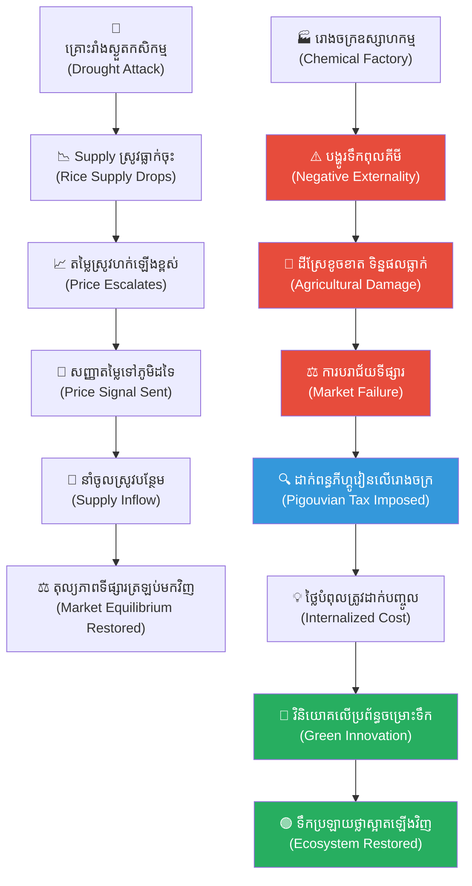

# ២៦០ — កសិករដែលដំឡើងថ្លៃស្រូវ (The Farmer Who Raised the Price)៖ អន្ទាក់នៃតម្លៃទីផ្សារ និងតម្លៃបរិស្ថានពិត

**Author:** ichamrong  
**Date:** 2026-05-27  
**Tags:** #microeconomics #externalities #parables #business-sustainability #cambodian-context  
**Category:** Business Sustainability  
**Read Time:** ~12 min  

---

## 📌 មាតិកា (Table of Contents)
- [វិបត្តិធុរកិច្ច និងអន្ទាក់ទីផ្សារ (The Business Dilemma & Market Trap)](#វិបត្តិធុរកិច្ច-និងអន្ទាក់ទីផ្សារ-the-business-dilemma-market-trap)
- [១. រឿងនិទានប្រៀបធៀប៖ សុខា និងវាលស្រែខេត្តកំពង់ចាម (The Parable: Sokha and the Kampong Cham Rice Fields)](#1)
  - [គ្រោះរាំងស្ងួត និងការដំឡើងថ្លៃស្រូវ (The Drought and the Price Hike)](#1-1)
  - [ស្រមោលអន្ធការពីឧស្សាហកម្ម៖ ទឹកបំពុលលើវាលស្រែ (The Shadow of Industry: Upstream Pollution)](#1-2)
- [២. ការវិភាគគំនិតសេដ្ឋកិច្ច និងធុរកិច្ច (Theoretical & Economic Analysis)](#2)
  - [ក. យន្តការសញ្ញាតម្លៃ និងសេរីភាពទីផ្សារ (Price Signals & Market Mechanisms)](#2-1)
  - [ខ. ផលប៉ះពាល់ខាងក្រៅអវិជ្ជមាន និងការបរាជ័យទីផ្សារ (Negative Externalities & Market Failure)](#2-2)
  - [គ. ពន្ធភីហ្គូវៀន៖ ការបញ្ចូលតម្លៃពិតទៅក្នុងទីផ្សារ (Pigouvian Tax & Internalizing Externalities)](#2-3)
- [៣. គំនូសតាងលំហូរការងារប្រព័ន្ធទីផ្សារ និងបរិស្ថាន (System Flow Diagram)](#3)
- [៤. ឧទាហរណ៍ជាក់ស្តែងក្នុងពិភពពិត (Real World Examples)](#4)
  - [ឧទាហរណ៍ទី ១ — បរិបទក្នុងស្រុក៖ បញ្ហាទឹកស្ទឹងសែន និងការប្រើប្រាស់ថ្នាំគីមីកសិកម្មនៅកម្ពុជា (Local Context: Agricultural Runoff and Water Pollution in Cambodia)](#4-1)
  - [ឧទាហរណ៍ទី ២ — បរិបទសកល៖ ពន្ធកាបូននៅសហភាពអឺរ៉ុប និងយន្តការកែសម្រួលព្រំដែនកាបូន (Global Context: EU Carbon Tax & CBAM)](#4-2)
- [៥. ដំណោះស្រាយយុទ្ធសាស្ត្រ និងមេរៀនសម្រាប់អ្នកគ្រប់គ្រង (Strategic Solutions & Takeaways for Managers)](#5)
- [សេចក្តីសន្និដ្ឋាន (Conclusion)](#conclusion)
- [Related Posts / Course Link](#related-posts--course-link)

---

## វិបត្តិធុរកិច្ច និងអន្ទាក់ទីផ្សារ (The Business Dilemma & Market Trap)

នៅក្នុងប្រព័ន្ធសេដ្ឋកិច្ចទីផ្សារសេរី តម្លៃ (price) ត្រូវបានចាត់ទុកថាជាប្រភពនៃការពិតដ៏មានឥទ្ធិពលបំផុត ដែលជួយសម្របសម្រួលរវាងការផ្គត់ផ្គង់ (supply) និងតម្រូវការ (demand) ដោយស្វ័យប្រវត្ត។ នៅពេលទំនិញមានការខ្វះខាត តម្លៃនឹងហក់ឡើងខ្ពស់ ដើម្បីផ្ញើសញ្ញាទៅកាន់អ្នកផលិតឱ្យបង្កើនការផលិត និងប្រាប់ទៅកាន់អ្នកប្រើប្រាស់ឱ្យសន្សំសំចៃ។ ប៉ុន្តែ តើតម្លៃទីផ្សារទាំងនោះពិតជាបាននិយាយការពិតគ្រប់ជ្រុងជ្រោយដែរឬទេ?

បញ្ហាប្រឈមដ៏ធំធេងនៅក្នុងធុរកិច្ចប្រកបដោយនិរន្តរភាព (business sustainability) គឺនៅពេលដែលតម្លៃទីផ្សារមិនបានរួមបញ្ចូលនូវ «ថ្លៃដើមពិតប្រាកដ» នៃផលប៉ះពាល់បរិស្ថាន និងសង្គម។ នៅពេលដែលរោងចក្រ ឬសហគ្រាសផលិតទំនិញដោយបង្កើតប្រាក់ចំណេញបានយ៉ាងច្រើន ប៉ុន្តែបែរជាទម្លាក់កាកសំណល់ពុលចូលទៅក្នុងធម្មជាតិ ពួកគេកំពុងបង្កើត «ផលប៉ះពាល់ខាងក្រៅអវិជ្ជមាន» (negative externalities) ដែលសហគមន៍ជុំវិញជាអ្នករងគ្រោះ និងបង់ថ្លៃជំនួស។ 

សោកនាដកម្មនេះកើតឡើងដោយសារតម្លៃទីផ្សារ «កុហក» ពួកយើង។ តម្លៃសៀវភៅ ឬអាហារមួយកញ្ចប់អាចនឹងថោកនៅលើធ្នើរលក់ទំនិញ ប៉ុន្តែវាអាចមានតម្លៃថ្លៃដើមបរិស្ថានដ៏មហាសាល បើសិនជាដំណើរការផលិតរបស់វាបានបំផ្លាញប្រភពទឹក និងព្រៃឈើដែលជាអាយុជីវិតរបស់មនុស្សជំនាន់ក្រោយ។ អត្ថបទសិក្សានេះនឹងលាតត្រដាងពីរបៀបដែលយន្តការសញ្ញាតម្លៃដំណើរការ និងមូលហេតុដែលយុទ្ធសាស្ត្ររៀបចំគោលនយោបាយចាំបាច់ត្រូវជួយឱ្យ «តម្លៃនិយាយការពិត» ដើម្បីជៀសវាងការបរាជ័យទីផ្សារ (market failure)។

---

## ១. រឿងនិទានប្រៀបធៀប៖ សុខា និងវាលស្រែខេត្តកំពង់ចាម (The Parable: Sokha and the Kampong Cham Rice Fields)

### គ្រោះរាំងស្ងួត និងការដំឡើងថ្លៃស្រូវ (The Drought and the Price Hike)

នារដូវវស្សាមួយដែលមេឃស្រឡះគ្មានពពកភ្លៀងនៅលើវាលស្រែខេត្តកំពង់ចាម កសិករម្នាក់ឈ្មោះ **សុខា** ឈរមើលដីស្រែដែលប្រេះស្រុតដោយក្តីបារម្ភ។ គ្រោះរាំងស្ងួត (drought) ដ៏ធ្ងន់ធ្ងរបានវាយប្រហារតំបន់នោះទាំងមូល ធ្វើឱ្យទិន្នផលស្រូវរបស់គាត់លូតលាស់បានត្រឹមតែពាក់កណ្តាលប៉ុណ្ណោះបើធៀបនឹងឆ្នាំមុនៗ។ មិនយូរប៉ុន្មាន ទីផ្សារលក់ដូរស្រូវអង្ករនៅក្នុងភូមិចាប់ផ្តើមជួបប្រទះនឹងការខ្វះខាតយ៉ាងខ្លាំង។ ការផ្គត់ផ្គង់ (supply) ស្រូវបានធ្លាក់ចុះយ៉ាងគំហុក ខណៈដែលតម្រូវការ (demand) របស់ប្រជាពលរដ្ឋនៅតែមានកម្រិតខ្ពស់ដដែល។

ដើម្បីទប់ទល់នឹងការខាតបង់ និងដើម្បីបែងចែកស្រូវដែលនៅសល់តិចតួចទៅឱ្យអ្នកដែលត្រូវការវាចាំបាច់បំផុត សុខាបានសម្រេចចិត្តឡើងថ្លៃស្រូវ (raise the price) របស់គាត់។ ភ្លាមៗនោះ រលកនៃកំហឹងបានផ្ទុះឡើងពីសំណាក់អ្នកភូមិ។ ពួកគេបានចោទប្រកាន់ និងជេរប្រមាថសុខាថាជា «អាជីវករឆ្លៀតឱកាស» និងជា «អ្នកកេងប្រវ័ញ្ចលើទុក្ខលំបាករបស់អ្នកដទៃ» (price gouger)។ 

ទោះជាយ៉ាងណាក៏ដោយ តម្លៃស្រូវដ៏ខ្ពស់ដែលសុខាបានកំណត់នោះ បានដើរតួជា **«សញ្ញាតម្លៃ» (price signal)** ដ៏សំខាន់មួយ។ វាបានផ្ញើសារយ៉ាងលឿនទៅកាន់កសិករ និងអាជីវករនៅក្នុងភូមិជិតខាងដែលមិនសូវរងគ្រោះឱ្យដឹងថា៖ *«នៅទីនេះកំពុងខ្វះស្រូវ ហើយតម្លៃស្រូវកំពុងឡើងថ្លៃខ្ពស់!»* ដោយសារតែមានការជម្រុញចិត្តពីផលចំណេញ (incentive) អាជីវករពីភូមិផ្សេងៗបានប្រញាប់ប្រញាល់ដឹកជញ្ជូនស្រូវមកលក់នៅក្នុងភូមិរបស់សុខា។ ត្រឹមតែរយៈពេលពីរបីសប្តាហ៍ប៉ុណ្ណោះ បរិមាណស្រូវនៅក្នុងទីផ្សារក៏កើនឡើងវិញ ធ្វើឱ្យតម្លៃស្រូវធ្លាក់ចុះមកចំណុចសមរម្យ ហើយសន្តិសុខស្បៀងនៅក្នុងតំបន់ក៏ត្រូវបានស្តារឡើងវិញតាមយន្តការទីផ្សារសេរី។

---

### ស្រមោលអន្ធការពីឧស្សាហកម្ម៖ ទឹកបំពុលលើវាលស្រែ (The Shadow of Industry: Upstream Pollution)

ខណៈពេលដែលវិបត្តិស្រូវត្រូវបានដោះស្រាយ វិបត្តិថ្មីមួយទៀតដែលកាន់តែធ្ងន់ធ្ងរបានលេចឡើង។ រោងចក្រផលិតសារធាតុគីមី (chemical factory) ដ៏ធំមួយត្រូវបានសាងសង់ឡើងនៅប៉ែកខាងលើនៃប្រភពទឹក (upstream) នៃស្ទឹងដែលហូរកាត់វាលស្រែរបស់សុខា។ ដើម្បីកាត់បន្ថយថ្លៃដើម និងបង្កើនប្រាក់ចំណេញរបស់ខ្លួន រោងចក្រនោះបានបង្ហូរកាកសំណល់គីមីពុលដោយផ្ទាល់ចូលទៅក្នុងប្រឡាយទឹកកសិកម្ម (irrigation canal) ដែលកសិករទាំងអស់ប្រើប្រាស់សម្រាប់ស្រោចស្រពវាលស្រែ។

មិនយូរប៉ុន្មាន ទឹកប្រឡាយចាប់ផ្តើមប្រែពណ៌ និងមានក្លិនស្អុយឆួល។ ដើមស្រូវរបស់សុខា និងអ្នកភូមិឯទៀតចាប់ផ្តើមក្រៀមស្វិត និងងាប់ជាបន្តបន្ទាប់។ ទិន្នផលកសិកម្មបានធ្លាក់ចុះជាថ្មីម្តងទៀត ហើយប្រាក់ចំណូល (revenue) របស់សុខាក៏ត្រូវបាត់បង់ស្ទើរតែទាំងស្រុង។ ប៉ុន្តែ អ្វីដែលគួរឱ្យអយុត្តិធម៌បំផុតនោះគឺ រោងចក្រគីមីនោះមិនបានបង់ប្រាក់សូម្បីតែមួយរៀលសម្រាប់ការខូចខាតនេះឡើយ។ ពួកគេនៅតែលក់សារធាតុគីមីរបស់ពួកគេបានថោកនៅលើទីផ្សារ និងទទួលបានប្រាក់ចំណេញយ៉ាងក្រាស់ក្រែល ព្រោះពួកគេបានបោះចោល «ថ្លៃដើមនៃការសម្អាតកាកសំណល់» ទៅលើស្មារបស់កសិករស្លូតត្រង់។ ការខូចខាតនេះត្រូវបានហៅថាសេដ្ឋកិច្ចថា **«ផលប៉ះពាល់ខាងក្រៅអវិជ្ជមាន» (negative externality)** ដែលទីផ្សារសេរីធម្មតាមិនបានគិតបញ្ចូលក្នុងបញ្ជីគណនេយ្យឡើយ។

ដោយឃើញស្ថានភាពកាន់តែដុនដាប ថ្នាក់ដឹកនាំភូមិ (village chief) បានកោះប្រជុំជាបន្ទាន់ និងសម្រេចចិត្តចាត់វិធានការដោះស្រាយភាពបរាជ័យនៃទីផ្សារនេះ។ គាត់បានស្នើឱ្យអាជ្ញាធរខេត្តដាក់ពន្ធពិន័យពិសេសមួយហៅថា **«ពន្ធភីហ្គូវៀន» (Pigouvian tax)** លើរោងចក្រគីមីនោះ។ រាល់ការបង្ហូរទឹកពុលមួយលីត្រ រោងចក្រត្រូវបង់ប្រាក់ពន្ធដែលស្មើនឹងទំហំនៃការខូចខាតដែលពួកគេបានបង្កឡើងលើដីស្រែរបស់កសិករ។ យន្តការនេះត្រូវបានធ្វើឡើងដើម្បីបង្ខំឱ្យរោងចក្របញ្ចូលថ្លៃខូចខាតបរិស្ថានទៅក្នុងថ្លៃដើមផលិតកម្មផ្ទាល់ខ្លួន (internalize the externality)។

តំណាងរោងចក្រគីមីបានតវ៉ាយ៉ាងខ្លាំងថា៖ *«ពន្ធនេះអយុត្តិធម៌ណាស់! វានឹងធ្វើឱ្យទំនិញរបស់យើងឡើងថ្លៃ បាត់បង់ភាពប្រកួតប្រជែងលើទីផ្សារ និងអាចឈានទៅដល់ការកាត់បន្ថយបុគ្គលិក ឬបិទទ្វាររោងចក្រ!»* 

ប៉ុន្តែ ថ្នាក់ដឹកនាំភូមិបានឆ្លើយតបវិញយ៉ាងម៉ឺងម៉ាត់ថា៖ *«នៅពេលអ្នកភូមិទិញស្រូវពីសុខា វាគឺជាជម្រើសសេរី (free choice) របស់ពួកគេ។ ប៉ុន្តែ នៅពេលរោងចក្ររបស់អ្នកបង្ហូរទឹកពុលបំផ្លាញដីស្រែរបស់សុខា គាត់គ្មានជម្រើសបដិសេធឡើយ។ ប្រសិនបើតម្លៃទំនិញរបស់អ្នកមិនបានគិតបញ្ចូលការបំផ្លាញបរិស្ថានទេ នោះទំនិញរបស់អ្នកកំពុងកុហកពិភពលោកហើយ។ ពន្ធនេះមិនមែនដើម្បីបំផ្លាញអាជីវកម្មរបស់អ្នកទេ ប៉ុន្តែវាជម្រុញឱ្យអ្នកស្វែងរកបច្ចេកវិទ្យាថ្មីដើម្បីសម្អាតទឹកកខ្វក់ មុននឹងបង្ហូរវាចូលទៅក្នុងប្រព័ន្ធទឹកធម្មជាតិរបស់ពួកយើង។»*

ចុងក្រោយ រោងចក្រគ្មានជម្រើសក្រៅពីដំឡើងប្រព័ន្ធចម្រោះទឹកកខ្វក់ ដើម្បីជៀសវាងការបង់ពន្ធដ៏ខ្ពស់នោះឡើយ។ ទឹកក្នុងប្រឡាយត្រឡប់មកថ្លាស្អាតវិញ ដីស្រែរបស់សុខាក៏បានផលល្អឡើងវិញ ហើយតម្លៃទំនិញគីមីនៅលើទីផ្សារក៏បានឆ្លុះបញ្ចាំងពីតម្លៃពិតប្រាកដដែលរួមបញ្ចូលទាំងតម្លៃការពារបរិស្ថានផងដែរ។

---

## ២. ការវិភាគគំនិតសេដ្ឋកិច្ច និងធុរកិច្ច (Theoretical & Economic Analysis)

រឿងរ៉ាវរបស់កសិករសុខាបានបង្ហាញយ៉ាងច្បាស់នូវទ្រឹស្តីគ្រឹះចំនួនពីរនៃមីក្រូសេដ្ឋកិច្ច (microeconomics)៖ របៀបដែលយន្តការទីផ្សារដោះស្រាយការខ្វះខាតធនធាន និងរបៀបដែលផលប៉ះពាល់ខាងក្រៅបំផ្លាញប្រសិទ្ធភាពទីផ្សារ។

### ក. យន្តការសញ្ញាតម្លៃ និងសេរីភាពទីផ្សារ (Price Signals & Market Mechanisms)

នៅក្នុងទីផ្សារសេរីដែលគ្មានការជ្រៀតជ្រែក តម្លៃ (price) ដើរតួជា **«សញ្ញាព័ត៌មាន» (information signal)** ដ៏សំខាន់៖
1. **សម្រាប់អ្នកប្រើប្រាស់ (Consumers)៖** តម្លៃខ្ពស់ផ្ញើសារឱ្យពួកគេប្រើប្រាស់ដោយការសន្សំសំចៃខ្ពស់ និងស្វែងរកទំនិញជំនួស (substitutes)។
2. **សម្រាប់អ្នកផលិត (Producers)៖** តម្លៃខ្ពស់បង្ហាញពីកាលានុវត្តភាពទទួលបានប្រាក់ចំណេញ ដែលជម្រុញ (incentivize) ឱ្យពួកគេបែងចែកធនធានបន្ថែមមកផលិតទំនិញនោះ។

ការដែលសុខាដំឡើងថ្លៃស្រូវមិនមែនជាការកេងប្រវ័ញ្ចឡើយ ប៉ុន្តែវាជាការឆ្លើយតបទៅនឹងការធ្លាក់ចុះនៃការផ្គត់ផ្គង់ (supply shock)។ ប្រសិនបើអាជ្ញាធរភូមិសម្រេចចិត្តកំណត់តម្លៃស្រូវឱ្យនៅថោកសិប្បនិម្មិត (price ceiling) នោះលទ្ធផលគឺ៖
* គ្មានកសិករពីភូមិផ្សេងនាំស្រូវមកលក់ឡើយ ព្រោះគ្មានការលើកទឹកចិត្តផ្នែកហិរញ្ញវត្ថុ។
* ស្រូវនឹងត្រូវអស់ពីស្តុកភ្លាមៗ បង្កើតឱ្យមានការតម្រង់ជួរ និងទីផ្សារងងឹត (black market)។
* តម្លៃខ្ពស់គឺជាយន្តការសេរី ដែលជួយទាញទីផ្សារឱ្យត្រឡប់ទៅរក **«ចំណុចលំនឹង» (market equilibrium)** វិញយ៉ាងលឿនបំផុត។

---

### ខ. ផលប៉ះពាល់ខាងក្រៅអវិជ្ជមាន និងការបរាជ័យទីផ្សារ (Negative Externalities & Market Failure)

ទោះបីជាទីផ្សារសេរីពូកែដោះស្រាយការខ្វះខាតក៏ដោយ វានឹងជួបការបរាជ័យភ្លាមៗនៅពេលមាន **«ផលប៉ះពាល់ខាងក្រៅ» (externalities)**។ 

> **ផលប៉ះពាល់ខាងក្រៅ (Externality)** គឺជាតម្លៃដើម (cost) ឬអត្ថប្រយោជន៍ (benefit) ដែលកើតឡើងពីសកម្មភាពផលិតកម្ម ឬការប្រើប្រាស់ ហើយធ្លាក់ទៅលើតួអង្គទីបីដែលមិនបានចូលរួមចំណែកក្នុងសកម្មភាពសេដ្ឋកិច្ចនោះឡើយ។

ក្នុងករណីរោងចក្រគីមី៖
* **តម្លៃដើមឯកជន (Private Cost - $C_P$)៖** ថ្លៃវត្ថុធាតុដើម ថ្លៃពលកម្ម និងថ្លៃដំណើរការម៉ាស៊ីនរបស់រោងចក្រ។
* **តម្លៃដើមសង្គម/បរិស្ថាន (Social Cost - $C_S$)៖** $C_P$ បូករួមជាមួយ **តម្លៃដើមខាងក្រៅ (External Cost - $C_E$)** ដែលជាការខូចខាតដីស្រែរបស់សុខា និងការបាត់បង់ជីវចម្រុះក្នុងទឹក។

$$C_S = C_P + C_E$$

ដោយសារទីផ្សារសេរីគណនាតែ $C_P$ រោងចក្រនឹងកំណត់តម្លៃទំនិញទាបពេក និងផលិតក្នុងបរិមាណច្រើនហួសហេតុពេក ដែលនាំឱ្យកើតមាន **«ការបែងចែកធនធានមិនសមស្រប» (allocative inefficiency)** ឬការបាត់បង់ផលប្រយោជន៍សង្គមទាំងស្រុង (deadweight loss)។ នេះគឺជាករណីបុរាណនៃការបរាជ័យទីផ្សារ (market failure)។

---

### គ. ពន្ធភីហ្គូវៀន៖ ការបញ្ចូលតម្លៃពិតទៅក្នុងទីផ្សារ (Pigouvian Tax & Internalizing Externalities)

ដើម្បីកែតម្រូវការបរាជ័យនេះ សេដ្ឋវិទូជនជាតិអង់គ្លេសឈ្មោះ Arthur Pigou បានស្នើឱ្យមានការដាក់ពន្ធរដ្ឋាភិបាលដែលស្មើនឹងទំហំនៃការខូចខាតខាងក្រៅ ($C_E$)។ ពន្ធនេះត្រូវបានហៅថា **«ពន្ធភីហ្គូវៀន» (Pigouvian Tax)**។

គោលបំណងនៃពន្ធនេះគឺដើម្បី៖
1. **Internalize the Externality:** បង្ខំឱ្យរោងចក្រទទួលខុសត្រូវលើតម្លៃដើមពិតប្រាកដដែលពួកគេបានបង្កើត។
2. **Shift Supply Curve:** រុញបន្ទាត់ផ្គត់ផ្គង់ទៅខាងឆ្វេង (កាត់បន្ថយបរិមាណផលិតកម្មទំនិញដែលបង្កការបំពុល និងបង្កើនតម្លៃលក់ឱ្យឆ្លុះបញ្ចាំងពីការពិត)។
3. **Incentivize Green Innovation:** ផ្តល់ជម្រើសឱ្យរោងចក្រ៖ *«បង់ពន្ធ ឬវិនិយោគលើប្រព័ន្ធចម្រោះទឹកស្អាត»*។ ជាទូទៅ ការវិនិយោគលើបច្ចេកវិទ្យាបៃតងមានតម្លៃធូរថ្លៃជាងការបង់ពន្ធរយៈពេលវែង ដែលនេះជាការជំរុញឱ្យមានការអភិវឌ្ឍប្រកបដោយចីរភាព។

---

## ៣. គំនូសតាងលំហូរការងារប្រព័ន្ធទីផ្សារ និងបរិស្ថាន (System Flow Diagram)

គំនូសតាងខាងក្រោមបង្ហាញពីប្រព័ន្ធពីរផ្សេងគ្នា៖ យន្តការទីផ្សារសេរីជោគជ័យ និងការដោះស្រាយផលប៉ះពាល់ខាងក្រៅដោយប្រើពន្ធភីហ្គូវៀន៖

---

## ៤. ឧទាហរណ៍ជាក់ស្តែងក្នុងពិភពពិត (Real World Examples)

### ឧទាហរណ៍ទី ១ — បរិបទក្នុងស្រុក៖ បញ្ហាទឹកស្ទឹងសែន និងការប្រើប្រាស់ថ្នាំគីមីកសិកម្មនៅកម្ពុជា (Local Context: Agricultural Runoff and Water Pollution in Cambodia)

នៅក្នុងប្រទេសកម្ពុជា បញ្ហាផលប៉ះពាល់ខាងក្រៅអវិជ្ជមានលេចឡើងយ៉ាងច្បាស់នៅក្នុងតំបន់អាងស្ទឹងសែន និងវាលទំនាបជុំវិញបឹងទន្លេសាប។ កសិករខ្នាតតូច និងមធ្យមជាច្រើនបានបង្កើនការប្រើប្រាស់ថ្នាំសម្លាប់សត្វល្អិត និងជីគីមីសិប្បនិម្មិតយ៉ាងគំហុក ដើម្បីជម្រុញទិន្នផលស្រូវឱ្យបានលឿន និងទាន់តម្រូវការទីផ្សារ។

* **ផលប៉ះពាល់ខាងក្រៅ (Externality)៖** សារធាតុគីមីដែលសេសសល់ពីដីស្រែបានហូរចូលទៅក្នុងស្ទឹងសែន និងបឹងទន្លេសាប ដែលជាប្រភពទឹកស្អាត និងជាជម្រកត្រីធម្មជាតិដ៏ធំបំផុតរបស់ប្រទេស។ លទ្ធផលគឺ បរិមាណត្រីធម្មជាតិធ្លាក់ចុះ ទឹកស្ទឹងមិនអាចប្រើប្រាស់សម្រាប់បរិភោគបានដោយសុវត្ថិភាព និងបង្កផលប៉ះពាល់ដល់សុខភាពអ្នកនេសាទជុំវិញបឹង។
* **ដំណោះស្រាយបច្ចុប្បន្ន និងអនាគត៖** រាជរដ្ឋាភិបាលកម្ពុជា តាមរយៈក្រសួងបរិស្ថាន និងក្រសួងកសិកម្ម បានចាប់ផ្តើមអនុវត្តការចុះបញ្ជី និងការផាកពិន័យលើការប្រើប្រាស់សារធាតុគីមីហាមឃាត់ និងការជម្រុញគម្រោង **«ស្រូវត្រី» (Rice-Fish Systems)** និង **«ស្រូវសង្គ្រោះសត្វព្រៃ» (IBIS Rice)**។ គម្រោងទាំងនេះផ្តល់តម្លៃបន្ថែមលើស្រូវដែលដាំដុះដោយមិនប្រើប្រាស់ថ្នាំគីមី និងមិនបំផ្លាញបរិស្ថាន ដែលជាការជួយឱ្យទីផ្សារតម្រង់ទិសដៅទៅរកតុល្យភាពអេកូឡូស៊ីពិតប្រាកដ។

---

### ឧទាហរណ៍ទី ២ — បរិបទសកល៖ ពន្ធកាបូននៅសហភាពអឺរ៉ុប និងយន្តការកែសម្រួលព្រំដែនកាបូន (Global Context: EU Carbon Tax & CBAM)

នៅលើឆាកអន្តរជាតិ ការបំភាយឧស្ម័នកាបូនិក ($CO_2$) ដែលបង្កឱ្យមានការប្រែប្រួលអាកាសធាតុ គឺជាផលប៉ះពាល់ខាងក្រៅអវិជ្ជមានដ៏ធំបំផុតនៅក្នុងប្រវត្តិសាស្ត្រមនុស្សជាតិ។ សហភាពអឺរ៉ុប (European Union) បានដោះស្រាយបញ្ហានេះដោយជោគជ័យតាមរយៈ **យន្តការជួញដូរការបំភាយឧស្ម័ន (Emission Trading System - ETS)** និងការបង្កើត **យន្តការកែសម្រួលព្រំដែនកាបូន (Carbon Border Adjustment Mechanism - CBAM)**។

* **របៀបដំណើរការ៖** ក្រុមហ៊ុនដែលផលិតដែក អាលុយមីញ៉ូម ស៊ីម៉ង់ត៍ ឬជីគីមី នៅក្នុងអឺរ៉ុបត្រូវបង់ថ្លៃលើរាល់តោននៃឧស្ម័នកាបូនដែលពួកគេភាយចេញទៅក្នុងបរិយាកាស (ប្រហាក់ប្រហែលនឹងពន្ធភីហ្គូវៀន)។ ចំណែកឯ CBAM វិញ គឺជាការដាក់ពន្ធលើទំនិញនាំចូលពីក្រៅប្រទេសដែលមិនមានច្បាប់ការពារបរិស្ថានតឹងរ៉ឹង ដើម្បីការពារកុំឱ្យក្រុមហ៊ុនទាំងនោះរត់ទៅផលិតនៅក្រៅប្រទេសដែលមានស្តង់ដារទាប (Carbon Leakage)។
* **លទ្ធផល៖** យន្តការនេះបានបង្ខំឱ្យក្រុមហ៊ុនយក្សនានាដូចជា BMW ឬ BASF បង្វែរការវិនិយោគរាប់ពាន់លានអឺរ៉ុបទៅលើថាមពលកកើតឡើងវិញ និងដែកថែបបៃតង (Green Steel) ព្រោះវាចំណេញជាងការបន្តបង់ពន្ធកាបូនដ៏ថ្លៃ។

---

## ៥. ដំណោះស្រាយយុទ្ធសាស្ត្រ និងមេរៀនសម្រាប់អ្នកគ្រប់គ្រង (Strategic Solutions & Takeaways for Managers)

ក្នុងនាមជាអ្នកដឹកនាំអាជីវកម្ម ឬអ្នកគ្រប់គ្រងនាពេលបច្ចុប្បន្ន ការស្វែងយល់ត្រឹមតែគណនេយ្យហិរញ្ញវត្ថុគឺមិនគ្រប់គ្រាន់ឡើយ។ នេះជាគោលការណ៍យុទ្ធសាស្ត្រសំខាន់ៗដែលត្រូវអនុវត្ត៖

| យុទ្ធសាស្ត្រ (Strategy) | របៀបអនុវត្តជាក់ស្តែង (Implementation Action) | លទ្ធផលរំពឹងទុក (Expected Outcome) |
| :--- | :--- | :--- |
| **១. ការវិភាគថ្លៃដើមពិតប្រាកដ (True Cost Accounting)** | គណនាផលប៉ះពាល់បរិស្ថានពេញមួយខ្សែសង្វាក់ផលិតកម្ម (Life Cycle Assessment - LCA) រាប់ចាប់ពីប្រភពវត្ថុធាតុដើមរហូតដល់ការកែច្នៃឡើងវិញ។ | ត្រៀមខ្លួនជាស្រេចចំពោះការផ្លាស់ប្តូរច្បាប់ពន្ធបរិស្ថាន និងទាក់ទាញវិនិយោគិន ESG (Environmental, Social, and Governance)។ |
| **២. យុទ្ធសាស្ត្រសេដ្ឋកិច្ចវិលជុំ (Circular Economy)** | រចនាផលិតផលដែលមិនបង្កើតកាកសំណល់គីមី ឬប្រើប្រាស់ឡើងវិញនូវរាល់កាកសំណល់ពីការផលិត (Zero Waste Goal)។ | កាត់បន្ថយហានិភ័យនៃការរងពន្ធពិន័យបរិស្ថាន និងកាត់បន្ថយថ្លៃដើមវត្ថុធាតុដើមថ្មី។ |
| **៣. ការកំណត់តម្លៃបៃតងជាសញ្ញា (Green Premium Signaling)** | ប្រើប្រាស់វិញ្ញាបនបត្របរិស្ថានផ្លូវការ (ដូចជា Organic, FSC, ឬ Carbon Neutral) ដើម្បីផ្ញើសញ្ញាទៅកាន់អតិថិជនដែលមានការយល់ដឹងខ្ពស់។ | ទីផ្សារអនុញ្ញាតឱ្យដំឡើងថ្លៃលក់បានខ្ពស់ជាងមុន ដោយមិនរងការខឹងសម្បារពីអតិថិជន ព្រោះពួកគេដឹងពីតម្លៃពិតដែលបានការពារបរិស្ថាន។ |

---

## សេចក្តីសន្និដ្ឋាន (Conclusion)

> **«ទីផ្សារសេរីគឺជាម៉ាស៊ីនដ៏អស្ចារ្យបំផុតក្នុងការបែងចែកធនធាន ប៉ុន្តែវានឹងក្លាយជាម៉ាស៊ីនបំផ្លាញធម្មជាតិ ប្រសិនបើយើងអនុញ្ញាតឱ្យតម្លៃលក់នៅលើទីផ្សារកុហកពួកយើងពីតម្លៃដើមពិតប្រាកដ។»**

សុខាបានបង្ហាញយើងថា តម្លៃស្រូវឡើងខ្ពស់គឺជាសញ្ញាដ៏ត្រឹមត្រូវដើម្បីស្តារតុល្យភាពទីផ្សាររាំងស្ងួត។ ប៉ុន្តែរោងចក្រគីមីបានរំលឹកយើងថា ការបំពុលដែលមិនបង់ប្រាក់គឺជាការលួចបន្លំប្រព័ន្ធសេដ្ឋកិច្ចទាំងមូល។ ភារកិច្ចរបស់អ្នកគ្រប់គ្រងអាជីវកម្ម និងអ្នកបង្កើតគោលនយោបាយជំនាន់ថ្មី គឺមិនមែនដើម្បីប្រឆាំងនឹងយន្តការទីផ្សារឡើយ ប៉ុន្តែគឺជួយធ្វើឱ្យ **«តម្លៃទីផ្សារ និយាយការពិតជាក់ស្តែង»** ដើម្បីឱ្យអាជីវកម្ម និងធម្មជាតិអាចរីកចម្រើនទៅមុខរួមគ្នាដោយចីរភាព។

---

## Related Posts / Course Link

- **[Principles of Microeconomics](../01-principles-of-microeconomics.md)** — Foundational overview of supply and demand, market equilibrium, and externalities for Year 1 business sustainability students.
- **[The Tragedy of the Commons (សោកនាដកម្មនៃទ្រព្យរួម)](./12-tragedy-of-the-commons.md)** — How shared resources get depleted when there are no individual incentives to conserve them.
- **[Pigouvian Taxes and Carbon Pricing (ពន្ធភីហ្គូវៀន និងការកំណត់ថ្លៃកាបូន)](../../articles/04-pigouvian-taxes-carbon-pricing.md)** — Practical guide on design and implementation of environmental taxes for managers.
