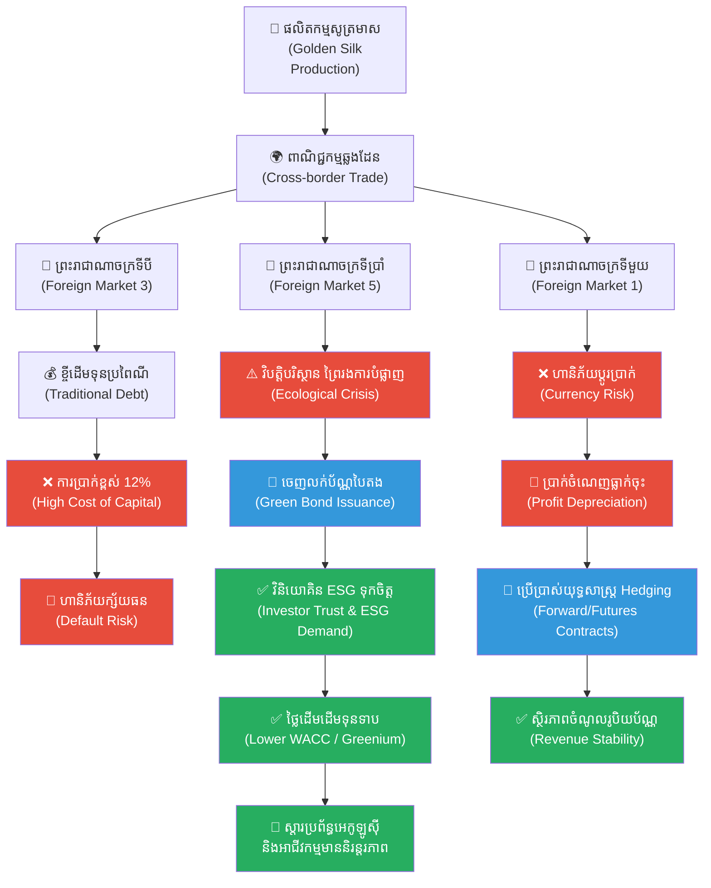

# ២៦១ — ពាណិជ្ជករឆ្លងកាត់មហាសមុទ្រទាំងប្រាំពីរ (The Merchant Who Crossed Seven Seas)៖ ប្រព័ន្ធហិរញ្ញវត្ថុសកល និងទំនុកចិត្តនៃប័ណ្ណបៃតង

**Author:** ichamrong  
**Date:** 2026-05-27  
**Tags:** #financial-markets #foreign-exchange #green-bonds #cost-of-capital #parables #business-sustainability #cambodian-context  
**Category:** Business Sustainability  
**Read Time:** ~12 min  

---

## 📌 មាតិកា (Table of Contents)
- [វិបត្តិធុរកិច្ច និងអន្ទាក់ហិរញ្ញវត្ថុសកល (The Global Financial Dilemma)](#វិបត្តិធុរកិច្ច)
- [រឿងនិទានប្រៀបធៀប៖ ដំណើររបស់នាង ចន្ទ្រា និងសូត្រមាសមហាសមុទ្រទាំងប្រាំពីរ (The Parable Story)](#រឿងនិទានប្រៀបធៀប)
  - [ព្រះរាជាណាចក្រទីមួយ៖ អន្ទាក់នៃអត្រាប្តូរប្រាក់ (Foreign Exchange Risk)](#ព្រះរាជាណាចក្រទីមួយ)
  - [ព្រះរាជាណាចក្រទីបី៖ តម្លៃដើមនៃបំណុល និងដើមទុន (Cost of Debt & Capital)](#ព្រះរាជាណាចក្រទីបី)
  - [ព្រះរាជាណាចក្រទីប្រាំ៖ កំណើតនៃប័ណ្ណបៃតង (The Birth of Green Bonds)](#ព្រះរាជាណាចក្រទីប្រាំ)
- [ការវិភាគគំនិតសេដ្ឋកិច្ច និងហិរញ្ញវត្ថុ (Theoretical Analysis)](#ការវិភាគគំនិតសេដ្ឋកិច្ច)
  - [១. ទីផ្សារប្តូរប្រាក់បរទេស និងហានិភ័យរូបិយប័ណ្ណ (Forex & Currency Risk)](#១-forex)
  - [២. ថ្លៃដើមដើមទុន និងថ្លៃដើមបំណុល (Cost of Capital & Debt)](#២-cost-of-capital)
  - [៣. ប័ណ្ណបៃតង និងហិរញ្ញវត្ថុប្រកបដោយនិរន្តរភាព (Green Bonds & Sustainable Finance)](#៣-green-bonds)
- [គំនូសតាងលំហូរការងារប្រព័ន្ធហិរញ្ញវត្ថុ (High-Contrast Systems Flowchart)](#គំនូសតាងលំហូរការងារ)
- [ឧទាហរណ៍ជាក់ស្តែងក្នុងពិភពពិត (Real-World Examples)](#ឧទាហរណ៍ជាក់ស្តែង)
  - [ឧទាហរណ៍ទី ១៖ ការបោះផ្សាយប័ណ្ណបៃតង និងសញ្ញាបណ្ណនិរន្តរភាពនៅអាស៊ាន (ASEAN Green & Sustainability Bonds)](#ឧទាហរណ៍ទី១)
  - [ឧទាហរណ៍ទី ២៖ ប័ណ្ណបៃតងសកលរបស់ក្រុមហ៊ុនបច្គេកវិទ្យា Apple (Apple's Corporate Green Bonds)](#ឧទាហរណ៍ទី២)
- [ដំណោះស្រាយ និងមេរៀនយុទ្ធសាស្ត្រធុរកិច្ច (Strategic Solutions & Takeaways)](#ដំណោះស្រាយ)
- [Related Posts / Course Link](#related-posts)

---

## វិបត្តិធុរកិច្ច និងអន្ទាក់ហិរញ្ញវត្ថុសកល (The Global Financial Dilemma)

នៅក្នុងសេដ្ឋកិច្ចសកលភាវូបនីយកម្ម (globalized economy) គ្មានអាជីវកម្មណាមួយអាចរស់នៅដាច់ដោយឡែកពីគេឡើយ។ នៅពេលសហគ្រាសមួយសម្រេចចិត្តពង្រីកខ្លួនឆ្លងកាត់ព្រំដែន ពួកគេមិនត្រឹមតែដឹកជញ្ជូនទំនិញរូបវន្តប៉ុណ្ណោះទេ ប៉ុន្តែថែមទាំងត្រូវឈានជើងចូលទៅក្នុងប្រព័ន្ធអេកូឡូស៊ីហិរញ្ញវត្ថុដ៏ស្មុគស្មាញ (complex financial ecosystem) ផងដែរ។ ប្រព័ន្ធនេះពោរពេញទៅដោយអថេរដែលប្រែប្រួលឥតឈប់ឈរ ដូចជារលកបោកបក់កណ្តាលមហាសមុទ្រ ទាំងអត្រាប្តូរប្រាក់ (foreign exchange rates) និងថ្លៃដើមដើមទុន (cost of capital) ដែលអាចពង្រីកប្រាក់ចំណេញ ឬដុតបំផ្លាញទ្រព្យសម្បត្តិទាំងស្រុងក្នុងមួយប៉ព្រិចភ្នែក។

បញ្ហាប្រឈមធំបំផុតសម្រាប់សហគ្រិនសម័យទំនើប គឺការយល់ដឹងថា «លុយ ឬដើមទុន» មិនមែនគ្រាន់តែជាឧបករណ៍សម្រាប់ទិញលក់ទំនិញធម្មតានោះទេ។ ដើមទុនគឺជាលំហូរនៃទំនុកចិត្ត (flow of trust)។ នៅពេលប្រភពហិរញ្ញវត្ថុប្រពៃណីចាប់ផ្តើមរឹតបន្តឹង និងមានថ្លៃដើមខ្ពស់ ធុរកិច្ចដែលចង់សម្រេចបាននូវការលូតលាស់ប្រកបដោយនិរន្តរភាព តែងតែជួបប្រទះនូវភាពទាល់ច្រក៖ តើយើងអាចរក្សាការប្រកួតប្រជែងក្នុងទីផ្សារអន្តរជាតិដោយរបៀបណា ប្រសិនបើការចំណាយលើដើមទុនបរិស្ថានមិនត្រូវបានគិតបញ្ចូលទៅក្នុងសមីការហិរញ្ញវត្ថុ?

សោកនាដកម្មនៃសហគ្រាសជាច្រើនគឺការផ្តោតតែលើការរកចំណូលក្នុងរយៈពេលខ្លី ដោយមើលរំលងហានិភ័យរូបិយប័ណ្ណ (currency risk) និងមិនចេះទាញយកអត្ថប្រយោជន៍ពីឧបករណ៍ហិរញ្ញវត្ថុទំនើបៗ ដូចជា ប័ណ្ណបៃតង (green bonds) ដែលជាស្ពានចម្លងទំនុកចិត្តរវាងវិនិយោគិនសកល និងគម្រោងអភិវឌ្ឍន៍បរិស្ថានក្នុងតំបន់។

---

## រឿងនិទានប្រៀបធៀប៖ ដំណើររបស់នាង ចន្ទ្រា និងសូត្រមាសមហាសមុទ្រទាំងប្រាំពីរ (The Parable Story)

កាលពីព្រេងនាយ ក្នុងយុគសម័យដ៏រុងរឿងនៃអាណាចក្រខ្មែរ មានស្រ្តីពាណិជ្ជករដ៏វៃឆ្លាតម្នាក់នាម **ចន្ទ្រា (Chantrea)**។ នាងល្បីល្បាញខាងការផលិតសូត្រមាស (golden silk) ដ៏ប្រណីតពីខេត្តកំពង់ចាម ដែលមានសរសៃទន់រលោង ភ្លឺចែងចាំង និងរឹងមាំខុសពីសូត្រនៃនគរដទៃ។ ដើម្បីពង្រីកកេរ្តិ៍ឈ្មោះ និងនាំយកសូត្រខ្មែរទៅកាន់ទីផ្សារពិភពលោក ចន្ទ្រាបានសម្រេចចិត្តដឹកនាំក្បួននាវាជួញដូរឆ្លងកាត់មហាសមុទ្រទាំងប្រាំពីរ ដើម្បីទៅកាន់ព្រះរាជាណាចក្រទាំងឡាយ។

---

### ព្រះរាជាណាចក្រទីមួយ៖ អន្ទាក់នៃអត្រាប្តូរប្រាក់ (Foreign Exchange Risk)

នៅពេលក្តោងនាវាបានបោះយុថ្កានៅព្រះរាជាណាចក្រទីមួយ ចន្ទ្រាបានជួបប្រទះនឹងឧបសគ្គហិរញ្ញវត្ថុដំបូងបង្អស់។ អតិថិជននៅក្នុងនគរនេះមិនប្រើប្រាស់កាក់មាសខ្មែរ (Khmer gold coins) ឡើយ ពួកគេប្រើប្រាស់តែកាក់ប្រាក់ក្នុងស្រុក (local silver coins) ប៉ុណ្ណោះ។ ដើម្បីលក់សូត្របាន ចន្ទ្រាត្រូវយល់ព្រមប្តូររូបិយប័ណ្ណ។ 

នៅទីនេះ នាងបានរៀនអំពីវិទ្យាសាស្ត្រនៃ **អត្រាប្តូរប្រាក់ (foreign exchange rate)**។ នៅថ្ងៃដំបូង អត្រាប្តូរប្រាក់មានអំណោយផលល្អ ប៉ុន្តែនៅសប្តាហ៍បន្ទាប់ ដោយសារវិបត្តិសង្គ្រាមព្រំដែននៃនគរនោះ ស្រាប់តែតម្លៃនៃកាក់ប្រាក់ក្នុងស្រុកធ្លាក់ចុះយ៉ាងគំហុកធៀបនឹងកាក់មាសខ្មែរ។ ទោះបីជានាងលក់សូត្របានក្នុងចំនួនច្រើនដូចមុន ក៏នៅពេលនាងប្តូរត្រឡប់ទៅជាមាសខ្មែរវិញ នាងទទួលបានប្រាក់ចំណេញតិចជាងមុនស្ទើរតែពាក់កណ្តាល។ ចន្ទ្រាបានដឹងខ្លួនថា៖ *«ការធ្វើពាណិជ្ជកម្មឆ្លងដែន មិនមែនផ្ដោតតែលើគុណភាពទំនិញឡើយ ប៉ុន្តែវាជាការប្រយុទ្ធប្រឆាំងនឹងហានិភ័យរូបិយប័ណ្ណ (currency risk) ដែលអាចលេបត្របាក់ផលចំណេញរបស់យើងបានគ្រប់ពេល»*។

---

### ព្រះរាជាណាចក្រទីបី៖ តម្លៃដើមនៃបំណុល និងដើមទុន (Cost of Debt & Capital)

បន្តដំណើរទៅដល់ព្រះរាជាណាចក្រទីបី ចន្ទ្រាចង់ពង្រីកសិប្បកម្មតម្បាញសូត្ររបស់នាងនៅក្នុងទីក្រុងនោះ ដើម្បីកុំឱ្យខាតបង់ថ្លៃដឹកជញ្ជូនតាមនាវា។ ប៉ុន្តែនាងខ្វះខាតមាសសម្រាប់ជួលជាងត្បាញ និងទិញម៉ាស៊ីនរ៉កវិលសូត្រថ្មី។ នាងបានធ្វើដំណើរទៅកាន់សមាគមពាណិជ្ជករធំ (merchant guild) ដើម្បីស្នើសុំខ្ចីមាស។

មេកុយ (guild master) បានយល់ព្រមផ្តល់មាសឱ្យនាង តែទាមទារការបង់ការប្រាក់ (interest rate) ក្នុងកម្រិត ១២% ក្នុងមួយឆ្នាំ។ នេះគឺជា **ថ្លៃដើមនៃបំណុល (cost of debt)** ដែលជាចំណែកមួយនៃ **ថ្លៃដើមដើមទុន (cost of capital)**។ ចន្ទ្រាត្រូវគណនាយ៉ាងម៉ត់ចត់៖ ប្រសិនបើសិប្បកម្មថ្មីរបស់នាងអាចបង្កើតផលចំណេញត្រឡប់មកវិញ (rate of return) បានត្រឹមតែ ១០% នោះការខ្ចីមាសនេះនឹងធ្វើឱ្យនាងក្ស័យធនជាមិនខាន ព្រោះផលចំណេញមិនអាចទប់ទល់នឹងតម្លៃការប្រាក់បំណុលបានឡើយ។ នាងយល់ច្បាស់ថា ដើមទុនមិនមែនជាកាដូឥតគិតថ្លៃទេ វាមានតម្លៃរបស់វា ហើយការគ្រប់គ្រងហិរញ្ញវត្ថុដ៏ល្អ គឺត្រូវធានាថាផលត្រឡប់មកវិញពីការវិនិយោគ (return on investment) ត្រូវតែខ្ពស់ជាងថ្លៃដើមដើមទុនជានិច្ច។

---

### ព្រះរាជាណាចក្រទីប្រាំ៖ កំណើតនៃប័ណ្ណបៃតង (The Birth of Green Bonds)

លុះធ្វើដំណើរមកដល់ព្រះរាជាណាចក្រទីប្រាំ ចន្ទ្រាបានជួបប្រទះវិបត្តិថ្មីមួយទៀត។ ដើម្បីបានសរសៃសូត្រមាសដ៏ល្អ នាងត្រូវការទឹកស្ទឹងដ៏ថ្លាឆ្វង់ និងម្លប់ត្រជាក់ពីព្រៃមន (mulberry forests) សម្រាប់ចិញ្ចឹមនាងនឿន។ ប៉ុន្តែដោយសារការកាប់បំផ្លាញព្រៃឈើដើម្បីពង្រីកទីក្រុង ទឹកស្ទឹងចាប់ផ្តើមឡើងកំដៅ និងមានភក់ ធ្វើឱ្យដង្កូវនាងចុះខ្សោយ និងងាប់ជាបន្តបន្ទាប់។ សង្វាក់ផ្គត់ផ្គង់ទាំងមូលត្រូវបានគំរាមកំហែងយ៉ាងធ្ងន់ធ្ងរ។ នាងត្រូវការដើមទុនដ៏មហាសាលដើម្បីស្តារព្រៃមន និងជីកប្រឡាយទឹកការពារប្រព័ន្ធអេកូឡូស៊ី ប៉ុន្តែគ្មានពាណិជ្ជករណាម្នាក់ហ្មត់ចត់ហ៊ានផ្តល់កម្ចីដែលមានការប្រាក់ទាបដល់នាងឡើយ ព្រោះពួកគេយល់ថាការដាំដើមឈើជាការវិនិយោគយឺតយ៉ាវ និងគ្មានប្រាក់ចំណេញលឿន។

ក្នុងស្ថានភាពដ៏ទាល់ច្រកនោះ ទីប្រឹក្សាចាស់ម្នាក់បានផ្តល់យោបល់ឱ្យនាងបង្កើតឧបករណ៍ហិរញ្ញវត្ថុថ្មីមួយ។ នាងបានប្រកាសបោះផ្សាយសំបុត្រសន្យាពិសេសមួយហៅថា **«ប័ណ្ណបៃតង (Green Bond)»**។ នាងបានសរសេរសំបុត្រនោះថា៖ *«រាល់មាសទាំងអស់ដែលលោកអ្នកដាក់វិនិយោគទិញប័ណ្ណនេះ ខ្ញុំនឹងយកទៅប្រើប្រាស់សម្រាប់តែការដាំស្តារព្រៃមនឡើងវិញ និងការការពារប្រភពទឹកស្ទឹងតែប៉ុណ្ណោះ។ ខ្ញុំសន្យានឹងផ្តល់ការប្រាក់សមរម្យមួយជារៀងរាល់ឆ្នាំ ហើយកេរ្តិ៍ឈ្មោះនៃសហគ្រាសសូត្ររបស់ខ្ញុំ ព្រមទាំងតុល្យភាពធម្មជាតិនៃនគរនេះ នឹងក្លាយជាទ្រព្យធានា (collateral) នៃទំនុកចិត្តនេះ»*។

ដំបូងឡើយ ពាណិជ្ជករលោភលន់មួយចំនួនបានសើចចំអកឱ្យនាង។ ប៉ុន្តែវិនិយោគិនសីលធម៌ (ethical investors) និងប្រាសាទធំៗដែលមានទ្រព្យសម្បត្តិច្រើន ព្រមទាំងអ្នកស្រឡាញ់បរិស្ថាន បានមើលឃើញពីតម្លៃពិតប្រាកដនៃគម្រោងនេះ។ ពួកគេយល់ថា ប្រសិនបើព្រៃឈើងាប់ អាជីវកម្មសូត្រក៏រលាយ ហើយសេដ្ឋកិច្ចនគរទាំងមូលក៏ត្រូវដួលរលំដូចគ្នា។ ពួកគេបានសម្រេចចិត្តនាំគ្នាមកទិញប័ណ្ណបៃតងរបស់ចន្ទ្រាយ៉ាងច្រើនលើសលប់។ 

ដោយសារទំនុកចិត្តនេះ ចន្ទ្រាទទួលបានដើមទុនដែលមានថ្លៃដើមទាប (lower cost of capital) មកស្តារព្រៃឈើ និងទឹកស្ទឹងឡើងវិញ។ ក្នុងរយៈពេលបីឆ្នាំក្រោយមក ព្រៃមនបានត្រឡប់មកមានពណ៌បៃតងខ្ចី សត្វដង្កូវនាងបង្កើតសរសៃសូត្រមាសដ៏ល្អឥតខ្ចោះ ហើយចន្ទ្រាអាចលក់សូត្រនាំចេញទៅកាន់នគរទាំងប្រាំពីរ ដោយបង្កើតផលចំណេញយ៉ាងច្រើនមកទូទាត់សងការប្រាក់ និងប្រាក់ដើមដល់អ្នកកាន់ប័ណ្ណបៃតងវិញដោយគ្មានការខកខាន។ នាងបានបង្ហាញឱ្យពិភពលោកឃើញថា ហិរញ្ញវត្ថុ និងធម្មជាតិមិនមែនជាសត្រូវនឹងគ្នាទេ ប៉ុន្តែពួកគេអាចដើរទន្ទឹមគ្នាដោយផ្អែកលើ «សសរស្តម្ភនៃទំនុកចិត្ត និងការទទួលខុសត្រូវ»។

---

## ការវិភាគគំនិតសេដ្ឋកិច្ច និងហិរញ្ញវត្ថុ (Theoretical Analysis)

រឿងនិទានរបស់នាង ចន្ទ្រា ឆ្លុះបញ្ចាំងពីគោលការណ៍គ្រឹះនៃប្រព័ន្ធហិរញ្ញវត្ថុសកល និងឧបករណ៍ហិរញ្ញវត្ថុទំនើបៗ ដូចខាងក្រោម៖

---

### ១. ទីផ្សារប្តូរប្រាក់បរទេស និងហានិភ័យរូបិយប័ណ្ណ (Forex & Currency Risk)

នៅក្នុងការធ្វើពាណិជ្ជកម្មអន្តរជាតិ រាល់ការលក់ទំនិញឆ្លងដែនតម្រូវឱ្យមានការប្រើប្រាស់រូបិយប័ណ្ណខុសគ្នា។ 
* **អត្រាប្តូរប្រាក់ (Exchange Rate):** គឺជាតម្លៃនៃរូបិយប័ណ្ណមួយធៀបនឹងរូបិយប័ណ្ណមួយទៀត។ នៅក្នុងរឿង ចំនួនកាក់មាសខ្មែរធៀបនឹងកាក់ប្រាក់ក្នុងស្រុក គឺជាអត្រាប្តូរប្រាក់ (foreign exchange rate)។
* **ហានិភ័យរូបិយប័ណ្ណ (Currency/Forex Risk):** កើតឡើងនៅពេលតម្លៃនៃរូបិយប័ណ្ណដែលយើងទទួលប្រាក់ចំណូលធ្លាក់ចុះ (depreciates) ធៀបនឹងរូបិយប័ណ្ណដែលយើងប្រើប្រាស់សម្រាប់ទូទាត់ថ្លៃដើម។ ប្រសិនបើពាណិជ្ជករមិនមានយុទ្ធសាស្ត្រការពារហានិភ័យរូបិយប័ណ្ណ (currency hedging) ដូចជាការប្រើប្រាស់កិច្ចសន្យាទិញលក់រូបិយប័ណ្ណទុកជាមុន (Forward Contracts) ទេនោះ អាជីវកម្មអាចនឹងខាតបង់ទោះបីជាការលក់ទំនិញទទួលបានជោគជ័យក៏ដោយ។

---

### ២. ថ្លៃដើមដើមទុន និងថ្លៃដើមបំណុល (Cost of Capital & Debt)

ដើម្បីបង្កើត ឬពង្រីកធុរកិច្ច សហគ្រិនត្រូវការប្រភពដើមទុន ដែលជាធម្មតាបានមកពីពីរប្រភពគឺ បំណុល (Debt) និងភាគហ៊ុន (Equity)។
* **ថ្លៃដើមនៃបំណុល (Cost of Debt):** គឺជាអត្រាការប្រាក់ដែលម្ចាស់បំណុល (creditors/lenders) ទាមទារដើម្បីជាថ្នូរនឹងហានិភ័យនៃការផ្តល់កម្ចី។ នៅក្នុងរឿង ការប្រាក់ ១២% ដែលសមាគមពាណិជ្ជករទាមទារ គឺជាថ្លៃដើមនៃបំណុល។
* **ថ្លៃដើមដើមទុន (Cost of Capital):** គឺជាកម្រិតផលត្រឡប់មកវិញអប្បបរមា (minimum hurdle rate) ដែលអាជីវកម្មត្រូវតែរកឱ្យបានដើម្បីបំពេញចិត្តអ្នកផ្តល់ដើមទុន (ទាំងម្ចាស់ភាគហ៊ុន និងម្ចាស់បំណុល)។ ប្រសិនបើគម្រោងវិនិយោគមានផលត្រឡប់មកវិញ (Return on Invested Capital - ROIC) ខ្ពស់ជាងថ្លៃដើមដើមទុនជាមធ្យម (Weighted Average Cost of Capital - WACC) នោះតម្លៃសហគ្រាស (enterprise value) នឹងកើនឡើង។ ផ្ទុយទៅវិញ វានឹងបំផ្លាញតម្លៃអាជីវកម្ម។

---

### ៣. ប័ណ្ណបៃតង និងហិរញ្ញវត្ថុប្រកបដោយនិរន្តរភាព (Green Bonds & Sustainable Finance)

* **ប័ណ្ណ ឬសញ្ញាបណ្ណ (Bonds):** គឺជាឧបករណ៍បំណុល (debt instruments) ដែលអនុញ្ញាតឱ្យអង្គភាពមួយ (ក្រុមហ៊ុន ឬរដ្ឋាភិបាល) ខ្ចីដើមទុនដោយផ្ទាល់ពីទីផ្សារហិរញ្ញវត្ថុ ដោយសន្យានឹងសងត្រឡប់មកវិញនូវប្រាក់ដើម រួមជាមួយការប្រាក់កំណត់មួយ (coupon rate) ទៅតាមកាលកំណត់។
* **ប័ណ្ណបៃតង (Green Bonds):** គឺជាសញ្ញាបណ្ណដែលមានលក្ខណៈបច្ចេកទេសដូចសញ្ញាបណ្ណធម្មតា ប៉ុន្តែមានការសន្យាយ៉ាងតឹងរ៉ឹងថា ដើមទុនដែលប្រមូលបានទាំងអស់ (use of proceeds) ត្រូវតែយកទៅប្រើប្រាស់សម្រាប់តែគម្រោងដែលមានផលវិជ្ជមានចំពោះបរិស្ថាន និងអាកាសធាតុប៉ុណ្ណោះ (ដូចជា ការដាំព្រៃឈើឡើងវិញ ថាមពលកកើតឡើងវិញ និងការគ្រប់គ្រងទឹកកខ្វក់)។
* **ការថយចុះនៃថ្លៃដើម (Greenium / Green Premium):** ដោយសារមានតម្រូវការខ្ពស់ពីវិនិយោគិនដែលផ្តោតលើគោលការណ៍ ESG (Environmental, Social, and Governance) ក្រុមហ៊ុនដែលបោះផ្សាយប័ណ្ណបៃតងជារឿយៗអាចទទួលបានដើមទុនក្នុងអត្រាការប្រាក់ទាបជាងសញ្ញាបណ្ណប្រពៃណី ដែលបាតុភូតនេះត្រូវបានគេហៅថា "Greenium" (បុព្វលាភបៃតង)។

---

## គំនូសតាងលំហូរការងារប្រព័ន្ធហិរញ្ញវត្ថុ (High-Contrast Systems Flowchart)

ខាងក្រោមនេះជាគំនូសតាងបង្ហាញពីលំហូរការងារប្រព័ន្ធហិរញ្ញវត្ថុសកល ហានិភ័យ និងដំណោះស្រាយតាមរយៈប័ណ្ណបៃតង៖

---

## ឧទាហរណ៍ជាក់ស្តែងក្នុងពិភពពិត (Real-World Examples)

---

### ឧទាហរណ៍ទី ១៖ ការបោះផ្សាយប័ណ្ណបៃតង និងសញ្ញាបណ្ណនិរន្តរភាពនៅអាស៊ាន (ASEAN Green & Sustainability Bonds)

នៅក្នុងតំបន់អាស៊ាន (ASEAN) ហិរញ្ញវត្ថុប្រកបដោយនិរន្តរភាពបានក្លាយជាក្បាលម៉ាស៊ីនរុញច្រានការអភិវឌ្ឍន៍សេដ្ឋកិច្ច។ 
* **ឧទាហរណ៍ជាក់ស្តែង៖** ធនាគារអភិវឌ្ឍន៍អាស៊ី (ADB) បានជួយគាំទ្រដល់ការបោះផ្សាយប័ណ្ណបៃតង (Green Bonds) និងប័ណ្ណនិរន្តរភាព (Sustainability Bonds) ជាច្រើននៅក្នុងតំបន់។ ជាក់ស្តែង ប្រទេសកម្ពុជាក៏បានឈានជើងចូលក្នុងទីផ្សារនេះផងដែរ តាមរយៈការរៀបចំក្របខណ្ឌបោះផ្សាយសញ្ញាបណ្ណបៃតងដំបូងបង្អស់របស់ក្រុមហ៊ុនក្នុងស្រុក (ដូចជា គម្រោងថាមពលពន្លឺព្រះអាទិត្យ និងគម្រោងហេដ្ឋារចនាសម្ព័ន្ធទឹកស្អាត) ដើម្បីទាក់ទាញដើមទុនពីវិនិយោគិនអន្តរជាតិដែលចង់បានផលចំណេញហិរញ្ញវត្ថុទន្ទឹមនឹងការជួយសង្គ្រោះបរិស្ថាន។

---

### ឧទាហរណ៍ទី ២៖ ប័ណ្ណបៃតងសកលរបស់ក្រុមហ៊ុនបច្ចេកវិទ្យា Apple (Apple's Corporate Green Bonds)

ក្រុមហ៊ុនបច្ចេកវិទ្យាយក្ស Apple គឺជាឧទាហរណ៍ដ៏លេចធ្លោបំផុតមួយក្នុងការប្រើប្រាស់ទីផ្សារសញ្ញាបណ្ណបៃតងសាជីវកម្ម (Corporate Green Bonds)។
* **យុទ្ធសាស្ត្ររបស់ Apple៖** ចាប់តាំងពីឆ្នាំ ២០១៦ មក Apple បានបោះផ្សាយប័ណ្ណបៃតងក្នុងតម្លៃរាប់ពាន់លានដុល្លារអាមេរិក។ ដើមទុនដែលទទួលបានពីការលក់ប័ណ្ណទាំងនេះត្រូវបានយកទៅប្រើប្រាស់ទាំងស្រុងក្នុងគម្រោងកាត់បន្ថយការបំភាយឧស្ម័នកាបូន (carbon footprint reduction) ការប្រើប្រាស់ថាមពលកកើតឡើងវិញ (renewable energy) ១០០% នៅក្នុងសង្វាក់ផលិតកម្មរបស់ពួកគេ និងការប្រើប្រាស់វត្ថុធាតុដើមកែច្នៃឡើងវិញ (recycled materials) នៅក្នុងឧបករណ៍ iPhone និង MacBook។ ការធ្វើបែបនេះមិនត្រឹមតែជួយឱ្យ Apple សម្រេចបាននូវគោលដៅអព្យាក្រឹតកាបូន (carbon neutrality) ក្នុងឆ្នាំ ២០៣០ ប៉ុណ្ណោះទេ ប៉ុន្តែថែមទាំងជួយកាត់បន្ថយថ្លៃដើមដើមទុន (cost of capital) របស់ពួកគេតាមរយៈការទទួលបានការប្រាក់ទាបពីវិនិយោគិន ESG ផងដែរ។

---

## ដំណោះស្រាយ និងមេរៀនយុទ្ធសាស្ត្រធុរកិច្ច (Strategic Solutions & Takeaways)

សម្រាប់សហគ្រិន និងអ្នកគ្រប់គ្រងសម័យទំនើប ខាងក្រោមនេះជាមេរៀនជាយុទ្ធសាស្ត្រដើម្បីគ្រប់គ្រងប្រព័ន្ធហិរញ្ញវត្ថុ និងការអភិវឌ្ឍន៍ប្រកបដោយចីរភាព៖

1. **សកម្មក្នុងការគ្រប់គ្រងហានិភ័យរូបិយប័ណ្ណ (Proactive FX Risk Management):**
   * នៅពេលធ្វើពាណិជ្ជកម្មឆ្លងដែន មិនត្រូវទុកឱ្យអាជីវកម្មរងឥទ្ធិពលពីភាពមិនច្បាស់លាស់នៃអត្រាប្តូរប្រាក់ឡើយ។ ត្រូវសហការជាមួយធនាគារដៃគូដើម្បីអនុវត្តការការពារហានិភ័យ (Hedging) តាមរយៈកិច្ចសន្យាអនាគត (Forward, Options, or Futures Contracts) ដើម្បីធានាអត្រាប្តូរប្រាក់ថេរសម្រាប់ប្រតិបត្តិការនាពេលអនាគត។

2. **វាយតម្លៃថ្លៃដើមដើមទុនឱ្យបានម៉ត់ចត់ (Rigorous Cost of Capital Evaluation):**
   * រាល់គម្រោងពង្រីកអាជីវកម្មទាំងអស់ត្រូវតែវាយតម្លៃដោយប្រើវិធីសាស្ត្រតម្លៃបច្ចុប្បន្នសុទ្ធ (Net Present Value - NPV) ដែលបញ្ចុះតម្លៃដោយផ្អែកលើថ្លៃដើមដើមទុនជាមធ្យម (WACC)។ ប្រសិនបើផលត្រឡប់មកវិញរំពឹងទុករបស់គម្រោង ទាបជាងថ្លៃដើមដើមទុន គម្រោងនោះគួរតែត្រូវបានច្រានចោល ទោះបីជាវាមើលទៅគួរឱ្យទាក់ទាញក៏ដោយ។

3. **ទាញយកប្រយោជន៍ពីហិរញ្ញវត្ថុបៃតង (Leverage Green Financing Instruments):**
   * សហគ្រាសគួរតែរៀបចំ និងកែសម្រួលរបាយការណ៍របស់ខ្លួនឱ្យស្របទៅតាមគោលការណ៍ ESG។ ការបង្កើតគម្រោងដែលមានលក្ខណៈបៃតង និងការបោះផ្សាយប័ណ្ណបៃតង (Green Bonds) អាចជួយឱ្យសហគ្រាសទទួលបានដើមទុនដែលមានអត្រាការប្រាក់ទាប (Greenium) និងទាក់ទាញក្រុមវិនិយោគិនលំដាប់ខ្ពស់ដែលមានទំនួលខុសត្រូវសង្គម។

4. **ការកសាងទំនុកចិត្តតាមរយៈតម្លាភាព (Building Trust through Transparency):**
   * ដូចគ្នានឹងនាងចន្ទ្រាដែរ គន្លឹះជោគជ័យនៃប័ណ្ណបៃតង និងការកៀរគរដើមទុន គឺការផ្តល់របាយការណ៍ផលប៉ះពាល់បរិស្ថានប្រកបដោយតម្លាភាព (impact reporting)។ ត្រូវធានាថា រាល់លុយដែលទទួលបានត្រូវបានប្រើប្រាស់ចំគោលដៅ និងអាចវាយតម្លៃបានតាមរយៈសវនកម្មឯករាជ្យ ដើម្បីរក្សាបាននូវកេរ្តិ៍ឈ្មោះ និងការទុកចិត្តជានិរន្តរភាព។

---

## Related Posts / Course Link

- **[Introduction to Global Financial Markets](../02-introduction-to-global-financial-markets.md)** — Foundational overview of global financial markets including forex, bond markets, and sustainable finance instruments for Year 1 students.
- **[Principles of Microeconomics](../01-principles-of-microeconomics.md)** — Exploring basic economic decision making, opportunity cost, and market dynamics that impact pricing and exchange systems.
- **[Externalities and Market Failures](./03-externalities-and-market-failures.md)** — Understanding how economic activities affect third parties and how green bonds serve to internalize environmental externalities.
