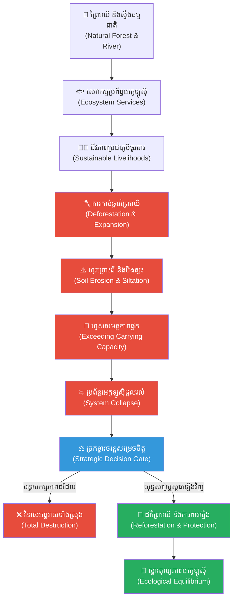

# ២៦២ — ស្ទឹងដែលចិញ្ចឹមអ្នកភូមិ (The River That Fed the Village)៖ ប្រព័ន្ធអេកូឡូស៊ី សេវាកម្មធម្មជាតិ និងនិរន្តរភាព

**Author:** ichamrong  
**Date:** 2026-05-27  
**Tags:** #environmental-studies #ecosystem-services #carrying-capacity #planetary-boundaries #business-sustainability #cambodian-context  
**Category:** Business Sustainability  
**Read Time:** ~12 min  

---

## 📌 មាតិកា (Table of Contents)
- [អន្ទាក់ផ្លូវចិត្ត / វិបត្តិធុរកិច្ច (The Dilemma / The Trap)](#អន្ទាក់ផ្លូវចិត្ត--វិបត្តិធុរកិច្ច-the-dilemma--the-trap)
- [១. រឿងនិទានប្រៀបធៀប៖ ស្ទឹងដែលចិញ្ចឹមអ្នកភូមិ (The Parable: The River That Fed the Village)](#១-រឿងនិទានប្រៀបធៀប៖-ស្ទឹងដែលចិញ្ចឹមអ្នកភូមិ-the-parable-the-river-that-fed-the-village)
  - [ជំនាន់ទី ១៖ អំណោយផលពីធម្មជាតិ និងតុល្យភាព (First Generation: Natural Abundance & Equilibrium)](#ជំនាន់ទី-១៖-អំណោយផលពីធម្មជាតិ-និងតុល្យភាព-first-generation-natural-abundance-equilibrium)
  - [ជំនាន់ទី ២ និងទី ៣៖ ការកើនឡើងនៃលោភលន់ និងការកាប់ឆ្ការព្រៃ (Later Generations: Escalation of Greed & Deforestation)](#ជំនាន់ទី-២-និងទី-៣៖-ការកើនឡើងនៃលោភលន់-និងការកាប់ឆ្ការព្រៃ-later-generations-escalation-of-greed-deforestation)
  - [សោកនាដកម្មនៃការបាក់បែកប្រព័ន្ធអេកូឡូស៊ី (The Ecological Collapse)](#សោកនាដកម្មនៃការបាក់បែកប្រព័ន្ធអេកូឡូស៊ី-the-ecological-collapse)
- [២. ការវិភាគគំនិតសេដ្ឋកិច្ច / ធុរកិច្ច (Theoretical Analysis)](#២-ការវិភាគគំនិតសេដ្ឋកិច្ច--ធុរកិច្ច-theoretical-analysis)
  - [សេវាកម្មប្រព័ន្ធអេកូឡូស៊ី (Ecosystem Services)](#សេវាកម្មប្រព័ន្ធអេកូឡូស៊ី-ecosystem-services)
  - [សមត្ថភាពផ្ទុករបស់បរិស្ថាន (Carrying Capacity)](#សមត្ថភាពផ្ទុករបស់បរិស្ថាន-carrying-capacity)
  - [ដែនកំណត់ផែនដី (Planetary Boundaries & Thresholds)](#ដែនកំណត់ផែនដី-planetary-boundaries--thresholds)
  - [ការវាយតម្លៃតម្លៃបរិស្ថាន និងផលប៉ះពាល់ខាងក្រៅអវិជ្ជមាន (Ecosystem Valuation & Negative Externalities)](#ការវាយតម្លៃតម្លៃបរិស្ថាន-និងផលប៉ះពាល់ខាងក្រៅអវិជ្ជមាន-ecosystem-valuation--negative-externalities)
- [៣. គំនូសតាងលំហូរការងារ (High-Contrast Flow Diagram)](#៣-គំនូសតាងលំហូរការងារ-high-contrast-flow-diagram)
- [៤. ឧទាហរណ៍ជាក់ស្តែងក្នុងពិភពពិត (Real World Examples)](#៤-ឧទាហរណ៍ជាក់ស្តែងក្នុងពិភពពិត-real-world-examples)
  - [ឧទាហរណ៍ទី ១៖ វិបត្តិជលផល និងការបាត់បង់ព្រៃលិចទឹកនៅបឹងទន្លេសាប (Tonle Sap Fishery Collapse & Flooded Forest Degradation)](#ឧទាហរណ៍ទី-១៖-វិបត្តិជលផល-និងការបាត់បង់ព្រៃលិចទឹកនៅបឹងទន្លេសាប-tonle-sap-fishery-collapse--flooded-forest-degradation)
  - [ឧទាហរណ៍ទី ២៖ ការស្ដារតំបន់ដីសើម និងព្រៃកោងកាងលំដាប់សកល (Global Wetland and Mangrove Restoration)](#ឧទាហរណ៍ទី-២៖-ការស្ដារតំបន់ដីសើម-និងព្រៃកោងកាងលំដាប់សកល-global-wetland-and-mangrove-restoration)
- [៥. ដំណោះស្រាយ និងមេរៀនធុរកិច្ច (Strategic Solutions & Takeaways)](#៥-ដំណោះស្រាយ-និងមេរៀនធុរកិច្ច-strategic-solutions--takeaways)
- [សេចក្តីសន្និដ្ឋាន (Conclusion)](#សេចក្តីសន្និដ្ឋាន-conclusion)
- [Related Posts / Course Link](#related-posts--course-link)

---

## អន្ទាក់ផ្លូវចិត្ត / វិបត្តិធុរកិច្ច (The Dilemma / The Trap)

នៅក្នុងប្រព័ន្ធសេដ្ឋកិច្ចទីផ្សារសេរី (Free-Market Economy) សហគ្រាស និងអាជីវកម្មភាគច្រើនតែងតែចាត់ទុក «ធនធានធម្មជាតិ» (Natural Resources) ថាជាទំនិញឥតគិតថ្លៃ ឬជាប្រភពវត្ថុធាតុដើមដែលមិនចេះរីងស្ងួត។ វិបត្តិធុរកិច្ចដ៏ធំបំផុតគឺការដែលយើងកត់ត្រាតែទ្រព្យសកម្មហិរញ្ញវត្ថុនៅលើតារាងតុល្យការ (Balance Sheet) ប៉ុន្តែបែរជាមើលរំលង «សេវាកម្មប្រព័ន្ធអេកូឡូស៊ី» (Ecosystem Services) ដែលធម្មជាតិផ្តល់ឱ្យដោយមិនយកកម្រៃ ដូចជាខ្យល់បរិសុទ្ធ ទឹកស្អាត ភាពមានជីជាតិនៃដី និងប្រព័ន្ធការពារគ្រោះធម្មជាតិជាដើម។

នៅពេលអាជីវកម្មព្យាយាមបង្កើនទិន្នផលសេដ្ឋកិច្ចរយៈពេលខ្លី (Short-term Economic Yield) ដោយការកេងប្រវ័ញ្ច និងបំផ្លិចបំផ្លាញប្រភពដើមនៃសេវាកម្មទាំងនេះ ពួកគេកំពុងរុញច្រានប្រព័ន្ធអេកូឡូស៊ីឱ្យហួសពី «សមត្ថភាពផ្ទុក» (Carrying Capacity) និងឈានទៅរក «ចំណុចរបត់ដែលមិនអាចត្រឡប់ក្រោយបាន» (Ecological Tipping Points)។ 

នេះជាអន្ទាក់នៃការគិតថា៖ *«ការបំផ្លាញបរិស្ថានថ្ងៃនេះ ដើម្បីបង្កើនប្រសិទ្ធភាពសេដ្ឋកិច្ច គឺជាភាពវៃឆ្លាតរបស់ធុរកិច្ច»*។ ប៉ុន្តែនៅក្នុងការពិត នៅពេលប្រព័ន្ធទ្រទ្រង់ជីវិតរបស់ធម្មជាតិដួលរលំ ធុរកិច្ចទាំងឡាយក៏ត្រូវវិនាសអន្តរាយទៅជាមួយគ្នាដែរ ព្រោះគ្មានអាជីវកម្មណាអាចដំណើរការបានឡើយនៅលើភពផែនដីដែលងាប់បាត់ទៅហើយនោះ។

---

## ១. រឿងនិទានប្រៀបធៀប៖ ស្ទឹងដែលចិញ្ចឹមអ្នកភូមិ (The Parable: The River That Fed the Village)

### ជំនាន់ទី ១៖ អំណោយផលពីធម្មជាតិ និងតុល្យភាព (First Generation: Natural Abundance & Equilibrium)

កាលពីដើមឡើយ មានភូមិមួយឈ្មោះថា **«ភូមិស្ទឹងខៀវ»** ស្ថិតនៅតាមបណ្តោយដៃទន្លេមេគង្គ (Mekong River) ក្នុងប្រទេសកម្ពុជា។ អ្នកភូមិនាជំនាន់ជីដូនជីតាបានរស់នៅយ៉ាងសុខសាន្ត ដោយពឹងផ្អែកស្ទើរតែទាំងស្រុងលើស្ទឹងដ៏ធំមួយដែលហូរកាត់កណ្តាលភូមិ។ ស្ទឹងនេះមិនមែនគ្រាន់តែជាផ្លូវទឹកធម្មតានោះទេ ប៉ុន្តែវាជាសរសៃឈាមមាសដែលផ្តល់ «សេវាកម្មប្រព័ន្ធអេកូឡូស៊ី» (Ecosystem Services) យ៉ាងសម្បូរបែបដោយឥតគិតថ្លៃ។ 

ស្ទឹងនេះបានផ្តល់ផលជលផល (Fish Catch) យ៉ាងច្រើនលើសលប់សម្រាប់ធ្វើជាអាហារប្រចាំថ្ងៃ ផ្តល់ទឹកស្អាតសម្រាប់ប្រើប្រាស់ និងដាំដុះ ហើយព្រៃឈើដ៏ក្រាស់ឃ្មឹកនៅផ្នែកខាងលើនៃស្ទឹងបានជួយស្រូបយកទឹកភ្លៀង ដើរតួជាប្រព័ន្ធការពារទឹកជំនន់ (Flood Control) ដ៏មានប្រសិទ្ធភាព។ រៀងរាល់ឆ្នាំ ទឹកជំនន់តាមរដូវកាល (Predictable Seasonal Floods) បាននាំមកនូវដីល្បាប់មានជីជាតិ (Fertile Silt) មកគ្របដណ្តប់លើវាលស្រែរបស់អ្នកភូមិ ធ្វើឱ្យការដាំដុះទទួលបានទិន្នផលខ្ពស់ដោយមិនបាច់ប្រើប្រាស់ជីគីមីឡើយ។ តុល្យភាពអេកូឡូស៊ី (Ecological Equilibrium) ត្រូវបានរក្សាយ៉ាងខ្ជាប់ខ្ជួន។

### ជំនាន់ទី ២ និងទី ៣៖ ការកើនឡើងនៃលោភលន់ និងការកាប់ឆ្ការព្រៃ (Later Generations: Escalation of Greed & Deforestation)

លុះឈានចូលដល់ជំនាន់ទី ២ និងទី ៣ តម្រូវការទីផ្សារ និងការចង់បានកំនើនសេដ្ឋកិច្ចលឿនរហ័សបានចាប់ផ្តើមជ្រៀតជ្រែក។ ប្រជាជននៅក្នុងភូមិកាន់តែកើនឡើង ហើយគំនិតចង់បង្កើនប្រាក់ចំណូលបានជម្រុញឱ្យពួកគេចាប់ផ្តើមកាប់ឆ្ការព្រៃឈើតាមដងស្ទឹង និងតំបន់ដើមទឹកដើម្បីពង្រីកដីស្រែ (Rice Field Expansion) និងដាំដំណាំកសិ-ឧស្សាហកម្មដូចជាដំឡូងមី និងកៅស៊ូ។ 

ដំបូងឡើយ ការកាប់ឆ្ការព្រៃ (Deforestation) នេះហាក់ដូចជាផ្តល់ផលចំណេញហិរញ្ញវត្ថុយ៉ាងច្រើន។ អ្នកភូមិអាចលក់ឈើផង និងមានផ្ទៃដីដាំដុះធំជាងមុនផង ដែលធ្វើឱ្យប្រាក់ចំណូលប្រចាំឆ្នាំកើនឡើងជាលំដាប់។ ពួកគេបានអបអរសាទរចំពោះ «ប្រសិទ្ធភាពសេដ្ឋកិច្ច» ថ្មីនេះ ដោយគិតថាកសិកម្មទំនើបកំពុងតែឈ្នះធម្មជាតិ។

### សោកនាដកម្មនៃការបាក់បែកប្រព័ន្ធអេកូឡូស៊ី (The Ecological Collapse)

ទោះជាយ៉ាងណាក៏ដោយ បំណុលធម្មជាតិចាប់ផ្តើមទារមកវិញ។ នៅពេលគ្មានឫសឈើចាំជួយស្រូបទឹក និងទប់ដីទៀតនោះ ពេលមានភ្លៀងធ្លាក់ខ្លាំង មហន្តរាយក៏បានកើតឡើង។ ដីស្រទាប់លើដ៏មានជីជាតិត្រូវបានហូរច្រោះ (Soil Erosion) យ៉ាងធ្ងន់ធ្ងរចូលទៅក្នុងស្ទឹង។ ដីល្បាប់ និងខ្សាច់រាប់លានតោនបានធ្វើឱ្យស្ទឹងកាន់តែរាក់ទៅៗ (Siltation) ដែលបណ្តាលឱ្យបាត់បង់ជម្រកត្រីពងកូន និងស្ទះចរន្តទឹក។

ក្នុងរយៈពេលត្រឹមតែប៉ុន្មានឆ្នាំ ផលត្រីដែលធ្លាប់តែសម្បូរបែបបានធ្លាក់ចុះរហូតដល់ជិតសូន្យ។ ទឹកស្ទឹងដែលធ្លាប់តែថ្លាឆ្វង់បានប្រែជាល្អក់កខ្វក់ និងពោរពេញដោយជាតិគីមីកសិកម្ម។ អ្វីដែលអាក្រក់បំផុតនោះគឺ ទឹកជំនន់លែងជាគ្រោះធម្មជាតិដែលអាចព្យាករណ៍បានទៀតហើយ។ ទឹកជំនន់បានក្លាយជាមហន្តរាយយាយីស្ទើររៀងរាល់ខែភ្លៀង ដោយសារគ្មានព្រៃឈើចាំទប់ទឹក រុញច្រានភូមិទាំងមូលឱ្យហួសពី «សមត្ថភាពផ្ទុក» (Carrying Capacity) នៃប្រព័ន្ធធម្មជាតិរបស់ខ្លួន។

នៅក្នុងកិច្ចប្រជុំភូមិដ៏តានតឹងមួយ យាយ **ម៉ាលី (Mali)** ដែលជាចាស់ទុំឆ្លាតវៃប្រចាំភូមិ បានក្រោកឈរឡើងពន្យល់ដោយទឹកមុខក្រៀមក្រំថា៖ 

> «ពួកយើងបានភ្លេចខ្លួនហើយ! ស្ទឹង និងព្រៃឈើគឺជាប្រព័ន្ធទ្រទ្រង់ជីវិតរបស់យើង។ ពួកយើងបានបំពាន "ដែនកំណត់ផែនដី" (Planetary Boundaries) របស់ស្ទឹងនេះហើយ។ ការបំផ្លាញព្រៃដើម្បីស្រែរយៈពេលខ្លី គឺដូចជាការសម្លាប់មេមាន់ដើម្បីយកពងមាសអញ្ចឹង។ ពេលនេះ ធម្មជាតិលែងមានលទ្ធភាពផ្តល់សេវាកម្មដ៏មានតម្លៃឱ្យយើងទៀតហើយ។ ប្រសិនបើយើងមិនព្រមលះបង់ផលចំណេញបច្ចុប្បន្នដើម្បីដាំព្រៃឈើឡើងវិញទេ មិនយូរប៉ុន្មានទេ ភូមិរបស់យើងនឹងក្លាយជាទឹកដីរហោស្ថានដែលគ្មានមនុស្សរស់នៅឡើយ។»

ពាក្យសម្តីរបស់យាយម៉ាលីបានធ្វើឱ្យអ្នកភូមិភ្ញាក់រលឹក។ ពួកគេបានសម្រេចចិត្តរួមគ្នាអនុវត្តយុទ្ធសាស្ត្រស្តារព្រៃឈើឡើងវិញ (Reforestation Campaign) បង្កើតតំបន់ការពារជលផលដ៏តឹងរ៉ឹង និងកាត់បន្ថយការប្រើប្រាស់គីមីកសិកម្ម ទោះបីជាត្រូវខាតបង់ចំណូលកសិកម្មភ្លាមៗក្នុងរយៈពេលប៉ុន្មានឆ្នាំដំបូងក៏ដោយ។ វាជាមេរៀនដ៏មានតម្លៃ៖ ធុរកិច្ច និងជីវភាពត្រូវតែរត់ស្របគ្នាជាមួយនឹងសមត្ថភាពទ្រទ្រង់របស់ធម្មជាតិជានិច្ច។

---

## ២. ការវិភាគគំនិតសេដ្ឋកិច្ច / ធុរកិច្ច (Theoretical Analysis)

រឿងនិទានប្រៀបធៀបនេះបង្ហាញពីគំនិតស្នូលនៃវិទ្យាសាស្ត្របរិស្ថាន និងសេដ្ឋកិច្ចបរិស្ថាន (Environmental Economics) ដូចខាងក្រោម៖

### សេវាកម្មប្រព័ន្ធអេកូឡូស៊ី (Ecosystem Services)
ធម្មជាតិផ្តល់នូវសេវាកម្មដ៏មានតម្លៃចំនួន ៤ ក្រុម ដែលគាំទ្រដល់ដំណើរការសេដ្ឋកិច្ចរបស់មនុស្ស៖
1. **សេវាកម្មផ្គត់ផ្គង់ (Provisioning Services):** ដូចជាទឹកស្អាត ត្រី ឈើ និងឱសថធម្មជាតិ។
2. **សេវាកម្មសម្របសម្រួល (Regulating Services):** ដូចជាការគ្រប់គ្រងទឹកជំនន់ដោយព្រៃឈើ ការជួយសម្រួលអាកាសធាតុ និងការបន្សុទ្ធទឹក។
3. **សេវាកម្មគាំទ្រ (Supporting Services):** ដូចជាវដ្តសារធាតុចិញ្ចឹមក្នុងដី (Nutrient Cycling) និងការបង្កើតដីមានជីជាតិ។
4. **សេវាកម្មវប្បធម៌ (Cultural Services):** ដូចជាទេសចរណ៍ធម្មជាតិ និងតម្លៃផ្លូវចិត្ត។

### សមត្ថភាពផ្ទុករបស់បរិស្ថាន (Carrying Capacity)
នៅក្នុងវិទ្យាសាស្ត្របរិស្ថាន សមត្ថភាពផ្ទុក (Carrying Capacity) គឺជាកម្រិតអតិបរមានៃចំនួនប្រជាជន ឬការប្រើប្រាស់ធនធានដែលប្រព័ន្ធអេកូឡូស៊ីមួយអាចទ្រទ្រង់បាន (Support Sustainably) ដោយមិនបណ្តាលឱ្យមានការខូចខាត ឬរលាយរលត់រចនាសម្ព័ន្ធអេកូឡូស៊ីរបស់ខ្លួនឡើយ។ នៅពេលអ្នកភូមិស្ទឹងខៀវពង្រីកការកាប់ឆ្ការព្រៃហួសកម្រិត ពួកគេបានបំពានដែនកំណត់នេះ ដែលធ្វើឱ្យប្រព័ន្ធអេកូឡូស៊ីធ្លាក់ចុះដុនដាប។

### ដែនកំណត់ផែនដី (Planetary Boundaries & Thresholds)
គំនិតនៃដែនកំណត់ផែនដី (Planetary Boundaries) បង្ហាញថា ប្រព័ន្ធធម្មជាតិមានចំណុចរបត់ ឬចំណុចកម្រិតកំណត់ (Ecological Thresholds)។ ប្រសិនបើយើងប្រើប្រាស់ធនធានហួសកម្រិតនេះ ប្រព័ន្ធនឹងផ្លាស់ប្តូរទម្រង់ទៅជាទម្រង់ថ្មីមួយដែលអាក្រក់ជាងមុន និងមិនអាចស្តារឡើងវិញបានឡើយ (Irreversible Collapse)។

### ការវាយតម្លៃតម្លៃបរិស្ថាន និងផលប៉ះពាល់ខាងក្រៅអវិជ្ជមាន (Ecosystem Valuation & Negative Externalities)
វិបត្តិធំរបស់កសិករគឺការមិនបានគិតបញ្ចូល «តម្លៃសេវាកម្មធម្មជាតិ» ទៅក្នុងគណនេយ្យកសិកម្មរបស់ពួកគេ។ ពួកគេគិតថាដីព្រៃជាដីទទេ គ្មានតម្លៃសេដ្ឋកិច្ច រហូតដល់ព្រៃនោះត្រូវបាត់បង់ ទើបពួកគេដឹងថាការបង្កើតប្រព័ន្ធការពារទឹកជំនន់សិប្បនិម្មិត និងការទិញជីគីមីមកជំនួសដីមានជីជាតិធម្មជាតិ ត្រូវការចំណាយលុយច្រើនជាងផលចំណេញដែលបានមកពីការលក់ឈើទៅទៀត។ នេះត្រូវបានគេហៅថា **ផលប៉ះពាល់ខាងក្រៅអវិជ្ជមាន (Negative Externalities)** ដែលទីផ្សារសេរីមិនបានគិតបញ្ចូល។

---

## ៣. គំនូសតាងលំហូរការងារ (High-Contrast Flow Diagram)

ខាងក្រោមនេះជាដ្យាក្រាមលំហូរប្រព័ន្ធបង្ហាញពីការផ្លាស់ប្តូរពីតុល្យភាពធម្មជាតិ ទៅជាវិបត្តិអេកូឡូស៊ី និងការស្តារឡើងវិញតាមយុទ្ធសាស្ត្រ៖

---

## ៤. ឧទាហរណ៍ជាក់ស្តែងក្នុងពិភពពិត (Real World Examples)

### ឧទាហរណ៍ទី ១៖ វិបត្តិជលផល និងការបាត់បង់ព្រៃលិចទឹកនៅបឹងទន្លេសាប (Tonle Sap Fishery Collapse & Flooded Forest Degradation)
បឹងទន្លេសាបប្រទេសកម្ពុជា គឺជាបេះដូងនៃសេវាកម្មប្រព័ន្ធអេកូឡូស៊ីដ៏ធំបំផុតមួយនៅអាស៊ីអាគ្នេយ៍។ ទោះជាយ៉ាងណាក៏ដោយ ការកាប់ឆ្ការព្រៃលិចទឹក (Flooded Forests) ដើម្បីពង្រីកដីកសិកម្មសម្រាប់ដាំស្រូវប្រាំង និងការនេសាទហួសកម្រិត (Overfishing) ដោយប្រើប្រាស់ឧបករណ៍ខុសច្បាប់ បានធ្វើឱ្យទិន្នផលជលផលធ្លាក់ចុះយ៉ាងគំហុក។ ព្រៃលិចទឹកដែលធ្លាប់ជាជម្រកពងកូន និងជាប្រព័ន្ធការពារការហូរច្រោះដីត្រូវបានបំផ្លាញ ដែលស្រដៀងគ្នាទាំងស្រុងទៅនឹងសោកនាដកម្មនៅក្នុងភូមិស្ទឹងខៀវ។ បច្ចុប្បន្ន រាជរដ្ឋាភិបាលកម្ពុជា និងអង្គការដៃគូកំពុងប្រឹងប្រែងស្តារ និងដាំព្រៃលិចទឹកឡើងវិញ ក៏ដូចជាការបង្កើតតំបន់អភិរក្សដើម្បីការពារសមត្ថភាពផ្ទុករបស់បឹងដ៏វិសេសវិសាលនេះ។

### ឧទាហរណ៍ទី ២៖ ការស្ដារតំបន់ដីសើម និងព្រៃកោងកាងលំដាប់សកល (Global Wetland and Mangrove Restoration)
នៅទូទាំងពិភពលោក តំបន់ដីសើម (Wetlands) និងព្រៃកោងកាង (Mangroves) ត្រូវបានបំផ្លាញដើម្បីធ្វើការអភិវឌ្ឍន៍តំបន់ឆ្នេរ និងឧស្សាហកម្មចិញ្ចឹមបង្គារ។ ការបំផ្លាញនេះបានធ្វើឱ្យតំបន់ឆ្នេរងាយរងគ្រោះដោយសារខ្យល់ព្យុះ និងរលកយក្សស៊ូណាមិ ព្រោះបាត់បង់របាំងការពារធម្មជាតិ (Natural Storm Barriers)។ ករណីជោគជ័យនៃការស្តារឡើងវិញមានដូចជាគម្រោងដាំព្រៃកោងកាងទ្រង់ទ្រាយធំនៅប្រទេសវៀតណាម និងតំបន់ដីសើមនៅអឺរ៉ុប ដែលបង្ហាញថា ការវិនិយោគលើការស្តារធម្មជាតិឡើងវិញជួយកាត់បន្ថយការខូចខាតសេដ្ឋកិច្ចរាប់ពាន់លានដុល្លារពីគ្រោះមហន្តរាយធម្មជាតិ។

---

## ៥. ដំណោះស្រាយ និងមេរៀនធុរកិច្ច (Strategic Solutions & Takeaways)

ដើម្បីដោះស្រាយបញ្ហាធនធាន និងធានានិរន្តរភាពអាជីវកម្ម ថ្នាក់ដឹកនាំ និងអ្នកគ្រប់គ្រងត្រូវអនុវត្តយុទ្ធសាស្ត្រដូចខាងក្រោម៖

1. **ការវាយតម្លៃតម្លៃបរិស្ថាន (Ecosystem Valuation):** ធុរកិច្ចត្រូវតែគិតបញ្ចូល «ថ្លៃដើមបរិស្ថាន» (Environmental Costs) ទៅក្នុងគំរូហិរញ្ញវត្ថុរបស់ខ្លួន។ មិនត្រូវចាត់ទុកធនធានធម្មជាតិថាជាធនធានឥតគិតថ្លៃនោះឡើយ។
2. **គំរូសេដ្ឋកិច្ចវិលជុំ (Circular Economy Models):** រចនាប្រព័ន្ធផលិតកម្មដែលកាត់បន្ថយការប្រើប្រាស់វត្ថុធាតុដើមថ្មី និងបង្កើតការកែច្នៃឡើងវិញ (Recycle & Reuse) ដើម្បីកុំឱ្យហួសពីដែនកំណត់ និងសមត្ថភាពផ្ទុករបស់ផែនដី។
3. **យុទ្ធសាស្ត្រការវិនិយោគបៃតង (Green Investment):** វិនិយោគលើគម្រោងអភិរក្ស និងស្តារឡើងវិញនូវប្រភពធនធានដែលធុរកិច្ចរបស់ខ្លួនពឹងផ្អែក (ឧទាហរណ៍៖ ក្រុមហ៊ុនផលិតទឹកពិសាត្រូវតែវិនិយោគលើការដាំព្រៃឈើនៅតំបន់ដើមទឹកដើម្បីរក្សាប្រភពទឹកស្អាត)។
4. **ការអនុលោមតាមក្របខ័ណ្ឌ ESG (Environmental, Social, and Governance):** ការបង្កើតគោលការណ៍ត្រួតពិនិត្យ និងវាយតម្លៃផលប៉ះពាល់បរិស្ថានឱ្យបានម៉ត់ចត់ ដើម្បីធានាបាននូវការគាំទ្រពីវិនិយោគិនសម័យថ្មីដែលផ្តោតលើនិរន្តរភាព។

---

## សេចក្តីសន្និដ្ឋាន (Conclusion)

ការរីកចម្រើនសេដ្ឋកិច្ចពិតប្រាកដ និងនិរន្តរភាពធុរកិច្ចមិនអាចកើតឡើងបានឡើយ ប្រសិនបើយើងបន្តបំផ្លិចបំផ្លាញប្រព័ន្ធអេកូឡូស៊ីដែលទ្រទ្រង់វា។ ដូចដែលយាយម៉ាលីបានដាស់តឿនអ្នកភូមិស្ទឹងខៀវ ការស្វែងយល់ និងគោរពច្បាប់ធម្មជាតិ សមត្ថភាពផ្ទុក និងសេវាកម្មប្រព័ន្ធអេកូឡូស៊ី មិនមែនជាការរារាំងដល់ការអភិវឌ្ឍន៍នោះទេ ប៉ុន្តែវាគឺជាគ្រឹះតែមួយគត់ដែលធានាថា ធុរកិច្ច និងជីវភាពរស់នៅរបស់មនុស្សជាតិអាចបន្តទៅមុខប្រកបដោយភាពរុងរឿងជាដរាបរៀងទៅ។

---

## Related Posts / Course Link

- **[Introduction to Environmental Studies](../03-introduction-to-environmental-studies.md)** — Foundational concepts in environmental science including ecosystem services, planetary boundaries, and carrying capacity for Year 1 students.
- **[Pigouvian Taxes and Market Failures (ពន្ធភីហ្គូ និងភាពបរាជ័យនៃទីផ្សារ)](../microeconomics/05-pigouvian-taxes.md)** — Understanding how governments can price negative externalities to prevent ecological tragedy.
