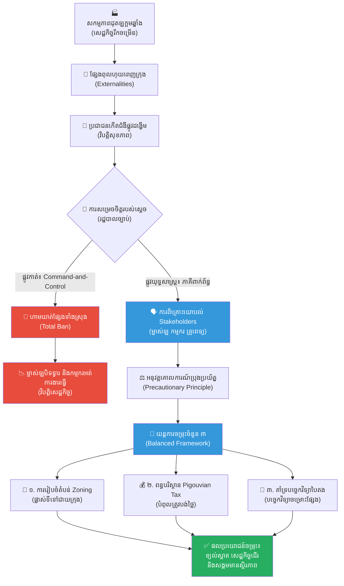

# ២៦៣ — ស្តេចដែលហាមឃាត់ផ្សែងពុល (The King Who Banned the Smoke)៖ ក្រមសីលធម៌បរិស្ថាន យន្តការរដ្ឋបាល និងការដោះស្រាយវិបត្តិ

**Author:** ichamrong  
**Date:** 2026-05-27  
**Tags:** #environmental-policy #ethics #command-and-control #precautionary-principle #market-instruments #stakeholder-theory #business-sustainability  
**Category:** Business Sustainability  
**Read Time:** ~12 min  

---

## 📌 មាតិកា (Table of Contents)
- [អន្ទាក់ផ្លូវចិត្ត / វិបត្តិធុរកិច្ច (The Dilemma)](#អន្ទាក់ផ្លូវចិត្ត--វិបត្តិធុរកិច្ច-the-dilemma)
- [១. រឿងនិទានប្រៀបធៀប៖ ស្តេចដែលហាមឃាត់ផ្សែងពុល (The Parable Story)](#១-រឿងនិទានប្រៀបធៀប៖-ស្តេចដែលហាមឃាត់ផ្សែងពុល-the-parable-story)
- [២. ការវិភាគគំនិតសេដ្ឋកិច្ច និងបរិស្ថាន (Theoretical Analysis)](#២-ការវិភាគគំនិតសេដ្ឋកិច្ច-និងបរិស្ថាន-theoretical-analysis)
  - [យន្តការរដ្ឋបាល Command-and-Control Regulation](#យន្តការរដ្ឋបាល-command-and-control-regulation)
  - [ឧបករណ៍ទីផ្សារ Market-Based Instruments (Cap-and-Trade / Pigouvian Tax)](#ឧបករណ៍ទីផ្សារ-market-based-instruments-cap-and-trade--pigouvian-tax)
  - [គោលការណ៍ប្រុងប្រយ័ត្នជាមុន Precautionary Principle](#គោលការណ៍ប្រុងប្រយ័ត្នជាមុន-precautionary-principle)
  - [ទ្រឹស្តីភាគីពាក់ព័ន្ធ Stakeholder Theory](#ទ្រឹស្តីភាគីពាក់ព័ន្ធ-stakeholder-theory)
  - [ផ្នត់គំនិតមនុស្សជាកណ្តាល Anthropocentrism ធៀបនឹងធម្មជាតិជាកណ្តាល Ecocentrism](#ផ្នត់គំនិតមនុស្សជាកណ្តាល-anthropocentrism-ធៀបនឹងធម្មជាតិជាកណ្តាល-ecocentrism)
- [៣. គំនូសតាងលំហូរការងារ (High-Contrast Flow Diagram)](#៣-គំនូសតាងលំហូរការងារ-high-contrast-flow-diagram)
- [៤. ឧទាហរណ៍ជាក់ស្តែងក្នុងពិភពពិត (Real World Examples)](#៤-ឧទាហរណ៍ជាក់ស្តែងក្នុងពិភពពិត-real-world-examples)
  - [ឧទាហរណ៍ទី ១ — កម្រិតមូលដ្ឋាន (កម្ពុជា)៖ ផ្សែងឡឥដ្ឋនៅខេត្តកណ្តាល និងការផ្លាស់ប្តូរឧស្សាហកម្ម](#ឧទាហរណ៍ទី-១--កម្រិតមូលដ្ឋាន-កម្ពុជា៖-ផ្សែងឡឥដ្ឋនៅខេត្តកណ្តាល-និងការផ្លាស់ប្តូរឧស្សាហកម្ម)
  - [ឧទាហរណ៍ទី ២ — កម្រិតសកលលោក៖ មហាវិនាសកម្មផ្សែងអ័ព្ទនៅឡុងដ៍ ឆ្នាំ ១៩៥២ (The London Great Smog of 1952)](#ឧទាហរណ៍ទី-២--កម្រិតសកលលោក៖-មហាវិនាសកម្មផ្សែងអ័ព្ទនៅឡុងដ៍-ឆ្នាំ-១៩៥២-the-london-great-smog-of-1952)
- [៥. ដំណោះស្រាយ និងមេរៀនធុរកិច្ច (Strategic Solutions & Takeaways)](#៥-ដំណោះស្រាយ-និងមេរៀនធុរកិច្ច-strategic-solutions--takeaways)
- [Related Posts](#related-posts)

---

## អន្ទាក់ផ្លូវចិត្ត / វិបត្តិធុរកិច្ច (The Dilemma)

តើអ្នកធ្លាប់ជួបស្ថានភាពដែលការអនុវត្តច្បាប់ ឬបទបញ្ញត្តិដ៏ម៉ឺងម៉ាត់មួយ មានបំណងល្អចង់ការពារសុខភាពសាធារណៈ ប៉ុន្តែបែរជាធ្វើឱ្យសេដ្ឋកិច្ចទាំងមូលដួលរលំ និងបំផ្លាញជីវភាពរបស់ប្រជាជនក្រីក្រទៅវិញដែរឬទេ?

នេះគឺជាវិបត្តិដ៏ធំបំផុតនៅក្នុង **គោលនយោបាយបរិស្ថាន (environmental policy)** និង **សីលធម៌ធុរកិច្ច (business ethics)**។ នៅពេលអ្នកដឹកនាំ ឬរដ្ឋបាលសាធារណៈប្រឈមមុខនឹងគ្រោះថ្នាក់បរិស្ថាន ពួកគេតែងតែជ្រើសរើសផ្លូវកាត់ដ៏ងាយស្រួលបំផុតមួយ គឺការប្រើប្រាស់អំណាចរដ្ឋបាលដើម្បីហាមឃាត់ទាំងស្រុង **(Command-and-Control Regulation)**។ ការសម្រេចចិត្តបែបរហ័សទាន់ចិត្តនេះហាក់ដូចជាមានប្រសិទ្ធភាពភ្លាមៗ ប៉ុន្តែវាបង្កើតឱ្យមានផលប៉ះពាល់អវិជ្ជមានជាប្រព័ន្ធ (systemic negative externalities) ដូចជាការបាត់បង់ការងារ ការកើនឡើងនៃភាពក្រីក្រ និងការជាប់គាំងនៃខ្សែច្រវាក់ផ្គត់ផ្គង់សកល។

ទន្ទឹមនឹងនេះ វិបត្តិសីលធម៌ក៏កើតឡើងផងដែរ៖ តើយើងគួរវាស់វែងតម្លៃនៃខ្យល់ស្អាត និងសុខភាពមនុស្សដោយរបៀបណា? តើផលប្រយោជន៍ភាគច្រើនរបស់សង្គមអាចយកមកធ្វើជាលេសដើម្បីបំផ្លាញការរស់រានមានជីវិតរបស់ក្រុមមនុស្សភាគតិចដែលជាសហគ្រិន និងកម្មករបានដែរឬទេ? ផែនទីបង្ហាញផ្លូវនៃអត្ថបទនេះនឹងជួយអ្នកឱ្យយល់កាន់តែច្បាស់អំពីបញ្ហានេះ៖
1. **រឿងនិទានប្រៀបធៀប (The Parable Story)** — រឿងរ៉ាវរបស់ព្រះរាជាដែលប្រឈមមុខនឹងផ្សែងពុលហុយចេញពីឡដុតក្អមឆ្នាំង និងតុល្យភាពរវាងសុខភាពសហគមន៍ និងសេដ្ឋកិច្ចទីក្រុង។
2. **ការវិភាគគំនិតសេដ្ឋកិច្ច និងបរិស្ថាន (Theoretical Analysis)** — ការសិក្សាអំពី Command-and-Control, Market-Based Instruments, Precautionary Principle, និងការប្រៀបធៀបរវាង Anthropocentrism និង Ecocentrism។
3. **គំនូសតាងលំហូរ (Mermaid Diagram)** — បង្ហាញពីប្រព័ន្ធដោះស្រាយវិបត្តិ និងទំនាក់ទំនងភាគីពាក់ព័ន្ធ។
4. **ឧទាហរណ៍ជាក់ស្តែងក្នុងពិភពពិត (Real World Examples)** — ករណីឡឥដ្ឋនៅកម្ពុជា និងប្រវត្តិច្បាប់ Clean Air Act នៅអង់គ្លេស។
5. **ដំណោះស្រាយយុទ្ធសាស្ត្រ (Strategic Solutions)** — វិធីសាស្ត្រសម្រាប់ធុរកិច្ច និងអ្នកបង្កើតគោលនយោបាយក្នុងការគ្រប់គ្រងអន្តរកាលបៃតងប្រកបដោយចីរភាព។

---

## ១. រឿងនិទានប្រៀបធៀប៖ ស្តេចដែលហាមឃាត់ផ្សែងពុល (The Parable Story)

នាសម័យបុរាណ មានបុរីដ៏រុងរឿងមួយឈ្មោះថា **ឥន្ទ្របុរៈ (Indrapura)** ដែលល្បីល្បាញខាងសិប្បកម្មផលិតក្អមឆ្នាំងដី និងក្បឿងដុត (pottery and ceramic tiles)។ ទីក្រុងនេះមានឡដុតក្អមឆ្នាំងដី (pottery kilns) រាប់រយដែលដំណើរការយប់ថ្ងៃដើម្បីផ្គត់ផ្គង់ដល់ការនាំចេញទៅកាន់នគរជិតខាង។ សិប្បកម្មនេះគឺជាឆ្អឹងខ្នងសេដ្ឋកិច្ច (economic backbone) របស់ទីក្រុង ដែលបង្កើតការងារដល់កម្មកររាប់ម៉ឺននាក់ និងនាំមកនូវទ្រព្យសម្បត្តិយ៉ាងមហាសាលដល់ម្ចាស់សហគ្រាស (factory owners)។

ទោះជាយ៉ាងណាក៏ដោយ ភាពរុងរឿងនេះត្រូវបង់ថ្លៃដោយការខូចខាតបរិស្ថានយ៉ាងធ្ងន់ធ្ងរ។ ផ្សែងខ្មៅ និងធូលីហុយ (soot and toxic smoke) ចេញពីឡដុតដែលប្រើប្រាស់អុស និងធ្យូងថ្មបានហុយគ្របដណ្តប់ពេញផ្ទៃមេឃនៃបុរីឥន្ទ្របុរៈ។ មិនយូរប៉ុន្មាន ប្រជាជននៅក្នុងទីក្រុងចាប់ផ្តើមកើតជំងឺផ្លូវដង្ហើម (respiratory illnesses) យ៉ាងខ្លាំង។ កុមារ និងមនុស្សចាស់ជរាជាច្រើនបានធ្លាក់ខ្លួនឈឺ ហើយអ្នកខ្លះទៀតត្រូវបាត់បង់ជីវិតដោយសារការដកដង្ហើមស្រូបយកខ្យល់ពុល (poisoned air) នេះ។

នៅពេលឃើញទុក្ខលំបាករបស់ប្រជារាស្ត្រ ព្រះរាជាទ្រង់មានព្រះកំហឹងយ៉ាងខ្លាំង។ ដោយចង់ដោះស្រាយបញ្ហានេះជាបន្ទាន់ ព្រះអង្គបានចេញព្រះរាជក្រឹត្យដ៏ម៉ឺងម៉ាត់មួយគឺ៖ **«ហាមឃាត់ការបង្ហុយផ្សែងគ្រប់ប្រភេទចេញពីឡដុតទាំងអស់នៅក្នុងទីក្រុងទាំងស្រុង និងជាបន្ទាន់»**។ នេះគឺជាវិធានការរដ្ឋបាលបែបក្តៅគគុក ឬហៅថា **Command-and-Control Regulation**។

ភ្លាមៗបន្ទាប់ពីក្រឹត្យនេះត្រូវបានប្រកាស ផ្សែងខ្មៅក៏រលាយបាត់ពីផ្ទៃមេឃ ខ្យល់អាកាសប្រែជាស្អាតបរិសុទ្ធឡើងវិញ។ ប៉ុន្តែ ផលវិបាកសេដ្ឋកិច្ចដ៏ធ្ងន់ធ្ងរបានកើតឡើងភ្លាមៗដែរ។ ម្ចាស់ឡដុតទាំងអស់ត្រូវបានបង្ខំចិត្តបិទទ្វារអាជីវកម្មព្រោះមិនអាចដុតក្អមឆ្នាំងដោយគ្មានផ្សែងបានឡើយ។ កម្មកររាប់ម៉ឺននាក់ស្រាប់តែបាត់បង់ការងារធ្វើ (unemployment) គ្មានប្រាក់ចំណូលសម្រាប់ទិញអាហារ អាជីវករលក់ដូរ និងឈ្មួញនាំចេញត្រូវក្ស័យធន ហើយវិបត្តិអត់ឃ្លាន និងឧក្រិដ្ឋកម្មបានចាប់ផ្តើមកើតមានឡើងពេញទីក្រុងជំនួសវិញ។ ម្ចាស់ឡដុត និងប្រជាជនក្រីក្របានប្រមូលផ្តុំគ្នាតវ៉ានៅមុខព្រះបរមរាជវាំង ដោយស្រែកថ្ងូរថា៖ *«ការហាមឃាត់ផ្សែងពិតជាបានជួយសង្គ្រោះយើងពីជំងឺសួត ប៉ុន្តែវាដុតសម្លាប់ក្រពះរបស់យើង និងក្រុមគ្រួសារដោយការអត់ឃ្លានទៅវិញ!»*

ស្ថិតក្នុងស្ថានភាពទាល់ច្រកនេះ ទស្សនវិទូវិទូដ៏ឈ្លាសវៃម្នាក់នាម **កោវិទ (Kovid)** បានចូលគាល់ព្រះរាជា ហើយបានលើកឡើងនូវទស្សនៈសីលធម៌ ៣ ចំណុច ដើម្បីជួយព្រះអង្គពិចារណា៖

*   **ទី១ — ទស្សនៈផលប្រយោជន៍និយម (The Utilitarian Case)៖** គោលនយោបាយត្រូវបង្កើតផលប្រយោជន៍ធំបំផុតដល់មនុស្សចំនួនច្រើនបំផុត (greatest good for the greatest number)។ ប្រសិនបើការរក្សាខ្យល់ស្អាតជួយសង្គ្រោះប្រជាជន ១០,០០០ នាក់ឱ្យរួចផុតពីជំងឺ ប៉ុន្តែវាធ្វើឱ្យម្ចាស់ឡដុត ១០០ នាក់ខាតបង់ទ្រព្យសម្បត្តិ នោះសកម្មភាពនេះគឺត្រឹមត្រូវតាមបែបផលប្រយោជន៍និយម។ ប៉ុន្តែប្រសិនបើការហាមឃាត់នោះធ្វើឱ្យកម្មករ ២០,០០០ នាក់អត់បាយ និងបង្កចលាចលសង្គម នោះផលប៉ះពាល់អវិជ្ជមានសរុបប្រហែលជាធំជាងផលប្រយោជន៍ដែលទទួលបានពីខ្យល់ស្អាតទៅទៀត។
*   **ទី២ — ទស្សនៈផ្អែកលើសិទ្ធិជាមូលដ្ឋាន (The Rights-Based Case)៖** មនុស្សគ្រប់រូបមានសិទ្ធិជាមូលដ្ឋានដែលមិនអាចរំលោភបំពានបានក្នុងការរស់នៅក្នុងបរិស្ថានដែលគ្មានជាតិពុល (right to clean air)។ ទោះបីជាការដុតឡនាំមកនូវលុយកាក់ និងផលចំណេញដល់អាជីវកម្ម និងរដ្ឋយ៉ាងណាក៏ដោយ ក៏គ្មានសហគ្រាសណាមួយមានសិទ្ធិយកសុខភាព និងជីវិតរបស់អ្នកដទៃមកធ្វើជាឈ្នាន់ដើម្បីផលចំណេញផ្ទាល់ខ្លួននោះឡើយ។
*   **ទី៣ — ទស្សនៈធម្មជាតិជាកណ្តាល (The Ecocentric Case)៖** ធម្មជាតិ បក្សី សត្វ និងដើមឈើនៅក្នុងបុរីឥន្ទ្របុរៈ សុទ្ធតែមានតម្លៃខាងក្នុងផ្ទាល់ខ្លួន (intrinsic value) មិនមែនគ្រាន់តែជាឧបករណ៍បម្រើឱ្យតម្រូវការរបស់មនុស្សឡើយ។ ផ្សែងពុលមិនត្រឹមតែធ្វើឱ្យមនុស្សឈឺទេ តែវាបានបំផ្លាញប្រព័ន្ធអេកូឡូស៊ីទាំងមូលនៃទឹកដីនេះ។

ព្រះរាជាទ្រង់ព្រះសណ្ដាប់ដោយការយកចិត្តទុកដាក់។ ទ្រង់បានសួរទៅកាន់ទស្សនវិទូ កោវិទ ថា៖ *«ប៉ុន្តែនៅពេលនោះ យើងមិនទាន់មានភស្តុតាងវិទ្យាសាស្ត្រច្បាស់លាស់ ១០០% ថាផ្សែងនេះជាមូលហេតុតែមួយគត់ដែលសម្លាប់មនុស្សនៅឡើយទេ វាគ្រាន់តែជាការសង្ស័យប៉ុណ្ណោះ។ តើយើងគួររង់ចាំការស្រាវជ្រាវជាមុនសិន ឬយ៉ាងណា?»*

កោវិទ បានទូលតបវិញថា៖ *«ក្រោមក្បួនច្បាប់នៃ **គោលការណ៍ប្រុងប្រយ័ត្នជាមុន (Precautionary Principle)** នៅពេលមានហានិភ័យនៃគ្រោះមហន្តរាយធ្ងន់ធ្ងរ ឬការខូចខាតដែលមិនអាចស្តារឡើងវិញបាន ទោះបីជាគ្មានភាពច្បាស់លាស់ខាងវិទ្យាសាស្ត្រពេញលេញក៏ដោយ ក៏យើងមិនត្រូវយកវាមកធ្វើជាលេសដើម្បីពន្យារពេលវិធានការការពារនោះឡើយ។ ប៉ុន្តែ វិធានការនោះមិនត្រូវធ្វើឡើងដោយការបិទភ្នែកចោលសេដ្ឋកិច្ចទាំងស្រុងនោះទេ»*។

ដោយទទួលបានពន្លឺនៃការយល់ដឹង ព្រះរាជាបានសម្រេចចិត្តលុបចោលការហាមឃាត់ទាំងស្រុង ហើយបានកោះហៅ **ភាគីពាក់ព័ន្ធទាំងអស់ (stakeholders)** រួមមាន៖ ម្ចាស់ឡដុត តំណាងកម្មករ គ្រូពេទ្យប្រចាំទីក្រុង និងឈ្មួញនាំចេញ មកជួបជុំគ្នាដើម្បីពិភាក្សាស្វែងរកដំណោះស្រាយរួមគ្នា។

ចុងក្រោយ ព្រះរាជាបានដាក់ចេញនូវគោលនយោបាយចម្រុះដ៏មានតុល្យភាព៖
1.  **ការរៀបចំតំបន់ឧស្សាហកម្មដាច់ដោយឡែក (Zoning)៖** បង្ខំឱ្យផ្លាស់ប្តូរទីតាំងឡដុតទាំងអស់ទៅកាន់តំបន់ជាយក្រុងប៉ែកខាងក្រោមខ្យល់។
2.  **ការដាក់កំហិតបរិមាណផ្សែង និងពន្ធបរិស្ថាន (Pigouvian Tax / Emission Fee)៖** ឡដុតណាដែលបង្ហុយផ្សែងលើសកម្រិតកំណត់ត្រូវបង់ពន្ធបន្ថែម ដែលថវិកានេះត្រូវបានយកមកប្រើប្រាស់សម្រាប់គាំទ្រការព្យាបាលជំងឺ និងដាំដើមឈើឡើងវិញ។
3.  **ការគាំទ្របច្ចេកវិទ្យាបៃតង៖** រដ្ឋផ្តល់ការលើកទឹកចិត្ត និងកម្ចីការប្រាក់ទាបដល់ម្ចាស់ឡដុតទាំងឡាយណាដែលផ្លាស់ប្តូរមកប្រើប្រាស់បច្ចេកវិទ្យាចម្រោះផ្សែង និងការដុតដោយប្រើប្រាស់ថាមពលស្អាតជាងមុន។

ជាលទ្ធផល បុរីឥន្ទ្របុរៈអាចរក្សាបាននូវភាពស្អាតនៃខ្យល់អាកាស សុខភាពរបស់ប្រជាពលរដ្ឋត្រូវបានការពារ ខណៈពេលដែលអាជីវកម្មសិប្បកម្មក្អមឆ្នាំងនៅតែអាចបន្តរីកចម្រើន និងផ្តល់ការងារដល់កម្មកររាប់ម៉ឺននាក់ដដែល។

---

## ២. ការវិភាគគំនិតសេដ្ឋកិច្ច និងបរិស្ថាន (Theoretical Analysis)

រឿងនិទានប្រៀបធៀបខាងលើឆ្លុះបញ្ចាំងពីគោលការណ៍គ្រឹះនៃគោលនយោបាយបរិស្ថាន និងទ្រឹស្តីសីលធម៌សេដ្ឋកិច្ចកម្រិតមហាវិទ្យាល័យ ដូចខាងក្រោម៖

### យន្តការរដ្ឋបាល Command-and-Control Regulation
យន្តការនេះ សំដៅលើការដែលរដ្ឋាភិបាល ឬអ្នកបង្កើតច្បាប់កំណត់ស្តង់ដារជាក់លាក់មួយ និងចេញច្បាប់ហាមឃាត់ ឬបង្ខំឱ្យអនុវត្តតាមដោយផ្ទាល់ ព្រមទាំងមានទោសទណ្ឌចំពោះអ្នកល្មើសច្បាប់។
*   **ចំណុចខ្លាំង៖** មានភាពច្បាស់លាស់ ងាយស្រួលយល់ និងមានប្រសិទ្ធភាពភ្លាមៗក្នុងការបញ្ឈប់សកម្មភាពគ្រោះថ្នាក់ខ្លាំង (ដូចជាការហាមឃាត់សារធាតុគីមីពុលខ្លាំង)។
*   **ចំណុចខ្សោយ៖** ខ្វះភាពបត់បែន (inflexibility) មិនគិតពីការចំណាយរបស់អាជីវកម្មម្នាក់ៗ និងមិនលើកទឹកចិត្តឱ្យសហគ្រាសច្នៃប្រឌិតបច្ចេកវិទ្យាថ្មីដើម្បីកាត់បន្ថយការបំពុលឱ្យកាន់តែទាបជាងច្បាប់កំណត់នោះឡើយ។

### ឧបករណ៍ទីផ្សារ Market-Based Instruments (Cap-and-Trade / Pigouvian Tax)
ផ្ទុយពីការហាមឃាត់ ឧបករណ៍ទីផ្សារប្រើប្រាស់យន្តការតម្លៃដើម្បីផ្លាស់ប្តូរឥរិយាបថអាជីវកម្ម៖
*   **ពន្ធ Pigouvian Tax (ពន្ធលើការបំពុល)៖** គឺជាការដាក់ពន្ធលើសកម្មភាពណាដែលបង្កើតផលប៉ះពាល់អវិជ្ជមានដល់សង្គម ដើម្បីឱ្យតម្លៃទីផ្សារឆ្លុះបញ្ចាំងពីតម្លៃបរិស្ថានពិតប្រាកដ (internalizing externalities)។
*   **ប្រព័ន្ធ Cap-and-Trade (ការកំណត់ដែនកំណត់ និងការជួញដូរកាតាបំពុល)៖** រដ្ឋកំណត់បរិមាណបំពុលសរុបដែលអាចអនុញ្ញាតបាន រួចបែងចែក ឬដេញថ្លៃ «កាតាអនុញ្ញាតបំពុល» (emissions permits)។ សហគ្រាសណាដែលកាត់បន្ថយការបំពុលបានល្អ អាចលក់កាតានេះទៅឱ្យសហគ្រាសផ្សេងទៀតដែលពិបាកកាត់បន្ថយ ដែលនេះបង្កើតឱ្យមានប្រសិទ្ធភាពសេដ្ឋកិច្ចខ្ពស់បំផុត។

### គោលការណ៍ប្រុងប្រយ័ត្នជាមុន Precautionary Principle
ចែងថា *«នៅពេលសកម្មភាព ឬផលិតផលណាមួយមានហានិភ័យបង្កផលប៉ះពាល់ធ្ងន់ធ្ងរ ឬមិនអាចកែខៃបានដល់បរិស្ថាន ឬសុខភាពសាធារណៈ ភាពមិនច្បាស់លាស់ខាងវិទ្យាសាស្ត្រមិនត្រូវយកមកប្រើជាហេតុផលដើម្បីពន្យារពេលវិធានការការពារឡើយ»*។ គោលការណ៍នេះប្តូរមុខងារបន្ទុកនៃការបង្ហាញភស្តុតាង (burden of proof) ទៅឱ្យអ្នកដែលចង់ធ្វើសកម្មភាពនោះវិញ ជាជាងឱ្យជនរងគ្រោះជាអ្នកស្វែងរកភស្តុតាងមកបញ្ជាក់។

### ទ្រឹស្តីភាគីពាក់ព័ន្ធ Stakeholder Theory
បង្កើតឡើងដោយលោក **R. Edward Freeman** ដែលចែងថា គោលបំណងរបស់ធុរកិច្ច ឬអ្នកបង្កើតគោលនយោបាយ មិនមែនគ្រាន់តែដើម្បីបម្រើផលប្រយោជន៍ម្ចាស់ភាគហ៊ុន (shareholders) នោះឡើយ ប៉ុន្តែត្រូវបង្កើតតម្លៃ និងការសម្របសម្រួលផលប្រយោជន៍រវាងភាគីពាក់ព័ន្ធទាំងអស់ (stakeholders) ដែលរងផលប៉ះពាល់ រួមមាន បុគ្គលិក អតិថិជន សហគមន៍មូលដ្ឋាន និងបរិស្ថាន។

### ផ្នត់គំនិតមនុស្សជាកណ្តាល Anthropocentrism ធៀបនឹងធម្មជាតិជាកណ្តាល Ecocentrism
*   **Anthropocentrism (មនុស្សជាកណ្តាល)៖** ជឿជាក់ថាមនុស្សគឺជាសេចក្តីត្រូវការ និងជាអ្នកមានតម្លៃខ្ពស់បំផុតនៅលើផែនដី។ ធម្មជាតិមានតម្លៃត្រឹមតែជាឧបករណ៍ (instrumental value) សម្រាប់បម្រើផលប្រយោជន៍ និងការរស់រានរបស់មនុស្សប៉ុណ្ណោះ។
*   **Ecocentrism (ធម្មជាតិជាកណ្តាល)៖** យល់ឃើញថាធម្មជាតិ និងប្រព័ន្ធអេកូឡូស៊ីទាំងមូលមានតម្លៃខាងក្នុងផ្ទាល់ខ្លួន (intrinsic value) ដែលត្រូវតែគោរព និងការពារ ដោយមិនខ្វល់ថាវាផ្តល់ផលប្រយោជន៍ដល់មនុស្សឬអត់នោះឡើយ។

---

## ៣. គំនូសតាងលំហូរការងារ (High-Contrast Flow Diagram)

គំនូសតាងខាងក្រោមបង្ហាញពីការផ្លាស់ប្តូរយុទ្ធសាស្ត្រពីរដ្ឋបាលបែបហាមឃាត់ទាំងស្រុង ទៅជាការគ្រប់គ្រងបែបចម្រុះប្រកបដោយចីរភាព៖

---

## ៤. ឧទាហរណ៍ជាក់ស្តែងក្នុងពិភពពិត (Real World Examples)

### ឧទាហរណ៍ទី ១ — កម្រិតមូលដ្ឋាន (កម្ពុជា)៖ ផ្សែងឡឥដ្ឋនៅខេត្តកណ្តាល និងការផ្លាស់ប្តូរឧស្សាហកម្ម
នៅក្នុងប្រទេសកម្ពុជា ពិសេសនៅតាមបណ្តោយដងទន្លេក្នុងខេត្តកណ្តាល មានសិប្បកម្មឡឥដ្ឋ (brick kilns) រាប់រយដែលដុតផ្គត់ផ្គង់ដល់វិស័យសំណង់ដ៏មមាញឹកនៅភ្នំពេញ។ 
*   **បញ្ហា៖** កាលពីមុន ឡឥដ្ឋភាគច្រើនប្រើប្រាស់អុស កៅស៊ូកង់ឡាន ឬកាកសំណល់វាយនភណ្ឌ (garment waste) ដើម្បីដុត ដែលបង្កើតឱ្យមានផ្សែងខ្មៅពុល និងប៉ះពាល់យ៉ាងធ្ងន់ធ្ងរដល់ប្រព័ន្ធដង្ហើមរបស់សហគមន៍មូលដ្ឋាន និងកម្មករ។
*   **ការដោះស្រាយ៖** ក្រសួងបរិស្ថានមិនបានជ្រើសរើសការបិទឡឥដ្ឋទាំងអស់ភ្លាមៗដែលនាំឱ្យខូចខាតសង្វាក់សំណង់ជាតិ និងធ្វើឱ្យកម្មកររាប់ម៉ឺននាក់បាត់បង់ការងារនិងជាប់បំណុលនោះឡើយ។ ផ្ទុយទៅវិញ ក្រសួងបានអនុវត្តការចុះត្រួតពិនិត្យ ណែនាំឱ្យផ្លាស់ប្តូរការដុតទៅប្រើប្រាស់ **អង្កាម (rice husk)** ដែលជាកាកសំណល់កសិកម្មមានការបំពុលទាប និងជំរុញឱ្យតម្លើងប្រព័ន្ធចម្រោះផ្សែង ព្រមទាំងផាកពិន័យចំពោះសហគ្រាសណាដែលលួចដុតកាកសំណល់កៅស៊ូ ឬក្រណាត់។ នេះគឺជាតុល្យភាពរវាងការបន្តដកដង្ហើមរបស់សេដ្ឋកិច្ច និងការដកដង្ហើមរបស់មនុស្សពិតប្រាកដ។

### ឧទាហរណ៍ទី ២ — កម្រិតសកលលោក៖ មហាវិនាសកម្មផ្សែងអ័ព្ទនៅឡុងដ៍ ឆ្នាំ ១៩៥២ (The London Great Smog of 1952)
នៅក្នុងខែធ្នូ ឆ្នាំ ១៩៥២ ទីក្រុងឡុងដ៍បានរងគ្រោះដោយផ្សែងអ័ព្ទពុលពីរោងចក្រឧស្សាហកម្ម និងការដុតធ្យូងថ្មតាមផ្ទះ (coal burning) គ្របដណ្តប់ទីក្រុងរយៈពេល ៥ ថ្ងៃ ដែលសម្លាប់មនុស្សដោយផ្ទាល់ និងប្រយោលប្រមាណ ១២,០០០ នាក់។
*   **ការឆ្លើយតបគោលនយោបាយ៖** រដ្ឋាភិបាលអង់គ្លេសមិនបានហាមឃាត់ការប្រើប្រាស់ថាមពលទាំងស្រុងឡើយ ប៉ុន្តែបានអនុម័តច្បាប់ **Clean Air Act 1956** ដែលជាច្បាប់បរិស្ថានប្រវត្តិសាស្ត្រ។ 
*   **យន្តការ៖** ច្បាប់នេះបានបង្កើតតំបន់គ្រប់គ្រងផ្សែង (Smoke Control Areas) ដែលតម្រូវឱ្យផ្ទះ និងរោងចក្រក្នុងតំបន់នោះដុតតែឥន្ធនៈដែលគ្មានផ្សែង (smokeless fuels) ផ្តល់ការឧបត្ថម្ភធន (subsidies) ដល់ប្រជាពលរដ្ឋដើម្បីប្តូរចង្ក្រាន និងផ្លាស់ទីរោងចក្រអគ្គិសនីដុតធ្យូងថ្មធំៗចេញពីកណ្តាលក្រុង។ នេះជាគំរូនៃការប្រើប្រាស់ច្បាប់រដ្ឋបាលគួបផ្សំនឹងការគាំទ្រហិរញ្ញវត្ថុដើម្បីផ្លាស់ប្តូររចនាសម្ព័ន្ធសង្គម។

---

## ៥. ដំណោះស្រាយ និងមេរៀនធុរកិច្ច (Strategic Solutions & Takeaways)

សម្រាប់អ្នកគ្រប់គ្រងសហគ្រាស និងអ្នករៀបចំគោលនយោបាយបច្ចុប្បន្ន នេះជាយុទ្ធសាស្ត្រគន្លឹះដើម្បីជៀសវាងវិបត្តិបរិស្ថាន និងការទាល់ច្រកនៃបទបញ្ញត្តិ៖

1.  **ការវាយតម្លៃផលប៉ះពាល់បរិស្ថាន និងសង្គមជាមុន (ESIA - Environmental and Social Impact Assessment)៖** ធុរកិច្ចត្រូវវាយតម្លៃពីផលប៉ះពាល់អវិជ្ជមានរបស់ខ្លួនលើសហគមន៍តាំងពីមុនចាប់ផ្តើមដំណើរការ ដើម្បីបង្កើតប្រព័ន្ធការពារជាមុន ជៀសវាងការប្រឈមនឹងការបង្ខំបិទទ្វារពីរដ្ឋាភិបាលនៅពេលក្រោយ។
2.  **ការអនុវត្តយន្តការថ្លៃកាបូនផ្ទៃក្នុង (Internal Carbon/Pollution Pricing)៖** សហគ្រាសធំៗគួរតែបង្កើត «តម្លៃពន្ធផ្ទៃក្នុង» សម្រាប់ការបំពុលនីមួយៗ ដើម្បីជំរុញឱ្យផ្នែកផលិតកម្មស្វែងរកបច្ចេកវិទ្យាស្អាតជាងមុនដោយខ្លួនឯង ដោយមិនបាច់រង់ចាំដល់មានច្បាប់បង្ខំពីខាងក្រៅឡើយ។
3.  **ការកសាងប្រព័ន្ធទំនាក់ទំនងភាគីពាក់ព័ន្ធ (Stakeholder Engagement Framework)៖** បង្កើតវេទិកាសន្ទនាទៀងទាត់ជាមួយសហគមន៍ជុំវិញ និងអាជ្ញាធរដែនដី ដើម្បីដោះស្រាយការត្អូញត្អែរ និងកសាងការទុកចិត្តគ្នា។ ការធ្វើបែបនេះជួយឱ្យសហគ្រាសរក្សាបាននូវ **«អាជ្ញាប័ណ្ណសង្គមដើម្បីដំណើរការ» (Social License to Operate)**។
4.  **អន្តរកាលបៃតងប្រកបដោយសមធម៌ (Just Transition)៖** នៅពេលរដ្ឋ ឬសហគ្រាសផ្លាស់ប្តូរបច្ចេកវិទ្យាទៅជាបៃតង ត្រូវមានផែនការបណ្តុះបណ្តាលឡើងវិញ (reskilling) និងគាំទ្រហិរញ្ញវត្ថុដល់កម្មករនិយោជិតដែលរងផលប៉ះពាល់ ដើម្បីធានាថាគ្មាននរណាម្នាក់ត្រូវបានបោះបង់ចោលនៅក្នុងដំណើរការអភិវឌ្ឍន៍ចីរភាពនោះឡើយ។

---

## Related Posts

*   **[Environmental Policy & Ethics](../04-environmental-policy-and-ethics.md)** — ការសិក្សាអំពីក្របខ័ណ្ឌគោលនយោបាយបរិស្ថាន គោលការណ៍សីលធម៌បរិស្ថាន រួមមាន គោលការណ៍ប្រុងប្រយ័ត្នជាមុន (precautionary principle) ទ្រឹស្តីភាគីពាក់ព័ន្ធ (stakeholder theory) និងការប្រៀបធៀបឧបករណ៍គោលនយោបាយចម្រុះ។
*   **[The Tragedy of the Commons (សោកនាដកម្មនៃទ្រព្យរួម)៖ វិបត្តិវាលស្មៅ និងការបាត់បង់តុល្យភាពអេកូឡូស៊ី](../../sustainability-advanced/parables/254-the-smoke-that-cost-a-kingdom.md)** — ការស្វែងយល់ពីរបៀបដែលផលប្រយោជន៍ផ្ទាល់ខ្លួនបំផ្លាញធនធានរួមរបស់សហគមន៍។
*   **[Externalities and Market Failures (ផលប៉ះពាល់ក្រៅប្រព័ន្ធ និងការបរាជ័យទីផ្សារ)](../01-principles-of-microeconomics.md)** — របៀបដែលទីផ្សារសេរីបរាជ័យក្នុងការគិតគូរពីថ្លៃខូចខាតបរិស្ថាន និងដំណោះស្រាយពន្ធរបស់រដ្ឋ។
