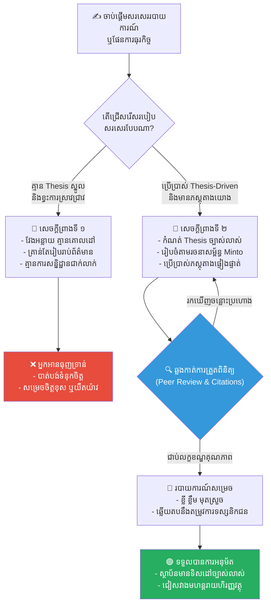

# ២៦៤ — ស្មេរដែលកែប្រែព្រះរាជាណាចក្រ (The Scribe Who Changed the Kingdom)៖ សិល្បៈនៃការតែងនិពន្ធ ការស្រាវជ្រាវ និងការកសាងអំណះអំណាងក្នុងធុរកិច្ច

**Author:** ichamrong  
**Date:** 2026-05-27  
**Tags:** #writing-seminar #thesis-driven #evidence-based #business-sustainability #critical-reading #cambodian-context  
**Category:** Business Sustainability  
**Read Time:** ~12 min  

---

## 📌 មាតិកា (Table of Contents)
- [វិបត្តិធុរកិច្ច និងអន្ទាក់នៃព័ត៌មានលំអៀង (The Dilemma / The Trap)](#វិបត្តិធុរកិច្ច-និងអន្ទាក់នៃព័ត៌មានលំអៀង-the-dilemma--the-trap)
- [១. រឿងនិទានប្រៀបធៀប៖ ស្មេរដែលកែប្រែព្រះរាជាណាចក្រ (The Parable Story)](#១-រឿងនិទានប្រៀបធៀប៖-ស្មេរដែលកែប្រែព្រះរាជាណាចក្រ-the-parable-story)
- [២. ការវិភាគគំនិតសរសេរ និងការកសាងអំណះអំណាង (Theoretical Analysis)](#២-ការវិភាគគំនិតសរសេរ-និងការកសាងអំណះអំណាង-theoretical-analysis)
  - [ក. ការអះអាងស្នូល ឬសារធាតុសម្មតិកម្ម (The Central Thesis Statement)](#ក-ការអះអាងស្នូល-ឬសារធាតុសម្មតិកម្ម-the-central-thesis-statement)
  - [ខ. គោលការណ៍រៀបចំរចនាសម្ព័ន្ធអំណះអំណាង (Minto Pyramid Principle)](#ខ-គោលការណ៍រៀបចំរចនាសម្ព័ន្ធអំណះអំណាង-minto-pyramid-principle)
  - [គ. ភស្តុតាង និងប្រភពយោងដែលគួរឱ្យទុកចិត្ត (Peer-Reviewed Evidence & Citations)](#គ-ភស្តុតាង-និងប្រភពយោងដែលគួរឱ្យទុកចិត្ត-peer-reviewed-evidence--citations)
  - [ឃ. ការយល់ដឹងពីទស្សនិកជនគោលដៅ (Audience Awareness)](#ឃ-ការយល់ដឹងពីទស្សនិកជនគោលដៅ-audience-awareness)
- [៣. គំនូសតាងលំហូរការងារក្នុងការកសាងអំណះអំណាង (Workflow Diagram)](#៣-គំនូសតាងលំហូរការងារក្នុងការកសាងអំណះអំណាង-workflow-diagram)
- [៤. ឧទាហរណ៍ជាក់ស្តែងក្នុងពិភពពិត (Real World Examples)](#៤-ឧទាហរណ៍ជាក់ស្តែងក្នុងពិភពពិត-real-world-examples)
  - [ឧទាហរណ៍ទី ១៖ របាយការណ៍វាយតម្លៃផលប៉ះពាល់បរិស្ថាន និងសង្គម (EIA) នៅក្នុងប្រទេសកម្ពុជា](#ឧទាហរណ៍ទី-១៖-របាយការណ៍វាយតម្លៃផលប៉ះពាល់បរិស្ថាន-និងសង្គម-eia-នៅក្នុងប្រទេសកម្ពុជា)
  - [ឧទាហរណ៍ទី ២៖ របាយការណ៍វិភាគធុរកិច្ច និងអភិបាលកិច្ចបរិស្ថាន (ESG Whitepaper) របស់ក្រុមហ៊ុនលំដាប់សកល](#ឧទាហរណ៍ទី-២៖-របាយការណ៍វិភាគធុរកិច្ច-និងអភិបាលកិច្ចបរិស្ថាន-esg-whitepaper-របស់ក្រុមហ៊ុនលំដាប់សកល)
- [៥. ដំណោះស្រាយយុទ្ធសាស្ត្រសម្រាប់ធុរកិច្ច (Strategic Solutions & Takeaways)](#៥-ដំណោះស្រាយយុទ្ធសាស្ត្រសម្រាប់ធុរកិច្ច-strategic-solutions--takeaways)
- [Related Posts / Course Link](#related-posts--course-link)

---

## វិបត្តិធុរកិច្ច និងអន្ទាក់នៃព័ត៌មានលំអៀង (The Dilemma / The Trap)

នៅក្នុងយុគសម័យព័ត៌មានវិទ្យាដ៏ទំនើប ថ្នាក់ដឹកនាំ និងអ្នកធ្វើសេចក្តីសម្រេចចិត្ត (decision-makers) តែងតែត្រូវបានជន់លិចដោយទិន្នន័យ និងរបាយការណ៍រាប់ពាន់ទំព័រជារៀងរាល់ថ្ងៃ។ ទោះជាយ៉ាងណាក៏ដោយ បញ្ហាធំបំផុតដែលស្ថាប័នជាច្រើនជួបប្រទះ មិនមែនជាការខ្វះខាតទិន្នន័យនោះទេ ប៉ុន្តែវាគឺ **«វិបត្តិព័ត៌មានអក្សរសាស្ត្រដែលគ្មានប្រធានបទស្នូល និងអំណះអំណាងច្បាស់លាស់» (The Thesis-less Information Trap)**។ 

នៅពេលដែលអ្នកវិភាគ ឬអ្នកស្រាវជ្រាវសរសេររបាយការណ៍ដោយគ្រាន់តែចងក្រងព័ត៌មានចាក់ស្រេះ គ្មានការអះអាង គ្មានទិសដៅសម្រេចចិត្ត និងគ្មានភស្តុតាងយោងច្បាស់លាស់ ពួកគេកំពុងតែបោះបន្ទុកនៃការវិភាគ (analytical burden) ទាំងស្រុងទៅលើអ្នកអានដែលរវល់ខ្លាំង។ របាយការណ៍ដែលមានលក្ខណៈស្រពិចស្រពិល (vague) មិនត្រឹមតែនាំទៅរកការខ្ជះខ្ជាយពេលវេលាប៉ុណ្ណោះទេ ប៉ុន្តែថែមទាំងអាចបង្កើតឱ្យមានការសម្រេចចិត្តខុសឆ្គងដែលនាំមកនូវមហន្តរាយដ៏ធំធេងដល់សង្គម បរិស្ថាន និងហិរញ្ញវត្ថុរបស់ស្ថាប័នផងដែរ។

នៅក្នុងបរិបទនៃនិរន្តរភាពធុរកិច្ច (business sustainability) ការសរសេរអត្ថបទ ឬរបាយការណ៍បែបស្រាវជ្រាវដែលខ្វះទិសដៅ និងភស្តុតាងរឹងមាំ គឺជាឫសគល់នៃគម្រោងបរាជ័យជាច្រើន។ តើធ្វើដូចម្តេចដើម្បីឱ្យការសរសេររបស់យើងប្រែក្លាយទៅជាឧបករណ៍ដែលមានឥទ្ធិពល អាចបញ្ចុះបញ្ចូលអ្នកដទៃ និងដឹកនាំពួកគេទៅរកសកម្មភាពត្រឹមត្រូវ? រឿងនិទានប្រៀបធៀបខាងក្រោមនឹងបង្ហាញពីគន្លឹះដ៏សំខាន់នេះ។

---

## ១. រឿងនិទានប្រៀបធៀប៖ ស្មេរដែលកែប្រែព្រះរាជាណាចក្រ (The Parable Story)

នាសម័យបុរាណ នៅក្នុងព្រះរាជាណាចក្រមួយដ៏រុងរឿងតាមដងទន្លេមេគង្គ ព្រះរាជាទ្រង់មានព្រះរាជតម្រិះចង់ស្ថាបនាទំនប់វារីអគ្គិសនី និងប្រព័ន្ធបារាយណ៍ខ្នាតយក្ស (giant reservoir/dam) ដើម្បីរក្សាទឹកសម្រាប់ជួយដល់វិស័យកសិកម្មរបស់រាស្ត្រពេញមួយឆ្នាំ។ គម្រោងនេះជាគម្រោងថ្នាក់ជាតិដ៏ធំធេង និងត្រូវចំណាយថវិកាជាតិយ៉ាងច្រើនសន្ធឹកសន្ធាប់ពីព្រះរាជទ្រព្យ។

ស្មេរវ័យក្មេងម្នាក់ឈ្មោះ **បុណ្យ (Bonn)** ត្រូវបានចាត់តាំងដោយក្រុមប្រឹក្សារាជវាំងឱ្យសរសេររបាយការណ៍ថ្វាយព្រះរាជា ដើម្បីជាមូលដ្ឋានក្នុងការសម្រេចព្រះទ័យថា តើគួរអនុញ្ញាតឱ្យសាងសង់ទំនប់នេះ ឬយ៉ាងណា។ 

ដោយសារចង់បង្ហាញពីភាពអព្យាក្រឹត និងចៀសវាងការខុសឆ្គង បុណ្យ បានចំណាយពេលជាច្រើនសប្តាហ៍ដើម្បីចងក្រងទិន្នន័យគ្រប់ទិសទី។ នៅក្នុងសេចក្តីព្រាងដំបូង (first draft) របស់ខ្លួន បុណ្យ បានសរសេរបើកឆាកយ៉ាងស្រពិចស្រពិល និងទូទៅជាទីបំផុត៖
> *«ការសាងសង់ទំនប់ទឹកនេះ គឺជាគម្រោងដ៏ធំមួយដែលមានទាំងអត្ថប្រយោជន៍ និងផលប៉ះពាល់ជាច្រើន ដែលទាមទារឱ្យអាជ្ញាធរពាក់ព័ន្ធទាំងអស់ត្រូវគិតគូរឱ្យបានដិតដល់បំផុត តាមរយៈការពិនិត្យមើលភស្តុតាងដែលមានស្រាប់ទាំងអស់...»*

របាយការណ៍កម្រាស់សាមសិបសន្លឹករបស់ បុណ្យ ត្រូវបានដាក់ថ្វាយដល់ព្រះហស្តព្រះរាជា។ ព្រះរាជាទ្រង់បានបើកមើល តែបន្ទាប់មកទ្រង់ក៏បោះវាទៅម្ខាងដោយក្តីធុញទ្រាន់។ គ្មានចំណុចណាមួយនៅក្នុងរបាយការណ៍នោះដែលអាចជួយឱ្យព្រះអង្គធ្វើសេចក្តីសម្រេចចិត្តបានឡើយ។ វាគ្រាន់តែជារាយការណ៍ពិពណ៌នាអំពីពិភពលោក (describing the world) ប៉ុន្តែមិនបានផ្តល់ជាគំនិតស្ថាបនា ឬទិសដៅអំណះអំណាងណាមួយឡើយ (arguing about it)។

ដោយឃើញ បុណ្យ អង្គុយសោកសៅ មេស្មេរចាស់ទុំដ៏មានបទពិសោធន៍ម្នាក់នាម **ចន្ទ្រា (Chanda)** បានដើរមកជិត ហើយទាញស្មារបស់បុណ្យទៅពិភាក្សាផ្ទាល់ខ្លួន។ ចន្ទ្រា បានពោលថា៖
> *«បុណ្យ អើយ! របាយការណ៍ដែលគ្មានការអះអាងស្នូល (thesis) គឺប្រៀបដូចជាគម្ពីរដែលពោពេញទៅដោយផ្សែងអ័ព្ទតែប៉ុណ្ណោះ។ ទ្រង់ជាព្រះរាជា មិនមែនជាអ្នកអានដែលទំនេរមកបកស្រាយទិន្នន័យជំនួសយើងនោះទេ។ ឯងត្រូវតែប្រាប់ព្រះរាជាឱ្យច្បាស់លាស់ពីអ្វីដែលឯងជឿជាក់ថាជាការពិត និងហេតុផលដែលគាំទ្រជំនឿនោះ!»*

គ្រូចន្ទ្រា ក៏បានបង្រៀន បុណ្យ នូវសសរស្តម្ភសំខាន់ៗបីនៃសិល្បៈតែងនិពន្ធដ៏មានអំណាច៖
1. **ការអះអាងស្នូល (The Central Thesis)**៖ រាល់របាយការណ៍ និងអំណះអំណាងទាំងអស់ត្រូវតែមានចំណុចអះអាងច្បាស់លាស់ ជាក់លាក់ និងអាចជជែកដេញដោលបាន (one clear, contestable claim) ដែលទិន្នន័យទាំងអស់ត្រូវតែរត់មកគាំទ្រចំណុចនេះ។
2. **ភស្តុតាង និងការយោងប្រភព (Evidence & Citation)**៖ គ្រប់ការអះអាងទាំងអស់ត្រូវតែមានភស្តុតាងរឹងមាំមកគាំទ្រ ដូចជាទិន្នន័យជាក់ស្តែង សាក្សីកម្ម ឬឯកសារយោងពីប្រភពដែលអាចផ្ទៀងផ្ទាត់បាន ដើម្បីបង្កើតឱ្យមានសេចក្តីទុកចិត្តខ្ពស់។
3. **ការយល់ដឹងពីទស្សនិកជនគោលដៅ (Audience Awareness)**៖ ត្រូវដឹងថាអ្នកណាកំពុងអានរបាយការណ៍នេះ។ ព្រះរាជាអានដើម្បីធ្វើការសម្រេចចិត្តរហ័ស (decisions); បណ្ឌិតអានដើម្បីស្វែងរកភស្តុតាងបញ្ជាក់ (proof); ចំណែកឯកសិករអានដើម្បីដឹងពីសកម្មភាពដែលត្រូវធ្វើ (action)។

បុណ្យ បានយល់ច្បាស់ពីរៀនសូត្រនេះ រួចក៏ត្រឡប់មកសរសេររបាយការណ៍ឡើងវិញទាំងស្រុង។ លើកនេះ គេបានបើកទំព័រដំបូងដោយការបញ្ជាក់ពីការអះអាងស្នូល (thesis statement) យ៉ាងមុតស្រួច៖
> *«ព្រះរាជាណាចក្រគួរតែអនុញ្ញាតឱ្យសាងសង់ទំនប់ទឹកនេះបាន លុះត្រាតែមានការព្រមព្រៀង និងផ្តល់កញ្ចប់ថវិកាស្តារជីវភាពជាមុនសម្រាប់គ្រួសាររងផលប៉ះពាល់ចំនួន ៤០០ គ្រួសារនៅផ្នែកខាងក្រោមនៃទន្លេ។ ប្រសិនបើគ្មានផែនការស្តារជីវភាពជាមុនទេ នោះផលចំណេញសេដ្ឋកិច្ចពីទំនប់ទឹក នឹងត្រូវរលាយបាត់បង់ទៅវិញទាំងស្រុង ដោយសារតែកុបកម្មសង្គម និងការបាត់បង់ទិន្នផលកសិកម្មក្នុងរយៈពេលបីរដូវដំបូង។»*

បន្ទាប់មក បុណ្យ បានលើកយកកំណត់ត្រាទឹកជំនន់ពីបណ្ណសារដ្ឋានហ្លួង (archives) សក្ខីកម្មរបស់មេភូមិ និងការប៉ាន់ស្មានផ្នែកវិស្វកម្មពីជាងសំណង់រាជវាំងមកបញ្ជាក់យ៉ាងលម្អិត ដោយរាល់អំណះអំណាងនីមួយៗសុទ្ធតែមានប្រភពយោង (citations) ច្បាស់លាស់។ របាយការណ៍ថ្មីនេះមានកម្រាស់ត្រឹមតែ ៣ ទំព័រប៉ុណ្ណោះ ជំនួសឱ្យ ៣០ ទំព័រមុន។

ពេលទទួលបានរបាយការណ៍ថ្មីនេះ ក្រុមប្រឹក្សារាជវាំង និងព្រះរាជាបានអានចប់ក្នុងពេលតែមួយអង្គុយ ហើយបានសម្រេចអនុម័តគម្រោងសាងសង់ទំនប់ទឹកភ្លាមៗ ដោយភ្ជាប់ជាមួយលក្ខខណ្ឌត្រូវដោះស្រាយគោលនយោបាយជូនប្រជាពលរដ្ឋរងផលប៉ះពាល់ជាមុន ស្របតាមអំណះអំណាងដែល បុណ្យ បានលើកឡើងយ៉ាងជាក់លាក់។

មេស្មេរចន្ទ្រា បានញញឹម ហើយនិយាយទៅកាន់បុណ្យថា៖
> *«ការសរសេរ និងការតាក់តែងអំណះអំណាង គឺជាបច្ចេកវិទ្យានៃអំណាច (writing is a technology of power)។ អំណះអំណាងដែលច្បាស់លាស់ និងមានប្រភពយោងត្រឹមត្រូវ ទទួលជ័យជម្នះមិនមែនដោយសារតែការស្រែកឡូឡានោះទេ ប៉ុន្តែដោយសារវាបានបំបាត់ចោលនូវមន្ទិលសង្ស័យទាំងឡាយរបស់អតិថិជន និងអ្នកធ្វើសេចក្តីសម្រេចចិត្ត។»*

---

## ២. ការវិភាគគំនិតសរសេរ និងការកសាងអំណះអំណាង (Theoretical Analysis)

រឿងរ៉ាវរបស់ បុណ្យ និងគ្រូចន្ទ្រា បង្ហាញយ៉ាងច្បាស់ពីទ្រឹស្តីសិក្សា និងយុទ្ធសាស្ត្រគន្លឹះក្នុងការតែងនិពន្ធ ក៏ដូចជាការវិភាគរបាយការណ៍ធុរកិច្ចឱ្យមានប្រសិទ្ធភាពខ្ពស់៖

### ក. ការអះអាងស្នូល ឬសារធាតុសម្មតិកម្ម (The Central Thesis Statement)
អំណះអំណាងស្នូល (thesis) មិនមែនគ្រាន់តែជាការប្រកាសប្រធានបទ (announcement of topic) នោះទេ។ ឧទាហរណ៍៖ «របាយការណ៍នេះស្តីពីទំនប់ទឹក» មិនមែនជា Thesis ឡើយ។ ផ្ទុយទៅវិញ Thesis ត្រូវតែមានលក្ខណៈ៖
- **អាចជជែកដេញដោលបាន (Contestable/Arguable)**៖ ជាគំនិតដែលមនុស្សម្នាក់ទៀតអាចយល់ស្រប ឬមិនយល់ស្រប។
- **ជាក់លាក់ និងផ្តោតច្បាស់លាស់ (Specific & Focused)**៖ បង្ហាញពីព្រំដែន និងទិសដៅនៃការវិភាគ។
- **មានលក្ខណៈជាផែនទីចង្អុលផ្លូវ (Roadmap)**៖ ប្រាប់អ្នកអានពីរបៀបដែលយើងនឹងការពារគំនិតនោះ។

### ខ. គោលការណ៍រៀបចំរចនាសម្ព័ន្ធអំណះអំណាង (Minto Pyramid Principle)
វិធីសាស្ត្រដែល បុណ្យ ប្រើប្រាស់ក្នុងសេចក្តីព្រាងទីពីរ ស្របគ្នានឹង **គោលការណ៍ពីរ៉ាមីតរបស់មីនតូ (Minto Pyramid Principle)** ដែលបង្កើតឡើងដោយ Barbara Minto នៅក្រុមហ៊ុន McKinsey & Company៖
- **កំពូលពីរ៉ាមីត**៖ ចាប់ផ្តើមដោយសារធាតុសេចក្តីសន្និដ្ឋាន ឬអនុសាសន៍ភ្លាមៗ (The Answer/Thesis)។
- **កម្រិតកណ្តាល**៖ ក្រុមនៃទឡ្ហីករណ៍ ឬហេតុផលគាំទ្រធំៗ (Supporting Arguments)។
- **បាតពីរ៉ាមីត**៖ ទិន្នន័យ ភស្តុតាង និងព័ត៌មានលម្អិត (Data, Facts & Citations)។

```
          / \        <- 1. អំណះអំណាងស្នូល (Thesis / Recommendation)
         /   \
        /-----\      <- 2. ក្រុមហេតុផលគាំទ្រធំៗ (Supporting Arguments)
       /       \
      /---------\    <- 3. ព័ត៌មានលម្អិត និងប្រភពយោង (Data & Citations)
```

### គ. ភស្តុតាង និងប្រភពយោងដែលគួរឱ្យទុកចិត្ត (Peer-Reviewed Evidence & Citations)
នៅក្នុងការសរសេរកម្រិតអាកាដេមី និងរបាយការណ៍ធុរកិច្ចដែលមានគុណភាពខ្ពស់ ជំនឿទុកចិត្ត (credibility/ethos) មិនអាចកើតចេញពីការស្មាននោះទេ។ យើងត្រូវការ៖
- **ភស្តុតាងផ្ទៀងផ្ទាត់បាន (Empirical Evidence)**៖ ដូចជាទិន្នន័យស្ថិតិ លទ្ធផលស្រាវជ្រាវតាមបែបវិទ្យាសាស្ត្រ ឬកំណត់ត្រាប្រវត្តិសាស្ត្រ។
- **ការយោងប្រភពច្បាស់លាស់ (Accurate Citations)**៖ ការផ្តល់ឥណទាន (credit) ដល់ម្ចាស់ប្រភពដើម ការពារការលួចចម្លងគំនិត (plagiarism) និងអនុញ្ញាតឱ្យអ្នកអានអាចដេញដោល ឬត្រួតពិនិត្យប្រភពឡើងវិញបាន។

### ឃ. ការយល់ដឹងពីទស្សនិកជនគោលដៅ (Audience Awareness)
រាល់ការសរសេរទាំងអស់ត្រូវតែតម្រូវទៅតាមកម្រិតយល់ដឹង និងតម្រូវការរបស់អ្នកអាន (audience's cognitive needs)៖
- **ថ្នាក់ដឹកនាំធុរកិច្ច (Executives)**៖ ត្រូវការភាពលឿន សេចក្តីសន្និដ្ឋានមុន និងការវិភាគហានិភ័យ។
- **អ្នកបច្ចេកទេស និងអ្នកស្រាវជ្រាវ (Scholars/Experts)**៖ ត្រូវការវិធីសាស្ត្រស្រាវជ្រាវច្បាស់លាស់ និងភស្តុតាងដែលគ្មានចន្លោះប្រហោង។

---

## ៣. គំនូសតាងលំហូរការងារក្នុងការកសាងអំណះអំណាង (Workflow Diagram)

គំនូសតាងលំហូរខាងក្រោមបង្ហាញពីការប្រៀបធៀបរវាងដំណើរការសរសេរដែលខ្វះប្រសិទ្ធភាព និងដំណើរការសរសេរដែលមានរចនាសម្ព័ន្ធអំណះអំណាងច្បាស់លាស់៖



---

## ៤. ឧទាហរណ៍ជាក់ស្តែងក្នុងពិភពពិត (Real World Examples)

### ឧទាហរណ៍ទី ១៖ របាយការណ៍វាយតម្លៃផលប៉ះពាល់បរិស្ថាន និងសង្គម (EIA) នៅក្នុងប្រទេសកម្ពុជា
នៅក្នុងការអភិវឌ្ឍន៍គម្រោងហេដ្ឋារចនាសម្ព័ន្ធខ្នាតធំនៅក្នុងប្រទេសកម្ពុជា ដូចជាគម្រោងសាងសង់ទំនប់វារីអគ្គិសនី ឬគម្រោងសម្បទានដីសេដ្ឋកិច្ច (ELCs) របាយការណ៍វាយតម្លៃផលប៉ះពាល់បរិស្ថាន និងសង្គម (Environmental and Social Impact Assessment - EIA) ដើរតួនាទីយ៉ាងសំខាន់។
- **របាយការណ៍ខ្សោយ (Vague EIA)**៖ ជារឿយៗ របាយការណ៍ដែលរៀបចំឡើងយ៉ាងប្រញាប់ប្រញាល់ គ្រាន់តែរៀបរាប់ជាទូទៅថា «គម្រោងនេះនឹងផ្តល់អត្ថប្រយោជន៍អគ្គិសនី ហើយផលប៉ះពាល់លើព្រៃឈើនឹងត្រូវបានដោះស្រាយតាមច្បាប់»។ កង្វះអំណះអំណាងជាក់លាក់ និងការមិនវិភាគទិន្នន័យជីវៈចម្រុះពិតប្រាកដ តែងតែនាំទៅរកការបំផ្លិចបំផ្លាញព្រៃឈើដ៏ធ្ងន់ធ្ងរ កុបកម្ម ឬការតវ៉ាពីសហគមន៍មូលដ្ឋាន និងការខាតបង់ថវិកាវិនិយោគយ៉ាងច្រើន។
- **របាយការណ៍រឹងមាំ (Evidence-based EIA)**៖ ផ្ទុយទៅវិញ របាយការណ៍ដែលស្រាវជ្រាវយ៉ាងហ្មត់ចត់ ដោយមានការកំណត់តំបន់របៀងសត្វព្រៃច្បាស់លាស់ ផែនការសំណងជាក់លាក់សម្រាប់ប្រជាពលរដ្ឋ និងយោងលើទិន្នន័យជីវសាស្ត្រផ្លូវការ នឹងជួយឱ្យរាជរដ្ឋាភិបាល ឬវិនិយោគិនធ្វើការសម្រេចចិត្តដ៏ត្រឹមត្រូវ ធានាបានទាំងស្ថិរភាពថាមពល និងកាត់បន្ថយផលប៉ះពាល់បរិស្ថានមកកម្រិតទាបបំផុត។

### ឧទាហរណ៍ទី ២៖ របាយការណ៍វិភាគធុរកិច្ច និងអភិបាលកិច្ចបរិស្ថាន (ESG Whitepaper) របស់ក្រុមហ៊ុនលំដាប់សកល
ក្រុមហ៊ុនហិរញ្ញវត្ថុ និងវិនិយោគលំដាប់ពិភពលោក ដូចជា BlackRock ឬ McKinsey & Company តែងតែបោះពុម្ពផ្សាយរបាយការណ៍ពិសេស (Whitepapers) ស្តីពីនិរន្តរភាព និងបម្រែបម្រួលអាកាសធាតុ។
- របាយការណ៍ទាំងនេះមិនមែនសរសេរឡើងដោយគ្រាន់តែនិយាយជាទូទៅថា «យើងគួរតែស្រឡាញ់បរិស្ថាន» នោះឡើយ។
- ពួកគេប្រើប្រាស់ទម្រង់ **Thesis-Driven** ដោយបង្ហាញពីអំណះអំណាងស្នូលថា៖ *«ការផ្លាស់ប្តូរទៅកាន់សេដ្ឋកិច្ចកាបូនសូន្យ (Net-Zero Emissions) នឹងបង្កើតឱកាសទីផ្សារថ្មីតម្លៃ ១២ ទ្រីលានដុល្លារត្រឹមឆ្នាំ ២០៣០»*។ 
- រាល់អំណះអំណាងទាំងអស់ ត្រូវបានគាំទ្រដោយម៉ូដែលទិន្នន័យសេដ្ឋកិច្ចម៉ាក្រូយ៉ាងស៊ីជម្រៅ និងការយោងប្រភពស្រាវជ្រាវវិទ្យាសាស្ត្រដែលឆ្លងកាត់ការពិនិត្យរួចរាល់ (peer-reviewed papers)។ ភាពច្បាស់លាស់ និងភាពរឹងមាំនៃអំណះអំណាងនេះហើយ ដែលអាចបញ្ចុះបញ្ចូលឱ្យក្រុមប្រឹក្សាភិបាលនៃក្រុមហ៊ុនមហាសេដ្ឋីនានា ព្រមបង្វែរទិសដៅវិនិយោគរាប់ពាន់លានដុល្លារទៅរកបច្ចេកវិទ្យាបៃតង។

---

## ៥. ដំណោះស្រាយយុទ្ធសាស្ត្រសម្រាប់ធុរកិច្ច (Strategic Solutions & Takeaways)

ដើម្បីអភិវឌ្ឍជំនាញតែងនិពន្ធ និងការកសាងអំណះអំណាងក្នុងស្ថាប័នធុរកិច្ចឱ្យមានប្រសិទ្ធភាព ថ្នាក់ដឹកនាំ និងអ្នកគ្រប់គ្រងគួរតែអនុវត្តយុទ្ធសាស្ត្រដូចខាងក្រោម៖

1. **អនុវត្តការសរសេរផ្តោតលើលទ្ធផលជាមុន (Write with a Goal in Mind)**៖
   មុនពេលសរសេររបាយការណ៍ ឬអត្ថបទវិភាគ ចូរឆ្លើយសំណួរដ៏សំខាន់បំផុតមួយ៖ *«តើអ្វីជាការសន្និដ្ឋាន ឬសកម្មភាពចុងក្រោយ (The Thesis/Action) ដែលយើងចង់ឱ្យអ្នកអានយល់ព្រម និងអនុវត្តតាម?»*។

2. **បង្កើតស្តង់ដារត្រួតពិនិត្យប្រភព និងភស្តុតាង (Establish Rigorous Evidence Standards)**៖
   ឈប់ប្រើប្រាស់ការគិតស្មាន ឬជំនឿផ្ទាល់ខ្លួនក្នុងការសរសេររបាយការណ៍ធុរកិច្ច។ រាល់ទិន្នន័យដែលលើកយកមកបញ្ជាក់ ត្រូវតែមានប្រភពយោងច្បាស់លាស់ មិនថាជាឯកសារផ្ទៃក្នុងក្រុមហ៊ុន ឬជាឯកសារស្រាវជ្រាវអាកាដេមីក្រៅប្រទេសឡើយ។

3. **បណ្តុះបណ្តាលបុគ្គលិកតាមគោលការណ៍ Minto Pyramid**៖
   លើកកម្ពស់វប្បធម៌សរសេររបាយការណ៍ដែលខ្លី និងផ្តោតចំចំណុចសំខាន់ (Top-Down Communication)។ ចាប់ផ្តើមរបាយការណ៍ដោយការសន្និដ្ឋាន និងអនុសាសន៍នៅទំព័រដំបូង រួចសរសេរព័ត៌មានលម្អិតនៅទំព័របន្ទាប់ ដើម្បីជួយសន្សំពេលវេលាដ៏មានតម្លៃរបស់អ្នកធ្វើសេចក្តីសម្រេចចិត្ត។

4. **កំណត់អត្តសញ្ញាណ និងតម្រូវការរបស់ទស្សនិកជន (Know Your Audience)**៖
   មុននឹងផ្ញើរបាយការណ៍ ត្រូវកែសម្រួលភាសា និងកម្រិតលម្អិតបច្ចេកវិទ្យាឱ្យត្រូវទៅនឹងអ្នកអាន។ បើអ្នកអានជា CFO ត្រូវផ្តោតលើទិន្នន័យហិរញ្ញវត្ថុ និងផលចំណេញ; បើអ្នកអានជាសហគមន៍ ត្រូវផ្តោតលើភាពងាយស្រួលយល់ និងសុវត្ថិភាពសង្គម។

---

## Related Posts / Course Link

- **[First-Year Writing Seminar](../05-first-year-writing-seminar.md)** — ការណែនាំមូលដ្ឋានគ្រឹះនៃការសរសេរ គ្របដណ្តប់លើការកសាងអំណះអំណាងស្នូល (thesis construction) ការប្រើប្រាស់ភស្តុតាងផ្អែកលើការស្រាវជ្រាវ យន្តការយោងប្រភព (citations) និងការតាក់តែងអត្ថបទស្របតាមទស្សនិកជនគោលដៅ។
- **[Principles of Microeconomics](../01-principles-of-microeconomics.md)** — ស្វែងយល់បន្ថែមអំពីផលប៉ះពាល់ខាងក្រៅ (externalities) និងឥទ្ធិពលនៃការសម្រេចចិត្តគោលនយោបាយកម្រិតម៉ាក្រូ និងមីក្រូនៅក្នុងធុរកិច្ច។
