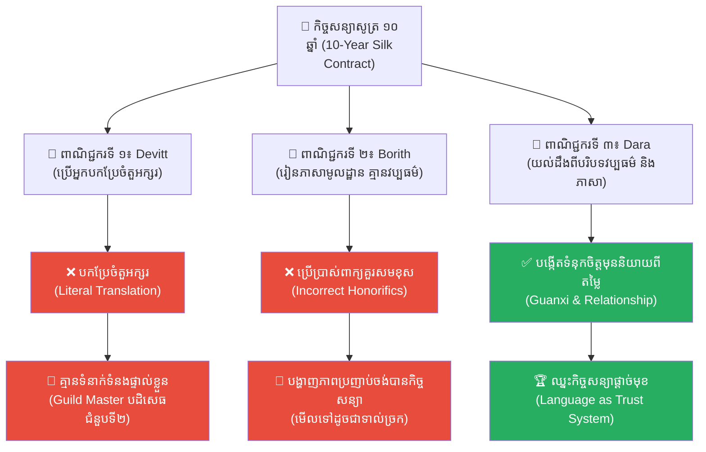
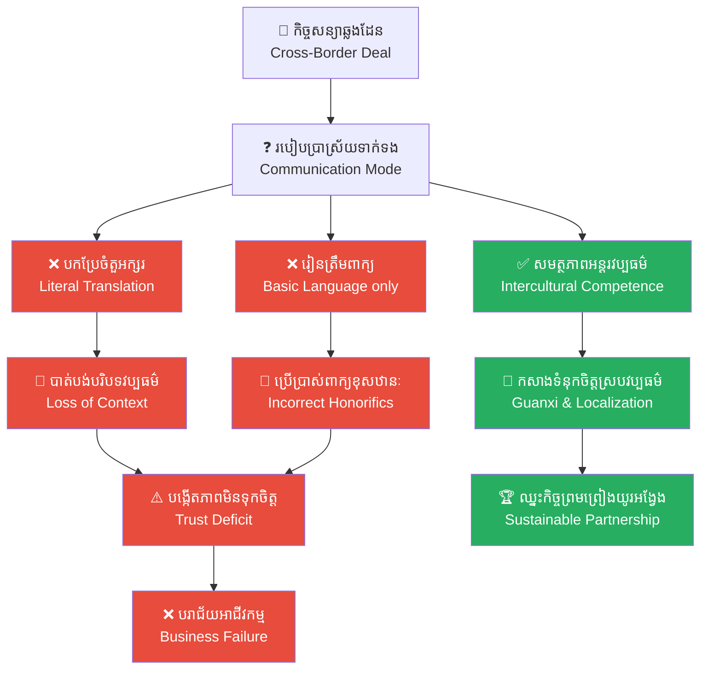

# ២៦៥ — ពាណិជ្ជករដែលរៀនបីភាសា (The Trader Who Learned Three Languages)៖ ភាសាបរទេស ការយល់ដឹងពីវប្បធម៌ និងការគ្រប់គ្រងហានិភ័យឆ្លងដែន

**Author:** ichamrong  
**Date:** 2026-05-27  
**Tags:** #international-business #cross-cultural-communication #localization #transaction-costs #business-sustainability #cambodian-context  
**Category:** Business Sustainability  
**Read Time:** ~12 min  

---

## 📌 មាតិកា (Table of Contents)
- [អន្ទាក់ផ្លូវចិត្ត / វិបត្តិធុរកិច្ច (The Dilemma / The Trap)](#អន្ទាក់ផ្លូវចិត្ត--វិបត្តិធុរកិច្ច-the-dilemma--the-trap)
- [១. រឿងនិទានប្រៀបធៀប (The Parable Story)](#1)
  - [ការចរចាដ៏ធំជាមួយសមាគមសូត្រចិន (The Grand Negotiation with the Chinese Silk Guild)](#1-1)
- [២. ការវិភាគគំនិតសេដ្ឋកិច្ច / ធុរកិច្ច (Theoretical Analysis)](#2)
  - [ក. ការប្រាស្រ័យទាក់ទងបែបបរិបទខ្ពស់ និងបរិបទទាប (High-Context vs. Low-Context Communication)](#2-1)
  - [ខ. ភាសាជាប្រព័ន្ធកសាងទំនុកចិត្ត និងកាត់បន្ថយចំណាយលើប្រតិបត្តិការ (Language as a Trust System & Transaction Cost Reducer)](#2-2)
  - [គ. ការធ្វើតំបន់ភាវូបនីយកម្ម ធៀបនឹងការបកប្រែចំតួអក្សរ (Localization vs. Literal Translation)](#2-3)
  - [ឃ. វិមាត្រវប្បធម៌របស់ Hofstede (Hofstede's Cultural Dimensions in Commerce)](#2-4)
- [៣. គំនូសតាងលំហូរការងារ (High-Contrast Flow Diagram)](#3)
- [៤. ឧទាហមណ៍ជាក់ស្តែងក្នុងពិភពពិត (Real World Examples)](#4)
  - [ឧទាហរណ៍ទី ១ — កម្រិតសកល៖ បរាជ័យនៃការបកប្រែម៉ាកយីហោ (Global Brand Translation & Marketing Blunders)](#4-1)
  - [ឧទាហរណ៍ទី ២ — កម្រិតតំបន់/កម្ពុជា៖ ការសម្របខ្លួនរបស់សហគ្រាសក្នុងស្រុកទៅនឹងដៃគូចិន និងអឺរ៉ុប (Local Cambodian Business Adapting to Chinese & Western Markets)](#4-2)
- [៥. ដំណោះស្រាយ និងមេរៀនធុរកិច្ច (Strategic Solutions & Takeaways)](#5)
- [សេចក្តីសន្និដ្ឋាន (Conclusion)](#conclusion)
- [Related Posts / Course Link](#related-posts)

---

## អន្ទាក់ផ្លូវចិត្ត / វិបត្តិធុរកិច្ច (The Dilemma / The Trap)

តើគុណភាពផលិតផលល្អ និងតម្លៃប្រកួតប្រជែង គ្រប់គ្រាន់ក្នុងការធានាភាពជោគជ័យនៅលើទីផ្សារអន្តរជាតិដែរឬទេ? សហគ្រិនជាច្រើនតែងតែយល់ច្រឡំថា នៅពេលពួកគេចង់ពង្រីកអាជីវកម្មទៅក្រៅប្រទេស ពួកគេគ្រាន់តែជួលអ្នកបកប្រែភាសាសាមញ្ញម្នាក់ ឬប្រើប្រាស់កម្មវិធីបកប្រែស្វ័យប្រវត្តិក៏អាចដំណើរការបានទៅហើយ។ នេះគឺជា **«អន្ទាក់នៃភាពលំអៀងខាងភាសា និងវប្បធម៌» (The Cultural Translation Trap)**។

នៅក្នុងពិភពពាណិជ្ជកម្មសកល (global commerce) ភាសាមិនមែនគ្រាន់តែជាឧបករណ៍សម្រាប់បញ្ជូនព័ត៌មាន ឬបំប្លែងពាក្យពេចន៍ពីវចនានុក្រមមួយទៅវចនានុក្រមមួយទៀតនោះទេ។ ផ្ទុយទៅវិញ ភាសាគឺជាយានផ្ទុកនូវតម្លៃវប្បធម៌ ឋានានុក្រមសង្គម ទម្រង់នៃទំនាក់ទំនង និងកម្រិតនៃការអត់ឱនចំពោះហានិភ័យរបស់មនុស្សម្នាក់ៗ។ នៅពេលក្រុមហ៊ុននានាចាត់ទុកការចរចាឆ្លងដែនជាកិច្ចការស្ងួត បកប្រែត្រឹមតែពាក្យពេចន៍ចំៗ ពួកគេនឹងបង្កើតឱ្យមានការយល់ច្រឡំ ការបាត់បង់ទំនុកចិត្ត និងការបង្កើតចំណាយលើប្រតិបត្តិការ (transaction costs) យ៉ាងមហាសាល។

វិបត្តិដ៏ស្ងប់ស្ងាត់នៅក្នុងពាណិជ្ជកម្មអន្តរជាតិ គឺការដែលដៃគូចរចាបដិសេធកិច្ចព្រមព្រៀងដោយសន្តិវិធី និងមិនផ្តល់ជំនួបជាលើកទីពីរ ព្រោះតែដៃគូម្នាក់ទៀតខ្វះខាតការយល់ដឹងពី «ភាសាវប្បធម៌»។ នៅក្នុងវប្បធម៌ខ្លះ ភាពស្ងប់ស្ងាត់ ឬការឆ្លើយតបយឺតយ៉ាវ មិនមែនជាការស្ទាក់ស្ទើរឡើយ ប៉ុន្តែវាគឺជា «ការបដិសេធដោយគួរសម» ដែលត្រូវបានបកស្រាយខុសដោយសហគ្រិនដែលធំធាត់ក្នុងវប្បធម៌ទាមទារភាពច្បាស់លាស់ និងលឿនរហ័ស។

---

## ១. រឿងនិទានប្រៀបធៀប (The Parable Story)

### ការចរចាដ៏ធំជាមួយសមាគមសូត្រចិន (The Grand Negotiation with the Chinese Silk Guild)

កាលពីព្រេងនាយ មានពាណិជ្ជករលក់សូត្រ (silk merchants) ចំនួនបីនាក់បានធ្វើដំណើរទៅកាន់ទីក្រុងក្វាងចូវ ប្រទេសចិន ដើម្បីប្រកួតប្រជែងដណ្តើមកិច្ចសន្យាផ្តាច់មុខរយៈពេលដប់ឆ្នាំជាមួយសមាគមសូត្រដ៏មានឥទ្ធិពលមួយ (The Grand Silk Guild)។ កិច្ចសន្យានេះមានតម្លៃស្មើនឹងចំណូលដប់ឆ្នាំបូកបញ្ចូលគ្នា ដែលអាចធានាបាននូវទ្រព្យសម្បត្តិមហាសាល និងភាពស្ថិតស្ថេរនៃអាជីវកម្មពេញមួយជីវិតរបស់ពួកគេ។ ពាណិជ្ជករទាំងបីមានគុណភាពសូត្រល្អប្រណីតដូចគ្នា និងមានតម្លៃប្រកួតប្រជែងស្មើៗគ្នា ប៉ុន្តែរបៀបដែលពួកគេចូលទៅចរចាមានលក្ខណៈខុសគ្នាស្រឡះ។

**ពាណិជ្ជករទីមួយ៖ ដេវីត (Devitt)**  
ដេវីត ជឿជាក់លើអំណាចនៃលុយ និងគុណភាពផលិតផល។ គាត់មិនចេះភាសាចិនសូម្បីតែមួយម៉ាត់ ហើយបានសម្រេចចិត្តជួលអ្នកបកប្រែអាជីពម្នាក់ដើម្បីបកប្រែរាល់ពាក្យពេចន៍នៅក្នុងជំនួប។ នៅពេលចូលជួបមេក្រុមសមាគមសូត្រ លោកចិន (Guild Master Chen) ដេវីតបាននិយាយយ៉ាងលឿនរហ័ស ផ្តោតលើតួលេខ និងលក្ខខណ្ឌច្បាប់ដោយផ្ទាល់។ ទោះជាយ៉ាងណាក៏ដោយ ដំណើរការបកប្រែតាមចំតួអក្សរ (literal translation) បានកាត់ផ្តាច់នូវសូរសៀង កាយវិការ ពេលវេលាគួរសម និងការបង្ហាញការគោរព ដែលជាធាតុដ៏មានតម្លៃបំផុតក្នុងការចរចារបស់ចិន។ ដេវីតយល់ឃើញថា ជំនួបនេះប្រព្រឹត្តទៅបានយ៉ាងរលូន ព្រោះអ្នកបកប្រែរបស់គាត់បកបានលឿន ប៉ុន្តែលោកចិនគ្រាន់តែញញឹមដោយគួរសម ស្តាប់ដោយស្ងប់ស្ងាត់ និងបានបដិសេធមិនផ្តល់ជំនួបជាលើកទីពីរឡើយ។

**ពាណិជ្ជករទីពីរ៖ បូរិទ្ធ (Borith)**  
បូរិទ្ធ មានភាពឆ្លាតវៃជាងមុនបន្តិច។ គាត់បានចំណាយពេលប្រាំមួយខែដើម្បីរៀនភាសាចិនកុកងឺកម្រិតមូលដ្ឋាន ហើយមានមោទនភាពចំពោះសមត្ថភាពរបស់ខ្លួនខ្លាំងណាស់។ នៅក្នុងជំនួប បូរិទ្ធបានសម្រេចចិត្តនិយាយភាសាចិនដោយផ្ទាល់ដោយមិនប្រើអ្នកបកប្រែ។ ប៉ុន្តែដោយសារតែការយល់ដឹងពីភាសានៅមានកម្រិត និងខ្វះខាតការយល់ដឹងពីប្រព័ន្ធវប្បធម៌ គាត់បានប្រើប្រាស់ពាក្យសម្តីគួរសមខុសកម្រិត (incorrect honorifics) ដោយហៅឈ្មោះលោកចិនចំៗជំនួសឱ្យការហៅឋានៈកិត្តិយសរបស់គាត់។ ជាងនេះទៅទៀត បូរិទ្ធបានបង្ហាញភាពចង់បានកិច្ចសន្យាយ៉ាងប្រញាប់ប្រញាល់ និងត្រង់ៗពេក ដែលនៅក្នុងវប្បធម៌ចិន ការបង្ហាញភាពប្រញាប់ប្រញាល់បែបនេះគឺជាសញ្ញានៃភាពទាល់ច្រក (desperation) និងការមិនទុកចិត្តលើគុណភាពខ្លួនឯង។ លោកចិនបានថ្លែងអំណរគុណដល់បូរិទ្ធយ៉ាងកក់ក្តៅ ប៉ុន្តែមិនដែលឆ្លើយតបទៅនឹងលិខិតតាមដានការងាររបស់បូរិទ្ធម្តងណាឡើយ។ នៅក្នុងការប្រាស្រ័យទាក់ទងបែបបរិបទខ្ពស់ (high-context communication) ភាពស្ងៀមស្ងាត់មិនមែនជាការអព្យាក្រឹតទេ តែវាគឺជា «ការបដិសេធដោយទន់ភ្លន់»។

**ពាណិជ្ជករទីបី៖ ដារ៉ា (Dara)**  
ដារ៉ា គឺជាពាណិជ្ជករស្ត្រីជនជាតិខ្មែរម្នាក់ដែលធ្លាប់បានរស់នៅក្នុងទីក្រុងក្វាងចូវអស់រយៈពេលពីរឆ្នាំ Presets នាងមិនត្រឹមតែនិយាយភាសាចិនកុកងឺបានយ៉ាងស្ទាត់ជំនាញ និងគោរពតាមវិធានភាសាប៉ុណ្ណោះទេ ប៉ុន្តែនាងយល់ច្បាស់ពី «វេយ្យាករណ៍នៃទំនាក់ទំនង» (grammar of relationship)។ ដារ៉ាយល់ច្បាស់ថានៅក្នុងសមាគមចិន ជំនួបពីរលើកដំបូងមិនមែនជួបគ្នាដើម្បីនិយាយរឿងសូត្រ ឬតម្លៃនោះទេ ប៉ុន្តែវាគឺជាជំនួបដើម្បីបង្កើត «ទំនុកចិត្ត» (trust) និង «ចំណងទាក់ទង» (Guanxi)។

ដារ៉ាបានរៀបចំកាដូតូចមួយដែលត្រូវបានជ្រើសរើសយ៉ាងយកចិត្តទុកដាក់ ដើម្បីបង្ហាញថានាងស្គាល់ច្បាស់ពីស្រុកកំណើតរបស់លោកចិន។ នៅក្នុងជំនួប នាងបានសាកសួរពីសុខទុក្ខរបស់ក្រុមគ្រួសារ និងសុខភាពរបស់គាត់ នាងអនុញ្ញាតឱ្យភាពស្ងប់ស្ងាត់កើតឡើងនៅក្នុងកិច្ចសន្ទនាដោយមិនប្រញាប់ប្រញាល់និយាយបង្គ្រប់កិច្ចឡើយ ហើយនាងមិនដែលរំលឹកពីតម្លៃសូត្រ ឬកិច្ចសន្យារហូតដល់ជំនួបលើកទីបីមកដល់។

នៅក្នុងវប្បធម៌បរិបទខ្ពស់ ខ្លឹមសារពិតប្រាកដមិនមែនស្ថិតនៅលើពាក្យពេចន៍ដែលនិយាយចេញមកនោះទេ ប៉ុន្តែស្ថិតនៅលើទំនាក់ទំនង កាយវិការ និងអ្វីដែល «មិនត្រូវបាននិយាយចេញមក» (what is NOT said)។ ដារ៉ាយល់ដឹងពីរបៀបប្រើប្រាស់ទាំងពីរប្រព័ន្ធ។ ជាលទ្ធផល នាងទទួលបានកិច្ចសន្យាផ្តាច់មុខរយៈពេលដប់ឆ្នាំនោះ ទោះបីជាតម្លៃសូត្ររបស់នាងស្មើនឹងគូប្រជែងដទៃទៀតក៏ដោយ ព្រោះនាងគឺជាមនុស្សម្នាក់គត់ដែលលោកចិនមានអារម្មណ៍ថាអាច «ទុកចិត្តបាន» ទៅតាមស្តង់ដារវប្បធម៌របស់គាត់។

ដារ៉ាបានត្រឡប់មកមាតុភូមិវិញជាមួយនឹងកិច្ចសន្យាដ៏មានតម្លៃ និងបានបង្រៀនមេរៀនមួយទៅកាន់កូនស្រីរបស់នាងថា៖ *«ចូររៀនយល់ពីវប្បធម៌ និងភាសារបស់ដៃគូមុនពេលឯងចង់លក់ផលិតផល ព្រោះនៅក្នុងពាណិជ្ជកម្ម ការចរចាចាប់ផ្តើមតាំងពីមុនពេលពាក្យដំបូងត្រូវបាននិយាយចេញមកម្ល៉េះ»*។

---

## ២. ការវិភាគគំនិតសេដ្ឋកិច្ច / ធុរកិច្ច (Theoretical Analysis)

### ក. ការប្រាស្រ័យទាក់ទងបែបបរិបទខ្ពស់ និងបរិបទទាប (High-Context vs. Low-Context Communication)

ទ្រឹស្តីរបស់អ្នកនរវិទ្យា Edward T. Hall បែងចែករបៀបនៃការប្រាស្រ័យទាក់ទងរបស់មនុស្សជាពីរប្រភេទ៖

1. **វប្បធម៌បរិបទខ្ពស់ (High-Context Cultures)៖** (ដូចជា ប្រទេសចិន ជប៉ុន កូរ៉េ និងកម្ពុជា) ព័ត៌មានភាគច្រើនត្រូវបានបង្កប់នៅក្នុងបរិបទជុំវិញ កាយវិការ ឋានៈសង្គម និងប្រវត្តិទំនាក់ទំនងរវាងបុគ្គល។ ពាក្យសម្តីជាក់ស្តែងមានតួនាទីត្រឹមតែមួយផ្នែកប៉ុណ្ណោះ។ ការនិយាយត្រង់ៗពេក អាចត្រូវបានចាត់ទុកថាជាភាពមិនគួរសម ឬជាការខ្វះការអប់រំ។
2. **វប្បធម៌បរិបទទាប (Low-Context Cultures)៖** (ដូចជា អាល្លឺម៉ង់ អាមេរិក និងអឺរ៉ុបខាងជើង) ព័ត៌មានទាំងអស់ត្រូវតែបង្ហាញចេញមកយ៉ាងច្បាស់លាស់ ត្រង់ៗ និងមានចែងនៅក្នុងកិច្ចសន្យាជាលាយលក្ខណ៍អក្សរ។ អត្ថន័យស្ថិតនៅលើ «ពាក្យពេចន៍ពិតប្រាកដ» (explicit statement)។

ដារ៉ាទទួលបានជោគជ័យព្រោះនាងមានសមត្ថភាពផ្លាស់ប្តូរការប្រើប្រាស់រវាងប្រព័ន្ធទាំងពីរនេះបានយ៉ាងរលូន (Code-switching) ខណៈដែល Devitt និង Borith ព្យាយាមប្រើប្រាស់ស្តង់ដារបរិបទទាបទៅបង្ខំឱ្យវប្បធម៌បរិបទខ្ពស់ទទួលយក។

### ខ. ភាសាជាប្រព័ន្ធកសាងទំនុកចិត្ត និងកាត់បន្ថយចំណាយលើប្រតិបត្តិការ (Language as a Trust System & Transaction Cost Reducer)

នៅក្នុងសេដ្ឋកិច្ចវិទ្យាស្ថាប័ន (Institutional Economics) របស់លោក Ronald Coase និង Oliver Williamson រាល់ការធ្វើពាណិជ្ជកម្មតែងតែជួបប្រទះនូវ **«ថ្លៃប្រតិបត្តិការ» (Transaction Costs)** ដែលរួមមាន៖
* ថ្លៃស្វែងរកព័ត៌មាន (Information search costs)
* ថ្លៃចរចា និងចុះកិច្ចសន្យា (Bargaining and contracting costs)
* ថ្លៃត្រួតពិនិត្យ និងអនុវត្តកិច្ចសន្យា (Monitoring and enforcement costs)

នៅពេលដៃគូពាណិជ្ជកម្មមិនយល់ពីភាសា និងវប្បធម៌គ្នាទៅវិញទៅមក កម្រិតនៃភាពមិនច្បាស់លាស់ (uncertainty) នឹងកើនឡើង ដែលនាំឱ្យការខ្វះទំនុកចិត្តកើនឡើង។ កត្តានេះធ្វើឱ្យថ្លៃប្រតិបត្តិការហក់ឡើងខ្ពស់ ព្រោះភាគីទាំងសងខាងត្រូវចំណាយលុយលើសេវាកម្មច្បាប់ និងយន្តការការពារខ្លួនកាន់តែច្រើន។ ការយល់ដឹងពីភាសា និងទំនាក់ទំនងបែបស៊ីជម្រៅ ដើរតួជា «ខ្លាញ់រំអិល» កាត់បន្ថយការសង្ស័យ បង្កើតទំនុកចិត្តយ៉ាងឆាប់រហ័ស និងកាត់បន្ថយថ្លៃប្រតិបត្តិការយ៉ាងច្រើន។

### គ. ការធ្វើតំបន់ភាវូបនីយកម្ម ធៀបនឹងការបកប្រែចំតួអក្សរ (Localization vs. Literal Translation)

* **ការបកប្រែចំតួអក្សរ (Translation)៖** គឺជាការប្តូរពាក្យពេចន៍ពីភាសាមួយទៅភាសាមួយទៀតដោយរក្សាទម្រង់ដើម។ វាគ្រាន់តែឆ្លើយតបនឹងតម្រូវការបច្ចេកទេស ប៉ុន្តែមិនអាចឆ្លុះបញ្ចាំងពីអារម្មណ៍ និងបរិបទបានឡើយ។
* **ការធ្វើតំបន់ភាវូបនីយកម្ម (Localization)៖** គឺជាការកែច្នៃសារ ផលិតផល ឬសេវាកម្មទាំងមូលឱ្យស្របទៅនឹងវប្បធម៌ ទម្លាប់ ជំនឿ និងចិត្តសាស្ត្ររបស់អ្នកប្រើប្រាស់នៅក្នុងទីផ្សារគោលដៅ។ វារួមបញ្ចូលទាំងការផ្លាស់ប្តូររូបភាព ពណ៌ កាយវិការ និងទម្រង់ចរចា។

### ឃ. វិមាត្រវប្បធម៌របស់ Hofstede (Hofstede's Cultural Dimensions in Commerce)

គំរូវប្បធម៌របស់លោក Geert Hofstede បង្ហាញថា ប្រទេសចិន និងប្រទេសក្នុងតំបន់អាស៊ីអាគ្នេយ៍មាន **«សន្ទស្សន៍គម្លាតអំណាចខ្ពស់» (High Power Distance)** និងលក្ខណៈ **«សមូហភាព» (Collectivism)**។ នៅក្នុងសង្គមបែបនេះ ការគោរពឋានានុក្រម ឋានៈកិត្តិយស និងការរក្សាមុខមាត់ (saving face) គឺជាកត្តាសំខាន់បំផុត។ ការដែលបូរិទ្ធហៅឈ្មោះលោកចិនចំៗ បានធ្វើឱ្យប៉ះពាល់ដល់ឋានានុក្រមវប្បធម៌ និងបំផ្លាញទំនុកចិត្តភ្លាមៗ។

---

## ៣. គំនូសតាងលំហូរការងារ (High-Contrast Flow Diagram)

---

## ៤. ឧទាហរណ៍ជាក់ស្តែងក្នុងពិភពពិត (Real World Examples)

### ឧទាហរណ៍ទី ១ — កម្រិតសកល៖ បរាជ័យនៃការបកប្រែម៉ាកយីហោ (Global Brand Translation & Marketing Blunders)

ក្រុមហ៊ុនពហុជាតិសាសន៍ធំៗជាច្រើនបានខាតបង់ថវិការាប់លានដុល្លារ ដោយសារតែការបកប្រែពាក្យស្លោកទីផ្សាររបស់ពួកគេចំៗដោយមិនសិក្សាពីវប្បធម៌តំបន់៖

* **KFC នៅប្រទេសចិន៖** នៅពេលក្រុមហ៊ុនមាន់បំពង KFC បានបើកហាងដំបូងរបស់ខ្លួននៅទីក្រុងប៉េកាំងក្នុងទសវត្សរ៍ឆ្នាំ ១៩៨០ ពាក្យស្លោកដ៏ល្បីល្បាញ **"Finger Lickin' Good"** (ឆ្ងាញ់រហូតដល់លិទ្ធម្រាមដៃ) ត្រូវបានបកប្រែជាភាសាចិនចំៗថា **"Eat your fingers off"** (ញ៉ាំម្រាមដៃរបស់អ្នកឱ្យដាច់)។ នេះបានបង្កើតឱ្យមានការភ័យខ្លាច និងការយល់ច្រឡំជាខ្លាំងពីសំណាក់អតិថិជនចិន។
* **Pepsi នៅប្រទេសចិន៖** ក្រុមហ៊ុន Pepsi បានប្រើប្រាស់ពាក្យស្លោក **"Come Alive with the Pepsi Generation"** (រស់រវើកជាមួយជំនាន់ភេសជ្ជៈ Pepsi) ប៉ុន្តែត្រូវបានបកប្រែចំតួអក្សរទៅជាភាសាចិនកុកងឺថា **"Pepsi brings your ancestors back from the grave"** (Pepsi នាំបុព្វបុរសរបស់អ្នកឱ្យរស់ឡើងវិញពីផ្នូរ)។ នៅក្នុងវប្បធម៌ចិនដែលគោរពបុព្វបុរសយ៉ាងខ្ជាប់ខ្ជួន សារនេះត្រូវបានចាត់ទុកថាជាការប្រមាថយ៉ាងធ្ងន់ធ្ងរ។
* **Chevrolet Nova ក្នុងប្រទេសនិយាយភាសាអេស្ប៉ាញ៖** ក្រុមហ៊ុនទូទៅ General Motors បានព្យាយាមលក់រថយន្តម៉ាក **Chevrolet Nova** នៅអាមេរិកឡាទីន។ ទោះជាយ៉ាងណាក៏ដោយ នៅក្នុងភាសាអេស្ប៉ាញ ពាក្យ **"No va"** មានន័យថា **"It doesn't go"** (វាមិនដំណើរការ ឬមិនទៅមុខឡើយ)។ ជាលទ្ធផល គ្មានអតិថិជនណាម្នាក់ចង់ទិញរថយន្តដែលមានឈ្មោះថាមិនដំណើរការនោះទេ។

### ឧទាហរណ៍ទី ២ — កម្រិតតំបន់/កម្ពុជា៖ ការសម្របខ្លួនរបស់សហគ្រាសក្នុងស្រុកទៅនឹងដៃគូចិន និងអឺរ៉ុប (Local Cambodian Business Adapting to Chinese & Western Markets)

* **ករណីនាំចេញកសិផលទៅចិន៖** ក្រុមហ៊ុននាំចេញផ្លែស្វាយ និងផ្លែមាន់ប៉ៃលិនខ្មែរមួយចំនួន ធ្លាប់បានបរាជ័យក្នុងការចរចាជាមួយអ្នកបញ្ជាទិញចិន កាលពីពួកគេប្រើប្រាស់របៀបទំនាក់ទំនងបែបលោកខាងលិច (low-context) ដោយការផ្ញើតែអ៊ីមែលផ្លូវការ និងតារាងតម្លៃភ្លាមៗ។ ក្រោយមក ពួកគេបានកែប្រែយុទ្ធសាស្ត្រដោយការបង្កើតទំនាក់ទំនងផ្ទាល់ខ្លួនតាមរយៈកម្មវិធី WeChat ចូលរួមពិសារអាហារពេលល្ងាច បង្ហាញការគោរពតាមឋានានុក្រមរបស់ប្រធានក្រុមហ៊ុនចិន និងរចនាការវេចខ្ចប់ដោយប្រើប្រាស់ពណ៌ក្រហម និងលឿងដែលតំណាងឱ្យលាភសំណាងរបស់ចិន។ ការផ្លាស់ប្តូរនេះបានធ្វើឱ្យពួកគេទទួលបានកិច្ចសន្យានាំចេញរាប់ពាន់តោន។
* **ករណីនាំចេញទៅសហគមន៍អឺរ៉ុប៖** ផ្ទុយទៅវិញ នៅពេលសហគ្រាសដដែលនេះចង់នាំចេញម្រេចកំពត ឬគ្រាប់ស្វាយចន្ទីទៅកាន់សហគមន៍អឺរ៉ុប ពួកគេត្រូវផ្លាស់ប្តូរមកប្រើប្រាស់ការប្រាស្រ័យទាក់ទងបែបបរិបទទាប (low-context) វិញ។ អតិថិជនអឺរ៉ុបមិនខ្វល់ពីទំនាក់ទំនងផ្ទាល់ខ្លួន ឬការហូបចុកជួបជុំគ្នានោះទេ ប៉ុន្តែពួកគេទាមទារនូវភាពច្បាស់លាស់ ឯកសារវិញ្ញាបនបត្រស្តង់ដារអនាម័យ (SPS) របាយការណ៍សង្វាក់ផ្គត់ផ្គង់ប្រកបដោយនិរន្តរភាព និងការបញ្ជាក់ប្រភពដើមទំនិញយ៉ាងលម្អិត និងត្រង់ៗ។ ការមិនយល់ពីការផ្លាស់ប្តូរបរិបទនេះ នឹងធ្វើឱ្យអាជីវកម្មដួលរលំភ្លាមៗ។

---

## ៥. ដំណោះស្រាយ និងមេរៀនធុរកិច្ច (Strategic Solutions & Takeaways)

ដើម្បីគ្រប់គ្រងហានិភ័យឆ្លងដែន និងទទួលបានជោគជ័យក្នុងពាណិជ្ជកម្មសកល ថ្នាក់ដឹកនាំធុរកិច្ចគួរអនុវត្តយុទ្ធសាស្ត្រដូចខាងក្រោម៖

1. **អភិវឌ្ឍសមត្ថភាពបត់បែនតាមបរិបទ (Dynamic Code-Switching)៖**  
   អ្នកដឹកនាំត្រូវបណ្តុះបណ្តាលក្រុមការងារឱ្យចេះសង្កេត និងសម្របខ្លួនទៅនឹងកម្រិតបរិបទនៃទីផ្សារគោលដៅ។ ចូរប្រើប្រាស់ភាពច្បាស់លាស់ និងកិច្ចសន្យាលម្អិតសម្រាប់ទីផ្សារបរិបទទាប (លោកខាងលិច) និងវិនិយោគលើពេលវេលាដើម្បីសាងកេរ្តិ៍ឈ្មោះ និងទំនុកចិត្តសម្រាប់ទីផ្សារបរិបទខ្ពស់ (អាស៊ី និងមជ្ឈិមបូព៌ា)។
2. **វិនិយោគលើការធ្វើតំបន់ភាវូបនីយកម្មពេញលេញ (Invest in Full Localization)៖**  
   ឈប់ប្រើប្រាស់កម្មវិធីបកប្រែចំតួអក្សរសម្រាប់យុទ្ធនាការទីផ្សារ និងឯកសារចរចា សំខាន់ៗ។ ត្រូវជួលអ្នកប្រឹក្សាយោបល់ខាងវប្បធម៌ក្នុងស្រុក (cultural consultants) ដើម្បីវាយតម្លៃរាល់សារ ឈ្មោះម៉ាកយីហោ និងការរចនាផលិតផលមុននឹងជ្រៀតចូលទីផ្សារ។
3. **កសាងដើមទុនសង្គមជាមុនសិន (Build Social Capital Before Transaction)៖**  
   នៅក្នុងវប្បធម៌ដែលផ្តោតលើទំនាក់ទំនង ត្រូវចងចាំថា *«មនុស្សធ្វើជំនួញជាមួយមនុស្សដែលពួកគេទុកចិត្ត»*។ ចូរកុំប្រញាប់ដាក់តម្លៃ ឬលក្ខខណ្ឌកិច្ចសន្យានៅជំនួបដំបូង។ ត្រូវចំណាយពេលស្វែងយល់ពីដៃគូ និងបង្ហាញការគោរពពិតប្រាកដ។
4. **បណ្តុះបណ្តាលក្រុមការងារពីវិមាត្រវប្បធម៌ (Cultural Dimensions Training)៖**  
   រៀបចំវគ្គបណ្តុះបណ្តាលស្តីពីការយល់ដឹងពីភាពខុសគ្នានៃវប្បធម៌ឆ្លងដែន (Cross-Cultural Management) ដល់បុគ្គលិកផ្នែកលក់ និងផ្នែកចរចា ដើម្បីជៀសវាងការប្រើប្រាស់កាយវិការ ឬពាក្យពេចន៍ដែលនាំឱ្យមានការអាក់អន់ចិត្ត។

---

## សេចក្តីសន្និដ្ឋាន (Conclusion)

> **«នៅក្នុងពាណិជ្ជកម្មសកល ទំនុកចិត្តគឺជាលុយដែលអាចចាយបានគ្រប់ប្រទេស។ ហើយភាសាដែលគ្មានការយល់ដឹងពីវប្បធម៌ គឺជាប្រព័ន្ធផ្សព្វផ្សាយដែលគ្មានសញ្ញា។»**

ពាណិជ្ជករទាំងបីនាក់បានបង្រៀនយើងថា ផលិតផលល្អ និងតម្លៃថោកគ្រាន់តែជាសំបុត្រសម្រាប់ចូលរួមប្រកួតប៉ុណ្ណោះ ប៉ុន្តែសមត្ថភាពយល់ដឹងពីភាសានៃទំនាក់ទំនង និងវប្បធម៌របស់ដៃគូទើបជាកត្តាសម្រេចជោគជ័យជាក់ស្តែង។ ភាសាគឺជាយានផ្ទុកទំនុកចិត្ត ហើយទំនុកចិត្តគឺជាទ្រព្យសកម្មប្រកបដោយនិរន្តរភាពបំផុតរបស់អាជីវកម្ម។

---

## Related Posts

* **[Foreign Language for Global Commerce](../06-foreign-language-for-global-commerce.md)** — ការសិក្សាភាសាតម្រង់ទិសឆ្ពោះទៅរកបរិបទអាជីវកម្មអន្តរជាតិ ការយល់ដឹងពីរបៀបទំនាក់ទំនង វិធានការចរចាវប្បធម៌ និងការចាត់ទុកភាសាជាទ្រព្យសកម្មយុទ្ធសាស្ត្រ។
* **[Confirmation Bias (ការលំអៀងបញ្ជាក់អំណះអំណាង)៖ អន្ទាក់ចិត្តដែលបង្ខំយើងឱ្យស្តាប់តែអ្វីដែលយើងចង់ឮ](../../../../../concepts/articles/01-confirmation-bias.md)** — យល់ដឹងពីរបៀបដែលមនុស្សចូលចិត្តស្តាប់តែរឿងដែលស្របនឹងសម្មតិកម្មផ្ទាល់ខ្លួន។
* **[The Lost Axe and the Filter of Mind (ពូថៅដែលបាត់ និងអ័ព្ទនៃការសង្ស័យ)](../../../../../concepts/parables/13-the-lost-axe-and-the-filter-of-mind.md)** — របៀបដែលការសង្ស័យលំអៀងបាំងបិទការពិតនៅក្នុងការចរចាពាណិជ្ជកម្ម។
