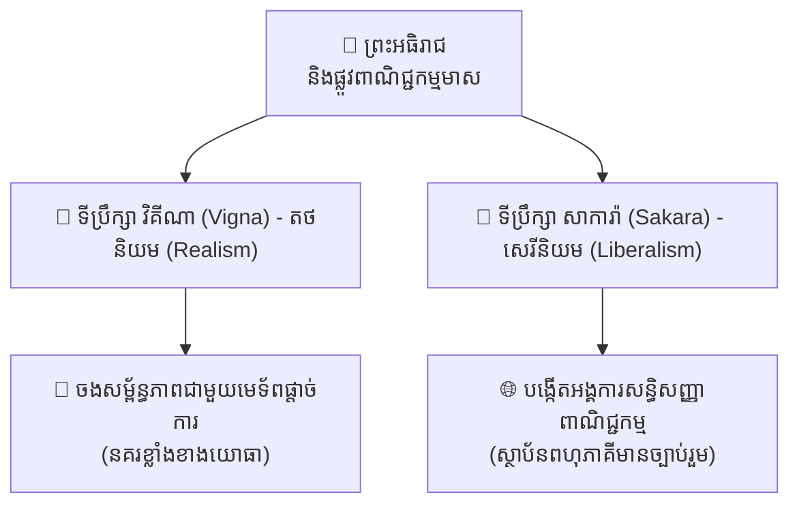
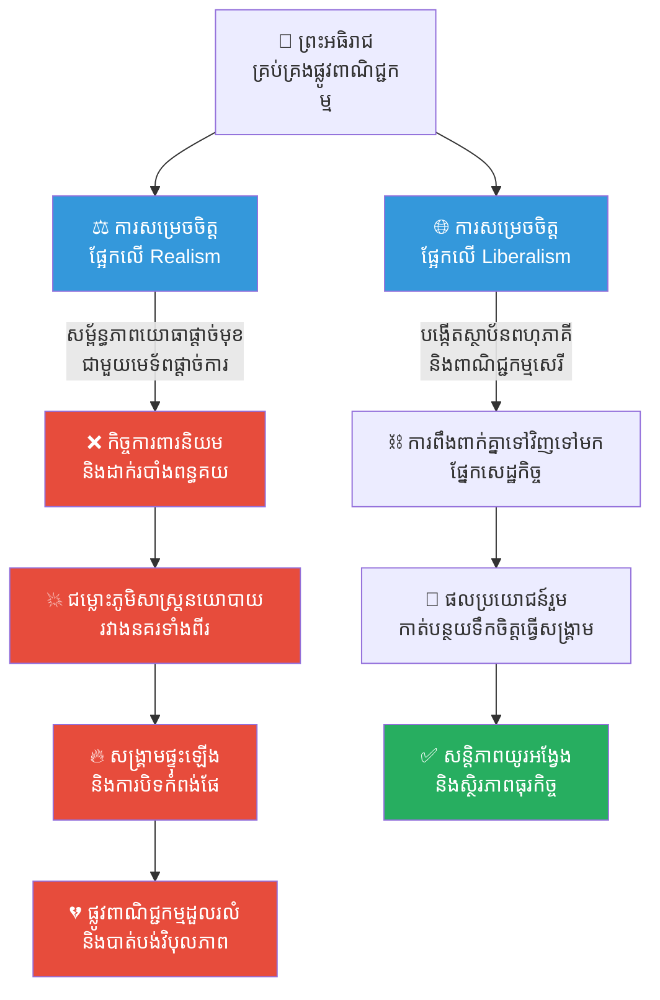
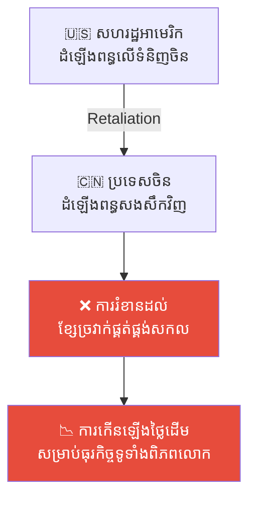

# ២៦៦ — អធិរាជ និងផ្លូវពាណិជ្ជកម្ម (The Emperor and the Trade Route)៖ នយោបាយសកល អធិបតេយ្យភាពរដ្ឋ និងពន្ធគយ

**Author:** ichamrong  
**Date:** 2026-05-27  
**Tags:** #political-science #international-relations #geopolitics #protectionism #realism-vs-liberalism #sovereignty #trade-policy #cambodian-context  
**Category:** Business Sustainability  
**Read Time:** ~12 min  

---

## 📌 មាតិកា (Table of Contents)
- [អន្ទាក់ផ្លូវចិត្ត / វិបត្តិធុរកិច្ច (The Dilemma / The Trap)](#អន្ទាក់ផ្លូវចិត្ត--វិបត្តិធុរកិច្ច-the-dilemma--the-trap)
- [១. រឿងនិទានប្រៀបធៀប (The Parable Story)](#១-រឿងនិទានប្រៀបធៀប-the-parable-story)
  - [ចក្រភពអង្គរ និងផ្លូវពាណិជ្ជកម្មមាស (Angkor and the Golden Route)](#ចក្រភពអង្គរ-និងផ្លូវពាណិជ្ជកម្មមាស-angkor-and-the-golden-route)
  - [ជម្រើសផ្លូវពីរ និងការខ្វែងគំនិតគ្នារវាងទីប្រឹក្សា (The Two Paths and the Advisors' Debate)](#ជម្រើសផ្លូវពីរ-និងការខ្វែងគំនិតគ្នារវាងទីប្រឹក្សា-the-two-paths-and-the-advisors-debate)
  - [ការសម្រេចចិត្តរបស់ព្រះអធិរាជ និងសោកនាដកម្មនៃសង្គ្រាម (The Emperor's Decision and the Tragedy of War)](#ការសម្រេចចិត្តរបស់ព្រះអធិរាជ-និងសោកនាដកម្មនៃសង្គ្រាម-the-emperors-decision-and-the-tragedy-of-war)
- [២. ការវិភាគគំនិតសេដ្ឋកិច្ច / ធុរកិច្ច (Theoretical Analysis)](#២-ការវិភាគគំនិតសេដ្ឋកិច្ច--ធុរកិច្ច-theoretical-analysis)
  - [តថនិយមនយោបាយ ទល់នឹង សេរីនិយម (Political Realism vs. Liberalism)](#តថនិយមនយោបាយ-ទល់នឹង-សេរីនិយម-political-realism-vs-liberalism)
  - [កិច្ចការពារនិយម ទល់នឹង ពាណិជ្ជកម្មសេរី (Protectionism vs. Free Trade)](#កិច្ចការពារនិយម-ទល់នឹង-ពាណិជ្ជកម្មសេរី-protectionism-vs-free-trade)
  - [អធិបតេយ្យភាពរដ្ឋ និងរបាំងពន្ធគយ (State Sovereignty & Tariffs/Trade Barriers)](#អធិបតេយ្យភាពរដ្ឋ-និងរបាំងពន្ធគយ-state-sovereignty--tariffstrade-barriers)
- [៣. គំនូសតាងលំហូរការងារ (High-Contrast Flow Diagram)](#៣-គំនូសតាងលំហូរការងារ-high-contrast-flow-diagram)
- [៤. ឧទាហរណ៍ជាក់ស្តែងក្នុងពិភពពិត (Real World Examples)](#៤-ឧទាហរណ៍ជាក់ស្តែងក្នុងពិភពពិត-real-world-examples)
  - [ឧទាហរណ៍ទី ១៖ សង្គ្រាមពាណិជ្ជកម្មអាមេរិក-ចិន (The US-China Trade War)](#ឧទាហរណ៍ទី-១៖-សង្គ្រាមពាណិជ្ជកម្មអាមេរិក-ចិន-the-us-china-trade-war)
  - [ឧទាហរណ៍ទី ២៖ សមាហរណកម្មសេដ្ឋកិច្ចអាស៊ាន និងពន្ធគយ (ASEAN Economic Integration & Tariff Dynamics)](#ឧទាហរណ៍ទី-២៖-សមាហរណកម្មសេដ្ឋកិច្ចអាស៊ាន-និងពន្ធគយ-asean-economic-integration--tariff-dynamics)
- [៥. ដំណោះស្រាយ និងមេរៀនធុរកិច្ច (Strategic Solutions & Takeaways)](#៥-ដំណោះស្រាយ-និងមេរៀនធុរកិច្ច-strategic-solutions--takeaways)
- [Related Posts / Course Link](#related-posts--course-link)

---

## អន្ទាក់ផ្លូវចិត្ត / វិបត្តិធុរកិច្ច (The Dilemma / The Trap)

នៅក្នុងសេដ្ឋកិច្ចនយោបាយសកល (global political economy) ធុរកិច្ច និងអធិបតេយ្យភាពរដ្ឋ (state sovereignty) តែងតែមានទំនាក់ទំនងយ៉ាងស្អិតល្មួត និងមិនអាចកាត់ផ្តាច់ចេញពីគ្នាបានឡើយ។ មេដឹកនាំអាជីវកម្ម និងអ្នករៀបចំគោលនយោបាយភាគច្រើន តែងតែជួបប្រទះនូវវិបត្តិដ៏លំបាកមួយ៖ **តើយើងគួរពឹងផ្អែកលើការការពារអំណាចផ្តាច់មុខតាមរយៈកម្លាំងយោធា និងសម្ព័ន្ធភាពនិយមតឹងរ៉ឹង (Political Realism) ឬគួរកសាងប្រព័ន្ធសហប្រតិបត្តិការអន្តរជាតិដែលមានច្បាប់ទម្លាប់ច្បាស់លាស់ និងការពឹងពាក់គ្នាទៅវិញទៅមកផ្នែកសេដ្ឋកិច្ច (Liberalism / Interdependence)?**

អន្ទាក់ដ៏គ្រោះថ្នាក់បំផុតសម្រាប់អ្នកសម្រេចចិត្ត គឺការគិតថា ពាណិជ្ជកម្មសេរីអាចដំណើរការទៅបានដោយរលូន ដោយពុំចាំបាច់គិតគូរពី **ហានិភ័យនយោបាយសកល (geopolitical risk)** ឬផ្ទុយទៅវិញ ការគិតថាការបង្កើតសម្ព័ន្ធភាពផ្តាច់មុខជាមួយមហាអំណាចយោធាតែមួយគត់ អាចការពារផលប្រយោជន៍របស់ខ្លួនបានជារៀងរហូត។ នៅពេលដែលនយោបាយអន្តរជាតិមានការប្រែប្រួល ប្រព័ន្ធពាណិជ្ជកម្មដែលធ្លាប់តែផ្តល់ផលចំណេញមហាសាល អាចនឹងដួលរលំត្រឹមតែមួយប៉ព្រិចភ្នែក ប្រសិនបើវាគ្មានរចនាសម្ព័ន្ធការពារដ៏រឹងមាំ ឬស្ថាប័នពហុភាគី (multilateral institutions) សម្រាប់សម្រុះសម្រួលជម្លោះ។

---

## ១. រឿងនិទានប្រៀបធៀប (The Parable Story)

### ចក្រភពអង្គរ និងផ្លូវពាណិជ្ជកម្មមាស (Angkor and the Golden Route)

កាលពីសម័យបុរាណ មានព្រះអធិរាជ (Emperor) មួយអង្គដែលបានគ្រប់គ្រងចក្រភពខ្មែរ (Khmer Empire) ដ៏មានអំណាច និងមានភូមិសាស្ត្រនយោបាយយុទ្ធសាស្ត្រដ៏សំខាន់បំផុតក្នុងតំបន់អាស៊ីអាគ្នេយ៍។ ចក្រភពរបស់ទ្រង់លាតសន្ធឹងលើចំនុចប្រសព្វនៃផ្លូវពាណិជ្ជកម្ម (trade route) ដ៏មានតម្លៃ ដែលគ្រប់គ្រងរាល់ការដឹកជញ្ជូនទំនិញ និងគ្រឿងទេសរវាងមហាសមុទ្រទាំងពីរ។ 

ជារៀងរាល់រដូវកាល ស្ដុកទំនិញ (goods and cargo) និងនាវាជំនួញមកពីប្រទេសជាងដប់ពីរបានឆ្លងកាត់កំពង់ផែ និងចំណុចត្រួតពិនិត្យពន្ធគយរបស់ទ្រង់។ ការគ្រប់គ្រងផ្លូវទឹកនេះបានធ្វើឱ្យព្រះរាជាណាចក្ររបស់ទ្រង់មានភាពស្តុកស្តម្ភ និងសម្បូរសប្បាយយ៉ាងខ្លាំង ដោយពុំចាំបាច់ធ្វើសង្គ្រាម ឬបង្ខំប្រជារាស្ត្រឱ្យធ្វើស្រែចម្ការហត់នឿយហួសកម្លាំងឡើយ។

ទោះជាយ៉ាងណាក៏ដោយ ភាពរុងរឿងនេះបានទាក់ទាញចំណាប់អារម្មណ៍ និងការចង់បានពីនគរជិតខាងធំៗពីរ។ 
* **នគរទីមួយ (Kingdom A)៖** ជានគរដែលគ្រប់គ្រងដោយប្រព័ន្ធសេរី និងក្រុមប្រឹក្សាជាប់ឆ្នោត (Democracy with elected councils) ដែលមានសេដ្ឋកិច្ចពឹងផ្អែកលើការលក់ដូរ និងការចរចាដោយសន្តិវិធី។
* **នគរទីពីរ (Kingdom B)៖** ជានគរផ្តាច់ការដែលគ្រប់គ្រងដោយមេទ័ពកំពូលតែម្នាក់ (Authoritarian state ruled by a general) ដែលមានកងទ័ពខ្លាំងពូកែ និងគ្មានការអត់ធ្មត់ចំពោះការចរចាឡើយ។

នគរទាំងពីរនេះសុទ្ធតែចង់បានសិទ្ធិផ្តាច់មុខក្នុងការប្រើប្រាស់ និងគ្រប់គ្រងផ្លូវពាណិជ្ជកម្មរបស់ព្រះអធិរាជ ដើម្បីពង្រីកឥទ្ធិពលរៀងៗខ្លួន។

### ជម្រើសផ្លូវពីរ និងការខ្វែងគំនិតគ្នារវាងទីប្រឹក្សា (The Two Paths and the Advisors' Debate)

ព្រះអធិរាជបានកោះប្រជុំក្រុមប្រឹក្សាដើម្បីស្វែងរកដំណោះស្រាយ។ ទីប្រឹក្សាពីររូបដែលមានទស្សនៈផ្ទុយគ្នាស្រឡះបានឡើងបង្ហាញយុទ្ធសាស្ត្រ៖

* **ទីប្រឹក្សា តថនិយម (Realist Advisor) ឈ្មោះ វិគីណា (Vigna)៖** បានទទូចសុំឱ្យព្រះអធិរាជលក់សិទ្ធិប្រើប្រាស់ផ្លូវនេះទៅឱ្យមេទ័ពផ្តាច់ការនៃនគរទីពីរ ដែលមានកងទ័ពខ្លាំងជាងគេបំផុត។ វិគីណា បានវែកញែកថា៖ 
  > *«ក្រាបទូលព្រះអង្គ នៅក្នុងពិភពលោកដ៏គ្រោះថ្នាក់នេះ មានតែអ្នកខ្លាំង និងអំណាចយោធាប៉ុណ្ណោះដែលអាចការពារផលប្រយោជន៍ និងអធិបតេយ្យភាពរបស់យើងបាន។ នគរប្រជាធិបតេយ្យមានភាពយឺតយ៉ាវ ក្រុមប្រឹក្សារបស់ពួកគេចូលចិត្តតែប្រកែកគ្នា និងផ្លាស់ប្តូរគោលនយោបាយមិនឈប់។ ចូរយើងចាប់ដៃជាមួយមេទ័ពផ្តាច់ការចុះ ព្រោះគាត់ជាអ្នកសម្រេចចិត្តលឿន និងមានកងទ័ពពិតប្រាកដដែលអាចកំចាត់រាល់ការគំរាមកំហែងបាន!»*

* **ទីប្រឹក្សា សេរីនិយម (Liberal Advisor) ឈ្មោះ សាការ៉ា (Sakara)៖** បានស្នើឱ្យបង្កើតសន្ធិសញ្ញាពាណិជ្ជកម្មរួមគ្នា និងបង្កើតជា **ស្ថាប័នពាណិជ្ជកម្មតំបន់ (Trade Treaty Institution)** ដែលអនុញ្ញាតឱ្យនគរទាំងអស់ រួមទាំងនគរទាំងពីរខាងលើ អាចចូលប្រើប្រាស់ផ្លូវពាណិជ្ជកម្មនេះក្រោមច្បាប់ និងពន្ធគយស្មើៗគ្នា។ សាការ៉ា បានពន្យល់ថា៖
  > *«ក្រាបទូលព្រះអង្គ ប្រសិនបើនគរទាំងពីរទទួលបានផលប្រយោជន៍សេដ្ឋកិច្ចរួមគ្នាពីផ្លូវនេះ ពួកគេនឹងមិនចង់បំផ្លាញវាដោយការធ្វើសង្គ្រាមឡើយ។ ភាពពឹងពាក់គ្នាទៅវិញទៅមកផ្នែកសេដ្ឋកិច្ច (Economic Interdependence) នឹងបង្កើតឱ្យមានសន្តិភាពយូរអង្វែង។ ស្ថាប័នអន្តរជាតិដែលមានច្បាប់ច្បាស់លាស់នឹងជួយកាត់បន្ថយការយល់ច្រឡំ និងហានិភ័យនៃសង្គ្រាមជាយថាហេតុ។»*

### ការសម្រេចចិត្តរបស់ព្រះអធិរាជ និងសោកនាដកម្មនៃសង្គ្រាម (The Emperor's Decision and the Tragedy of War)

ព្រះអធិរាជ ដែលយល់ថាអំណាចកម្លាំងបាយយោធាជាទីពឹងដ៏កក់ក្តៅបំផុត បានសម្រេចចិត្តជ្រើសរើសផ្លូវរបស់ **វិគីណា (Realist path)**។ ទ្រង់បានចុះហត្ថលេខាលើកិច្ចព្រមព្រៀងផ្តាច់មុខជាមួយមេទ័ពផ្តាច់ការនៃនគរទីពីរ ដោយបដិសេធសិទ្ធិប្រើប្រាស់របស់នគរទីមួយ និងចាប់ផ្តើមអនុវត្ត **របាំងពន្ធគយ (tariff barriers)** យ៉ាងតឹងរ៉ឹងប្រឆាំងនឹងទំនិញរបស់នគរប្រជាធិបតេយ្យ។

ពីរឆ្នាំក្រោយមក ស្ថានភាពភូមិសាស្ត្រនយោបាយបានផ្លាស់ប្តូរយ៉ាងគំហុក។ សង្គ្រាមបានផ្ទុះឡើងរវាងនគរទាំងពីរដោយសារតែជម្លោះព្រំដែនទឹកទន្លេដ៏តូចមួយ។ មេទ័ពផ្តាច់ការដែលធ្លាប់តែជាសម្ព័ន្ធមិត្តរបស់ព្រះអធិរាជ បានសម្រេចចិត្តបិទច្រកកំពង់ផែទាំងអស់ ហើយនគរទីមួយក៏បានបញ្ជូននាវាចម្បាំងមកឡោមព័ទ្ធផ្លូវពាណិជ្ជកម្មនោះដើម្បីកាត់ផ្តាច់ស្បៀងសត្រូវ។

ផ្លូវពាណិជ្ជកម្មមាសដែលធ្លាប់តែអ៊ូអរ ត្រូវបានបិទទាំងស្រុង (fully blockaded)។ ព្រះអធិរាជបានដឹងខ្លួនថា ទ្រង់បានប្រែក្លាយខ្លួនទៅជា **កូនអុក (pawn)** នៅក្នុងល្បែងភូមិសាស្ត្រនយោបាយរបស់មហាអំណាច ជំនួសឱ្យការធ្វើជាស្ថាបនិកដែលបង្កើតច្បាប់រួម។

ទ្រង់បានរៀនសូត្រពីមេរៀនដ៏ជូរចត់នៃសេដ្ឋកិច្ចនយោបាយអន្តរជាតិ (International Political Economy)៖ **ពាណិជ្ជកម្ម និងនយោបាយមិនអាចបំបែកចេញពីគ្នាបានឡើយ ហើយហានិភ័យនយោបាយ (political risk) ត្រូវតែគ្រប់គ្រងដោយយកចិត្តទុកដាក់បំផុត មិនចាញ់ការគ្រប់គ្រងតម្លៃ និងការផ្គត់ផ្គង់នោះទេ។** ប្រសិនបើទ្រង់ជ្រើសរើសផ្លូវរបស់ សាការ៉ា ក្នុងការកសាងស្ថាប័នពហុភាគី នគរទាំងពីរប្រាកដជាត្រូវគិតគូរពីការខាតបង់ផ្នែកសេដ្ឋកិច្ចរបស់ពួកគេ មុននឹងសម្រេចចិត្តទាញអាវុធធ្វើសង្គ្រាមដាក់គ្នា។

---

## ២. ការវិភាគគំនិតសេដ្ឋកិច្ច / ធុរកិច្ច (Theoretical Analysis)

### តថនិយមនយោបាយ ទល់នឹង សេរីនិយម (Political Realism vs. Liberalism)

នៅក្នុងទ្រឹស្តីទំនាក់ទំនងអន្តរជាតិ (International Relations Theories) ទស្សនៈរបស់វិគីណា និងសាការ៉ាតំណាងឱ្យសាលាគំនិតធំៗពីរ៖

| លក្ខណៈវិនិច្ឆ័យ (Criteria) | តថនិយមនយោបាយ (Political Realism) | សេរីនិយមអន្តរជាតិ (Liberalism in IR) |
| :--- | :--- | :--- |
| **តួអង្គចម្បង (Key Actor)** | រដ្ឋអធិបតេយ្យ (Sovereign States) | រដ្ឋ, ស្ថាប័នអន្តរជាតិ, និងធុរកិច្ចឯកជន |
| **ការយល់ឃើញពីពិភពលោក** | ពិភពលោកអនាធិបតេយ្យ (Anarchical World) ដែលមានតែអំណាច និងកម្លាំងយោធាប៉ុណ្ណោះជាបង្អែក | ពិភពលោកដែលមានទំនាក់ទំនងគ្នា និងអាចសហការគ្នាបានតាមរយៈច្បាប់អន្តរជាតិ |
| **កត្តាជំរុញសកម្មភាព** | ផលប្រយោជន៍ជាតិផ្ទាល់ខ្លួន (National Self-Interest & Power) | វិបុលភាពសេដ្ឋកិច្ចរួមគ្នា និងសន្តិភាព (Absolute Gains & Cooperation) |
| **តួនាទីរបស់ពាណិជ្ជកម្ម** | ជាឧបករណ៍សម្រាប់ពង្រីកអំណាចរដ្ឋ (Mercantilism) | ជាកត្តាបង្កើតសន្តិភាព និងកាត់បន្ថយជម្លោះ (Interdependence) |

### កិច្ចការពារនិយម ទល់នឹង ពាណិជ្ជកម្មសេរី (Protectionism vs. Free Trade)

ការសម្រេចចិត្តបិទផ្លូវ និងការប្រើប្រាស់ពន្ធគយខ្ពស់របស់ព្រះអធិរាជប្រឆាំងនឹងនគរទីមួយ គឺស្រដៀងគ្នាទៅនឹងគោលនយោបាយ **កិច្ចការពារនិយម (Protectionism)**។ 
* **កិច្ចការពារនិយម (Protectionism)៖** គឺជាការប្រើប្រាស់របាំងពាណិជ្ជកម្មដូចជា ពន្ធគយនាំចូល (tariffs) ឬ កូតាកំណត់ការនាំចូល (quotas) ដើម្បីការពារផលិតផលក្នុងស្រុក ឬដើម្បីដាក់គំនាបនយោបាយលើរដ្ឋដទៃ។ ទោះជាយ៉ាងណាក៏ដោយ វាតែងតែនាំមកនូវផលវិបាកដោយចៀសមិនរួច គឺការសងសឹកវិញផ្នែកពាណិជ្ជកម្ម (trade retaliation) ដែលធ្វើឱ្យប៉ះពាល់ដល់ខ្សែច្រវាក់ផ្គត់ផ្គង់សកល។
* **ពាណិជ្ជកម្មសេរី (Free Trade)៖** ជួយកាត់បន្ថយរបាំងទាំងនេះ ដើម្បីអនុញ្ញាតឱ្យទំនិញហូរចូលដោយសេរី ផ្អែកលើ **ទ្រឹស្តីផលប្រៀបធៀប (Theory of Comparative Advantage)** ដែលជួយឱ្យរដ្ឋនីមួយៗអាចផលិតអ្វីដែលខ្លួនជំនាញបំផុត និងទិញអ្វីដែលខ្លួនខ្វះខាតក្នុងតម្លៃថោក។

### អធិបតេយ្យភាពរដ្ឋ និងរបាំងពន្ធគយ (State Sovereignty & Tariffs/Trade Barriers)

អធិបតេយ្យភាពរដ្ឋ (State Sovereignty) ផ្តល់សិទ្ធិឱ្យរដ្ឋនីមួយៗបង្កើតច្បាប់ និងគ្រប់គ្រងព្រំដែនសេដ្ឋកិច្ចរបស់ខ្លួន ប៉ុន្តែនៅក្នុងសម័យកាលសកលភាវូបនីយកម្ម (Globalization) ការប្រើប្រាស់អធិបតេយ្យភាពដើម្បីបង្កើត **របាំងពន្ធគយដែលគ្មានតម្លាភាព (arbitrary tariffs)** អាចបង្កើតជា **ហានិភ័យប្រព័ន្ធ (systemic risk)** សម្រាប់អាជីវកម្មអន្តរជាតិ។ អាជីវកម្មប្រកបដោយនិរន្តរភាពត្រូវការបរិយាកាសគោលនយោបាយដែលមានស្ថិរភាព និងអាចព្យាករណ៍បាន (predictable policy environment) ដើម្បីវិនិយោគក្នុងរយៈពេលវែង។

---

## ៣. គំនូសតាងលំហូរការងារ (High-Contrast Flow Diagram)

ខាងក្រោមនេះជាគំនូសតាងបង្ហាញពីប្រព័ន្ធសេដ្ឋកិច្ចនយោបាយ និងផលវិបាកនៃការសម្រេចចិត្តរបស់ព្រះអធិរាជ៖

---

## ៤. ឧទាហរណ៍ជាក់ស្តែងក្នុងពិភពពិត (Real World Examples)

### ឧទាហរណ៍ទី ១៖ សង្គ្រាមពាណិជ្ជកម្មអាមេរិក-ចិន (The US-China Trade War)

នៅក្នុងពិភពពិតជាក់ស្តែង ទំនាស់រវាងកិច្ចការពារនិយម និងពាណិជ្ជកម្មសេរី ត្រូវបានបង្ហាញយ៉ាងច្បាស់តាមរយៈ **សង្គ្រាមពាណិជ្ជកម្មរវាងសហរដ្ឋអាមេរិក និងប្រទេសចិន (US-China Trade War)** ដែលបានចាប់ផ្តើមឡើងខ្លាំងក្នុងឆ្នាំ ២០១៨។ 

* **យុទ្ធសាស្ត្រ Realism / Protectionism៖** សហរដ្ឋអាមេរិកបានប្រកាសដំឡើងពន្ធគយ (tariffs) លើទំនិញនាំចូលពីចិនរាប់ពាន់លានដុល្លារ ដើម្បីការពារឧស្សាហកម្មក្នុងស្រុក និងដើម្បីកាត់បន្ថយឱនភាពពាណិជ្ជកម្ម។ ជាការឆ្លើយតប ប្រទេសចិនបានប្រើប្រាស់វិធានការសងសឹក (retaliatory tariffs) ភ្លាមៗលើទំនិញកសិកម្ម និងបច្ចេកវិទ្យារបស់អាមេរិក។
* **ផលប៉ះពាល់ចំពោះធុរកិច្ច៖** ក្រុមហ៊ុនបច្ចេកវិទ្យាធំៗដូចជា Apple ឬក្រុមហ៊ុនផលិតរថយន្ត បានជួបប្រទះការរំខានយ៉ាងខ្លាំងនៅក្នុងខ្សែច្រវាក់ផ្គត់ផ្គង់ (supply chain disruptions) និងការកើនឡើងនៃថ្លៃដើមផលិតកម្ម ដែលបង្ហាញឱ្យឃើញថា គ្មានរដ្ឋណាអាចគេចផុតពីការខូចខាតផ្នែកសេដ្ឋកិច្ចឡើយ នៅក្នុងពិភពលោកដែលមានការពឹងពាក់គ្នាទៅវិញទៅមកខ្ពស់។

### ឧទាហរណ៍ទី ២៖ សមាហរណកម្មសេដ្ឋកិច្ចអាស៊ាន និងពន្ធគយ (ASEAN Economic Integration & Tariff Dynamics)

ផ្ទុយទៅវិញ នៅក្នុងតំបន់អាស៊ីអាគ្នេយ៍ ការបង្កើត **សហគមន៍សេដ្ឋកិច្ចអាស៊ាន (ASEAN Economic Community - AEC)** និងកិច្ចព្រមព្រៀងពាណិជ្ជកម្មសេរីអាស៊ាន (AFTA) គឺជាគំរូដ៏ជោគជ័យនៃការអនុវត្តទ្រឹស្តី សេរីនិយមអន្តរជាតិ (Liberalism)។

* **យុទ្ធសាស្ត្រសមាហរណកម្ម៖** តាមរយៈកិច្ចព្រមព្រៀងនេះ ប្រទេសជាសមាជិកអាស៊ានទាំង ១០ រួមទាំងប្រទេសកម្ពុជាផងដែរ បានសម្រេចកាត់បន្ថយពន្ធគយនាំចូលរវាងគ្នានឹងគ្នាមកត្រឹម **០% ទៅ ៥%** សម្រាប់ទំនិញស្ទើរតែទាំងអស់។ 
* **ការគ្រប់គ្រងហានិភ័យនយោបាយ៖** ជំនួសឱ្យការដោះស្រាយទំនាស់ដែនដី ឬនយោបាយតាមរយៈអំណាចយោធា ប្រទេសអាស៊ានបានប្រើប្រាស់ប្រព័ន្ធពិភាក្សា និងយន្តការកសាងទំនុកចិត្ត (ASEAN Way) ដើម្បីដោះស្រាយបញ្ហាដោយសន្តិវិធី។ ស្ថិរភាពគោលនយោបាយ និងការបើកចំហទីផ្សារនេះ បានទាក់ទាញការវិនិយោគផ្ទាល់ពីបរទេស (FDI) យ៉ាងច្រើនមហាសាលមកកាន់តំបន់អាស៊ីអាគ្នេយ៍ និងជួយជំរុញសេដ្ឋកិច្ចកម្ពុជាឱ្យមានការលូតលាស់យ៉ាងឆាប់រហ័សក្នុងរយៈពេលពីរទសវត្សរ៍ចុងក្រោយនេះ។

---

## ៥. ដំណោះស្រាយ និងមេរៀនធុរកិច្ច (Strategic Solutions & Takeaways)

ដើម្បីធានាបាននូវនិរន្តរភាពធុរកិច្ចនៅក្នុងពិភពលោកដែលពោរពេញដោយហានិភ័យភូមិសាស្ត្រនយោបាយ មេដឹកនាំអាជីវកម្ម និងអ្នករៀបចំគោលនយោបាយគួរអនុវត្តយុទ្ធសាស្ត្រដូចខាងក្រោម៖

1. **ការធ្វើពិពិធកម្មខ្សែច្រវាក់ផ្គត់ផ្គង់ (Supply Chain Diversification)៖**
   ចៀសវាងការដាក់ក្តីសង្ឃឹម និងការពឹងផ្អែកទាំងអស់ទៅលើដៃគូពាណិជ្ជកម្ម ឬប្រទេសតែមួយគត់ (China+1 strategy ឬការបង្កើតមូលដ្ឋានផលិតកម្មជំនួសក្នុងតំបន់អាស៊ាន)។ ប្រសិនបើមានសង្គ្រាមពាណិជ្ជកម្ម ឬជម្លោះនយោបាយកើតឡើង ធុរកិច្ចនៅតែអាចដំណើរការទៅមុខបានតាមរយៈប្រភពផ្គត់ផ្គង់ផ្សេងទៀត។

2. **ការវិភាគ និងវាយតម្លៃហានិភ័យនយោបាយជាប្រចាំ (Geopolitical Risk Assessment)៖**
   មុននឹងបោះទុនវិនិយោគនៅក្នុងប្រទេសណាមួយ ធុរកិច្ចត្រូវសិក្សាពីស្ថិរភាពនយោបាយ ប្រព័ន្ធច្បាប់ និងសមាជិកភាពរបស់ប្រទេសនោះនៅក្នុងស្ថាប័នពហុភាគីអន្តរជាតិ (ដូចជា WTO, ASEAN, RCEP)។

3. **ការគាំទ្រ និងការចូលរួមក្នុងយន្តការពហុភាគី (Supporting Multilateralism)៖**
   រដ្ឋ និងធុរកិច្ចគួរតែរួមគ្នាកសាង និងគោរពច្បាប់អន្តរជាតិរួម ព្រោះស្ថាប័នទាំងនេះដើរតួជា «ខ្នើយការពារ» (buffer) ជួយកាត់បន្ថយផលប៉ះពាល់ពីជម្លោះនយោបាយ និងធានាបាននូវការប្រកួតប្រជែងប្រកបដោយសមធម៌ និងមានតម្លាភាព។

---

## Related Posts / Course Link

- **[Introduction to Political Science](../07-introduction-to-political-science.md)** — សេចក្តីផ្តើមអំពីទ្រឹស្តីនយោបាយ និងទំនាក់ទំនងអន្តរជាតិ ដែលគ្របដណ្តប់លើ តថនិយម (Realism), សេរីនិយម (Liberalism), ភូមិសាស្ត្រនយោបាយ, និងវិមាត្រនយោបាយនៃពាណិជ្ជកម្មសកល។
- **[Principles of Microeconomics](../01-principles-of-microeconomics.md)** — ស្វែងយល់អំពីយន្តការទីផ្សារ ការបែងចែកធនធាន និងឥទ្ធិពលនៃពន្ធគយទៅលើតុល្យភាពទីផ្សារ។
