# ២៦៧ — នរវិទូក្នុងរោងចក្រ (The Anthropologist in the Factory)៖ វប្បធម៌អង្គការ ទំនាក់ទំនងការងារ និងឥរិយាបថបុគ្គលិក

**Author:** ichamrong  
**Date:** 2026-05-27  
**Tags:** #organizational-culture #ethnography #labor-relations #hawthorne-effect #taylorism #cambodian-context  
**Category:** Business Sustainability  
**Read Time:** ~12 min  

---

## 📌 មាតិកា (Table of Contents)
- [អន្ទាក់ផ្លូវចិត្ត / វិបត្តិធុរកិច្ច (The Dilemma / The Trap)](#0)
- [រឿងនិទានប្រៀបធៀប (The Parable Story)](#1)
  - [ម៉ាកូស និងម៉ាស៊ីនត្បាញទំនើប (Marcus and the Modern Looms)](#1-1)
  - [បេសកកម្មរបស់សុខា និងការស្រាវជ្រាវបែបនរវិទ្យា (Sokha's Ethnographic Mission)](#1-2)
  - [ប្រភពទាំងបីនៃជម្លោះលាក់កំបាំង (The Three Hidden Friction Points)](#1-3)
  - [ការផ្លាស់ប្តូរយុទ្ធសាស្ត្រ និងលទ្ធផលអស្ចារ្យ (The Strategic Shift and Results)](#1-4)
- [ការវិភាគគំនិតសេដ្ឋកិច្ច / ធុរកិច្ច (Theoretical Analysis)](#2)
  - [១. ទ្រឹស្តី Taylorism និងការគ្រប់គ្រងបែបវិទ្យាសាស្ត្រ (Taylorism & Scientific Management)](#2-1)
  - [២. ឥទ្ធិពល ហ័រថន (The Hawthorne Effect)](#2-2)
  - [៣. នរវិទ្យាអង្គការ និងវិធីសាស្ត្រជនជាតិវិទ្យា (Organizational Ethnography)](#2-3)
  - [៤. ភាពទាក់ទងគ្នានៃវប្បធម៌ និងដើមទុនសង្គម (Cultural Relativism & Social Capital)](#2-4)
- [គំនូសតាងលំហូរការងារ (High-Contrast Flow Diagram)](#3)
- [ឧទាហរណ៍ជាក់ស្តែងក្នុងពិភពពិត (Real World Examples)](#4)
  - [ឧទាហរណ៍ទី ១៖ Taylorism សម័យទំនើប និងមជ្ឈមណ្ឌលផ្ទុកទំនិញ Amazon (Modern Taylorism at Amazon Fulfillment Centers)](#4-1)
  - [ឧទាហរណ៍ទី ២៖ ទំនាក់ទំនង និងឋានានុក្រមមិនផ្លូវការក្នុងរោងចក្រកាត់ដេរនៅកម្ពុជា (Informal Dynamics in Cambodian Garment Factories)](#4-2)
- [ដំណោះស្រាយ និងមេរៀនធុរកិច្ច (Strategic Solutions & Takeaways)](#5)
- [Related Posts / Course Link](#6)

---

## អន្ទាក់ផ្លូវចិត្ត / វិបត្តិធុរកិច្ច (The Dilemma / The Trap)

នៅក្នុងពិភពធុរកិច្ចសម័យទំនើប អ្នកគ្រប់គ្រងភាគច្រើនត្រូវបានបណ្តុះបណ្តាលឱ្យជឿជាក់លើទិន្នន័យ តារាងបញ្ជី (spreadsheets) និងលេខវាស់វែងការអនុវត្តការងារ (Key Performance Indicators - KPIs)。 ពួកគេយល់ថា មនុស្សគឺជាកោសិកាមេកានិកដែលដំណើរការទៅតាមការលើកទឹកចិត្តជាប្រាក់កាស (financial incentives) និងការកំណត់គោលដៅច្បាស់លាស់។ ផ្នត់គំនិតនេះហៅថា **ការគ្រប់គ្រងបែបវិទ្យាសាស្ត្រ (Scientific Management)** ឬ **Taylorism** ដែលព្យាយាមបំបែករាល់សកម្មភាពការងារទៅជាលក្ខណៈស្តង់ដារតឹងរ៉ឹងបំផុត ដើម្បីបង្កើនប្រសិទ្ធភាពផលិតកម្ម (efficiency) ឱ្យដល់កម្រិតអតិបរមា។

ទោះជាយ៉ាងណាក៏ដោយ អន្ទាក់ដ៏ធំបំផុតនៃការគ្រប់គ្រងប្រភេទនេះ គឺការមើលរំលងវិមាត្រមនុស្សសាស្ត្រ និងវប្បធម៌ (cultural and human dimension)។ នៅពេលប្រព័ន្ធគ្រប់គ្រងដែលរៀបចំឡើងយ៉ាងស្អាតនៅលើក្រដាស ឬបន្ទប់ប្រជុំម៉ាស៊ីនត្រជាក់ ត្រូវបានយកទៅអនុវត្តផ្ទាល់ក្នុងពិភពពិត វាជារឿយៗជួបប្រទះនឹងការប្រឆាំងដោយស្ងៀមស្ងាត់ (passive resistance) ការធ្លាក់ចុះនៃទិន្នផល និងការកើនឡើងនៃអត្រាឈប់ការងារ។ អ្នកគ្រប់គ្រងតែងតែបន្ទោសបុគ្គលិកថាខ្ជិលច្រអូស ឬខ្វះវិន័យ ប៉ុន្តែការពិតជាក់ស្តែង គឺប្រព័ន្ធគ្រប់គ្រងនោះកំពុងធ្វើសង្គ្រាមប្រឆាំងនឹង **វប្បធម៌មិនផ្លូវការ (informal culture)** និង **ក្រមសីលធម៌សហគមន៍ (social capital)** របស់កម្មករទៅវិញទេ។

តើហេតុអ្វីបានជាយន្តការលើកទឹកចិត្តជាលុយបែរជាបង្កើតជម្លោះ? ហេតុអ្វីបានជាការគ្រប់គ្រងដោយតឹងរ៉ឹងបង្កឱ្យមានការបះបោរ? វិបត្តិនេះទាមទារនូវឧបករណ៍វិភាគដែលលើសពីគណនេយ្យ និងវិស្វកម្ម صنعتی — នោះគឺ **នរវិទ្យាអង្គការ (Organizational Anthropology)** ដែលជួយឱ្យយើងមើលឃើញវប្បធម៌ជាប្រព័ន្ធប្រតិបត្តិការដ៏មានឥទ្ធិពលបំផុតរបស់មនុស្ស។

---

## រឿងនិទានប្រៀបធៀប (The Parable Story)

### ម៉ាកូស និងម៉ាស៊ីនត្បាញទំនើប (Marcus and the Modern Looms)

លោក **ម៉ាកូស (Marcus)** គឺជាប្រធានរោងចក្រជនជាតិបរទេសម្នាក់ដែលមានជំនាញខ្ពស់ និងធ្លាប់គ្រប់គ្រងរោងចក្រវាយនភណ្ឌធំៗនៅក្នុងប្រទេសចំនួនបីរួចមកហើយ។ គាត់ជឿជាក់យ៉ាងមុតមាំលើប្រព័ន្ធគ្រប់គ្រងស្តង់ដារ ពេលវេលា និងចលនាការងារ (time and motion studies)។ ក្នុងឆ្នាំ ២០២៦ ម៉ាកូសបានមកដល់ភូមិមួយក្នុងខេត្តតាកែវ ប្រទេសកម្ពុជា ដើម្បីដំណើរការរោងចក្រត្បាញសូត្រ និងក្រមាទំនើបមួយសម្រាប់នាំចេញទៅទីផ្សារអន្តរជាតិ។

ដើម្បីធានាបាននូវទិន្នផលខ្ពស់បំផុត ម៉ាកូសបានបញ្ជាទិញម៉ាស៊ីនត្បាញស្វ័យប្រវត្តិកម្រិតខ្ពស់ (weaving machines) មកដំឡើង។ គាត់បានបង្កើតប្រព័ន្ធគ្រប់គ្រងការងារយ៉ាងម៉ត់ចត់៖
1. **ការវាស់ស្ទង់ទិន្នផលច្បាស់លាស់ (Set targets):** កម្មករម្នាក់ៗត្រូវមានកម្រិតទិន្នផលប្រចាំថ្ងៃដែលត្រូវសម្រេច។
2. **ប្រាក់ឈ្នួលតាមចំនួនផលិតផលសម្រេច (Piece-rate pay):** កម្មករដែលត្បាញបានលឿនជាង នឹងទទួលបានប្រាក់ឧបត្ថម្ភច្រើនជាងបុគ្គលដទៃ ដើម្បីបង្កើតការប្រកួតប្រជែង។
3. **ឋានានុក្រមគ្រប់គ្រងច្បាស់លាស់ (Clear supervisory hierarchy):** គាត់បានជួលយុវជនបញ្ចប់ការសិក្សាថ្នាក់វិទ្យាល័យ និងសាកលវិទ្យាល័យពីខាងក្រៅភូមិ ឱ្យមកធ្វើជាអ្នកត្រួតពិនិត្យ (supervisors) កាន់ក្តារឃ្លីបបត (clipboards) ដើម្បីដើរតាមដាន និងជំរុញកម្មករ។

ម៉ាស៊ីនត្រូវបានដំឡើងរួចរាល់នៅថ្ងៃច័ន្ទ។ ប៉ុន្តែនៅត្រឹមថ្ងៃសុក្រ លទ្ធផលបានធ្វើឱ្យម៉ាកូសស្រឡាំងកាំងយ៉ាងខ្លាំង។ ទិន្នផលផលិតកម្ម (output) សរុបបែរជាធ្លាក់ចុះទាបជាងកាលពីពេលដែលកម្មករប្រើប្រាស់កីត្បាញដៃបុរាណទៅទៀត! កម្មករជាច្រើនចាប់ផ្តើមឈប់សម្រាកដោយគ្មានច្បាប់ ផលិតផលមានស្នាមខូចខាត (defect rates) កើនឡើងទ្វេដង ហើយបរិយាកាសក្នុងរោងចក្រពោរពេញដោយភាពតានតឹង និងស្ងប់ស្ងាត់ខុសធម្មតា។ ម៉ាកូសមិនយល់ទាល់តែសោះ៖ *ម៉ាស៊ីនក៏ល្អជាងមុន យន្តការលើកទឹកចិត្តជាលុយក៏ច្បាស់លាស់ កម្មករក៏ទទួលបានការបណ្តុះបណ្តាលត្រឹមត្រូវ តើហេតុអ្វីបានជាទិន្នផលធ្លាក់ចុះបែបនេះ?*

---

### បេសកកម្មរបស់សុខា និងការស្រាវជ្រាវបែបនរវិទ្យា (Sokha's Ethnographic Mission)

ដោយសារតែការដោះស្រាយតាមបែបបច្ចេកទេស និងការព្រមានពិន័យមិនទទួលបានលទ្ធផល អគ្គនាយកដ្ឋាននៅការិយាល័យកណ្តាលបានសម្រេចចិត្តបញ្ជូនអ្នកស្រាវជ្រាវម្នាក់ឈ្មោះ **សុខា (Sokha)** មកជួយដោះស្រាយ។ សុខាគឺជាអ្នកនរវិទ្យា និងជនជាតិវិទ្យា (trained ethnographer) ម្នាក់។ 

ផ្ទុយពីអ្នកគ្រប់គ្រងទូទៅ សុខាមិនបានចាប់ផ្តើមដោយការហៅកម្មករមកសម្ភាសន៍ក្នុងបន្ទប់ប្រជុំ ឬអង្គុយមើលសន្លឹកទិន្នន័យ Excel ឡើយ។ នាងបានធ្វើរឿងបីយ៉ាង៖
* នាងបានសុំការអនុញ្ញាតមករស់នៅក្នុងភូមិជាមួយគ្រួសារកម្មករផ្ទាល់។
* នាងញ៉ាំបាយ ស្នាក់នៅ និងជួយការងារផ្ទះរបស់ពួកគេ ដោយមិនកាន់ក្តារឃ្លីបបត ឬឧបករណ៍កត់ត្រាផ្លូវការណាមួយឡើយ ដើម្បីកុំឱ្យកម្មករមានអារម្មណ៍ថាត្រូវគេឃ្លាំមើល។
* នាងបានសង្កេតមើលរបៀបដែលកម្មករប្រាស្រ័យទាក់ទងគ្នា និងសួរសំណួរអំពីជីវិតប្រចាំថ្ងៃ ទំនៀមទម្លាប់ និងជំនឿរបស់ពួកគេ ច្រើនជាងការសួរអំពីល្បឿនម៉ាស៊ីន។

វិធីសាស្ត្រនេះនៅក្នុងនរវិទ្យាហៅថា **ជនជាតិវិទ្យា (Ethnography)** ឬ **ការសង្កេតដោយចូលរួម (Participant Observation)**។ វាជួយស្វែងរកចំណេះដឹងលាក់កំបាំង (tacit knowledge) និងបទដ្ឋានសង្គម (social norms) ដែលមិនអាចរកឃើញតាមរយៈកម្រងសំណួរ (surveys) ឬការវិភាគតួលេខឡើយ។ ក្រោយពេលចុះអង្កេតយ៉ាងយកចិត្តទុកដាក់អស់រយៈពេលមួយខែ សុខាបានរកឃើញបញ្ហាពិតប្រាកដដែលជា «ឫសគល់» នៃវិបត្តិផលិតកម្មនេះ។

---

### ប្រភពទាំងបីនៃជម្លោះលាក់កំបាំង (The Three Hidden Friction Points)

សុខាបានពន្យល់ទៅម៉ាកូសថា ប្រព័ន្ធការងារដែលរៀបចំឡើងដោយគ្មានការយល់ដឹងពីវប្បធម៌ក្នុងតំបន់ បានបង្កើតចំណុចទាស់ទែងដ៏ធ្ងន់ធ្ងរចំនួនបី៖

#### ១. ការមិនគោរពថ្ងៃសីល (Ignoring Buddhist Rest Days)
រោងចក្ររបស់ម៉ាកូសដំណើរការពីថ្ងៃច័ន្ទដល់ថ្ងៃសៅរ៍ និងសម្រាកតែថ្ងៃអាទិត្យ។ ប៉ុន្តែនៅក្នុងវប្បធម៌សហគមន៍តាកែវ កម្មករភាគច្រើនជាពុទ្ធសាសនិកជនដែលគោរពច្បាប់ **ថ្ងៃសីល (Buddhist rest days)** យ៉ាងខ្ជាប់ខ្ជួន (ដែលផ្លាស់ប្តូរទៅតាមប្រតិទិនចន្ទគតិ មិនមែនថ្ងៃអាទិត្យឡើយ)។ នៅពេលរោងចក្របង្ខំឱ្យពួកគេធ្វើការចំថ្ងៃសីល កម្មករមានអារម្មណ៍ភ័យខ្លាចចំពោះបាបកម្ម និងមានសម្ពាធផ្លូវចិត្តយ៉ាងខ្លាំងពីសំណាក់សហគមន៍ និងចាស់ទុំក្នុងភូមិ។ ពួកគេមកធ្វើការទាំងអារម្មណ៍មិនមូល ឬសុខចិត្តអវត្តមានដើម្បីទៅវត្តធ្វើបុណ្យ។

#### ២. ការរំលោភលើឋានានុក្រមវ័យ និងអតីតភាពក្នុងភូមិ (Violating Village Seniority)
អ្នកត្រួតពិនិត្យ (supervisors) វ័យក្មេងពីខាងក្រៅភូមិដែលម៉ាកូសជួលមក បានប្រើប្រាស់ពាក្យសម្តីបញ្ជា និងស្តីបន្ទោសខ្លាំងៗទៅលើស្ត្រីត្បាញសូត្រដែលមានវ័យចំណាស់ និងជាចាស់ទុំគោរពស្រឡាញ់នៅក្នុងភូមិ។ នៅក្នុងសង្គមខ្មែរ ឋានានុក្រមវ័យ និងអតីតភាព (seniority/elder respect) គឺជាគ្រឹះនៃសណ្តាប់ធ្នាប់សង្គមដ៏ស៊ីជម្រៅ។ ការដែលក្មេងៗស្រែកគំហកដាក់ចាស់ទុំ បានធ្វើឱ្យកម្មករទាំងអស់មានអារម្មណ៍ថា រោងចក្រនេះគ្មានសីលធម៌ និងមិនផ្តល់តម្លៃដល់មនុស្សធម៌ឡើយ។ ពួកគេបានជ្រើសរើសការតវ៉ាដោយស្ងៀមស្ងាត់ (passive resistance) ដោយការធ្វើការយឺតៗ និងធ្វើមិនដឹងមិនឮចំពោះការណែនាំ។

#### ៣. ការបំផ្លាញប្រព័ន្ធសាមគ្គីភាពតាមរយៈប្រាក់ឈ្នួលទោល (Piece-rate pay vs. Collective labor norms)
ការត្បាញក្រមា និងសូត្រនៅក្នុងភូមិនេះ ជាប្រវត្តិសាស្ត្រមក គឺមិនមែនជាការងារឯកត្តជនឡើយ។ វាគឺជា **សកម្មភាពរួមសហគមន៍ (collective labor)** ដែលអ្នកលឿនជួយអ្នកយឺត អ្នកចេះច្រើនបង្រៀនអ្នកចេះតិច និងជួយគ្នារៀបចំសរសៃអំបោះនៅពេលជួបការលំបាក។ ប៉ុន្តែប្រព័ន្ធប្រាក់ឈ្នួលតាមចំនួនផលិតផលសម្រេច (piece-rate pay) របស់ម៉ាកូស បែរជាបង្ខំឱ្យកម្មករម្នាក់ៗត្រូវផ្តោតតែលើល្បឿនខ្លួនឯង និងរារាំងការជួយគ្នាទៅវិញទៅមក ព្រោះពេលវេលាជួយអ្នកដទៃស្មើនឹងការបាត់បង់ប្រាក់ចំណូលផ្ទាល់ខ្លួន។ ប្រព័ន្ធនេះបានបំផ្លាញ **ដើមទុនសង្គម (Social Capital)** និងទំនាក់ទំនងស្និទ្ធស្នាលដែលធ្លាប់ជាប្រភពថាមពលការងាររបស់ពួកគេ។

---

### ការផ្លាស់ប្តូរយុទ្ធសាស្ត្រ និងលទ្ធផលអស្ចារ្យ (The Strategic Shift and Results)

បន្ទាប់ពីបានស្តាប់ការវិភាគរបស់សុខារួចមក ម៉ាកូសបានសម្រេចចិត្តលះបង់ Ego និងមេកានិចគ្រប់គ្រងបែបចាស់របស់ខ្លួនចោល ហើយបានអនុវត្តការកែសម្រួលយុទ្ធសាស្ត្រសំខាន់ៗមួយចំនួន៖
* **ការបត់បែនប្រតិទិនការងារ (Flexible scheduling):** គាត់បានកែសម្រួលឱ្យរោងចក្រឈប់សម្រាកនៅថ្ងៃសីលចន្ទគតិជំនួសឱ្យថ្ងៃអាទិត្យ ឬអនុញ្ញាតឱ្យកម្មករសុំច្បាប់ផ្លាស់វេនគ្នានៅថ្ងៃសីល។
* **ការកែសម្រួលឋានានុក្រមគ្រប់គ្រង (Respecting seniority):** គាត់បានតែងតាំងស្ត្រីត្បាញសូត្រចាស់ទុំ និងមានឥទ្ធិពលក្នុងភូមិឱ្យធ្វើជា «ប្រធានក្រុមការងារ» (team leads) ដោយដើរតួជាអ្នកសម្របសម្រួល និងណែនាំ បែបយោគយល់ ជំនួសឱ្យយុវជនត្រួតពិនិត្យមកពីខាងក្រៅ។
* **យន្តការប្រាក់លើកទឹកចិត្តជាក្រុម (Team-based incentives):** គាត់បានលុបចោលការផ្តល់ប្រាក់រង្វាន់ឯកត្តជនតឹងរ៉ឹង ហើយជំនួសមកវិញនូវ «ប្រាក់លើកទឹកចិត្តផ្អែកលើលទ្ធផលក្រុម» (team bonuses) ដែលអនុញ្ញាតឱ្យសមាជិកក្នុងក្រុមអាចជួយគ្នាទៅវិញទៅមកដើម្បីសម្រេចគោលដៅរួម។

លទ្ធផលពិតជាគួរឱ្យភ្ញាក់ផ្អើលយ៉ាងខ្លាំង។ ក្នុងរយៈពេលត្រឹមតែបីខែប៉ុណ្ណោះ៖
* ទិន្នផលផលិតកម្ម (output) សរុបបាន **កើនឡើងទ្វេដង**。
* អត្រាផលិតផលខូចខាត (defect rates) បាន **ធ្លាក់ចុះពាក់កណ្តាល**。
* ភាពអវត្តមានគ្មានច្បាប់របស់កម្មករបានកាត់បន្ថយស្ទើរតែសូន្យភាគរយ។

ម៉ាកូសបានដឹងខ្លួនថា **ភាពទាក់ទងគ្នានៃវប្បធម៌ (Cultural Relativism)** — ការព្យាយាមស្វែងយល់ និងផ្តល់តម្លៃដល់វប្បធម៌ផ្ទាល់ខ្លួនរបស់សហគមន៍ ជាជាងការយកស្តង់ដារខាងក្រៅមកបង្ខំ និងវិនិច្ឆ័យ — មិនមែនជាទស្សនវិទ្យាទន់ជ្រាយ និងគ្មានប្រយោជន៍នោះឡើយ ប៉ុន្តែវាជាឧបករណ៍គ្រប់គ្រងដែលមានប្រសិទ្ធភាព និងភាពជាក់ស្តែងបំផុតសម្រាប់ប្រតិបត្តិការធុរកិច្ចប្រកបដោយនិរន្តរភាព។

---

## ការវិភាគគំនិតសេដ្ឋកិច្ច / ធុរកិច្ច (Theoretical Analysis)

រឿងនិទាននេះបានឆ្លុះបញ្ចាំងពីគោលគំនិតសិក្សាដ៏ស៊ីជម្រៅទាក់ទងនឹងការគ្រប់គ្រងមនុស្ស និងនរវិទ្យាអាជីវកម្ម៖

### ១. ទ្រឹស្តី Taylorism និងការគ្រប់គ្រងបែបវិទ្យាសាស្ត្រ (Taylorism & Scientific Management)
បង្កើតឡើងដោយលោក Frederick Winslow Taylor នៅចុងសតវត្សទី១៩ ទ្រឹស្តីនេះផ្តោតលើការវិភាគ និងសំយោគលំហូរការងារ ដើម្បីបង្កើនប្រសិទ្ធភាពសេដ្ឋកិច្ច។ ទ្រឹស្តីនេះសន្មតថា៖
* កម្មករប្រៀបដូចជាគ្រឿងម៉ាស៊ីន (mechanistic view of labor)。
* ការលើកទឹកចិត្តតែមួយគត់គឺហិរញ្ញវត្ថុ (economic incentive)。
* ការងារត្រូវតែបែងចែកជាផ្នែកតូចៗ និងត្រួតពិនិត្យយ៉ាងតឹងរ៉ឹងពីខាងលើ (top-down control)។

ទោះបីជា Taylorism ជោគជ័យក្នុងការបង្កើនផលិតកម្មក្នុងខ្សែសង្វាក់ដំឡើងឡាន (assembly lines) ក៏ដោយ វាតែងតែបរាជ័យក្នុងបរិបទដែលការងារទាមទារនូវជំនាញសិល្បៈ ឬនៅពេលដែលវាប៉ះទង្គិចជាមួយប្រព័ន្ធតម្លៃសង្គមរបស់មនុស្ស។

---

### ២. ឥទ្ធិពល ហ័រថន (The Hawthorne Effect)
ការសិក្សានៅរោងចក្រ Western Electric Hawthorne Works (ឆ្នាំ ១៩២៤-១៩៣២) បានបង្ហាញថា កម្មករមិនមែនឆ្លើយតបតែនឹងកត្តារូបវន្ត (ដូចជាពន្លឺ ឬប្រាក់ឈ្នួល) នោះឡើយ។ ផ្ទុយទៅវិញ ផលិតភាពរបស់ពួកគេកើនឡើងនៅពេលដែលពួកគេមានអារម្មណ៍ថា៖
* ពួកគេត្រូវបានគេយកចិត្តទុកដាក់ និងស្តាប់មតិយោបល់ (attention & social recognition)។
* ពួកគេជាផ្នែកមួយនៃក្រុមការងារដែលមានសាមគ្គីភាព និងមានទំនាក់ទំនងល្អជាមួយអ្នកគ្រប់គ្រង។

នៅក្នុងរឿងនេះ សកម្មភាពរស់នៅជាមួយរបស់សុខា និងការដែលម៉ាកូសកែប្រែប្រព័ន្ធគ្រប់គ្រងឱ្យស្របតាមចិត្តសាស្ត្ររបស់កម្មករ គឺជាឧទាហរណ៍ជាក់ស្តែងនៃការប្រើប្រាស់ច្បាប់នៃទំនាក់ទំនងមនុស្សសាស្ត្រ (Human Relations Movement)។

---

### ៣. នរវិទ្យាអង្គការ និងវិធីសាស្ត្រជនជាតិវិទ្យា (Organizational Ethnography)
**ជនជាតិវិទ្យា (Ethnography)** គឺជាវិធីសាស្ត្រស្រាវជ្រាវគុណភាព (qualitative research method) ដែលអ្នកស្រាវជ្រាវចុះទៅជ្រមុជខ្លួននៅក្នុងបរិស្ថានធម្មជាតិរបស់ប្រធានបទសិក្សា។ 
* **ទិន្នន័យក្រាស់ (Thick Description):** ពាក្យបង្កើតឡើងដោយ Clifford Geertz សំដៅលើការយល់ដឹងពីសកម្មភាពរបស់មនុស្ស មិនត្រឹមតែអំពីអ្វីដែលពួកគេធ្វើឡើយ ប៉ុន្តែថែមទាំងអំពី *បរិបទ និងអត្ថន័យ* នៃសកម្មភាពនោះទៀតផង។
* នៅក្នុងអាជីវកម្ម ការធ្វើបែបនេះជួយឱ្យយើងមើលឃើញភាពខុសគ្នារវាង **«ប្រព័ន្ធផ្លូវការ» (formal system)** ដែលសរសេរលើក្រដាស និង **«ប្រព័ន្ធមិនផ្លូវការ» (informal system)** ដែលជាយន្តការរស់រានពិតប្រាកដរបស់បុគ្គលិក។

---

### ៤. ភាពទាក់ទងគ្នានៃវប្បធម៌ និងដើមទុនសង្គម (Cultural Relativism & Social Capital)
* **Cultural Relativism:** ការយល់ដឹងថាគ្មានវប្បធម៌ណាខ្ពង់ខ្ពស់ជាងវប្បធម៌ណាឡើយ។ ប្រព័ន្ធតម្លៃនីមួយៗត្រូវតែវិនិច្ឆ័យផ្អែកលើបរិបទផ្ទាល់ខ្លួនរបស់វា។
* **Social Capital (ដើមទុនសង្គម):** បណ្តាញទំនាក់ទំនង ទំនុកចិត្ត (trust) និងបទដ្ឋាននៃការជួយគ្នាទៅវិញទៅមក (reciprocity) ដែលអនុញ្ញាតឱ្យក្រុមកិច្ចការសហការគ្នាបានយ៉ាងរលូន។ ការបំផ្លាញដើមទុនសង្គមតាមរយៈការប្រកួតប្រជែងហួសហេតុ នឹងធ្វើឱ្យរោងចក្របាត់បង់សក្តានុពលសរុប។

---

## គំនូសតាងលំហូរការងារ (High-Contrast Flow Diagram)

ខាងក្រោមនេះជាគំនូសតាងលំហូរការងារ បង្ហាញពីប្រព័ន្ធគ្រប់គ្រងបែប Taylorism ដែលខ្វះការយល់ដឹងពីវប្បធម៌ និងការផ្លាស់ប្តូរទៅកាន់ប្រព័ន្ធគ្រប់គ្រងដែលរួមបញ្ចូលវប្បធម៌៖

```mermaid
%%{init: {
  'theme': 'dark',
  'themeVariables': {
    'background': '#1e1e1e',
    'primaryTextColor': '#ffffff',
    'lineColor': '#a0a0a0'
  },
  'themeCSS': 'svg { background-color: #1e1e1e !important; padding: 1rem !important; border-radius: 8px !important; } .edgeLabel rect { fill: #1e1e1e !important; } text, tspan { fill: #ffffff !important; }'
}}%%
graph TD
    A["⚙️<br/>រៀបចំប្រព័ន្ធ<br/>រោងចក្រថ្មី<br/>(Taylorism/KPIs/<br/>Piece-rate)"] --> B["⚠️ ប៉ះទង្គិចនឹង<br/>វប្បធម៌មូលដ្ឋាន<br/>(ថ្ងៃសីល/ឋានានុក្រមវ័យ/<br/>ការងារក្រុម)"]
    B --> C["❌ កម្មករតវ៉ា<br/>ដោយស្ងៀមស្ងាត់<br/>(Passive<br/>Resistance)"]
    style C fill:#e74c3c,color:#fff
    
    C --> D["📉 ទិន្នផល<br/>ធ្លាក់ចុះ<br/>និងអត្រាផលិតផល<br/>ខូចកើនឡើង"]
    style D fill:#e74c3c,color:#fff
    
    D --> E["🔍 អនុវត្ត<br/>វិធីសាស្ត្រ<br/>ជនជាតិវិទ្យា<br/>(Sokha's<br/>Ethnography/<br/>Listening)"]
    style E fill:#2980b9,color:#fff
    
    E --> F["💡 រកឃើញ<br/>ឫសគល់បញ្ហា<br/>និងផ្លាស់ប្តូរ<br/>យុទ្ធសាស្ត្រ<br/>ប្រតិបត្តិការ"]
    style F fill:#2980b9,color:#fff
    
    F --> G["🔄 សម្របសម្រួល<br/>ប្រព័ន្ធការងារ<br/>(បត់បែនថ្ងៃឈប់/<br/>គោរពចាស់ទុំ/<br/>រង្វាន់ក្រុម)"]
    G --> H["🌱 បង្កើតទំនុកចិត្ត<br/>និងសាមគ្គីភាព<br/>(Enhanced<br/>Social Capital)"]
    H --> I["✅ ទិន្នផល<br/>កើនឡើងទ្វេដង<br/>និងប្រតិបត្តិការ<br/>មាននិរន្តរភាព"]
    style I fill:#27ae60,color:#fff

    style A fill:#2980b9,color:#fff
    style B fill:#e74c3c,color:#fff
    style G fill:#2980b9,color:#fff
    style H fill:#2980b9,color:#fff
```

---

## ឧទាហរណ៍ជាក់ស្តែងក្នុងពិភពពិត (Real World Examples)

### ឧទាហរណ៍ទី ១៖ Taylorism សម័យទំនើប និងមជ្ឈមណ្ឌលផ្ទុកទំនិញ Amazon (Modern Taylorism at Amazon Fulfillment Centers)
ក្រុមហ៊ុនបច្គេកវិទ្យាយក្ស Amazon ត្រូវបានគេស្គាល់ថាជាអ្នកប្រើប្រាស់ប្រព័ន្ធគ្រប់គ្រងបែបវិទ្យាសាស្ត្រទំនើបកម្រិតខ្ពស់បំផុត។
* **បញ្ហា៖** កម្មករនៅក្នុងឃ្លាំងផ្ទុកទំនិញត្រូវបានតាមដានរាល់វិនាទីដោយប្រព័ន្ធកុំព្យូទ័រ និងក្បួនដោះស្រាយ (algorithms)។ រាល់ចលនាការងារ ពេលវេលាសម្រាកបង្គន់ និងការវេចខ្ចប់ ត្រូវតែសម្រេចបានតាមគោលដៅវិវដ្តយ៉ាងតឹងរ៉ឹងបំផុត។ 
* **លទ្ធផលអវិជ្ជមាន៖** ការគ្រប់គ្រងដែលចាត់ទុកមនុស្សដូចជាយន្តការគ្មានព្រលឹងនេះ បានបង្កឱ្យមានអត្រាឈប់ពីការងារ (turnover rate) ខ្ពស់រហូតដល់ជាង ១០០% ក្នុងមួយឆ្នាំៗ និងបង្កឱ្យមានសម្ពាធផ្លូវចិត្ត ក៏ដូចជារបួសរាងកាយជាប្រព័ន្ធ។ នេះជាភស្តុតាងច្បាស់ក្រឡែតថា ការសម្រុកយកតែប្រសិទ្ធភាពមេកានិកដោយខ្វះការយល់ដឹងពីលក្ខខណ្ឌសង្គម និងចិត្តសាស្ត្រមនុស្សសាស្ត្រ បង្កើតការខាតបង់យ៉ាងធ្ងន់ធ្ងរដល់និរន្តរភាពអាជីវកម្ម។

---

### ឧទាហរណ៍ទី ២៖ ទំនាក់ទំនង និងឋានានុក្រមមិនផ្លូវការក្នុងរោងចក្រកាត់ដេរនៅកម្ពុជា (Informal Dynamics in Cambodian Garment Factories)
នៅក្នុងវិស័យកាត់ដេរសម្លៀកបំពាក់នៅកម្ពុជា រោងចក្រដែលគ្រប់គ្រងដោយជនជាតិបរទេសភាគច្រើនតែងតែជួបប្រទះការលំបាកក្នុងការគ្រប់គ្រង។
* **ស្ថានភាពជាក់ស្តែង៖** នៅពេលប្រធានរោងចក្របរទេសប្រើប្រាស់វប្បធម៌ស្តីបន្ទោសខ្លាំងៗ ឬការផាកពិន័យតឹងរ៉ឹង ពួកគេច្រើនតែប្រឈមមុខនឹងការធ្វើកូដកម្មភ្លាមៗពីសំណាក់កម្មករទាំងមូល ទោះបីជាជម្លោះនោះផ្តើមចេញពីបញ្ហាតូចតាចក៏ដោយ។
* **ការវិភាគនរវិទ្យា៖** កម្មកររោងចក្រនៅកម្ពុជាមានការផ្សារភ្ជាប់គ្នាយ៉ាងខ្លាំងតាមរយៈ **បណ្តាញស្រុកកំណើត (homeland networks)** និងជំនឿរួម។ ពួកគេតែងតែបង្កើតឱ្យមានប្រព័ន្ធដឹកនាំមិនផ្លូវការ (informal leaders) ដែលជាកម្មករចាស់ទុំ ឬអ្នកដែលមានឥទ្ធិពលផ្លូវចិត្តក្នុងក្រុម។ រោងចក្រណាដែលចេះសហការ ផ្តល់ការគោរព និងប្រើប្រាស់ប្រព័ន្ធទំនាក់ទំនងមិនផ្លូវការទាំងនេះដើម្បីសម្របសម្រួល បែរជាមានផលិតភាពការងារខ្ពស់ និងគ្មានការធ្វើកូដកម្មឡើយ ផ្ទុយស្រឡះពីរោងចក្រដែលព្យាយាមគ្រប់គ្រងតែតាមរយៈវិន័យដែក។

---

## ដំណោះស្រាយ និងមេរៀនធុរកិច្ច (Strategic Solutions & Takeaways)

ដើម្បីកសាងធុរកិច្ចប្រកបដោយចីរភាព និងជៀសវាងអន្ទាក់នៃការរំលោភវប្បធម៌ អ្នកគ្រប់គ្រងគួរតែអនុវត្តវិធានការយុទ្ធសាស្ត្រដូចខាងក្រោម៖

1. **ឈប់គ្រប់គ្រងតាមការសន្មត ចូរប្រើវិធីសាស្ត្រជនជាតិវិទ្យា (Implement Ethnographic Audits):** មុននឹងដាក់ចេញនូវប្រព័ន្ធប្រតិបត្តិការ ឬយន្តការលើកទឹកចិត្តថ្មី ត្រូវចំណាយពេលចុះទៅអង្កេត និងសន្ទនាជាមួយបុគ្គលិកថ្នាក់ក្រោម ដើម្បីស្វែងយល់ពីរបៀបរស់នៅ ជំនឿ និងទំនាក់ទំនងសង្គមពិតប្រាកដរបស់ពួកគេ។
2. **គោរព និងប្រើប្រាស់ឋានានុក្រមមិនផ្លូវការ (Leverage Informal Leadership):** កំណត់អត្តសញ្ញាណអ្នកដែលមានឥទ្ធិពល (influencers) ឬចាស់ទុំនៅក្នុងក្រុមការងារ រួចសហការជាមួយពួកគេដើម្បីផ្សារភ្ជាប់ទំនាក់ទំនងរវាងអ្នកគ្រប់គ្រង និងបុគ្គលិក។
3. **កែសម្រួលប្រព័ន្ធការងារឱ្យស្របតាមបរិបទតំបន់ (Localize Operations & Calendars):** កុំបង្ខំយកស្តង់ដារពីបរទេសមកអនុវត្តទាំងស្រុង។ ត្រូវចេះបត់បែនពេលវេលាធ្វើការ ទំនៀមទម្លាប់បុណ្យទាន និងការគោរពជំនឿសាសនា ដើម្បីទទួលបានមកវិញនូវភក្តីភាព និងការប្តេជ្ញាចិត្តពីបុគ្គលិក។
4. **កសាង និងថែរក្សាដើមទុនសង្គម (Protect Social Capital):** រចនាប្រព័ន្ធលើកទឹកចិត្តដែលគាំទ្រដល់ការសហការគ្នា និងការជួយគ្នាទៅវិញទៅមក ជាជាងការបង្កើតបរិយាកាសប្រកួតប្រជែងបែបពុល (toxic competition) ដែលបំផ្លាញសាមគ្គីភាពក្រុម។

---

## Related Posts / Course Link

* **[Introduction to Anthropology & Sociology](../08-introduction-to-anthropology-and-sociology.md)** — Introduction to cultural anthropology and sociology covering ethnographic methods, cultural relativism, labor systems, and social structure in business contexts.
* **[The Farmer Who Raised the Price (កសិករដែលដំឡើងថ្លៃស្រូវ)៖ អន្ទាក់នៃតម្លៃទីផ្សារ និងតម្លៃបរិស្ថានពិត](./260-the-farmer-who-raised-the-price.md)** — Analyzing how market economics fail to account for community and environmental values.
* **[The Lost Axe and the Filter of Mind (ពូថៅដែលបាត់ និងអ័ព្ទនៃការសង្ស័យ)](../../../../../concepts/parables/01-projection-effect.md)** — How projection effects and psychological biases cloud a manager's view of objective organizational reality.
