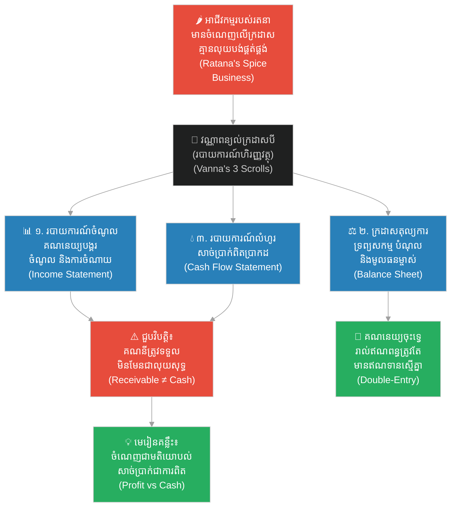

# ២៦៨ — ពាណិជ្ជករដែលរាប់គ្រប់កាក់ (The Merchant Who Counted Every Coin)៖ របាយការណ៍ហិរញ្ញវត្ថុ និងគណនេយ្យចុះទ្វេ
**Subject:** Financial Accounting  
**Concept:** Three financial statements, GAAP vs IFRS, double-entry bookkeeping  
**Level:** Year 2  
**Author:** ichamrong  
**Date:** 2026-05-30  
**Tags:** #financial-accounting #double-entry #parables #business-sustainability #cambodian-context  
**Category:** Business Sustainability  
**Read Time:** ~4 min  

---

## 📌 មាតិកា (Table of Contents)
- [វិបត្តិធុរកិច្ច និងអន្ទាក់ហិរញ្ញវត្ថុ (The Financial Dilemma)](#0)
- [១. រឿងនិទានប្រៀបធៀប៖ រតនា និងក្រដាសរមូរទាំងបី (The Parable: Ratana and the Three Scrolls)](#1)
- [២. គំនូសតាងលំហូរការងារ (System Flowchart)](#2)
- [៣. មេរៀនពីរឿង (Lesson)](#3)
- [Related Posts](#4)

---

## វិបត្តិធុរកិច្ច និងអន្ទាក់ហិរញ្ញវត្ថុ (The Financial Dilemma)

នៅក្នុងការគ្រប់គ្រងអាជីវកម្ម កំហុសឆ្គងដ៏ធំបំផុតមួយដែលសហគ្រិនជាច្រើនតែងតែជួបប្រទះ គឺការភាន់ច្រឡំរវាង «ប្រាក់ចំណេញលើក្រដាស» និង «សាច់ប្រាក់ពិតប្រាកដនៅក្នុងដៃ»។ អាជីវកម្មមួយអាចមើលទៅហាក់ដូចជាទទួលបានជោគជ័យ និងមានផលចំណេញយ៉ាងច្រើននៅក្នុងរបាយការណ៍លទ្ធផលការងារ ប៉ុន្តែបែរជាជួបវិបត្តិអសន្និធិ និងក្ស័យធនដោយសារគ្មានលុយសុទ្ធសម្រាប់ទូទាត់ថ្លៃដើមប្រតិបត្តិការប្រចាំថ្ងៃ ដូចជាប្រាក់ខែបុគ្គលិក ឬប្រាក់ថ្លៃវត្ថុធាតុដើមទៅឱ្យអ្នកផ្គត់ផ្គង់ឡើយ។ នេះគឺជាអន្ទាក់នៃការមិនយល់ដឹងពីប្រព័ន្ធរបាយការណ៍ហិរញ្ញវត្ថុ ដែលតម្រូវឱ្យមានការវិភាគស៊ីជម្រៅតាមរយៈកញ្ចក់ឆ្លុះទាំងបីនៃគណនេយ្យ។

---

## ១. រឿងនិទានប្រៀបធៀប៖ រតនា និងក្រដាសរមូរទាំងបី (The Parable: Ratana and the Three Scrolls)

ពាណិជ្ជករ (merchant) ម្នាក់ឈ្មោះ **រតនា (Ratana)** បានដំណើរការអាជីវកម្មលក់គ្រឿងទេសមួយ ដែលមើលទៅហាក់ដូចជាកំពុងរីកចម្រើនយ៉ាងខ្លាំង។ ជារៀងរាល់ខែ ក្រដាសកត់ត្រាប្រាក់ចំណូលរបស់គាត់បង្ហាញថាមានប្រាក់ចំណេញ ប៉ុន្តែជារៀងរាល់សប្តាហ៍ គាត់តែងតែឃើញខ្លួនឯងគ្មានលទ្ធភាពបង់ប្រាក់ឱ្យអ្នកផ្គត់ផ្គង់ឡើយ។ គាត់បានខ្ចីលុយពីមិត្តភក្តិ ពន្យារពេលបង់ប្រាក់ឱ្យកសិករ និងមិនអាចពន្យល់បានថាហេតុអ្វីបានជាអាជីវកម្មដែលមានចំណេញបែរជាតែងតែខ្វះខាតប្រាក់ជានិច្ច។ គណនេយ្យកររបស់គាត់ ដែលជាព្រឹទ្ធាចារ្យម្នាក់ឈ្មោះ **វណ្ណា (Vanna)** បានឱ្យគាត់អង្គុយចុះ រួចលាតក្រដាសរមូរចំនួនបីសន្លឹក។

«ក្រដាសរមូរទីមួយ» វណ្ណាពន្យល់ «គឺ **ក្រដាសកត់ត្រាប្រាក់ចំណូល (Income Statement)**។ វាចុះបញ្ជីរាល់ចំណូលដែលរកបាន (revenue earned) និងរាល់ការចំណាយទាំងអស់ដែលបានកើតឡើង (expenses incurred) ក្នុងរយៈពេលមួយ។ នៅក្រោម **វិធីសាស្ត្រគណនេយ្យបង្គរ (Accrual Accounting)** ចំណូលត្រូវបានកត់ត្រានៅពេលដែលវាត្រូវបានបង្កើតឡើង មិនមែននៅពេលទទួលបានសាច់ប្រាក់ពិតប្រាកដនោះឡើយ។» 

«ក្រដាសរមូរទីពីរ» វណ្ណាបន្ត «គឺ **ក្រដាសតុល្យការ (Balance Sheet)**។ វាចុះបញ្ជីរាល់របស់របរទាំងអស់ដែលអ្នកមាន ملکیت (**ទ្រព្យសកម្ម — Assets**), រាល់កាតព្វកិច្ចដែលអ្នកត្រូវសង (**បំណុល — Liabilities**), និងទ្រព្យសម្បត្តិពិតប្រាកដដែលនៅសេសសល់ជារបស់អ្នក (**មូលធនម្ចាស់ — Equity**) នៅចំណុចជាក់លាក់ណាមួយនៃពេលវេលា។ រាល់គណនីនីមួយៗតែងតែមានពីរផ្នែកជានិច្ច គឺផ្នែកឥណពន្ធ និងឥណទាន (**គណនេយ្យចុះទ្វេ — Double-entry Bookkeeping**) ព្រោះរាល់ប្រតិបត្តិការនីមួយៗតែងតែមានការផ្តល់ឱ្យ និងការទទួលយកទៅវិញទៅមក។»

«ក្រដាសរមូរទីបី» វណ្ណានិយាយរួចយកម្រាមដៃគោះតុ «គឺ **របាយការណ៍លំហូរសាច់ប្រាក់ (Cash Flow Statement)** ឬហៅថា ក្រដាសរមូរទឹក។ វាបង្ហាញពីកន្លែងដែលសាច់ប្រាក់ពិតប្រាកដបានហូរចូល និងហូរចេញពីដៃរបស់អ្នក — មិនមែននៅពេលដែលអ្នករកវាបាននោះទេ ប៉ុន្តែគឺនៅពេលដែលអ្នកបានប៉ះពាល់វាផ្ទាល់។» 

រតនាបានលក់គ្រឿងទេសចំនួន ៥០០ កន្ត្រកទៅឱ្យអ្នកទិញក្នុងព្រះបរមរាជវាំង ដែលនឹងទូទាត់ប្រាក់ឱ្យក្នុងរយៈពេល ៩០ ថ្ងៃបន្ទាប់ — នេះត្រូវបានហៅថា **គណនីត្រូវទទួល (Accounts Receivable)**។ នៅក្នុងរបាយការណ៍លទ្ធផលការងារ វាមើលទៅហាក់ដូចជាប្រាក់ចំណេញដ៏ច្រើនសន្ធឹកសន្ធាប់ ប៉ុន្តែនៅក្នុងរបាយការណ៍លំហូរសាច់ប្រាក់ វាកត់ត្រាបានត្រឹមតែលេខសូន្យប៉ុណ្ណោះ។ គាត់បានយល់ច្រឡំដោយយក «ពាក្យសន្យា» មកកត់ត្រាជា «កាក់មាស»។

វណ្ណាក៏បានពន្យល់បន្ថែមទៀតថា ព្រះរាជាណាចក្រផ្សេងៗគ្នាមានច្បាប់គណនេយ្យខុសៗគ្នា។ ដៃគូពាណិជ្ជកម្មលោកខាងលិចប្រើប្រាស់ **គោលការណ៍គណនេយ្យទូទៅ (GAAP)** ឬ **ស្តង់ដាររបាយការណ៍ហិរញ្ញវត្ថុអន្តរជាតិ (IFRS)** ដែលជាស្តង់ដារតម្រូវឱ្យមានការរាយការណ៍ហិរញ្ញវត្ថុប្រកបដោយភាពស៊ីសង្វាក់គ្នា និងអាចប្រៀបធៀបបាន ដើម្បីឱ្យអ្នកទិញអាជីវកម្មពីនគរម្ខាងទៀតអាចជឿទុកចិត្តលើអ្វីដែលក្រដាសរមូរទាំងនោះបានកត់ត្រាទុក។ 

រតនាបានរៀនមេរៀនមួយដែលអាជីវកម្មភាគច្រើនតែងតែដឹងខ្លួនយឺតពេល៖ **«ប្រាក់ចំណេញគ្រាន់តែជាមតិយោបល់ ប៉ុន្តែសាច់ប្រាក់ទើបជាការពិតជាក់ស្តែង (Profit is an opinion, cash is a fact)»**។ ចាប់ពីថ្ងៃនោះមក គាត់បានជួលអ្នកកាន់បញ្ជីម្នាក់ ហើយធ្វើឱ្យរបាយការណ៍លំហូរសាច់ប្រាក់ក្លាយជាក្រដាសរមូរដំបូងគេដែលគាត់ត្រូវអានរៀងរាល់ព្រឹក។

---

## ២. គំនូសតាងលំហូរការងារ (System Flowchart)

---

## ៣. មេរៀនពីរឿង (Lesson)

របាយការណ៍ហិរញ្ញវត្ថុ (financial statements) មិនមែនជាលិខិតស្នាមរដ្ឋបាលឥតប្រយោជន៍ឡើយ ប៉ុន្តែវាគឺជាកញ្ចក់ឆ្លុះបីផ្ទាំងដែលជួយឱ្យអាជីវកម្មមើលឃើញខ្លួនឯងបានច្បាស់លាស់៖
1. **របាយការណ៍លទ្ធផលការងារ (Income Statement)** បង្ហាញពីសមិទ្ធផលការងារក្នុងរយៈពេលមួយ។
2. **ក្រដាសតុល្យការ (Balance Sheet)** បង្ហាញពីស្ថានភាពសុខភាពហិរញ្ញវត្ថុនៅចំណុចណាមួយនៃពេលវេលា។
3. **របាយការណ៍លំហូរសាច់ប្រាក់ (Cash Flow Statement)** បង្ហាញពីលទ្ធភាពរស់រានមានជីវិតជាក់ស្តែង។

សហគ្រិន និងអាជីវកម្មដែលទទួលបានផលចំណេញជាច្រើនត្រូវបានដួលរលំ ដោយសារតែពួកគេភាន់ច្រឡំនិងវាយតម្លៃគណនេយ្យចំណូលចំណាយជំនួសឱ្យរបាយការណ៍លំហូរសាច់ប្រាក់ពិតប្រាកដ។

---

## Related Posts

- **[Financial Accounting](../01-financial-accounting.md)** — Core financial accounting principles covering the three financial statements, double-entry bookkeeping, and GAAP/IFRS reporting standards for Year 2 students.
