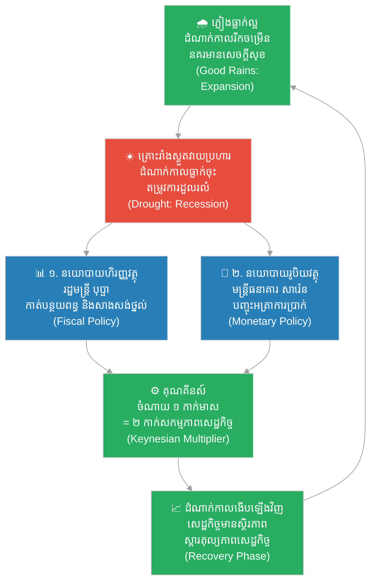

# ២៦៩ — ការប្រមូលផលរបស់ព្រះរាជាណាចក្រ និងគ្រោះរាំងស្ងួត (The Kingdom's Harvest and the Drought)៖ វដ្ដសេដ្ឋកិច្ច និងនយោបាយស្ថិរភាព
**Subject:** Principles of Macroeconomics  
**Concept:** Business cycles, monetary policy, fiscal policy, Keynesian multiplier  
**Level:** Year 2  
**Author:** ichamrong  
**Date:** 2026-05-30  
**Tags:** #macroeconomics #business-cycles #monetary-policy #fiscal-policy #parables #business-sustainability #cambodian-context  
**Category:** Business Sustainability  
**Read Time:** ~4 min  

---

## 📌 មាតិកា (Table of Contents)
- [វិបត្តិធុរកិច្ច និងស្ថិរភាពសេដ្ឋកិច្ច (The Macroeconomic Dilemma)](#0)
- [១. រឿងនិទានប្រៀបធៀប៖ ការប្រមូលផលរបស់ព្រះរាជាណាចក្រ និងគ្រោះរាំងស្ងួត (The Parable Story)](#1)
- [២. គំនូសតាងលំហូរការងារ (System Flowchart)](#2)
- [៣. មេរៀនពីរឿង (Lesson)](#3)
- [Related Posts](#4)

---

## វិបត្តិធុរកិច្ច និងស្ថិរភាពសេដ្ឋកិច្ច (The Macroeconomic Dilemma)

នៅក្នុងប្រព័ន្ធសេដ្ឋកិច្ចម៉ាក្រូ សកម្មភាពសេដ្ឋកិច្ចមិនមានការរីកចម្រើនក្នុងខ្សែបន្ទាត់ត្រង់រហូតនោះទេ ប៉ុន្តែវាដំណើរការតាមលក្ខណៈជាវដ្ដ ដែលឆ្លងកាត់ដំណាក់កាលរីកចម្រើន និងដំណាក់កាលធ្លាក់ចុះ។ សម្រាប់សហគ្រាស និងរដ្ឋាភិបាល ការយល់ដឹងពីរបៀបគ្រប់គ្រងស្ថិរភាពសេដ្ឋកិច្ចនៅពេលជួបវិបត្តិធ្លាក់ចុះ គឺមានសារៈសំខាន់បំផុតដើម្បីការពារសង្វាក់ផ្គត់ផ្គង់ និងការងាររបស់ប្រជាពលរដ្ឋ។ តាមរយៈការប្រើប្រាស់ឧបករណ៍នយោបាយហិរញ្ញវត្ថុ និងនយោបាយរូបិយវត្ថុ រដ្ឋាភិបាលអាចជួយកាត់បន្ថយផលប៉ះពាល់ និងជម្រុញការងើបឡើងវិញនៃសេដ្ឋកិច្ចបាន។

---

## ១. រឿងនិទានប្រៀបធៀប៖ ការប្រមូលផលរបស់ព្រះរាជាណាចក្រ និងគ្រោះរាំងស្ងួត (The Parable Story)

នៅក្នុងព្រះរាជាណាចក្រ (kingdom) មួយ សេដ្ឋកិច្ចទាំងមូលតែងតែផ្លាស់ប្តូរទៅតាមរដូវភ្លៀងធ្លាក់។ នៅពេលដែលរដូវវស្សាមកដល់មានទឹកភ្លៀងបរិបូរ ទិន្នផលស្រូវកើនឡើងខ្ពស់ ពាណិជ្ជករទទួលបានផលចំណេញច្រើន ជាងសំណង់ត្រូវបានជួលឱ្យសាងសង់ ហើយព្រះរាជាណាចក្រទាំងមូលមានភាពអ៊ូអរយ៉ាងខ្លាំង — ដំណាក់កាលនេះហៅថា **ការរីកចម្រើនសេដ្ឋកិច្ច (Economic Expansion)**។ ប៉ុន្តែនៅពេលដែលគ្រោះរាំងស្ងួតមកដល់ ការប្រមូលផលត្រូវបរាជ័យ តម្រូវការទិញទំនិញដួលរលំ អាជីវករលែងចង់ទិញទំនិញថ្មី កម្មករត្រូវបានបញ្ឈប់ពីការងារ ហើយព្រះរាជាណាចក្រទាំងមូលធ្លាក់ចូលក្នុងភាពស្ងប់ស្ងាត់ — ដំណាក់កាលនេះហៅថា **ការធ្លាក់ចុះសេដ្ឋកិច្ច ឬវិបត្តិសេដ្ឋកិច្ច (Recession)**។ វដ្ដនៃការផ្លាស់ប្តូរនេះ — ការរីកចម្រើន (expansion), ចំណុចកំពូល (peak), ការធ្លាក់ចុះ (contraction), ចំណុចទាបបំផុត (trough), និងការងើបឡើងវិញ (recovery) — គឺជាអ្វីដែលសេដ្ឋវិទូប្រចាំព្រះរាជវាំងហៅថា **វដ្ដសេដ្ឋកិច្ច (Business Cycle)**។

គ្រោះរាំងស្ងួត (drought) ដ៏ធ្ងន់ធ្ងរមួយបានវាយប្រហារនៅក្នុងឆ្នាំទីបីនៃរជ្ជកាលស្តេចវ័យក្មេង។ រដ្ឋមន្ត្រីក្រសួងព្រះរាជទ្រព្យ (royal treasurer) ឈ្មោះ **បុប្ផា (Bopha)** បានស្នើឡើងនូវវិធានការចំនួនពីរទាក់ទងនឹង **នយោបាយហិរញ្ញវត្ថុ (Fiscal Policy)** ដែលជាគោលនយោបាយរបស់រដ្ឋាភិបាលលើការចំណាយ និងការបង់ពន្ធ៖
1. **ទីមួយ៖** កាត់បន្ថយពន្ធលើកសិករ និងអាជីវករ ដើម្បីឱ្យពួកគេអាចរក្សាទុកចំណូលដែលនៅសេសសល់តិចតួចរបស់ខ្លួន។
2. **ទីពីរ៖** បញ្ជាឱ្យមានការសាងសង់ផ្លូវថ្នល់ និងប្រឡាយទឹករបស់ព្រះរាជវាំង ដោយផ្តល់ប្រាក់ខែដល់កម្មករ ដែលបន្ទាប់មកពួកគេនឹងយកលុយនោះទៅទិញអាហារ ហើយអ្នកលក់អាហារនឹងយកលុយទៅទូទាត់បន្តឱ្យកម្មករដទៃទៀត — នេះជាការជំរុញហិរញ្ញវត្ថុដែលរីករាលដាលពេញប្រព័ន្ធសេដ្ឋកិច្ច ដូចជាទឹកហូរកាត់វាលស្រែអញ្ចឹង។

ចំណែកឯទីប្រឹក្សាគណៈធនាគារ (central banker) ឈ្មោះ **សារ៉េន (Saren)** បានស្នើឡើងនូវវិធីសាស្ត្រ **នយោបាយរូបិយវត្ថុ (Monetary Policy)** ដោយការកាត់បន្ថយថ្លៃដើមនៃការខ្ចីប្រាក់ ឬ **អត្រាការប្រាក់ (Interest Rate)** ដើម្បីឱ្យពាណិជ្ជករអាចខ្ចីប្រាក់មកវិនិយោគលើទំនិញថ្មីៗ ដោយមិនបារម្ភថាការប្រាក់ខ្ពស់នឹងបំផ្លាញអាជីវកម្មរបស់ខ្លួនឡើយ។ ការបញ្ចុះអត្រាការប្រាក់នឹងជួយលើកទឹកចិត្តឱ្យមានការវិនិយោគ និងការចំណាយ — ដែលជាការបើកទ្វារទឹកកសិកម្មផ្នែករូបិយវត្ថុ។

ទីប្រឹក្សាទីបី ដែលជាអ្នកប្រាជ្ញបានសិក្សាពីសំណេររបស់សេដ្ឋវិទូឈ្មោះ Keynes បានពន្យល់អំពី **គុណគីនស៍ (Keynesian Multiplier)**៖ រាល់កាក់មាសនីមួយៗដែលព្រះរាជាបានចំណាយលើការធ្វើផ្លូវ នឹងត្រូវទទួលបានដោយកម្មករ រួចកម្មករនឹងយកពាក់កណ្តាលទៅទិញអាហារ ហើយអ្នកលក់អាហារនឹងយកពាក់កណ្តាលនៃលុយនោះទៅទិញគ្រាប់ពូជបន្ត — ធ្វើឱ្យកាក់មាសតែមួយកាក់អាចបង្កើតសកម្មភាពសេដ្ឋកិច្ចបានរហូតដល់ពីរកាក់ មុនពេលវាស្ងប់ស្ងាត់ទៅវិញ។

ព្រះរាជាបានសម្រេចចិត្តប្រើប្រាស់ឧបករណ៍ទាំងពីរនេះស្របពេលគ្នា — ដោយរួមបញ្ចូលគ្នារវាងនយោបាយហិរញ្ញវត្ថុ និងនយោបាយរូបិយវត្ថុ។ ការងើបឡើងវិញនៃសេដ្ឋកិច្ចមានលក្ខណៈយឺតជាងការរំពឹងទុកបន្តិច — ពោលគឺត្រូវចំណាយពេលពីររដូវ មិនមែនមួយរដូវឡើយ — ប៉ុន្តែព្រះរាជាណាចក្រទាំងមូលមិនបានដួលរលំនោះទេ។ មេរៀនរបស់បុប្ផាត្រូវបានកត់ត្រាទុកក្នុងបណ្ណសារដ្ឋានរបស់រដ្ឋ៖ *«សេដ្ឋកិច្ចតែងតែមានការវិលវល់រវាងភ្លៀង និងភាពរាំងស្ងួត ហើយឧបករណ៍របស់រដ្ឋាភិបាល — ការចំណាយ ការបង់ពន្ធ និងការកំណត់ថ្លៃដើមឥណទាន — អាចជួយពន្យឺតការធ្លាក់ចុះ និងជម្រុញការងើបឡើងវិញបាន លុះត្រាតែវាត្រូវបានប្រើប្រាស់ទាន់ពេលវេលា និងប្រកបដោយតម្លាភាព។»*

---

## ២. គំនូសតាងលំហូរការងារ (System Flowchart)

---

## ៣. មេរៀនពីរឿង (Lesson)

វដ្ដសេដ្ឋកិច្ច (business cycles) គឺជាលក្ខណៈធម្មជាតិនៃប្រព័ន្ធសេដ្ឋកិច្ច — ការរីកចម្រើន និងការធ្លាក់ចុះតែងតែឆ្លាស់គ្នាដូចជារដូវប្រាំង និងរដូវវស្សា។ រដ្ឋាភិបាលមានឧបករណ៍សំខាន់ពីរក្នុងការរក្សាស្ថិរភាព៖
1. **នយោបាយហិរញ្ញវត្ថុ (Fiscal Policy)**៖ តាមរយៈការគ្រប់គ្រងការចំណាយរបស់រដ្ឋ និងការកែសម្រួលពន្ធដារ។
2. **នយោបាយរូបិយវត្ថុ (Monetary Policy)**៖ តាមរយៈការគ្រប់គ្រងអត្រាការប្រាក់ និងបរិមាណផ្គត់ផ្គង់លុយក្នុងទីផ្សារ។

គុណគីនស៍ (Keynesian multiplier) បង្ហាញថា ការចំណាយរបស់រដ្ឋាភិបាលក្នុងកំឡុងពេលវិបត្តិសេដ្ឋកិច្ច នឹងជួយជម្រុញសកម្មភាពសេដ្ឋកិច្ចបន្ថែមជាច្រើនដង — ធ្វើឱ្យរាល់កាក់មាសនៃការជំរុញសេដ្ឋកិច្ចមានតម្លៃស្មើនឹងច្រើនជាងមួយកាក់មាសនៅក្នុងដំណើរការសេដ្ឋកិច្ចសរុប។

---

## Related Posts

- **[Principles of Macroeconomics](../02-principles-of-macroeconomics.md)** — Macroeconomic theory covering business cycles, GDP, fiscal and monetary policy, and Keynesian demand management for Year 2 students.
