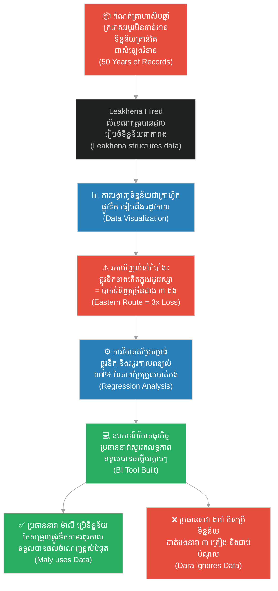

# ២៧០ — អ្នកអានផែនទីដែលមើលមិនឃើញ (The Blind Map Reader)៖ ការវិភាគទិន្នន័យ និងឧបករណ៍វាយតម្លៃអាជីវកម្ម
**Subject:** Data Analytics for Business  
**Concept:** Data visualization, regression analysis, BI tools  
**Level:** Year 2  
**Author:** ichamrong  
**Date:** 2026-05-30  
**Tags:** #data-analytics #data-visualization #regression-analysis #bi-tools #parables #business-sustainability #cambodian-context  
**Category:** Business Sustainability  
**Read Time:** ~4 min  

---

## 📌 មាតិកា (Table of Contents)
- [វិបត្តិធុរកិច្ច និងការវិភាគទិន្នន័យ (The Business Analytics Dilemma)](#0)
- [១. រឿងនិទានប្រៀបធៀប៖ អ្នកអានផែនទីដែលមើលមិនឃើញ (The Parable Story)](#1)
- [២. គំនូសតាងលំហូរការងារ (System Flowchart)](#2)
- [៣. មេរៀនពីរឿង (Lesson)](#3)
- [Related Posts](#4)

---

## វិបត្តិធុរកិច្ច និងការវិភាគទិន្នន័យ (The Business Analytics Dilemma)

នៅក្នុងយុគសម័យព័ត៌មានវិទ្យា អាជីវកម្មជាច្រើនតែងតែកកកុញទៅដោយទិន្នន័យដ៏ច្រើនមហាសាល។ ទោះជាយ៉ាងណាក៏ដោយ ទិន្នន័យទាំងនោះច្រើនតែត្រូវបានទុកចោលដោយគ្មានការប្រើប្រាស់ ឬកប់ទុកនៅក្នុងបណ្ណសារដ្ឋាន ព្រោះគ្មាននរណាម្នាក់ដឹងពីរបៀបអាន ឬស្រង់យកអត្ថប្រយោជន៍ពីវាឡើយ។ ការប្រមូលទិន្នន័យដោយគ្មានការរៀបចំ និងគ្មានការបង្ហាញឱ្យឃើញច្បាស់លាស់ គឺមិនខុសពីការមានទ្រព្យសម្បត្តិដែលកប់ទុកក្នុងដីនោះទេ។ តាមរយៈការប្រើប្រាស់វិធីសាស្ត្របង្ហាញទិន្នន័យជាក្រាហ្វិក ការវិភាគតម្រែតម្រង់ និងឧបករណ៍វិភាគធុរកិច្ច អាជីវកម្មអាចផ្លាស់ប្តូរទិន្នន័យរញ៉េរញ៉ៃទៅជាការសម្រេចចិត្តដ៏មានអំណាច និងច្បាស់លាស់បំផុត។

---

## ១. រឿងនិទានប្រៀបធៀប៖ អ្នកអានផែនទីដែលមើលមិនឃើញ (The Parable Story)

ក្រុមហ៊ុនដឹកជញ្ជូន (shipping company) ដ៏ចំណាស់បំផុតមួយនៅក្នុងទីក្រុងកំពង់ផែ បានរក្សាទុកកំណត់ត្រានៃរាល់ការធ្វើដំណើររបស់នាវាទាំងអស់អស់រយៈពេលហាសិបឆ្នាំ — រាប់ចាប់ពីលក្ខខណ្ឌអាកាសធាតុ ប្រភេទមុខទំនិញ ផ្លូវទឹកដែលបានប្រើប្រាស់ រហូតដល់ការខូចខាត និងការបាត់បង់ទំនិញនានា។ ក្រដាសរមូរកំណត់ត្រារាប់ពាន់ត្រូវបានទុកដាក់តម្រៀបគ្នាពីបាតរហូតដល់ពិដាននៅក្នុងបណ្ណសារដ្ឋានថ្មមួយ។ ក្រុមប្រធាននាវា (captains) ដែលធ្លាប់បានធ្វើដំណើរទាំងនោះបានស្លាប់ ឬចូលនិវត្តន៍អស់ទៅហើយ ហើយក្រុមប្រធាននាវាបច្ចុប្បន្នបានបើកបរនាវាដោយផ្អែកលើការចងចាំ វិចារណញ្ញាណ និងការបន់ស្រន់សុំកុំឱ្យជួបអាកាសធាតុអាក្រក់តែប៉ុណ្ណោះ។ ក្នុងចំណោមពួកគេ មានពីរនាក់បានជួបគ្រោះថ្នាក់លិចនាវាក្នុងកំឡុងទសវត្សរ៍ចុងក្រោយនេះ។ តាមពិតទៅ ទិន្នន័យសម្រាប់ការពារការបាត់បង់ទាំងនោះគឺមានស្រាប់នៅក្នុងបណ្ណសារដ្ឋាន — គ្រាន់តែគ្មាននរណាម្នាក់ធ្លាប់អានវាឡើយ។

អ្នកវិភាគវ័យក្មេងម្នាក់ឈ្មោះ **លីខេណា (Leakhena)** ត្រូវបានជួលឱ្យមកពិនិត្យ និងស្រាវជ្រាវបណ្ណសារដ្ឋាននេះឡើងវិញ។ នាងមិនបានអានក្រដាសរមូរទាំងនោះម្តងមួយៗឡើយ ព្រោះវាមានចំនួនច្រើនហួសហេតុពេក។ ផ្ទុយទៅវិញ នាងបានកូដទិន្នន័យនៃការធ្វើដំណើរនីមួយៗបញ្ចូលទៅក្នុងតារាងដែលមានរចនាសម្ព័ន្ធត្រឹមត្រូវ រួចហើយនាងបានគូរវាជាផែនទី ឬហៅថា **ការបង្ហាញទិន្នន័យជាក្រាហ្វិក (Data Visualization)** ដោយចំនុចនីមួយៗតំណាងឱ្យការធ្វើដំណើរមួយ៖ ផ្លូវទឹកនៅលើអ័ក្សដេក រដូវកាលនៅលើអ័ក្សឈរ ហើយពណ៌តំណាងឱ្យស្ថានភាពថាតើទំនិញត្រូវបានបាត់បង់ឬអត់។ ភ្លាមៗនោះ លំនាំមួយបានលេចឡើងយ៉ាងច្បាស់ក្រឡែត៖ ផ្លូវទឹកប៉ែកខាងកើតនៅក្នុងរដូវវស្សាបង្ហាញថាមានការបាត់បង់ទំនិញច្រើនជាងរហូតដល់បីដង បើធៀបនឹងការរួមបញ្ចូលគ្នានៃផ្លូវទឹក និងរដូវកាលដទៃទៀត — វាជាក្រុមចំនុចពណ៌ក្រហមដ៏ក្រាស់ ដែលក្រដាសរមូរកំណត់ត្រាហាសិបឆ្នាំបានកប់ទុកវាបាត់យ៉ាងជិតឈឹង។

បន្ទាប់មក លីខេណាបានដំណើរការ **ការវិភាគតម្រែតម្រង់ (Regression Analysis)** ដើម្បីបញ្ជាក់ឱ្យឃើញច្បាស់ថាតើកត្តាណាខ្លះដែលជាកត្តាព្យាករណ៍ខ្លាំងបំផុតចំពោះការបាត់បង់ទំនិញ។ កត្តារដូវកាល ផ្លូវទឹក អាយុកាលរបស់នាវា និងប្រភេទមុខទំនិញ — នាងបានវាស់វែងទំនាក់ទំនងរវាងអថេរនីមួយៗ និងលទ្ធផលចុងក្រោយ។ ការវិភាគតម្រែតម្រង់បានបញ្ជាក់ពីអ្វីដែលការបង្ហាញជាក្រាហ្វិកបានបង្ហាញ៖ កត្តាផ្លូវទឹក និងរដូវកាលរួមគ្នាអាចពន្យល់បានរហូតដល់ ៦៧% នៃភាពប្រែប្រួលនៃការបាត់បង់ទំនិញទាំងអស់។ 

បន្ទាប់មក នាងបានរៀបចំ **ឧបករណ៍វិភាគធុរកិច្ច (Business Intelligence Tool - BI Tool)** របស់ក្រុមហ៊ុន ដែលអនុញ្ញាតឱ្យប្រធាននាវាណាម្នាក់អាចសួរទិន្នន័យបានភ្លាមៗថា៖ *«ផ្លូវទឹកខាងកើត ក្នុងរដូវវស្សា — តើលទ្ធភាពនៃការខូចខាត និងការបាត់បង់ទំនិញតាមប្រវត្តិសាស្ត្រមានកម្រិតប៉ុន្មានភាគរយ?»* រួចទទួលបានចម្លើយភ្លាមៗក្នុងរយៈពេលត្រឹមតែប៉ុន្មានវិនាទីប៉ុណ្ណោះ។

ប្រធាននាវាឈ្មោះ **ដារ៉ា (Dara)** ដែលបានបដិសេធមិនព្រមប្រើប្រាស់ទិន្នន័យ និងបានបន្តបើកបរនាវាកាត់តាមផ្លូវទឹកខាងកើតក្នុងរដូវវស្សាចំនួនពីរលើក បានបាត់បង់នាវាអស់ចំនួនបីគ្រឿង រួចបានចូលនិវត្តន៍ទាំងជាប់បំណុលវណ្ឌក។ ចំណែកឯប្រធាននាវាឈ្មោះ **ម៉ាលី (Maly)** ដែលបានអានរបាយការណ៍របស់លីខេណា និងបានកែសម្រួលផ្លូវទឹករបស់ខ្លួនទៅតាមរដូវកាល បានក្លាយជាពាណិជ្ជករដែលទទួលបានផលចំណេញខ្ពស់បំផុតនៅក្នុងកំពង់ផែក្នុងរយៈពេលត្រឹមតែប្រាំឆ្នាំប៉ុណ្ណោះ។

មេរៀនរបស់លីខេណាគឺសាមញ្ញបំផុត៖ **«ទិន្នន័យមានប្រយោជន៍ លុះត្រាតែវាត្រូវបានបង្ហាញឱ្យឃើញច្បាស់លាស់។ លេខនៅក្នុងប្រអប់គ្រាន់តែជាសំឡេងរំខាន ប៉ុន្តែលេខនៅក្នុងគំនូសតាងដែលរៀបចំឡើងយ៉ាងល្អ គឺជាការសម្រេចចិត្តដ៏ឆ្លាតវៃ។»**

---

## ២. គំនូសតាងលំហូរការងារ (System Flowchart)

---

## ៣. មេរៀនពីរឿង (Lesson)

ទិន្នន័យ (data) ដែលគ្មានរចនាសម្ព័ន្ធ និងគ្មានការបង្ហាញជាក្រាហ្វិក គឺគ្រាន់តែជាសំឡេងរំខានដែលកប់ទុកក្នុងប្រអប់ប៉ុណ្ណោះ។ ការបង្ហាញទិន្នន័យជាក្រាហ្វិក (Data Visualization) ជួយផ្លាស់ប្តូរតួលេខស្មុគស្មាញឱ្យទៅជាលំនាំរូបភាពដែលខួរក្បាលមនុស្សអាចយល់ និងធ្វើសកម្មភាពបានភ្លាមៗ ខណៈពេលដែលការវិភាគតម្រែតម្រង់ (Regression Analysis) ជួយកំណត់អត្តសញ្ញាណអថេរណាដែលជះឥទ្ធិពល និងអាចព្យាករណ៍លទ្ធផលបានយ៉ាងត្រឹមត្រូវបំផុត។ ឧបករណ៍វិភាគធុរកិច្ច (Business Intelligence Tools) ធ្វើឱ្យសមត្ថភាពទាំងពីរនេះមានភាពងាយស្រួលសម្រាប់អ្នកធ្វើសេចក្តីសម្រេចចិត្តនៅខណៈពេលដែលពួកគេត្រូវសម្រេចចិត្ត — ដោយបំប្លែងព័ត៌មានដែលកប់ទុក ឱ្យទៅជាអត្ថប្រយោជន៍ប្រកួតប្រជែងដ៏មហាសាល។

---

## Related Posts

- **[Data Analytics for Business](../03-data-analytics-for-business.md)** — Applied data analytics covering visualization, regression analysis, and business intelligence tools for managerial decision-making in Year 2.
