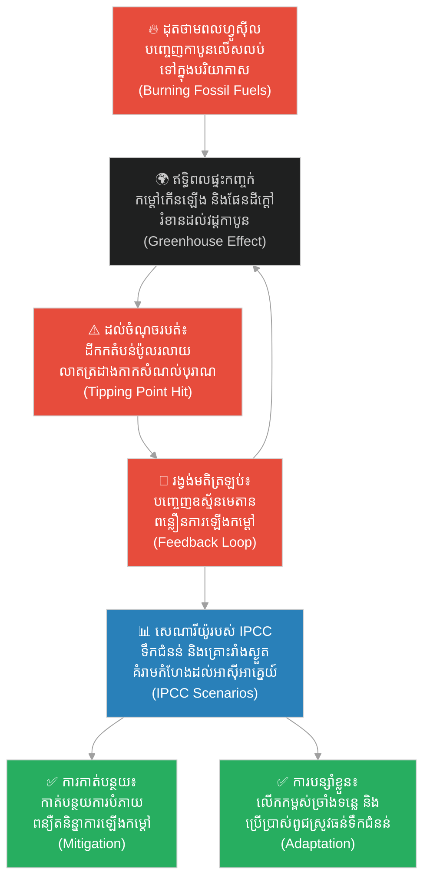

# ២៧១ — ស្ទឹងដែលភ្លេចច្រាំងរបស់ខ្លួន (The River That Forgot Its Banks)៖ វិទ្យាសាស្ត្រនៃការប្រែប្រួលអាកាសធាតុ
**Subject:** Science of Climate Change  
**Concept:** Tipping points, feedback loops, IPCC scenarios  
**Level:** Year 2  
**Author:** ichamrong  
**Date:** 2026-05-30  
**Tags:** #climate-change #greenhouse-effect #tipping-points #feedback-loops #ipcc-scenarios #business-sustainability #cambodian-context  
**Category:** Business Sustainability  
**Read Time:** ~4 min  

---

## 📌 មាតិកា (Table of Contents)
- [វិបត្តិធុរកិច្ច និងការប្រែប្រួលអាកាសធាតុ (The Climate Dilemma)](#0)
- [១. រឿងនិទានប្រៀបធៀប៖ ស្ទឹងដែលភ្លេចច្រាំងរបស់ខ្លួន (The Parable Story)](#1)
- [២. គំនូសតាងលំហូរការងារ (System Flowchart)](#2)
- [៣. មេរៀនពីរឿង (Lesson)](#3)
- [Related Posts](#4)

---

## វិបត្តិធុរកិច្ច និងការប្រែប្រួលអាកាសធាតុ (The Climate Dilemma)

ការប្រែប្រួលអាកាសធាតុមិនមែនជាទ្រឹស្តីអរូបិយដែលនៅឆ្ងាយពីយើងនោះទេ ប៉ុន្តែវាគឺជាការពិតជាក់ស្តែងដែលកំពុងគំរាមកំហែងដល់ប្រព័ន្ធអេកូឡូស៊ី សង្វាក់ផ្គត់ផ្គង់កសិកម្ម និងជីវភាពរស់នៅរបស់មនុស្សជាតិទូទាំងពិភពលោក។ សម្រាប់អ្នកគ្រប់គ្រង និងអ្នកដឹកនាំអាជីវកម្ម ការយល់ដឹងពីយន្តការវិទ្យាសាស្ត្រនៃការប្រែប្រួលអាកាសធាតុ ដូចជា ឥទ្ធិពលផ្ទះកញ្ចក់ វដ្ដកាបូន ចំណុចរបត់ និងរង្វង់មតិត្រឡប់ គឺមានសារៈសំខាន់បំផុតដើម្បីរៀបចំយុទ្ធសាស្ត្រកាត់បន្ថយការបំភាយឧស្ម័ន និងការបន្សាំខ្លួនទៅនឹងការផ្លាស់ប្តូរដែលលែងអាចជៀសវាងបាន។

---

## ១. រឿងនិទានប្រៀបធៀប៖ ស្ទឹងដែលភ្លេចច្រាំងរបស់ខ្លួន (The Parable Story)

ចាស់ទុំ (elders) នៅក្នុងភូមិមួយតាមបណ្តោយទន្លេមេគង្គនៅតែចងចាំពីពេលដែលទន្លេនេះមានលក្ខណៈដែលអាចព្យាករណ៍បានយ៉ាងងាយស្រួល។ ទឹកជំនន់តែងតែកើតឡើងនៅក្នុងខែដដែលពីរដងជារៀងរាល់ឆ្នាំ ហើយទឹកមិនដែលហូរហួសពីច្រាំងរបស់វាលើសពីចម្ងាយដើរមួយថ្ងៃឡើយ ដោយបន្សល់ទុកនូវដីល្បាប់ដ៏មានជីជាតិដែលធ្វើឱ្យស្រូវរបស់ពួកគេល្បីល្បាញទូទាំងតំបន់។ ប៉ុន្តែបច្ចុប្បន្ន ទឹកជំនន់បែរជាមកដល់ខុសខែ ឬមិនមកសោះ ឬមកម្តងទាំងអស់គ្នាយ៉ាងគំហុក ដែលបំផ្លាញផ្ទះសម្បែងដែលបានឈរជើងអស់ជាច្រើនជំនាន់មកហើយ។ វិទ្យាសាស្ត្រករផ្នែកអាកាសធាតុវ័យក្មេងម្នាក់ឈ្មោះ **ចាន់ដា (Chanda)** បានមកកាន់ភូមិនោះ រួចចាស់ទុំទាំងអស់បានសួរនាងថា៖ *«តើមានអ្វីកើតឡើងចំពោះស្ទឹងរបស់ពួកយើង?»*

ចាន់ដាបានពន្យល់ពួកគេអំពី **ឥទ្ធិពលផ្ទះកញ្ចក់ (Greenhouse Effect)**៖ វាគឺជាស្រទាប់ឧស្ម័នធម្មជាតិ — រួមមាន កាបូនឌីអុកស៊ីត (carbon dioxide), មេតាន (methane), និងចំហាយទឹក (water vapor) — ដែលជួយរក្សាកំដៅពីព្រះអាទិត្យ និងរក្សាសីតុណ្ហភាពភពផែនដីឱ្យមានភាពកក់ក្តៅសមរម្យសម្រាប់ជីវិតរស់នៅ។ អស់រយៈពេលរាប់ពាន់ឆ្នាំមកហើយ **វដ្ដកាបូន (Carbon Cycle)** នេះមានតុល្យភាពយ៉ាងល្អឥតខ្ចោះ — កាបូនត្រូវបានស្រូបយកដោយព្រៃឈើ និងមហាសមុទ្រ ហើយកាបូនត្រូវបានបញ្ចេញមកវិញតាមរយៈការរលួយ និងភ្លើងឆេះព្រៃធម្មជាតិ។ ប៉ុន្តែការដុតបំផ្លាញប្រភពថាមពលហ្វូស៊ីល (fossil fuels) ក្នុងរយៈពេលពីររយឆ្នាំចុងក្រោយនេះ បានបន្ថែមបរិមាណកាបូនទៅក្នុងបរិយាកាសក្នុងល្បឿនលឿនជាងប្រព័ន្ធធម្មជាតិអាចស្រូបយកបាន។ លទ្ធផលគឺភពផែនដីកាន់តែក្តៅឡើង — ហើយភពផែនដីដែលកាន់តែក្តៅឡើង នឹងផ្លាស់ប្តូរវដ្ដទឹក (water cycle) ដែលជាប្រភពផ្គត់ផ្គង់ដល់ស្ទឹងទាំងឡាយ។

ចាន់ដាបានគូរគំនូសបង្ហាញពីផ្នែកដ៏គួរឱ្យភ័យខ្លាចបំផុត៖ **ចំណុចរបត់ (Tipping Points)**។ នៅប៉ែកខាងជើងដ៏ឆ្ងាយ តំបន់ដីកកជានិច្ច (**Permafrost** — ដីដែលកកជានិច្ចដែលផ្ទុកសារធាតុសរីរាង្គបុរាណ) កំពុងចាប់ផ្តើមរលាយ។ នៅពេលដែលវារលាយ វាបញ្ចេញឧស្ម័នមេតាន ដែលជាឧស្ម័នផ្ទះកញ្ចក់ដែលមានឥទ្ធិពលខ្លាំងជាងកាបូនឌីអុកស៊ីតឆ្ងាយណាស់។ ការណ៍នេះធ្វើឱ្យភពផែនដីកាន់តែក្តៅឡើងបន្ថែមទៀត ដែលបណ្តាលឱ្យតំបន់ដីកករលាយកាន់តែច្រើនឡើង — នេះហៅថា **រង្វង់មតិត្រឡប់ ឬរង្វង់ពង្រីកស្វ័យប្រវត្ត (Feedback Loop)** ដែលគ្មានហ្វ្រាំងទប់ធម្មជាតិឡើយ។

**ក្រុមប្រឹក្សាអន្តររដ្ឋាភិបាលស្តីពីការប្រែប្រួលអាកាសធាតុ (IPCC)** — ដែលជាក្រុមអ្នកវិទ្យាសាស្ត្រផ្នែកអាកាសធាតុទូទាំងពិភពលោក — បានបង្កើតគំរូសេដ្ឋកិច្ច និងអាកាសធាតុចំនួនជាច្រើន ឬហៅថា **សេណារីយ៉ូរបស់ IPCC (IPCC Scenarios)** ដែលរាប់ចាប់ពីពិភពលោកដែលកាត់បន្ថយការបំភាយឧស្ម័នបានលឿន រហូតដល់ពិភពលោកដែលបន្តដុតបំផ្លាញរាល់ថាមពលហ្វូស៊ីលទាំងអស់ដែលមាន។ នៅក្នុងគ្រប់សេណារីយ៉ូទាំងអស់ តំបន់អាស៊ីអាគ្នេយ៍តែងតែប្រឈមមុខនឹងគ្រោះទឹកជំនន់ និងគ្រោះរាំងស្ងួតកាន់តែធ្ងន់ធ្ងរ និងខ្លាំងក្លាជាងមុនជានិច្ច។

ចាន់ដាបានពន្យល់ថា អ្នកភូមិត្រូវប្រឈមមុខនឹងការឆ្លើយតបពីរយ៉ាង៖
1. **ការកាត់បន្ថយការប្រែប្រួលអាកាសធាតុ (Mitigation)**៖ កាត់បន្ថយអ្វីដែលពួកគេដុតបំផ្លាញ — កាត់បន្ថយការដុតបំផ្លាញព្រៃឈើដើម្បីពង្រីកដីកសិកម្ម ប្រើប្រាស់ប្រព័ន្ធសម្ងួតស្រូវដោយកម្តៅព្រះអាទិត្យជំនួសឱ្យការដុតអុស ដើម្បីពន្យឺតការកើនឡើងកម្តៅដែលកំពុងបង្កការរំខានដល់ស្ទឹងរបស់ពួកគេ។
2. **ការបន្សាំខ្លួនទៅនឹងការប្រែប្រួលអាកាសធាតុ (Adaptation)**៖ សម្របខ្លួនទៅនឹងការផ្លាស់ប្តូរដែលកំពុងតែកើតឡើងរួចទៅហើយ — ដូចជា ការដំឡើងកម្ពស់ច្រាំងស្ទឹង ការផ្លាស់ប្តូរទៅប្រើប្រាស់ពូជស្រូវដែលធន់នឹងទឹកជំនន់ និងការផ្លាស់ទីលំនៅរបស់ផ្ទះដែលងាយរងគ្រោះទៅកាន់ទីទួលសុវត្ថិភាព។

ចុងក្រោយ ចាន់ដានិយាយថា វិធីសាស្ត្រទាំងពីរគឺចាំបាច់ដូចគ្នា៖ ការកាត់បន្ថយដោយគ្មានការបន្សាំខ្លួន គឺដូចជាការមើលរំលងការផ្លាស់ប្តូរដែលបានកើតឡើងរួចទៅហើយ ចំណែកឯការបន្សាំខ្លួនដោយគ្មានការកាត់បន្ថយ គឺមិនខុសពីការចុះចាញ់ចំពោះអនាគតដែលកាន់តែអាក្រក់ទៅៗនោះឡើយ។

---

## ២. គំនូសតាងលំហូរការងារ (System Flowchart)

---

## ៣. មេរៀនពីរឿង (Lesson)

ការប្រែប្រួលអាកាសធាតុ (climate change) មិនមែនជាប្រធានបទអរូបិយដែលនៅឆ្ងាយពីយើងឡើយ — វាកំពុងផ្លាស់ប្តូរលក្ខណៈធម្មជាតិនៃស្ទឹងដែលបានចិញ្ចឹមអ្នកភូមិអស់ជាច្រើនជំនាន់មកហើយ។ ចំណុចរបត់ (Tipping points) និងរង្វង់មតិត្រឡប់ (feedback loops) បង្ហាញថា ការផ្លាស់ប្តូរមួយចំនួននឹងក្លាយជាការពង្រីកខ្លួនដោយស្វ័យប្រវត្តនៅពេលវាឆ្លងហួសកម្រិតកំណត់ណាមួយ — ដែលធ្វើឱ្យសកម្មភាពការពារ និងកាត់បន្ថយដំបូងបង្អស់មានតម្លៃថោកជាងការបន្សាំខ្លួននៅពេលក្រោយឆ្ងាយណាស់។ ទាំងការកាត់បន្ថយ (mitigation) និងការបន្សាំខ្លួន (adaptation) គឺសុទ្ធតែចាំបាច់ត្រូវអនុវត្តទន្ទឹមគ្នា — ដើម្បីឆ្លើយតបទៅនឹងផ្នែកផ្សេងគ្នានៃបញ្ហាតែមួយ។

---

## Related Posts

- **[Science of Climate Change](../04-science-of-climate-change.md)** — Scientific foundations of climate change covering the carbon cycle, greenhouse effect, tipping points, feedback loops, and IPCC assessment scenarios.
