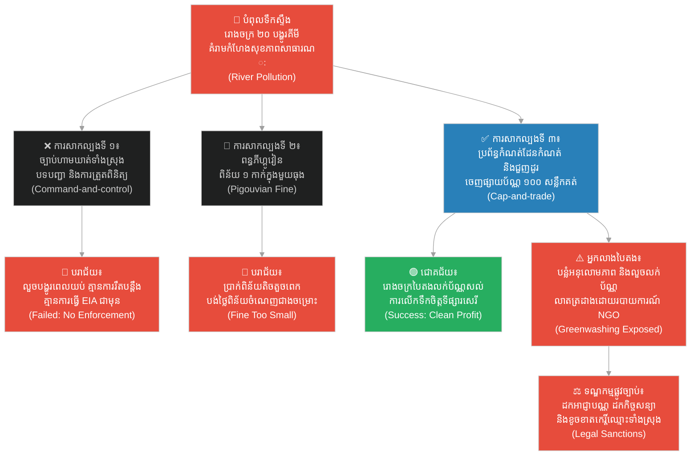

# ២៧២ — អភិបាលខេត្តដែលហាមឃាត់ការបំពុលស្ទឹង (The Governor Who Banned the River)៖ យន្តការនយោបាយ និងច្បាប់ការពារបរិស្ថាន
**Subject:** Environmental Policy & Law  
**Concept:** Cap-and-trade, environmental impact assessment, greenwashing law  
**Level:** Year 2  
**Author:** ichamrong  
**Date:** 2026-05-30  
**Tags:** #environmental-law #environmental-policy #cap-and-trade #eia #greenwashing #parables #business-sustainability #cambodian-context  
**Category:** Business Sustainability  
**Read Time:** ~4 min  

---

## 📌 មាតិកា (Table of Contents)
- [វិបត្តិធុរកិច្ច និងច្បាប់បរិស្ថាន (The Environmental Law Dilemma)](#0)
- [១. រឿងនិទានប្រៀបធៀប៖ អភិបាលខេត្ត និងយុទ្ធសាស្ត្រទាំងបី (The Parable Story)](#1)
- [២. គំនូសតាងលំហូរការងារ (System Flowchart)](#2)
- [៣. មេរៀនពីរឿង (Lesson)](#3)
- [Related Posts](#4)

---

## វិបត្តិធុរកិច្ច និងច្បាប់បរិស្ថាន (The Environmental Law Dilemma)

នៅក្នុងការការពារបរិស្ថាន ការបង្កើតគោលនយោបាយ និងច្បាប់ដែលមានប្រសិទ្ធភាព គឺមិនមែនគ្រាន់តែជាការចេញបញ្ជាហាមឃាត់នោះទេ។ ច្បាប់ និងគោលនយោបាយបរិស្ថាននីមួយៗសុទ្ធតែមានចំណុចខ្លាំង និងចំណុចខ្សោយរៀងៗខ្លួន។ ការអនុវត្តច្បាប់ដោយគ្មានតុល្យភាពទីផ្សារ ឬគ្មានការវាយតម្លៃហេតុប៉ះពាល់បរិស្ថានច្បាស់លាស់ តែងតែនាំឱ្យមានការបំពានច្បាប់នៅកំបាំងភ្នែក។ តាមរយៈការយល់ដឹងពីយន្តការដូចជា ពន្ធភីហ្គូវៀន ប្រព័ន្ធកំណត់ដែនកំណត់ និងការជួញដូរ និងច្បាប់ប្រឆាំងការលាងបៃតង សហគមន៍អាចកាត់បន្ថយការបំពុលបរិស្ថានយ៉ាងមានប្រសិទ្ធភាព និងចីរភាព។

---

## ១. រឿងនិទានប្រៀបធៀប៖ អភិបាលខេត្ត និងយុទ្ធសាស្ត្រទាំងបី (The Parable Story)

អភិបាលខេត្ត (governor) ម្នាក់នៃខេត្តតាមដងស្ទឹងដ៏មានការរីកចម្រើនមួយ បានប្រឈមមុខនឹងវិបត្តិដ៏ធ្ងន់ធ្ងរ៖ រោងចក្រទាំងម្ភៃនៅក្នុងខេត្តបានបង្ហូរកាកសំណល់ពណ៌ជ្រលក់ក្រណាត់គីមីទៅក្នុងស្ទឹង ដែលសម្លាប់មច្ឆជាតិដែលជាប្រភពអាហាររបស់គ្រួសារអ្នកភូមិរាប់ពាន់នាក់ និងបង្កផលប៉ះពាល់ជាទឹកពុលដល់ប្រភពទឹកប្រើប្រាស់របស់ប្រជាជននៅប៉ែកខាងក្រោមស្ទឹង។ គាត់បានសាកល្បងអនុវត្តវិធីសាស្ត្រចំនួនបី ដែលវិធីសាស្ត្រនីមួយៗគឺជាមេរៀនដ៏មានតម្លៃក្នុងការរចនាគោលនយោបាយបរិស្ថាន។

**ការសាកល្បងទីមួយ៖** គឺការចេញច្បាប់ហាមឃាត់ទាំងស្រុង ដែលជាវិធីសាស្ត្រ **បទបញ្ជា និងការត្រួតពិនិត្យ (Command-and-control)**៖ *«មិនអនុញ្ញាតឱ្យរោងចក្រណាមួយបង្ហូរកាកសំណល់គីមីចូលទៅក្នុងស្ទឹងជាដាច់ខាត ទោះក្នុងកាលៈទេសៈណាក៏ដោយ។»* ម្ចាស់រោងចក្រទាំងអស់បានងក់ក្បាលយល់ព្រម ប៉ុន្តែពួកគេបានលួចបង្ហូរកាកសំណល់នៅពេលយប់ ពេលដែលក្រុមមន្ត្រីត្រួតពិនិត្យកំពុងដេកលក់។ ច្បាប់ហាមឃាត់នេះទាមទារឱ្យមានការរឹតបន្តឹងច្បាប់យ៉ាងខ្លាំង ដែលអភិបាលខេត្តគ្មានកម្លាំងមន្ត្រីគ្រប់គ្រាន់ដើម្បីដើរត្រួតពិនិត្យឡើយ។ អ្វីដែលកាន់តែខុសឆ្គងនោះ មុននឹងអនុវត្តច្បាប់នេះ ក្រុមហ៊ុន និងអាជ្ញាធរមិនបានធ្វើ **ការវាយតម្លៃហេតុប៉ះពាល់បរិស្ថាន (Environmental Impact Assessment - EIA)** ឡើយ — គ្មាននរណាម្នាក់ដឹងថារោងចក្រណាជាអ្នកបំពុលធំបំផុត ឬប៉ែកណាខ្លះនៃស្ទឹងដែលងាយរងគ្រោះខ្លាំងជាងគេនោះទេ។

**ការសាកល្បងទីពីរ៖** គឺការដាក់ពិន័យលើការបង្ហូរកាកសំណល់ ដែលជាវិធីសាស្ត្រ **ពន្ធភីហ្គូវៀន (Pigouvian Tax)**៖ *«ពិន័យជាប្រាក់មួយកាក់មាស សម្រាប់រាល់កាកសំណល់គីមីមួយធុងដែលបង្ហូរចូលស្ទឹង។»* ប៉ុន្តែរោងចក្រខ្នាតធំគ្រាន់តែបង់ប្រាក់ពិន័យនោះ រួចបន្តបង្ហូរកាកសំណល់ដដែល — ព្រោះថ្លៃបង់ពិន័យនោះមានតម្លៃថោកជាងការសាងសង់ប្រព័ន្ធចម្រោះទឹកស្អាត។ ថ្លៃពិន័យនេះមានកម្រិតទាបពេកមិនអាចផ្លាស់ប្តូរឥរិយាបថរបស់ពួកគេបានឡើយ៖ ពន្ធពិន័យបរិស្ថានត្រូវតែស្មើនឹងទំហំនៃការខូចខាតជាក់ស្តែង ដែលគ្មាននរណាម្នាក់ធ្លាប់គណនាឱ្យបានត្រឹមត្រូវនោះឡើយ។

**ការសាកល្បងទីបី៖** គឺការអនុវត្ត **ប្រព័ន្ធកំណត់ដែនកំណត់ និងការជួញដូរ (Cap-and-trade)**៖ អភិបាលខេត្តបានចេញផ្សាយប័ណ្ណអនុញ្ញាតបង្ហូរកាកសំណល់ចំនួន ១០០ សន្លឹកគត់ — សន្លឹកនីមួយៗអនុញ្ញាតឱ្យបង្ហូរកាកសំណល់មួយធុងក្នុងមួយខែ — ដោយបែងចែកទៅឱ្យរោងចក្រទាំងអស់។ ប្រសិនបើរោងចក្រណាអាចកាត់បន្ថយការបង្ហូរកាកសំណល់ក្រោមចំនួនប័ណ្ណដែលខ្លួនមាន ពួកគេអាចលក់ប័ណ្ណដែលនៅសល់ទៅឱ្យរោងចក្រផ្សេងទៀតបានតាមតម្លៃទីផ្សារសេរី។ រោងចក្រដែលវិនិយោគលើបច្ចេកវិទ្យាចម្រោះទឹកស្អាត អាចលក់ប័ណ្ណដែលសល់របស់ខ្លួនបាន — ធ្វើឱ្យបច្ចេកវិទ្យាបៃតងក្លាយជាប្រភពចំណេញបន្ថែម។ បរិមាណនៃការបង្ហូរកាកសំណល់សរុបនៅក្នុងខេត្តបានធ្លាក់ចុះមកនៅកម្រិតដែនកំណត់ដែលបានកំណត់ទុកយ៉ាងត្រឹមត្រូវ និងអាចវាស់វែងបាន។

ទោះជាយ៉ាងណាក៏ដោយ មានរោងចក្រមួយ — ដែលបានផ្សព្វផ្សាយពីខ្លួនឯងថាជា «រោងចក្របៃតងគំរូ» — ត្រូវបានរកឃើញថាបានលួចបង្ហូរកាកសំណល់គីមីច្រើនជាងពីរដងនៃច្បាប់កំណត់នៅពេលយប់ ខណៈពេលដែលខ្លួនបានលួចលក់ប័ណ្ណដែលខ្លួនមិនមានសេសសល់ពិតប្រាកដ។ នេះជាទង្វើ **ការលាងបៃតង ឬការបន្លំផ្សព្វផ្សាយបៃតង (Greenwashing)**។ អ្នកស៊ើបអង្កេតមកពីអង្គការមិនមែនរដ្ឋាភិបាល (NGO investigator) បានបោះពុម្ពផ្សាយរបាយការណ៍ស៊ើបអង្កេតនេះឡើង ធ្វើឱ្យរោងចក្រនោះត្រូវបាត់បង់កិច្ចសន្យាពាណិជ្ជកម្ម ត្រូវដកហូតអាជ្ញាបណ្ណអាជីវកម្ម និងខូចខាតកេរ្តិ៍ឈ្មោះទាំងស្រុង។

អភិបាលខេត្តបានយល់ច្បាស់ថា៖ **«គោលនយោបាយបរិស្ថានទាមទារទាំងការរចនាប្រព័ន្ធដ៏ល្អ និងការអនុវត្តច្បាប់ដ៏តឹងរ៉ឹង ហើយការលាងបៃតងមិនមែនគ្រាន់តែជាការធ្លាក់ចុះក្រមសីលធម៌ឡើយ ប៉ុន្តែវាគឺជាការបំពានច្បាប់យ៉ាងធ្ងន់ធ្ងរ។»**

---

## ២. គំនូសតាងលំហូរការងារ (System Flowchart)

---

## ៣. មេរៀនពីរឿង (Lesson)

ឧបករណ៍គោលនយោបាយបរិស្ថាន (environmental policy instruments) — រួមមាន ការហាមឃាត់ ច្បាប់ពន្ធ និងប្រព័ន្ធជួញដូរការបំភាយឧស្ម័ន — សុទ្ធតែមានចំណុចខ្លាំង និងចំណុចខ្សោយរៀងៗខ្លួន។ ប្រព័ន្ធកំណត់ដែនកំណត់ និងការជួញដូរ (Cap-and-trade) ដំណើរការបានយ៉ាងល្អដោយការបង្កើតកម្លាំងទីផ្សារលើការកាត់បន្ថយការបំពុល ប៉ុន្តែវាដំណើរការបានតែក្នុងករណីដែលមានការផ្ទៀងផ្ទាត់ និងការអនុវត្តច្បាប់ប្រកបដោយតម្លាភាព និងភាពត្រឹមត្រូវប៉ុណ្ណោះ។ ការលាងបៃតង (Greenwashing) — ការបន្លំអះអាងពីសមិទ្ធផលបរិស្ថានដោយគ្មានការពិតជាក់ស្តែង — គឺមិនត្រឹមតែបំផ្លាញប្រព័ន្ធអេកូឡូស៊ីទាំងមូលប៉ុណ្ណោះទេ ប៉ុន្តែថែមទាំងនាំមកនូវផលវិបាកផ្លូវច្បាប់យ៉ាងធ្ងន់ធ្ងរទៀតផង។

---

## Related Posts

- **[Environmental Policy & Law](../05-environmental-policy-and-law.md)** — Study of environmental law and policy instruments including cap-and-trade, environmental impact assessment, Pigouvian taxation, and greenwashing regulation.
