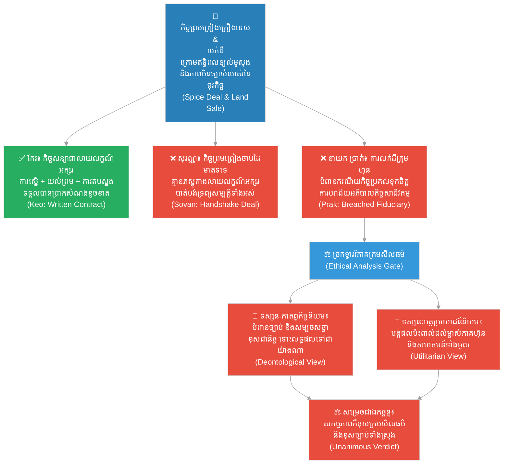

# ២៧៣ — កិច្ចសន្យាដែលសរសេរលើខ្សាច់ (The Contract Written in Sand)៖ ច្បាប់ធុរកិច្ច និងក្រមសីលធម៌
**Subject:** Business Law & Ethics  
**Concept:** Contract law, corporate governance, ethical frameworks (utilitarian vs. deontological)  
**Level:** Year 2  
**Author:** ichamrong  
**Date:** 2026-05-30  
**Tags:** #business-law #ethics #contract-law #corporate-governance #fiduciary-duty #utilitarianism #deontology #parables #business-sustainability #cambodian-context  
**Category:** Business Sustainability  
**Read Time:** ~4 min  

---

## 📌 មាតិកា (Table of Contents)
- [វិបត្តិធុរកិច្ច ច្បាប់ និងក្រមសីលធម៌ (The Legal & Ethical Dilemma)](#0)
- [១. រឿងនិទានប្រៀបធៀបទីមួយ៖ ជោគវាសនានៃកិច្ចសន្យាពីរ (The Story of Two Contracts)](#1)
- [២. រឿងនិទានប្រៀបធៀបទីពីរ៖ ដីមាត់ស្ទឹង និងករណីយកិច្ចប្រគល់ទុកចិត្ត (The Story of Riverside Land & Fiduciary Duty)](#2)
- [៣. គំនូសតាងលំហូរការងារ (System Flowchart)](#3)
- [៤. មេរៀនពីរឿង (Lesson)](#4)
- [Related Posts](#5)

---

## វិបត្តិធុរកិច្ច ច្បាប់ និងក្រមសីលធម៌ (The Legal & Ethical Dilemma)

នៅក្នុងពិភពធុរកិច្ច ការកសាងទំនុកចិត្តរវាងមនុស្សដែលមិនស្គាល់គ្នា ក្រោមលក្ខខណ្ឌមិនច្បាស់លាស់នៃទីផ្សារ គឺទាមទារនូវស្ថាបត្យកម្មច្បាប់ និងក្រមសីលធម៌ដ៏រឹងមាំ មិនមែនពឹងផ្អែកតែលើបុគ្គលិកលក្ខណៈរបស់មនុស្សនោះឡើយ។ កិច្ចសន្យាជាលាយលក្ខណ៍អក្សរ និងច្បាប់អភិបាលកិច្ចសាជីវកម្ម គឺជាស្ពានចម្លងទំនុកចិត្ត និងជាខែលការពារហានិភ័យនៅពេលមានវិបត្តិ។ ជាមួយគ្នានេះ ថ្នាក់ដឹកនាំត្រូវប្រឈមនឹងការវិភាគក្រមសីលធម៌ តាមរយៈទស្សនៈកាតព្វកិច្ចនិយម និងអត្ថប្រយោជន៍និយម ដើម្បីធានាបាននូវការសម្រេចចិត្តដ៏ត្រឹមត្រូវ និងយុត្តិធម៌។

---

## ១. រឿងនិទានប្រៀបធៀបទីមួយ៖ ជោគវាសនានៃកិច្ចសន្យាពីរ (The Story of Two Contracts)

ពាណិជ្ជករ (merchants) ពីរនាក់បានព្រមព្រៀងគ្នាក្នុងការផ្គត់ផ្គង់គ្រឿងទេសពីតំបន់ភ្នំប៉ែកខាងកើត សម្រាប់ផ្ទះបាយរបស់ព្រះរាជវាំង មុនពេលពិធីបុណ្យចូលឆ្នាំថ្មីចូលមកដល់។ 

ពាណិជ្ជករទីមួយឈ្មោះ **កែវ (Keo)** បានរៀបចំ **កិច្ចសន្យា (Contract)** ជាលាយលក្ខណ៍អក្សរយ៉ាងត្រឹមត្រូវ ដោយមានសាក្សីពីរនាក់ កំណត់កាលបរិច្ឆេទប្រគល់ទំនិញ តម្លៃលក់ និងមាត្រាពិសេសមួយបញ្ជាក់ពីការទូទាត់សងសំណង ប្រសិនបើរដូវវស្សាបង្កការខូចខាតដល់ទិន្នផលស្រូវ និងដំណាំ។ 

ចំណែកឯពាណិជ្ជករទីពីរឈ្មោះ **សុវណ្ណ (Sovan)** បានគ្រាន់តែចាប់ដៃជាមួយអ្នកគ្រប់គ្រងវាំង (palace steward) រួចនិយាយថា៖ *«ពួកយើងជាមនុស្សមានកិត្តិយស — ត្រឹមតែសម្តីសន្យាមាត់ទទេគឺគ្រប់គ្រាន់ហើយ។»* 

បីខែមុនពេលកំណត់ប្រគល់ទំនិញ គ្រោះខ្យល់មូសុងដ៏បោកបក់ខ្លាំង បានបំផ្លាញពាក់កណ្តាលនៃទិន្នផលដំណាំទាំងអស់នៅតំបន់ភ្នំប៉ែកខាងកើត។

កែវបានដឹកជញ្ជូនគ្រឿងទេសដែលនាងអាចប្រមូលបានតាមលទ្ធភាព រួចស្នើសុំអនុវត្តតាមមាត្រាសំណងខូចខាត។ អ្នកគ្រប់គ្រងវាំងបានយល់ព្រមបង់ប្រាក់សំណងខូចខាតសម្រាប់ការខ្វះខាតទំនិញនោះតាមកិច្ចសន្យាច្បាប់កំណត់។ ការខាតបង់របស់កែវកើតឡើងតែមួយចំណែកតូចប៉ុណ្ណោះ ហើយនាងអាចស្តារអាជីវកម្មរបស់នាងឡើងវិញបានយ៉ាងលឿននៅរដូវបន្ទាប់។ 

ផ្ទុយទៅវិញ សុវណ្ណបានដឹកជញ្ជូនគ្រឿងទេសដែលខ្លួនប្រមូលបានដូចគ្នា ប៉ុន្តែអ្នកគ្រប់គ្រងវាំង ក្រោមសម្ពាធហិរញ្ញវត្ថុពីអគ្គហេរញ្ញិកវាំង បានបដិសេធមិនព្រមបង់ប្រាក់សំណងសម្រាប់ការខ្វះខាតទំនិញឡើយ។ គ្មានភស្តុតាងជាលាយលក្ខណ៍អក្សរណាមួយបញ្ជាក់ពីកិច្ចព្រមព្រៀងសំណងនេះទេ — មានតែការចងចាំរបស់សុវណ្ណដែលប្រឆាំងនឹងសម្តីរបស់អ្នកគ្រប់គ្រងវាំងប៉ុណ្ណោះ។ សុវណ្ណបានបាត់បង់ទ្រព្យសម្បត្តិទាំងអស់ និងមិនអាចចាប់ផ្តើមអាជីវកម្មរបស់ខ្លួនឡើងវិញបានឡើយ។

កិច្ចសន្យាផ្លូវច្បាប់មួយ មានធាតុផ្សំសំខាន់ៗចំនួនបីគឺ៖
1. **ការស្នើសុំ (Offer)**
2. **ការយល់ព្រម (Acceptance)**
3. **ការផ្តល់តម្លៃ/ការតបស្នង (Consideration)**

បើគ្មានធាតុផ្សំទាំងបីនេះកត់ត្រាទុកជាលាយលក្ខណ៍អក្សរទេ កិច្ចសន្យានឹងរស់នៅត្រឹមតែ «សុច្ឆន្ទៈមាត់ទទេ» ដែលនឹងរលាយបាត់ទៅវិញភ្លាមៗនៅពេលមានសម្ពាធហិរញ្ញវត្ថុមកដល់។

---

## ២. រឿងនិទានប្រៀបធៀបទីពីរ៖ ដីមាត់ស្ទឹង និងករណីយកិច្ចប្រគល់ទុកចិត្ត (The Story of Riverside Land & Fiduciary Duty)

នាយកក្រុមហ៊ុន (company director) ម្នាក់ឈ្មោះ **ប្រាក់ (Prak)** បានអង្គុយក្នុងក្រុមប្រឹក្សាភិបាលនៃក្រុមហ៊ុនវាយនភណ្ឌមួយ។ ដោយមិនបានជូនដំណឹងដល់ម្ចាស់ភាគហ៊ុន (shareholders) គាត់បានរៀបចំលក់ដីមាត់ស្ទឹងដ៏មានតម្លៃបំផុតរបស់ក្រុមហ៊ុនទៅឱ្យបងប្អូនជីដូនមួយរបស់ខ្លួន ក្នុងតម្លៃទាបជាងទីផ្សារពាក់កណ្តាល។ 

ក្នុងនាមជានាយកក្រុមហ៊ុន ប្រាក់មាន **ករណីយកិច្ចប្រគល់ទុកចិត្ត (Fiduciary Duty)** ក្នុងការធ្វើសកម្មភាពដើម្បីផលប្រយោជន៍ល្អបំផុតរបស់ម្ចាស់ភាគហ៊ុន — មិនមែនដើម្បីផលប្រយោជន៍ក្រុមគ្រួសាររបស់ខ្លួននោះឡើយ។ ទង្វើនេះគឺជាការបំពានយ៉ាងធ្ងន់ធ្ងរលើ **អភិបាលកិច្ចសាជីវកម្ម (Corporate Governance)**។

អ្នកប្រាជ្ញទស្សនវិទូម្នាក់ប្រចាំព្រះរាជវាំង បានចោទសួរអំពីសកម្មភាពរបស់ប្រាក់តាមរយៈទ្រឹស្តីក្រមសីលធម៌ចំនួនពីរ៖
* **តាមទស្សនៈកាតព្វកិច្ចនិយម (Deontological View/Ethics)៖** សកម្មភាពរបស់ប្រាក់គឺខុសទាំងស្រុង ព្រោះវាបានបំពានច្បាប់ និងករណីយកិច្ចដែលគាត់បានស្បថសច្ចាថានឹងការពារ ទោះបីជាលទ្ធផលចុងក្រោយទៅជាយ៉ាងណាក៏ដោយ។
* **តាមទស្សនៈអត្ថប្រយោជន៍និយម (Utilitarian View/Ethics)៖** សកម្មភាពរបស់ប្រាក់គឺខុសដូចគ្នា ព្រោះវាបានបង្កផលប៉ះពាល់ និងការខូចខាតដល់ម្ចាស់ភាគហ៊ុន បុគ្គលិក កម្មករ និងសហគមន៍ទាំងមូលដែលពឹងផ្អែកលើទ្រព្យសកម្មរបស់ក្រុមហ៊ុន។

សេចក្តីសម្រេចរបស់អ្នកប្រាជ្ញគឺ៖ ចម្លើយគឺខុសទាំងពីរ — ទាំងទ្រឹស្តីកាតព្វកិច្ចនិយម និងអត្ថប្រយោជន៍និយម សុទ្ធតែនាំទៅដល់ការសន្និដ្ឋានដូចគ្នាពីទិសដៅខុសៗគ្នា។

រឿងរ៉ាវទាំងពីរនេះបានផ្តល់មេរៀនរួមគ្នាអំពីស្ថាបត្យកម្មនៃទំនុកចិត្ត៖ **«កិច្ចសន្យា និងច្បាប់អភិបាលកិច្ចសាជីវកម្ម មិនមែនជាបន្ទុកការិយាធិបតេយ្យឥតប្រយោជន៍ឡើយ ប៉ុន្តែវាគឺជាគ្រឹះស្ថាបត្យកម្មដែលធ្វើឱ្យកិច្ចសហប្រតិបត្តិការរវាងមនុស្សដែលមិនស្គាល់គ្នាអាចប្រព្រឹត្តទៅបាន ក្រោមភាពមិនច្បាស់លាស់នៃអនាគត។ បើគ្មានពួកវាទេ ទំនាក់ទំនងទាំងអស់នឹងពឹងផ្អែកទាំងស្រុងលើបុគ្គលិកលក្ខណៈរបស់មនុស្សម្នាក់ៗ — ដែលសូម្បីតែមនុស្សល្អបំផុតក៏អាចបរាជ័យបានដែរនៅពេលមានសម្ពាធ។»**

---

## ៣. គំនូសតាងលំហូរការងារ (System Flowchart)

---

## ៤. មេរៀនពីរឿង (Lesson)

ច្បាប់កិច្ចសន្យា (contract law) និងច្បាប់អភិបាលកិច្ចសាជីវកម្ម (corporate governance rules) មានវត្តមានឡើងដោយសារតែទំនុកចិត្តរវាងមនុស្សដែលមិនស្គាល់គ្នា ក្រោមលក្ខខណ្ឌមិនច្បាស់លាស់ គឺទាមទារនូវស្ថាបត្យកម្មប្រព័ន្ធច្បាប់ជាគ្រឹះ មិនមែនពឹងផ្អែកតែលើបុគ្គលិកលក្ខណៈនោះឡើយ។ ទ្រឹស្តីសីលធម៌កាតព្វកិច្ច (Deontological ethics) វាយតម្លៃសកម្មភាពផ្អែកលើច្បាប់ ឬកាតព្វកិច្ចដែលពួកគេបានបំពាន ខណៈពេលដែលទ្រឹស្តីសីលធម៌អត្ថប្រយោជន៍និយម (utilitarian ethics) វាយតម្លៃសកម្មភាពផ្អែកលើផលប៉ះពាល់ ឬការខូចខាតដែលពួកគេបានបង្កឡើង។ នៅក្នុងករណីនៃការរំលោភសីលធម៌ពិតប្រាកដ — ដូចជាការរំលោភលើករណីយកិច្ចប្រគល់ទុកចិត្ត — ទ្រឹស្តីទាំងពីរនេះតែងតែផ្តល់នូវការសន្និដ្ឋានស្របគ្នាជានិច្ច។

---

## Related Posts

- **[Business Law & Ethics](../06-business-law-and-ethics.md)** — Foundations of business law covering contract formation, corporate governance, fiduciary duty, and ethical frameworks for managerial decision-making.
