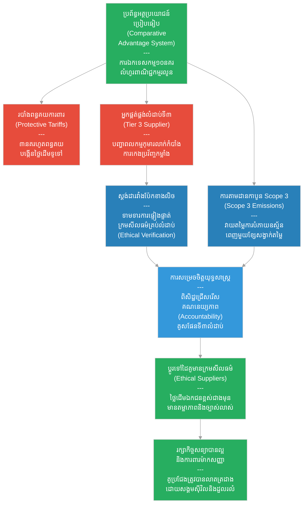

# ២៧៤ — ក្បួនដឹកទំនិញដែលឆ្លងកាត់ដប់ព្រះរាជាណាចក្រ (The Caravan That Crossed Ten Kingdoms)៖ ពាណិជ្ជកម្មអន្តរជាតិ និងខ្សែសង្វាក់ផ្គត់ផ្គង់សកល
**Subject:** International Trade & Global Supply Chains  
**Concept:** Comparative advantage, trade barriers, Scope 3 supply chain emissions  
**Level:** Year 3  
**Author:** ichamrong  
**Date:** 2026-05-30  
**Tags:** #international-trade #supply-chains #comparative-advantage #tariffs #scope-3-emissions #parables #business-sustainability #cambodian-context  
**Category:** Business Sustainability  
**Read Time:** ~4 min  

---

## 📌 មាតិកា (Table of Contents)
- [វិបត្តិធុរកិច្ច និងខ្សែសង្វាក់ផ្គត់ផ្គង់សកល (The Global Supply Chain Dilemma)](#0)
- [១. រឿងនិទានប្រៀបធៀប៖ ពិសិដ្ឋ និងក្បួនដឹកទំនិញដប់នគរ (The Parable Story)](#1)
- [២. គំនូសតាងលំហូរការងារ (System Flowchart)](#2)
- [៣. មេរៀនពីរឿង (Lesson)](#3)
- [Related Posts](#4)

---

## វិបត្តិធុរកិច្ច និងខ្សែសង្វាក់ផ្គត់ផ្គង់សកល (The Global Supply Chain Dilemma)

នៅក្នុងយុគសម័យសកលភាវូបនីយកម្ម ខ្សែសង្វាក់ផ្គត់ផ្គង់របស់អាជីវកម្មមិនមែនបញ្ចប់ត្រឹមតែព្រំដែនប្រទេសរបស់ខ្លួនឡើយ។ ការដោះដូរពាណិជ្ជកម្មត្រូវបានជំរុញដោយទ្រឹស្តីអត្ថប្រយោជន៍ប្រៀបធៀប ដែលប្រទេសនីមួយៗផលិតតែទំនិញណាដែលមានថ្លៃដើមទាបប្រៀបធៀប រួចធ្វើការដោះដូរគ្នា។ ទោះជាយ៉ាងណាក៏ដោយ នៅក្នុងការគ្រប់គ្រងធុរកិច្ចប្រកបដោយនិរន្តរភាពសម័យទំនើប ទំនួលខុសត្រូវរបស់សហគ្រាសមិនមែនបញ្ចប់ត្រឹមតែរោងចក្រផ្ទាល់ខ្លួន ឬដៃគូផ្គត់ផ្គង់ផ្ទាល់របស់ខ្លួននោះឡើយ។ ច្បាប់ស្តីពីការវាយតម្លៃសង្វាក់ផ្គត់ផ្គង់ តម្រូវឱ្យក្រុមហ៊ុននានាត្រូវតាមដានទាំងបញ្ហាកម្លាំងពលកម្ម និងការបំភាយឧស្ម័នកាបូនពេញមួយខ្សែសង្វាក់តម្លៃទាំងមូល រាប់ចាប់ពីអ្នកផ្គត់ផ្គង់លំដាប់ទី ៣ រហូតដល់ការបំភាយឧស្ម័នលំដាប់ទី ៣។

---

## ១. រឿងនិទានប្រៀបធៀប៖ ពិសិដ្ឋ និងក្បួនដឹកទំនិញដប់នគរ (The Parable Story)

ប្រធានក្រុមដំណើរ (caravan master) ម្នាក់ឈ្មោះ **ពិសិដ្ឋ (Piseth)** បានរៀបចំនិងគ្រប់គ្រងការធ្វើពាណិជ្ជកម្មគ្រឿងទេសឆ្លងកាត់ព្រះរាជាណាចក្រដប់ ដែលព្រះរាជាណាចក្រនីមួយៗមានរូបិយប័ណ្ណ ពន្ធគយ និងច្បាប់ពាណិជ្ជកម្មខុសៗគ្នាទាំងអស់។ គាត់បានរៀនសូត្រតាំងពីដំបូងមកថា ប្រព័ន្ធដែលមានប្រសិទ្ធភាពបំផុតមិនមែនជាការដែលព្រះរាជាណាចក្រនីមួយៗព្យាយាមផលិតរាល់របស់របរទាំងអស់ដែលខ្លួនត្រូវការនោះឡើយ ប៉ុន្តែគឺការដែលនគរនីមួយៗផ្តោតលើការផលិតទំនិញណាដែលខ្លួនអាចផលិតបានក្នុងថ្លៃដើមទាបប្រៀបធៀប រួចធ្វើការដោះដូរពាណិជ្ជកម្មគ្នាសម្រាប់ទំនិញដែលនៅសល់។ 

នេះគឺជា **អត្ថប្រយោជន៍ប្រៀបធៀប (Comparative Advantage)**៖ ព្រះរាជាណាចក្រតំបន់ភ្នំខ្ពស់ពូកែខាងផលិតម្រេច ព្រះរាជាណាចក្រតំបន់ឆ្នេរពូកែខាងផលិតត្រីប្រៃ ហើយព្រះរាជាណាចក្រតំបន់ដងទន្លេពូកែខាងផលិតសូត្រ។ នគរនីមួយៗបានលះបង់ការដាំដុះទំនិញណាដែលមានថ្លៃដើមផលិតខ្ពស់ រួចធ្វើការនាំចូល និងដោះដូរយកទំនិញដែលត្រូវបានផលិតយ៉ាងធូរថ្លៃពីនគរដទៃ។ ប៉ុន្តែថ្មីៗនេះ ព្រះរាជាណាចក្រចំនួនបីបានចាប់ផ្តើមដាក់ **ពន្ធគយការពារ (Protective Tariffs)** លើទំនិញនាំចូល ដើម្បីការពារអ្នកផលិតក្នុងស្រុករបស់ខ្លួន។ ពន្ធគយនីមួយៗបានធ្វើឱ្យថ្លៃដើមទំនិញកើនឡើងសម្រាប់មនុស្សគ្រប់គ្នា ដែលពន្យឺតលំហូរនៃអត្ថប្រយោជន៍ប្រៀបធៀបពេញមួយប្រព័ន្ធ។

នៅពាក់កណ្តាលផ្លូវនៃខ្សែសង្វាក់ដឹកជញ្ជូន ក្បួនដឹកទំនិញរបស់ពិសិដ្ឋបានឆ្លងកាត់ព្រះរាជាណាចក្រមួយ ដែលដំណើរការរើស និងបំបែកគ្រាប់ម្រេចត្រូវបានធ្វើឡើងដោយកុមារ មិនមែនមនុស្សពេញវ័យឡើយ។ គាត់បានដឹងរឿងនេះអស់ជាច្រើនឆ្នាំមកហើយ — ម្រេចនៅទីនោះមានតម្លៃថោកជាងទីផ្សារ ព្រោះថ្លៃពលកម្មនៅទីនោះមានតម្លៃថោកខ្លាំង ហើយថ្លៃពលកម្មថោកគឺដោយសារវាត្រូវបានធ្វើឡើងដោយកុមារអាយុដប់ពីរឆ្នាំដែលធ្វើការដប់ពីរម៉ោងក្នុងមួយថ្ងៃ។ នេះគឺជាបញ្ហាពលកម្មកុមារ ឬទម្រង់នៃទាសភាពសម័យទំនើប ដែលបង្កប់ខ្លួនយ៉ាងជ្រៅនៅក្នុងអ្វីដែលអ្នកប្រាជ្ញខ្សែសង្វាក់ផ្គត់ផ្គង់ហៅថា **អ្នកផ្គត់ផ្គង់លំដាប់ទី ៣ (Tier 3 Supplier)** — ពោលគឺមិនមែនជាអ្នកផ្គត់ផ្គង់ផ្ទាល់របស់គាត់ ឬជាអ្នកផ្គត់ផ្គង់របស់ដៃគូផ្គត់ផ្គង់របស់គាត់ឡើយ ប៉ុន្តែវាស្ថិតនៅស្រទាប់ទីបីផ្នែកខាងក្រោមនៃសង្វាក់។

អតិថិជនធំបំផុតរបស់ពិសិដ្ឋ — ដែលជាអ្នកទិញក្នុងព្រះបរមរាជវាំងនៃព្រះរាជាណាចក្រប៉ែកលោកខាងលិច — ថ្មីៗនេះបានចេញផ្សាយស្តង់ដារក្រមសីលធម៌ខ្សែសង្វាក់ផ្គត់ផ្គង់ដ៏តឹងរ៉ឹងមួយ ដោយទាមទារឱ្យមានការបង្ហាញភស្តុតាងជាលាយលក្ខណ៍អក្សរថាគ្មានពលកម្មបង្ខំ ឬពលកម្មកុមារឡើយនៅក្នុងគ្រប់ស្រទាប់ ឬលំដាប់អ្នកផ្គត់ផ្គង់ទាំងអស់។

បន្ថែមពីលើនេះ ព្រះបរមរាជវាំងប៉ែកលោកខាងលិចក៏បានចាប់ផ្តើមតាមដាននូវអ្វីដែលអ្នកផ្គត់ផ្គង់នៃដៃគូផ្គត់ផ្គង់របស់ខ្លួនបានភាយចេញទៅក្នុងបរិយាកាស — ពោលគឺឧស្ម័នកាបូនដែលបានបញ្ចេញក្នុងកំឡុងពេលផលិតកម្ម និងការដឹកជញ្ជូន ដែលហួសពីការគ្រប់គ្រងផ្ទាល់របស់វាំង។ នេះគឺជា **គណនេយ្យការបំភាយឧស្ម័នលំដាប់ទី ៣ (Scope 3 Emissions)** ដែលជាការបំភាយឧស្ម័នដែលកើតឡើងនៅក្នុងខ្សែសង្វាក់តម្លៃទាំងមូលរបស់ក្រុមហ៊ុន មិនមែនត្រឹមតែនៅក្នុងប្រតិបត្តិការផ្ទាល់ខ្លួនរបស់ខ្លួននោះឡើយ។ ពិសិដ្ឋត្រូវធ្វើការជ្រើសរើស៖ ផ្លាស់ប្តូរទៅប្រើប្រាស់អ្នកផ្គត់ផ្គង់ម្រេចដែលប្រើប្រាស់ពលកម្មមនុស្សពេញវ័យដែលមានតម្លៃថ្លៃជាង ឬត្រូវបាត់បង់កិច្ចសន្យាដ៏ធំជាមួយព្រះរាជវាំងប៉ែកលោកខាងលិច។

ពិសិដ្ឋបានសម្រេចចិត្តជ្រើសរើសយកទំនួលខុសត្រូវ និងតម្លាភាព។ គាត់បានរៀបចំគូសផែនទីខ្សែសង្វាក់ផ្គត់ផ្គង់ទាំងស្រុងរបស់ខ្លួនរហូតដល់ស្រទាប់ទីបី ផ្លាស់ប្តូរទៅប្រើប្រាស់អ្នកផ្គត់ផ្គង់ដែលមានក្រមសីលធម៌ និងការផ្ទៀងផ្ទាត់ត្រឹមត្រូវ ទោះបីជាត្រូវចំណាយថ្លៃដើមខ្ពស់ជាងមុនបន្តិចក៏ដោយ រួចកត់ត្រាឯកសារនៃការផ្លាស់ប្តូរនេះជូនទៅកាន់ព្រះរាជវាំងប៉ែកលោកខាងលិច។

ក្រុមហ៊ុនគូប្រជែងរបស់គាត់ដែលមិនព្រមធ្វើការផ្លាស់ប្តូរ ត្រូវបានបាត់បង់កិច្ចសន្យាជាមួយព្រះរាជវាំងនៅឆ្នាំបន្ទាប់ភ្លាមៗ នៅពេលដែលការស៊ើបអង្កេតរបស់អង្គការសង្គមស៊ីវិលបានលាតត្រដាងពីការប្រើប្រាស់ពលកម្មកុមារនៅក្នុងខ្សែសង្វាក់ផ្គត់ផ្គង់របស់ពួកគេ។

មេរៀនដែលទទួលបានគឺ៖ **«អត្ថប្រយោជន៍ប្រៀបធៀបគឺជាគោលការណ៍សេដ្ឋកិច្ចដ៏មានឥទ្ធិពល ប៉ុន្តែវាមិនអាចកសាងឡើងនៅលើការកេងប្រវ័ញ្ចកម្លាំងពលកម្មកុមារ ឬការលាក់បាំងផលប៉ះពាល់អវិជ្ជមានឡើយ។ នៅក្នុងពិភពលោកដែលមានគណនេយ្យភាពការបំភាយឧស្ម័នលំដាប់ទី ៣ ថ្លៃដើមដែលបង្កប់ទាំងនោះនឹងត្រូវលេចចេញមកលើផ្ទៃទីផ្សារនៅថ្ងៃណាមួយជានិច្ច។»**

---

## ២. គំនូសតាងលំហូរការងារ (System Flowchart)

---

## ៣. មេរៀនពីរឿង (Lesson)

អត្ថប្រយោជន៍ប្រៀបធៀប (comparative advantage) ជួយពន្យល់ពីមូលហេតុដែលប្រទេស និងតំបន់នានាធ្វើការដោះដូរពាណិជ្ជកម្មគ្នា ជំនួសឱ្យការព្យាយាមផលិតរាល់របស់របរទាំងអស់ដោយខ្លួនឯង។ ទោះជាយ៉ាងណាក៏ដោយ ខ្សែសង្វាក់ផ្គត់ផ្គង់សកលមិនត្រឹមតែបញ្ជូនទំនិញ និងសញ្ញាតម្លៃប៉ុណ្ណោះទេ ប៉ុន្តែថែមទាំងបញ្ជូននូវស្តង់ដារកម្លាំងពលកម្ម និងការបំភាយឧស្ម័នកាបូនផងដែរ។ គណនេយ្យការបំភាយឧស្ម័នលំដាប់ទី ៣ (Scope 3 accounting) បានពង្រីកទំនួលខុសត្រូវសង្គមរបស់សាជីវកម្មទៅលើខ្សែសង្វាក់តម្លៃទាំងមូល — ធ្វើឱ្យអត្ថប្រយោជន៍ថ្លៃដើមដែលផ្អែកលើការខូចខាតលាក់បាំង ឬការកេងប្រវ័ញ្ច ក្លាយជាយុទ្ធសាស្ត្រធុរកិច្ចដែលមិនអាចរស់រានមានជីវិតបានឡើយនៅក្នុងទីផ្សាររយៈពេលវែង។

---

## Related Posts

- **[International Trade & Global Supply Chains](../01-international-trade-and-supply-chains.md)** — Advanced study of international trade theory, supply chain management, and sustainability accountability including Scope 3 emissions and supply chain due diligence.
