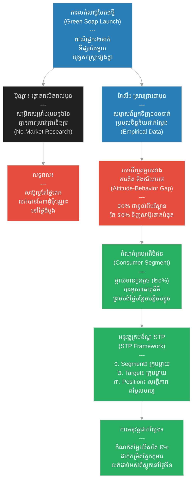

# ២៧៥ — ពាណិជ្ជករដែលសួរមុនពេលលក់ (The Merchant Who Asked Before Selling)៖ ការស្រាវជ្រាវទីផ្សារ និងឥរិយាបថអ្នកប្រើប្រាស់
**Subject:** Market Research & Consumer Behavior  
**Concept:** Consumer segmentation, attitude-behavior gap, STP framework  
**Level:** Year 3  
**Author:** ichamrong  
**Date:** 2026-05-30  
**Tags:** #market-research #consumer-behavior #segmentation #stp-framework #attitude-behavior-gap #parables #business-sustainability #cambodian-context  
**Category:** Business Sustainability  
**Read Time:** ~4 min  

---

## 📌 មាតិកា (Table of Contents)
- [វិបត្តិធុរកិច្ច និងការស្រាវជ្រាវទីផ្សារ (The Market Research Dilemma)](#0)
- [១. រឿងនិទានប្រៀបធៀប៖ ប៊ុណ្ណា ម៉ាលី និងសាប៊ូបៃតង (The Parable Story)](#1)
- [២. គំនូសតាងលំហូរការងារ (System Flowchart)](#2)
- [៣. មេរៀនពីរឿង (Lesson)](#3)
- [Related Posts](#4)

---

## វិបត្តិធុរកិច្ច និងការស្រាវជ្រាវទីផ្សារ (The Market Research Dilemma)

នៅក្នុងការបើកដំណើរការផលិតផលថ្មី កំហុសឆ្គងដ៏ធំរបស់សហគ្រិនជាច្រើនគឺការសន្មត់ថា «អ្វីដែលខ្លួនចូលចិត្ត និងយល់ថាមានតម្លៃ គឺជាអ្វីដែលទីផ្សារទាំងមូលចង់បាន»។ ការវិនិយោគដើមទុនទាំងអស់ទៅលើការកែលម្អគុណភាពផលិតផល ដោយគ្មានការស្ទង់មតិ ឬស្រាវជ្រាវពីអាកប្បកិរិយារបស់អតិថិជនពិតប្រាកដ តែងតែនាំទៅរកការបរាជ័យ។ គន្លឹះជោគជ័យគឺការយល់ដឹងពី គម្លាតរវាងឥរិយាបថ និងការគិតរបស់អតិថិជន និងការប្រើប្រាស់ក្របខ័ណ្ឌ STP ដើម្បីកំណត់ក្រុមអតិថិជនគោលដៅ និងកំណត់ទីតាំងផលិតផលឱ្យត្រូវទៅនឹងតម្រូវការជាក់ស្តែង។

---

## ១. រឿងនិទានប្រៀបធៀប៖ ប៊ុណ្ណា ម៉ាលី និងសាប៊ូបៃតង (The Parable Story)

ពាណិជ្ជករ (merchants) ពីរនាក់បានសម្រេចចិត្តផលិតនិងលក់សាប៊ូបៃតង — ដែលធ្វើឡើងពីសារធាតុផ្សំធម្មជាតិ គ្មានសារធាតុគីមី និងខ្ចប់ក្នុងស្លឹកចេក — នៅក្នុងទីប្រជុំជនទីផ្សារតែមួយ។

ពាណិជ្ជករទីមួយឈ្មោះ **ប៊ុណ្ណា (Bunna)** បានចំណាយប្រាក់សន្សំទាំងអស់របស់នាងដើម្បីធ្វើឱ្យផលិតផលមានភាពល្អឥតខ្ចោះបំផុត៖ នាងស្វែងរកប្រភពប្រេងដូងដ៏ល្អបំផុត កែច្នៃនិងសម្រិតសម្រាំងក្លិនក្រអូបអស់រយៈពេលប្រាំមួយខែ និងបោះពុម្ពស្លាកសញ្ញាដ៏ស្រស់ស្អាត។ នៅថ្ងៃបើកទីផ្សារ នាងបានដាក់តាំងលក់សាប៊ូរបស់នាង — ដែលមានភាពស្រស់ស្អាត ពិតប្រាកដ និងមានតម្លៃថ្លៃ — ប៉ុន្តែបែរជាលក់សាប៊ូស្ទើរតែមិនដាច់សោះឡើយ។ អតិថិជនបានមកប៉ះសាប៊ូនោះ ងក់ក្បាលកោតសរសើរ ប៉ុន្តែបន្ទាប់មកបែរជានាំគ្នាទៅទិញសាប៊ូដែលមានតម្លៃថោកនៅតូបបន្ទាប់ទៅវិញ។

ពាណិជ្ជករទីពីរឈ្មោះ **ម៉ាលី (Maly)** បានចំណាយពេលពេញមួយខែដំបូងរបស់នាង មិនមែនដើម្បីផលិតសាប៊ូនោះឡើយ ប៉ុន្តែដើម្បីដើរសួរព័ត៌មាន និងចោទសួរអតិថិជន។ នាងបានធ្វើសវនកម្មសម្ភាសន៍មនុស្សមួយរយនាក់នៅក្នុងទីផ្សារ៖ *«តើនរណាជាអ្នកទិញសាប៊ូ? ទិញញឹកញាប់កម្រិតណា? ហេតុអ្វីបានជាទិញ? តើបារម្ភពីអ្វីខ្លះចំពោះសាប៊ូគីមី? តើឱ្យតម្លៃលើអ្វីខ្លះ?»*

នាងបានប្រមូលទិន្នន័យអំពីការគិត និងឥរិយាបថរបស់ពួកគេ — រួចបានរកឃើញ **គម្លាតរវាងការគិត និងឥរិយាបថ (Attitude-behavior Gap)** ដ៏សំខាន់មួយ៖ *ប្រាំបីសិបភាគរយនៃអ្នកទិញបាននិយាយថាពួកគេ «បារម្ភ និងខ្វល់ខ្វាយយ៉ាងខ្លាំងអំពីសារធាតុផ្សំធម្មជាតិ» — ប៉ុន្តែប្រាំបួនសិបភាគរយនៃពួកគេ បែរជានាំគ្នាទិញសាប៊ូដែលមានតម្លៃថោកបំផុតដែលមាននៅលើទីផ្សារទៅវិញ*។ នេះបង្ហាញថា អ្វីដែលមនុស្សនិយាយថាខ្លួនឱ្យតម្លៃ និងអ្វីដែលពួកគេសម្រេចចិត្តទិញជាក់ស្តែង គឺមិនមែនជារបស់តែមួយនោះឡើយ។

ទោះជាយ៉ាងណាក៏ដោយ ក្នុងចំណោមអ្នកទិញមួយរយនាក់ដែលម៉ាលីបានសម្ភាសន៍ នាងបានរកឃើញ **ចំណែកក្រុមអតិថិជន (Consumer Segment)** ពិសេសមួយ៖ គឺក្រុមម្តាយដែលធ្វើការងារ និងមានកូនតូចៗ — ដែលមានប្រហែលម្ភៃភាគរយនៃអ្នកទិញសរុប។ ពួកគេនិយាយថាពួកគេបារម្ភយ៉ាងខ្លាំងពីបញ្ហាសាប៊ូគីមីដែលអាចបង្កបញ្ហាស្បែកដល់កូនៗរបស់ពួកគេ ហើយពួកគេ — ខុសពីអ្នកទិញដទៃទៀត — បានបង្ហាញពីឆន្ទៈក្នុងការបង់ថ្លៃបន្ថែមបន្តិចបន្តួចប្រសិនបើសាប៊ូនោះមានតម្លៃសមរម្យ ប៉ុន្តែមិនមែនជាតម្លៃថ្លៃហួសហេតុពេកនោះឡើយ។

ម៉ាលីបានយកទិន្នន័យនេះទៅអនុវត្តតាម **ក្របខ័ណ្ឌ STP (STP Framework)**៖
1. **ការបែងចែកផ្នែកទីផ្សារ (Segmentation)**៖ នាងបានកំណត់អត្តសញ្ញាណក្រុមម្តាយដែលធ្វើការងារ និងមានកូនតូចៗជាចំណែកទីផ្សារជាក់លាក់។
2. **ការជ្រើសរើសទីផ្សារគោលដៅ (Targeting)**៖ នាងសម្រេចចិត្តផ្តោតការយកចិត្តទុកដាក់ និងការលក់ទាំងស្រុងទៅលើតែក្រុមម្តាយទាំងនោះប៉ុណ្ណោះ។
3. **ការកំណត់ទីតាំងផលិតផល (Positioning)**៖ នាងបានរៀបចំសារផ្សព្វផ្សាយសាប៊ូរបស់នាងថាជា៖ *«សាប៊ូដែលមានសុវត្ថិភាពខ្ពស់សម្រាប់ស្បែកកូនតូចរបស់អ្នក ជាមួយនឹងតម្លៃសមរម្យ និងត្រឹមត្រូវបំផុត»*។

នាងបានកំណត់តម្លៃលក់សាប៊ូរបស់នាងប្រកបដោយភាពប្រកួតប្រជែងខ្ពស់ — ពោលគឺថ្លៃជាងសាប៊ូថោកធម្មតាតែប្រាំភាគរយប៉ុណ្ណោះ ដែលធ្វើឱ្យក្រុមអតិថិជនគោលដៅរបស់នាងអាចទទួលយកបានយ៉ាងងាយស្រួល។ នាងបានដាក់តាំងលក់វាឱ្យចំកម្រិតភ្នែករបស់កុមារ ជាមួយនឹងស្លាកសញ្ញាសាមញ្ញបំផុត៖ *«គ្មានសារធាតុគីមី សុវត្ថិភាពបំផុតសម្រាប់ស្បែកកូនតូច»*។

ម៉ាលីលក់សាប៊ូដាច់អស់ពីស្តុកតាំងពីថ្ងៃដំបូងនៃការបើកទីផ្សារ។ ចំណែកឯប៊ុណ្ណាលក់សាប៊ូដាច់បានត្រឹមតែបីដុំប៉ុណ្ណោះ។ ភាពខុសគ្នានេះមិនមែននៅលើគុណភាពសាប៊ូនោះទេ — ព្រោះសាប៊ូទាំងពីរគឺសុទ្ធតែមានគុណភាពល្អដូចគ្នា។ ប៉ុន្តែភាពខុសគ្នាគឺ ម៉ាលីបានចាប់ផ្តើមអាជីវកម្មដោយការស្រាវជ្រាវជាមុន មិនមែនចាប់ផ្តើមដោយការសន្មត់ដោយខ្លួនឯងឡើយ រួចយកព័ត៌មានដែលនាងបានរៀនទៅធ្វើការសម្រេចចិត្តលើផលិតផល សម្រេចចិត្តលើតម្លៃ និងសម្រេចចិត្តលើការកំណត់ទីតាំងផលិតផលដែលឆ្លើយតបទៅនឹងឥរិយាបថពិតប្រាកដរបស់ក្រុមអតិថិជនគោលដៅ — មិនមែនផ្អែកលើការនិយាយលម្អៀងរបស់ពួកគេនោះឡើយ។

---

## ២. គំនូសតាងលំហូរការងារ (System Flowchart)

---

## ៣. មេរៀនពីរឿង (Lesson)

ការស្រាវជ្រាវទីផ្សារ (market research) ជួយលាតត្រដាងពីគម្លាតរវាងអ្វីដែលអ្នកប្រើប្រាស់និយាយថាពួកគេឱ្យតម្លៃ និងអ្វីដែលពួកគេសម្រេចចិត្តទិញពិតប្រាកដនៅលើទីផ្សារជាក់ស្តែង។ ក្របខ័ណ្ឌ STP (STP framework) — ការបែងចែកផ្នែកទីផ្សារ (segmentation), ការជ្រើសរើសទីផ្សារគោលដៅ (targeting), និងការកំណត់ទីតាំងផលិតផល (positioning) — គឺជាវិធីសាស្ត្របំប្លែងទិន្នន័យស្រាវជ្រាវទាំងនោះឱ្យទៅជាការសម្រេចចិត្តអាជីវកម្មដ៏មានប្រសិទ្ធភាព — ជាជាងការសន្និដ្ឋានទូទៅលើទីផ្សារទាំងមូល។ ការធ្វើការស្រាវជ្រាវមុនពេលបង្កើតផលិតផល មិនមែនជាការស្ទាក់ស្ទើរឡើយ ប៉ុន្តែវាជាវិធីសាស្ត្រតែមួយគត់ដែលជួយបំប្លែងការខិតខំប្រឹងប្រែងឱ្យទៅជាសមិទ្ធផលចំណេញពិតប្រាកដ។

---

## Related Posts

- **[Market Research & Consumer Behavior](../02-market-research-and-consumer-behavior.md)** — Study of market research methods and consumer behavior theory including segmentation, attitude-behavior gaps, and the STP framework for Year 3 students.
