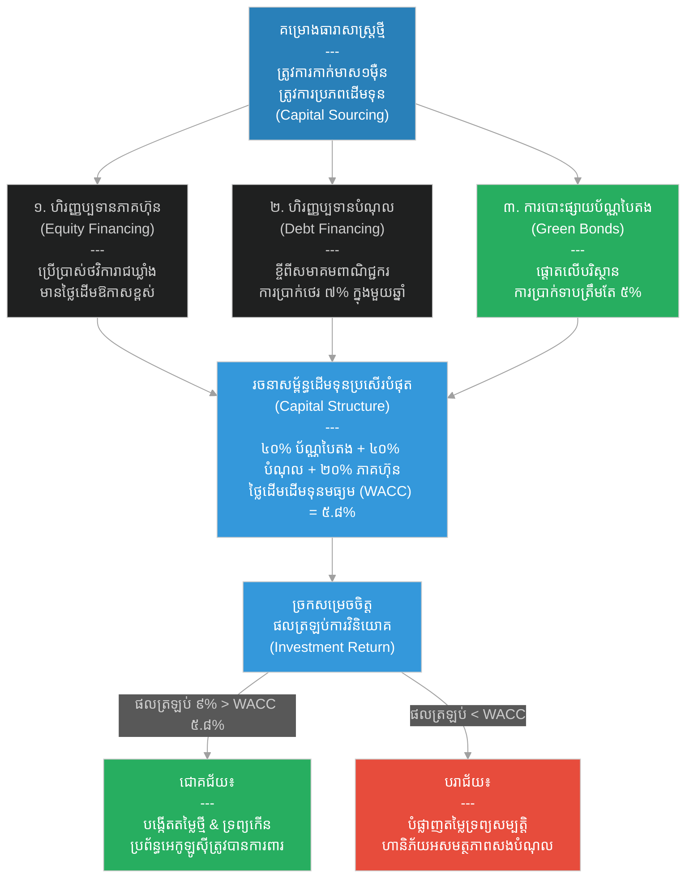

# ២៧៦ — ព្រះរាជបុត្រដែលខ្ចីប្រាក់ដើម្បីសាងសង់ (The Prince Who Borrowed to Build)៖ ហិរញ្ញវត្ថុសាជីវកម្មកម្រិតខ្ពស់ និងរចនាសម្ព័ន្ធដើមទុន
**Subject:** Advanced Corporate Finance  
**Concept:** WACC, capital structure, green bonds, M&A  
**Level:** Year 3  
**Author:** ichamrong  
**Date:** 2026-05-30  
**Tags:** #corporate-finance #wacc #capital-structure #green-bonds #mergers-acquisitions #parables #business-sustainability #cambodian-context  
**Category:** Business Sustainability  
**Read Time:** ~4 min  

---

## 📌 មាតិកា (Table of Contents)
- [វិបត្តិធុរកិច្ច និងហិរញ្ញវត្ថុបុរេប្រទាន (The Corporate Finance Dilemma)](#0)
- [១. រឿងនិទានប្រៀបធៀប៖ ព្រះរាជបុត្រ និងយុទ្ធសាស្ត្រគៀងគរដើមទុន (The Parable Story)](#1)
- [២. គំនូសតាងលំហូរការងារ (System Flowchart)](#2)
- [៣. មេរៀនពីរឿង (Lesson)](#3)
- [Related Posts](#4)

---

## វិបត្តិធុរកិច្ច និងហិរញ្ញវត្ថុបុរេប្រទាន (The Corporate Finance Dilemma)

នៅក្នុងហិរញ្ញវត្ថុសាជីវកម្មកម្រិតខ្ពស់ រាល់គម្រោងវិនិយោគខ្នាតធំទាំងអស់ទាមទារនូវការគិតគូរយ៉ាងម៉ត់ចត់ពីរបៀបគៀងគរដើមទុន។ សហគ្រាសត្រូវកំណត់រចនាសម្ព័ន្ធដើមទុនឱ្យមានតុល្យភាព ដើម្បីកាត់បន្ថយថ្លៃដើមដើមទុនជាមធ្យម។ ប្រសិនបើគម្រោងមួយបង្កើតផលត្រឡប់មកវិញទាបជាងថ្លៃដើមដើមទុន គម្រោងនោះនឹងបំផ្លាញតម្លៃសាជីវកម្ម ទោះបីជាវាមើលទៅហាក់ដូចជាទទួលបានប្រាក់ចំណេញផ្នែកគណនេយ្យក៏ដោយ។ ការប្រើប្រាស់ឧបករណ៍ហិរញ្ញវត្ថុបៃតង ដូចជាប័ណ្ណបៃតង ជួយឱ្យក្រុមហ៊ុនទទួលបានប្រភពដើមទុនដែលមានតម្លៃថោកពីវិនិយោគិនដែលផ្តោតលើនិរន្តរភាពបរិស្ថាន។

---

## ១. រឿងនិទានប្រៀបធៀប៖ ព្រះរាជបុត្រ និងយុទ្ធសាស្ត្រគៀងគរដើមទុន (The Parable Story)

ព្រះរាជបុត្រ (prince) មួយអង្គចង់សាងសង់ប្រព័ន្ធធារាសាស្ត្រដ៏ធំមួយដែលអាចស្រោចស្រពទឹកដីស្រែចំនួនបីខេត្ត បង្កើនទិន្នផលស្រូវទ្វេដង និងបញ្ចប់វដ្ដនៃគ្រោះរាំងស្ងួត និងការអត់ឃ្លានរបស់ប្រជាពលរដ្ឋ។ ថ្លៃដើមសាងសង់គឺដប់ពាន់កាក់មាស — ដែលជាចំនួនច្រើនជាងថវិកាដែលព្រះរាជឃ្លាំងមានផ្ទាល់។ ប្រធានទីប្រឹក្សាហិរញ្ញវត្ថុរបស់ទ្រង់ — គឺព្រឹទ្ធាចារ្យស្រ្តីម្នាក់ឈ្មោះ **ស្រីលក្ខណ៍ (Srey Leak)** បានបង្ហាញនូវជម្រើសគៀងគរដើមទុនចំនួនបី៖

**ជម្រើសទីមួយ៖** គឺការប្រើប្រាស់បំរុងថវិកានៃព្រះរាជឃ្លាំង ដែលជា **ហិរញ្ញប្បទានភាគហ៊ុន ឬហិរញ្ញប្បទានមូលធន (Equity Financing)**៖ គឺការចំណាយទ្រព្យសម្បត្តិដែលមានស្រាប់ដោយគ្មានកាតព្វកិច្ចត្រូវសងត្រឡប់មកវិញឡើយ។ ប៉ុន្តែថវិការបស់ព្រះរាជឃ្លាំងគឺមានដែនកំណត់ — រាល់កាក់មាសដែលចំណាយនៅទីនេះ នឹងមិនអាចយកទៅប្រើប្រាស់សម្រាប់ការការពារជាតិ ឬវិស័យអប់រំបានឡើយ។ ថ្លៃដើមពិតប្រាកដនៃហិរញ្ញប្បទានភាគហ៊ុន គឺថ្លៃដើមឱកាស (opportunity cost) នៃអ្វីដែលដើមទុននោះអាចបង្កើតផលចំណេញបានប្រសិនបើវិនិយោគនៅកន្លែងផ្សេង។

**ជម្រើសទីពីរ៖** គឺការខ្ចីប្រាក់ពីសមាគមពាណិជ្ជករ ដែលជា **ហិរញ្ញប្បទានបំណុល (Debt Financing)**៖ ជាមួយនឹងការបង់អត្រាការប្រាក់ប្រាំពីរភាគរយក្នុងមួយឆ្នាំ។ ហិរញ្ញប្បទានបំណុលមានតម្លៃថោកជាងហិរញ្ញប្បទានភាគហ៊ុន — ព្រោះពាណិជ្ជករត្រូវតែទទួលបានការសងប្រាក់ត្រឡប់មកវិញមុនគេបង្អស់ ប្រសិនបើមានហានិភ័យ ឬគម្រោងបរាជ័យ — ប៉ុន្តែវាទាមទារការបង់ប្រាក់ការប្រាក់ជារៀងរាល់ឆ្នាំជានិច្ច ទោះបីជាការប្រមូលផលស្រូវល្អឬអាក្រក់ក៏ដោយ។

**ជម្រើសទីបី៖** គឺការចេញលក់ **ប័ណ្ណបៃតង (Green Bond)**៖ ដោយសន្យាថារាល់កាក់មាសដែលខ្ចីទាំងអស់ នឹងត្រូវយកទៅប្រើប្រាស់សម្រាប់តែការការពារនិងអភិរក្សប្រភពទឹក ហើយត្រូវបានផ្ទៀងផ្ទាត់ជារៀងរាល់ឆ្នាំដោយសវនករឯករាជ្យ។ ក្រុមវិនិយោគិនដែលឱ្យតម្លៃលើផលប៉ះពាល់បរិស្ថាន — ដូចជាពាណិជ្ជករមានទ្រព្យសម្បត្តិមកពីនគរឆ្នេរសមុទ្រដែលប្រឈមមុខនឹងបញ្ហាទឹកជំនន់ — នឹងយល់ព្រមទទួលយកអត្រាការប្រាក់ត្រឹមតែប្រាំភាគរយប៉ុណ្ណោះជំនួសឱ្យប្រាំពីរភាគរយ។

ស្រីលក្ខណ៍បានពន្យល់ពីគោលការណ៍ស្នូលនៃហិរញ្ញវត្ថុសាជីវកម្ម៖ *រាល់គម្រោងវិនិយោគទាំងអស់ត្រូវតែរកចំណូលឱ្យបានច្រើនជាង **ថ្លៃដើមដើមទុនជាមធ្យម (Weighted Average Cost of Capital - WACC)** ដែលជាថ្លៃដើមចម្រុះនៃរាល់ប្រភពលុយទាំងអស់ដែលបានយកមកប្រើប្រាស់សម្រាប់ផ្តល់ហិរញ្ញប្បទានដល់គម្រោង។* 

ប្រសិនបើប្រព័ន្ធធារាសាស្ត្រផ្តល់ផលត្រឡប់មកវិញ (rate of return) ប្រាំបីភាគរយ — ក្នុងទម្រង់ជាពន្ធលើទិន្នផលស្រូវដែលកើនឡើង — ហើយថ្លៃដើមដើមទុនចម្រុះ (WACC) មានកម្រិតត្រឹមតែប្រាំមួយភាគរយ នោះព្រះរាជាណាចក្រនឹងកាន់តែមានទ្រព្យសម្បត្តិស្តុកស្តម្ភពីការសាងសង់នេះ។ ប៉ុន្តែប្រសិនបើផលត្រឡប់មកវិញមានត្រឹមតែបួនភាគរយ ខណៈថ្លៃដើមដើមទុនមានប្រាំមួយភាគរយ នោះព្រះរាជាណាចក្រនឹងកំពុងបំផ្លាញតម្លៃទ្រព្យសម្បត្តិដោយការសាងសង់នេះឡើយ។ 

នាងក៏បានព្រមានផងដែរអំពីអន្ទាក់នៃ **ការរួមបញ្ចូលគ្នានិងការទិញយក (Mergers and Acquisitions - M&A)**៖ ព្រះរាជាណាចក្រជិតខាងបានស្នើសុំធ្វើការរួមបញ្ចូលគ្នា — ប៉ុន្តែបំណុលរបស់ពួកគេមានទំហំធំជាងទ្រព្យសកម្ម ហើយការទទួលយកពួកគេនឹងធ្វើឱ្យកម្រិត WACC របស់ព្រះរាជាណាចក្រកើនឡើងយ៉ាងខ្លាំង ដែលបង្កហានិភ័យខ្ពស់។

ព្រះរាជបុត្របានសម្រេចចិត្តជ្រើសរើសការរួមបញ្ចូលចម្រុះ៖ សែសិបភាគរយបានមកពីប័ណ្ណបៃតង សែសិបភាគរយបានមកពីហិរញ្ញប្បទានបំណុលពាណិជ្ជករ និងម្ភៃភាគរយបានមកពីថវិកាព្រះរាជឃ្លាំង។ **រចនាសម្ព័ន្ធដើមទុន (Capital Structure)** នេះជួយកាត់បន្ថយថ្លៃដើមដើមទុនចម្រុះឱ្យនៅកម្រិតទាបបំផុត ខណៈពេលដែលរក្សាបាននូវភាពបត់បែននៃថវិការបស់ព្រះរាជឃ្លាំង។ ប័ណ្ណបៃតងបានទាក់ទាញវិនិយោគិនដែលផ្តោតលើបរិស្ថានឱ្យផ្តល់កម្ចីក្នុងអត្រាការប្រាក់ទាប (បាតុភូត Greenium) ដែលជួយកាត់បន្ថយថ្លៃដើមហិរញ្ញប្បទានសរុប។

ប្រព័ន្ធធារាសាស្ត្រត្រូវបានសាងសង់ឡើង ផ្ទៀងផ្ទាត់ត្រឹមត្រូវ និងបង្កើតផលត្រឡប់មកវិញបានប្រាំបួនភាគរយ — ដែលខ្ពស់ជាងថ្លៃដើមដើមទុនចម្រុះ (WACC) ៥,៨ ភាគរយឆ្ងាយណាស់។ ព្រះរាជាណាចក្រកាន់តែមានភាពរីកចម្រើន ព្រៃឈើតាមបណ្តោយប្រឡាយទឹកត្រូវបានការពារត្រឹមត្រូវតាមលក្ខខណ្ឌនៃប័ណ្ណបៃតង ហើយក្រុមវិនិយោគិនពីចម្ងាយទទួលបានទាំងផលត្រឡប់មកវិញផ្នែកហិរញ្ញវត្ថុ និងទំនុកចិត្តបរិស្ថានពិតប្រាកដ។

---

## ២. គំនូសតាងលំហូរការងារ (System Flowchart)

---

## ៣. មេរៀនពីរឿង (Lesson)

ថ្លៃដើមដើមទុនជាមធ្យម (WACC) គឺជាកម្រិតរបាំងអប្បបរមា (hurdle rate) ដែលរាល់ការវិនិយោគទាំងអស់ត្រូវតែឆ្លងផុត៖ គម្រោងវិនិយោគណាដែលបង្កើតផលត្រឡប់មកវិញទាបជាងថ្លៃដើមដើមទុន នឹងបំផ្លាញតម្លៃសាជីវកម្ម ទោះបីជាវាកត់ត្រាបានប្រាក់ចំណេញផ្នែកគណនេយ្យក៏ដោយ។ ការសម្រេចចិត្តលើរចនាសម្ព័ន្ធដើមទុន (capital structure) — ដែលជាការរួមបញ្ចូលគ្នារវាងភាគហ៊ុន បំណុល និងឧបករណ៍ហិរញ្ញវត្ថុដូចជាប័ណ្ណបៃតង — ជះឥទ្ធិពលផ្ទាល់ទៅលើថ្លៃដើមនៃការផ្តល់ហិរញ្ញប្បទាន។ ប័ណ្ណបៃតង (Green bonds) ជួយកាត់បន្ថយថ្លៃដើមហិរញ្ញវត្ថុសម្រាប់គម្រោងណាដែលមានទំនុកចិត្ត និងតម្លាភាពផ្នែកបរិស្ថានខ្ពស់ — ធ្វើឱ្យនិរន្តរភាពបរិស្ថានផ្តល់អត្ថប្រយោជន៍ផ្នែកហិរញ្ញវត្ថុពិតប្រាកដ មិនមែនគ្រាន់តែជាក្រមសីលធម៌ឡើយ។

---

## Related Posts

- **[Advanced Corporate Finance](../03-advanced-corporate-finance.md)** — Advanced corporate finance covering WACC, capital structure optimization, green bonds, and mergers and acquisitions for Year 3 students.
