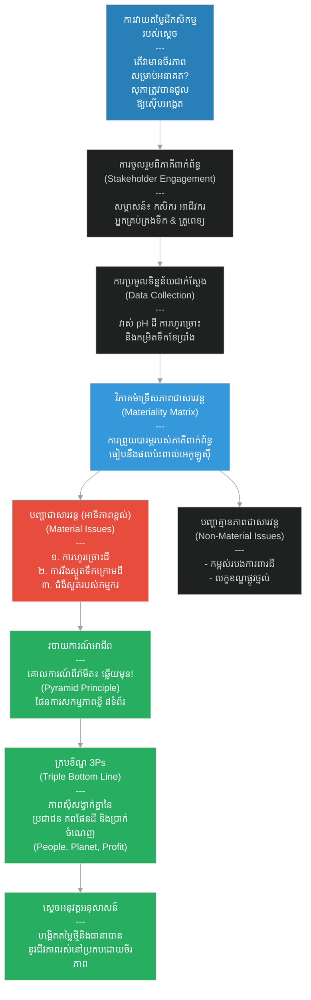

# ២៧៧ — ព្រឹទ្ធាចារ្យដែលវាស់វែងដី (The Elder Who Measured the Soil)៖ ការវាយតម្លៃភាពជាសារវន្ត និងការអនុវត្តជាក់ស្តែងនៃគោលការណ៍ 3Ps
**Subject:** Sustainability Practicum  
**Concept:** Materiality assessment, consulting methodology, triple bottom line in practice  
**Level:** Year 3  
**Author:** ichamrong  
**Date:** 2026-05-30  
**Tags:** #materiality-assessment #consulting #triple-bottom-line #stakeholder-engagement #materiality-matrix #parables #business-sustainability #cambodian-context  
**Category:** Business Sustainability  
**Read Time:** ~4 min  

---

## 📌 មាតិកា (Table of Contents)
- [វិបត្តិធុរកិច្ច និងការពិគ្រោះយោបល់ (The Consulting Dilemma)](#0)
- [១. រឿងនិទានប្រៀបធៀប៖ សុភា និងការវាស់វែងដែនដី (The Parable Story)](#1)
- [២. គំនូសតាងលំហូរការងារ (System Flowchart)](#2)
- [៣. មេរៀនពីរឿង (Lesson)](#3)
- [Related Posts](#4)

---

## វិបត្តិធុរកិច្ច និងការពិគ្រោះយោបល់ (The Consulting Dilemma)

នៅក្នុងការពិគ្រោះយោបល់ និងការវាយតម្លៃអាជីវកម្មប្រកបដោយចីរភាព បញ្ហាប្រឈមធំបំផុតគឺ៖ *តើអ្វីជាបញ្ហាសំខាន់បំផុតដែលយើងត្រូវដោះស្រាយជាបន្ទាន់?* ជារឿយៗ អ្នកវាយតម្លៃតែងតែជួបប្រទះនូវរបកគំហើញរាប់សិបបញ្ហា ប៉ុន្តែបើគ្មានការបែងចែកឱ្យច្បាស់លាស់ពីអ្វីដែលជាបញ្ហាជាសារវន្ត និងអ្វីដែលជាបញ្ហាគួរឱ្យចាប់អារម្មណ៍ធម្មតានោះទេ ការចំណាយធនធាននឹងមិនមានប្រសិទ្ធភាពឡើយ។ តាមរយៈការប្រើប្រាស់វិធីសាស្ត្រសម្ភាសន៍ភាគីពាក់ព័ន្ធ ម៉ាទ្រីសនៃភាពជាសារវន្ត និងគោលការណ៍ពីរ៉ាមីត អាជីវកម្មអាចកំណត់អាទិភាពការងារ និងដោះស្រាយបញ្ហាបានចំគោលដៅបំផុត។

---

## ១. រឿងនិទានប្រៀបធៀប៖ សុភា និងការវាស់វែងដែនដី (The Parable Story)

ព្រឹទ្ធាចារ្យ (elder) ម្នាក់ឈ្មោះ **សុភា (Sophea)** បានចំណាយពេលសាមសិបឆ្នាំក្នុងការធ្វើកសិកម្ម និងសង្កេតមើលតុល្យភាពធម្មជាតិនៃដែនដី។ ព្រះរាជាមួយអង្គពីនគរដ៏ឆ្ងាយបានឮកេរ្តិ៍ឈ្មោះរបស់នាង រួចបានបញ្ជូនរាជទូតមក៖ *«សូមអញ្ជើញទៅវាយតម្លៃថាតើដីកសិកម្មរបស់ព្រះរាជាណាចក្រខ្ញុំពិតជាមាននិរន្តរភាពដែរឬទេ — ខ្ញុំចង់បានការពិតជាក់ស្តែង មិនមែនពាក្យបញ្ជោរឡើយ។»*

សុភាបានធ្វើដំណើរទៅដល់ជាមួយនឹងសៀវភៅកត់ត្រាមួយក្បាល ដោយគ្មានការសន្មត់ទុកជាមុនឡើយ។ ក្នុងរយៈពេលបីសប្តាហ៍ដំបូង នាងមិនទាន់សរសេរសេចក្តីសន្និដ្ឋានអ្វីឡើយ — គឺនាងប្រមូលតែទិន្នន័យប៉ុណ្ណោះ។ នាងបានធ្វើ **ការសម្ភាសន៍ភាគីពាក់ព័ន្ធ (Stakeholder Interviews)** ជាច្រើន៖ រាប់ចាប់ពីក្រុមកសិករ អ្នកគ្រប់គ្រងទឹក អាជីវករដែលទិញផលប្រមូលកសិកម្ម រហូតដល់គ្រូពេទ្យថែទាំសុខភាពដែលព្យាបាលកម្មករដីស្រែពីជំងឺសួត។ នាងបានវាស់វែងកម្រិតអាស៊ីតដី កម្រិត pH ទឹក និងអត្រានៃការហូរច្រោះដី តាមដានប្រភពទឹកទាំងប៉ែកខាងលើ និងប៉ែកខាងក្រោមស្ទឹង រួចគូរផែនទីបង្ហាញពីកន្លែងដែលប្រភពទឹកត្រូវបានរីងស្ងួតក្នុងកំឡុងខែប្រាំង។

នៅពេលដែលនាងប្រមូលព័ត៌មានបានគ្រប់គ្រាន់ សុភាបានប្រឈមមុខនឹងបញ្ហាពិគ្រោះយោបល់បុរាណ៖ *តើអ្វីជាបញ្ហាដែលសំខាន់បំផុត?*

នាងមានរបកគំហើញចំនួនសាមសិបបញ្ហា — រួមមាន ការហូរច្រោះដី ប្រសិទ្ធភាពធារាសាស្ត្រ ការប្រើប្រាស់គីមីកសិកម្ម ប្រាក់ខែកម្មករ ការបាត់បង់ជីវចម្រុះ កម្ពស់របងការពារដី លក្ខខណ្ឌផ្លូវថ្នល់ និងវិធីសាស្ត្ររក្សាទុកគ្រាប់ពូជ។ នាងបានគូរ **ម៉ាទ្រីសនៃភាពជាសារវន្ត (Materiality Matrix)** ដោយដាក់តម្រៀបរបកគំហើញនីមួយៗនៅលើអ័ក្សពីរ៖ អ័ក្សមួយគឺកម្រិតសំខាន់ចំពោះភាគីពាក់ព័ន្ធ និងអ័ក្សមួយទៀតគឺកម្រិតផលប៉ះពាល់លើការរស់រានរយៈពេលវែងនៃដីកសិកម្ម។

របកគំហើញណាដែលទទួលបានពិន្ទុខ្ពស់នៅលើអ័ក្សទាំងពីរ គឺជា **បញ្ហាជាសារវន្ត (Material Issues)** — ដែលរួមមាន ការហូរច្រោះដី ការរីងស្ងួតនៃប្រភពទឹកក្រោមដី និងជំងឺសួតរបស់កម្មករ។ បញ្ហាទាំងបីនេះគឺជាអាទិភាពកំពូលរបស់នាង។ ចំណែកឯបញ្ហាកម្ពស់របង និងលក្ខខណ្ឌផ្លូវថ្នល់ គឺមិនមែនជាបញ្ហាជាសារវន្តឡើយ — វាជាបញ្ហាគួរឱ្យចាប់អារម្មណ៍ ប៉ុន្តែមិនមែនជាបញ្ហាសម្រាប់ធ្វើការសម្រេចចិត្តអាជីវកម្មនោះទេ។

សុភាបានរៀបចំរចនាសម្ព័ន្ធរបាយការណ៍របស់នាងដោយប្រើ **គោលការណ៍ពីរ៉ាមីត (Pyramid Principle)**៖ *ពោលគឺផ្តល់ចម្លើយជាមុន និងភស្តុតាងជាក្រោយ (answer first, evidence second)*។ 

ទំព័របើកឆាកដំបូងគេបង្អស់នៃរបាយការណ៍បានបញ្ជាក់ពីសេចក្តីសម្រេចរបស់នាងថា៖ *«ដីកសិកម្មនេះមានទិន្នផលល្អនៅថ្ងៃនេះ ប៉ុន្តែនឹងមិនមាននិរន្តរភាពឡើយក្នុងរយៈពេលដប់ប្រាំឆ្នាំខាងមុខ លើកលែងតែការផ្លាស់ប្តូរចំនួនបីត្រូវបានអនុវត្តជាបន្ទាន់»* បន្ទាប់មកគឺការលម្អិតពីបញ្ហាជាសារវន្តទាំងបី ជាមួយនឹងភស្តុតាងច្បាស់លាស់ និងសកម្មភាពផ្តល់អនុសាសន៍។ របាយការណ៍របស់នាងមានត្រឹមតែប្រាំបីទំព័រប៉ុណ្ណោះ មិនមែនប៉ែតសិបទំព័រឡើយ។

នាងក៏បានវាយតម្លៃដីកសិកម្មនោះធៀបនឹង **ទ្រឹស្តីមូលដ្ឋានគ្រឹះទាំងបី (Triple Bottom Line - 3Ps)** ផងដែរ៖ 
1. **ប្រជាជន (People)**៖ សុខភាពរបស់កម្មករ និងជីវភាពរស់នៅរបស់សហគមន៍។
2. **ភពផែនដី (Planet)**៖ សុខភាពដី និងទឹក។
3. **ប្រាក់ចំណេញ (Profit)**៖ ផលចំណូលពីការប្រមូលផលរយៈពេលវែង។

កត្តាទាំងបីនេះមានទំនាក់ទំនងគ្នាយ៉ាងស្អិតរមួត៖ ដីកសិកម្មដែលបំពុលកម្មកររបស់ខ្លួន និងបំផ្លាញប្រភពទឹកផ្ទាល់ខ្លួន នឹងបំផ្លាញប្រាក់ចំណេញផ្ទាល់ខ្លួនក្នុងរយៈពេលត្រឹមតែមួយជំនាន់មនុស្សប៉ុណ្ណោះ។

ព្រះរាជាបានអានរបាយការណ៍នោះចប់ក្នុងរយៈពេលត្រឹមតែមួយព្រឹក រួចបានចាត់វិធានការភ្លាមៗទៅលើអនុសាសន៍ទាំងបី។ ទ្រង់បានហៅសុភាថាជា *«ស្រ្តីដែលវាស់វែងចំអ្វីដែលសំខាន់»* រួចបានតែងតាំងនាងឱ្យបណ្តុះបណ្តាលក្រុមមន្ត្រីវាយតម្លៃរបស់ព្រះរាជវាំងជាច្រើនជំនាន់ក្រោយ។ វិធីសាស្ត្ររបស់នាងគឺអ្វីដែលអ្នកពិគ្រោះយោបល់អាជីពហៅថា **ការដោះស្រាយបញ្ហាប្រកបដោយរចនាសម្ព័ន្ធ (Structured Problem-Solving)**៖ ពោលគឺ ដឹកនាំដោយសម្មតិកម្ម ផ្អែកលើទិន្នន័យពិត កំណត់អាទិភាពតាមភាពជាសារវន្ត និងទាក់ទងដោយផ្តល់ចម្លើយជាមុន។

---

## ២. គំនូសតាងលំហូរការងារ (System Flowchart)

---

## ៣. មេរៀនពីរឿង (Lesson)

ការពិគ្រោះយោបល់ (consulting) គឺជាការស្រាវជ្រាវប្រកបដោយរចនាសម្ព័ន្ធ និងវិន័យខ្ពស់៖ ប្រមូលទិន្នន័យពីភាគីពាក់ព័ន្ធ បែងចែកបញ្ហាជាសារវន្តចេញពីបញ្ហាដែលគ្រាន់តែគួរឱ្យចាប់អារម្មណ៍ រួចធ្វើការប្រាស្រ័យទាក់ទងដោយផ្តល់ចម្លើយជាមុនជានិច្ច។ ទ្រឹស្តីមូលដ្ឋានគ្រឹះទាំងបី (Triple Bottom Line) — ប្រជាជន (people), ភពផែនដី (planet), និងប្រាក់ចំណេញ (profit) — មិនមែនជាគោលដៅបីដាច់ដោយឡែកពីគ្នានោះទេ ប៉ុន្តែពួកគេគឺជាវិមាត្រទាំងបីនៃប្រព័ន្ធតែមួយ ដែលនឹងត្រូវដួលរលំទៅជាមួយគ្នាភ្លាមៗ ប្រសិនបើយើងមើលរំលងវិមាត្រណាមួយ។

---

## Related Posts

- **[Sustainability Practicum](../04-sustainability-practicum.md)** — Applied sustainability consulting practicum covering materiality assessment, stakeholder engagement, triple bottom line analysis, and professional report writing.
